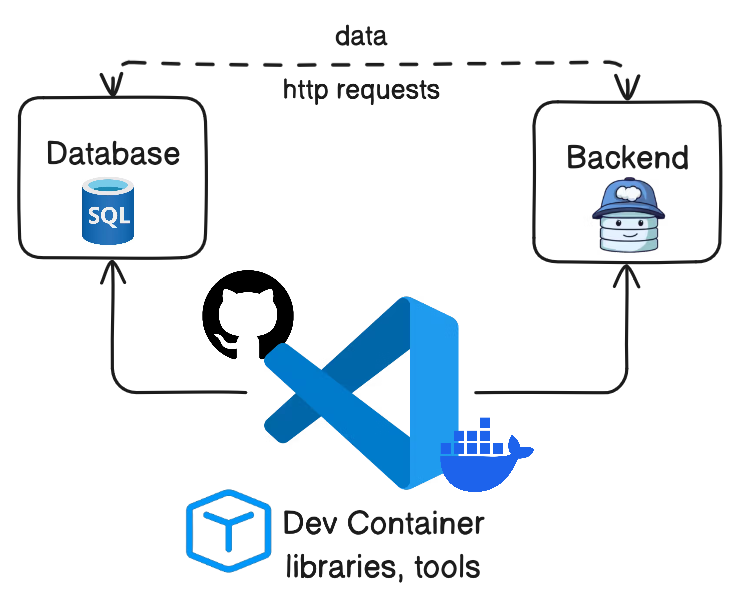

## The Development Environment Problem: "It Works on My Machine!"

How many times have you heard or said the infamous phrase **"It works on my machine!"**? It's the bane of collaboration between developers. Each team member configures their environment slightly differently: mismatched language versions, missing dependencies, or misaligned environment variables. This leads to hours wasted debugging the setup, slowing onboarding of new team members and creating inconsistencies between development and production environments.

In modern distributed systems and microservices architectures, where a project can depend on multiple languages, databases, and services, the complexity of maintaining consistent environments explodes. Manually configuring everything is a nightmare. This is where **DevContainers** come into play as an elegant and powerful solution.

-----

### DevContainers: The Containerized Development Environment

**DevContainers** (or "Development Containers") are a Visual Studio Code (VS Code) feature that allows you to use a **Docker** container as a complete development environment. In practice, your code is mounted in the container, and all development operations (editing, debugging, command execution, dependency installation) occur within this isolated and reproducible environment.

The concept is simple but revolutionary: instead of configuring your local machine for each project, you define an ideal development environment once in a configuration file. Anyone who opens the project with VS Code and Docker will automatically get the exact same environment, regardless of their operating system.



#### How They Work

At the heart of DevContainers are two main components:

  - **VS Code**: The IDE itself, which runs a "remote server" inside the container, allowing you to interact with files and tools as if they were local.
  - **Docker**: The containerization engine that hosts the development environment.

When you open a project configured with DevContainers in VS Code, the IDE detects the configuration, builds and starts a Docker container, mounts your code, and installs the specified extensions. At this point, your VS Code interface connects to the container, and all terminal commands, debugging, and installations happen inside the containerized environment.

-----

### Anatomy of a DevContainer: the `.devcontainer` Folder

The heart of a DevContainer is the `.devcontainer` folder at the root of your project, which contains the configuration files that define the environment.

#### 1\. `devcontainer.json`

This is the main configuration file. It's a JSON file that specifies how to build and configure your environment.

```json
// .devcontainer/devcontainer.json
{
  "name": "My Python App Dev Environment", // DevContainer display name
  "image": "mcr.microsoft.com/devcontainers/python:0-3.11", // Default Docker image
  // Or: "dockerFile": "Dockerfile", // If using a custom Dockerfile
  "features": {
    "ghcr.io/devcontainers/features/docker-in-docker:2": {
      "version": "latest"
    },
    "ghcr.io/devcontainers/features/node:1": {
      "version": "latest"
    },
    "ghcr.io/devcontainers/features/common-utils:2": {
      "installZsh": true,
      "installOhMyZsh": true
    }
  },
  "customizations": {
    "vscode": {
      "extensions": [
        "ms-python.python",
        "ms-azuretools.vscode-docker",
        "redhat.vscode-yaml",
        "esbenp.prettier-vscode"
      ],
      "settings": {
        "python.defaultInterpreterPath": "/usr/local/bin/python"
      }
    }
  },
  "postCreateCommand": "pip install -r requirements.txt",
  "forwardPorts": [3000, 8000],
  "remoteUser": "vscode"
}
```

For a complete guide on all available properties, check the [official documentation](https://code.visualstudio.com/docs/devcontainers/create-dev-container).

#### 2\. `Dockerfile` (Optional)

For more granular control, you can use a custom `Dockerfile`.

```dockerfile
# .devcontainer/Dockerfile
ARG VARIANT="3.11"
FROM mcr.microsoft.com/devcontainers/python:${VARIANT}

# Install additional system dependencies
RUN apt-get update && export DEBIAN_FRONTEND=noninteractive \
    && apt-get -y install --no-install-recommends git curl make build-essential \
    && rm -rf /var/lib/apt/lists/*

# Configure the working directory
WORKDIR /workspace

# Set a default entrypoint (if needed)
ENTRYPOINT ["/usr/local/bin/python"]
```

The Dockerfile gives you the flexibility to install system-level packages and customize the base image.

#### 3\. `docker-compose.yml` (For Multi-Service Architectures)

When your project includes multiple services (e.g. a web app, a database, and a message broker), a `docker-compose.yml` is essential.

```yaml
# .devcontainer/docker-compose.yml
version: '3.8'
services:
  # Main service, your app, which will be the development environment
  app:
    build:
      context: ../my-app
      dockerfile: Dockerfile
    volumes:
      - ..:/workspaces:cached
    command: sleep infinity
    ports:
      - "8000:8000"

  # Example database service
  database:
    image: postgres:15
    environment:
      POSTGRES_DB: mydb
      POSTGRES_USER: user
      POSTGRES_PASSWORD: password
    ports:
      - "5432:5432"

  # Example Kafka service
  kafka:
    image: confluentinc/cp-kafka:7.6.0
    ports:
      - "9092:9092"
    environment:
      KAFKA_BROKER_ID: 1
      KAFKA_ZOOKEEPER_CONNECT: 'zookeeper:2181'
      KAFKA_ADVERTISED_LISTENERS: PLAINTEXT://kafka:9092
      KAFKA_OFFSETS_TOPIC_REPLICATION_FACTOR: 1
    depends_on:
      - zookeeper
  zookeeper:
    image: confluentinc/cp-zookeeper:7.6.0
    ports:
      - "2181:2181"
    environment:
      ZOOKEEPER_CLIENT_PORT: 2181
      ZOOKEEPER_TICK_TIME: 2000
```

In this case, VS Code uses the `docker-compose.yml` to start all services, ensuring that the app can communicate with other components. The `devcontainer.json` points to this file to specify the development environment.

-----

### DevContainers and the Developer Experience (DX)

The adoption of DevContainers brings numerous benefits, the greatest of which is on the **Developer Experience (DX)**, i.e., the interactions and feelings a developer has while working. DevContainers improve the DX in meaningful ways:

  - **Simplified and Fast Onboarding**: A new developer can begin working on a complex project in just a few minutes, reducing frustration and delays.
  - **Elimination of "It Works on My Machine"**: DevContainers ensure that all team members work in the same environment, resolving most configuration discrepancy issues at their root.
  - **Project-by-Project Isolation**: You can work on multiple projects with different tech stacks without worrying about conflicts, since each project has its own isolated environment.
  - **Consistency with Production**: Having a development environment that closely mirrors production reduces surprises at deployment time, increasing confidence.
  - **Collaboration without Friction**: DevContainers facilitate environment sharing for debugging, reducing the time needed to solve issues.
  - **Safe Experimentation**: You can try new language or library versions within the container without fear of "polluting" your local machine.

In short, DevContainers shift the focus from "how do I configure my environment?" to "how can I solve this business problem?". This not only increases productivity but makes the development experience much more pleasant, fluid, and less frustrating.

-----

### Challenges and Best Practices

Although DevContainers offer huge benefits, it's good to keep some considerations in mind.

#### Challenges

  - **Docker Requirements**: Requires Docker to be installed and working on the local machine. For more details, visit [**Docker Desktop Installation**](https://www.docker.com/products/docker-desktop/).
  - **Initial Overhead**: The first time you open a project, building the image can take time.
  - **Scaling**: A `docker-compose.yml` with many services can consume significant CPU and RAM resources.
  - **Docker Debugging**: If there are issues with the container, debugging may be more complex for beginners.

#### Best Practices

  - **Optimized Base Images**: Start with official DevContainer images, already optimized for development environments. You can explore the catalog at [**DevContainers Features**](https://containers.dev/features).
  - **Docker Cache Layers**: Leverage Docker's layer cache to speed up rebuilds.
  - **`features` vs `Dockerfile`**: Use DevContainer `features` to add common tools and reserve the `Dockerfile` for project-specific customizations.
  - **Minimize Dependencies**: Install only what is strictly necessary in your DevContainer.
  - **Port Management**: Ensure all necessary ports are properly mapped.
  - **Dotfiles**: Use VS Code features to sync your dotfiles to the DevContainer for a more familiar experience.
  - **Resource Monitoring**: Keep an eye on your Docker Desktop/Engine resource usage.

-----

### Conclusions: A Must-Have for Modern Development

DevContainers are more than just a convenience; they represent a paradigm shift in how we think about development environments. By automating setup and eliminating inconsistencies, they enable teams to be more productive, collaborate more effectively, and maintain greater consistency between development and production environments.

If you work on complex architectures, distributed systems, or simply want to eliminate environment configuration headaches, DevContainers are a tool that absolutely deserves to be in your arsenal. They pave the way for a more streamlined, reproducible, and ultimately more enjoyable workflow.
