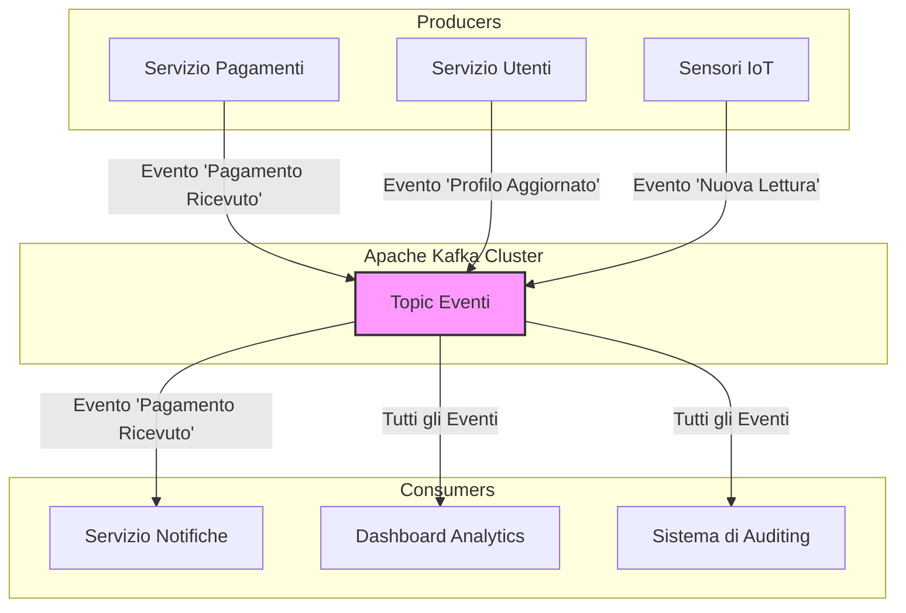
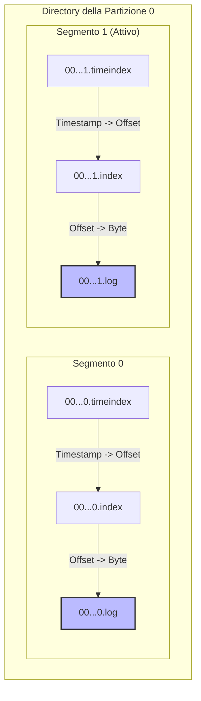

Foto di <a href="https://unsplash.com/it/@jonflobrant?utm_content=creditCopyText&utm_medium=referral&utm_source=unsplash">Jon Flobrant</a> su <a href="https://unsplash.com/it/foto/specchio-dacqua-tra-gli-alberi-sotto-il-cielo-nuvoloso-rB7-LCa_diU?utm_content=creditCopyText&utm_medium=referral&utm_source=unsplash">Unsplash</a>
      

## Da Chiamate Sincrone a Flussi di Eventi

Hai mai visto un singolo microservizio in timeout trascinare con sé l'intero sistema? Nei sistemi distribuiti, la comunicazione sincrona tra componenti introduce un accoppiamento che scala male. Quando ogni servizio deve chiamare e attendere un altro, una latenza di rete o un servizio in sovraccarico si propagano a catena. Il costo cresce in modo non lineare con il numero di componenti.

La soluzione non è semplicemente "usare una coda di messaggi". Il cambio di paradigma consiste nel passare da comandi diretti a **eventi di business**. Un evento non è una richiesta: è un fatto immutabile. "Un utente ha aggiornato il suo profilo". "Un sensore ha registrato una nuova temperatura". "Un veicolo ha trasmesso la sua posizione GPS".

[**Apache Kafka**](https://kafka.apache.org/) è una piattaforma di *event streaming* - un log distribuito e replicato che agisce come unica fonte di verità per gli eventi, permettendo ai componenti di reagire in modo asincrono, disaccoppiato e resiliente.



---

## Partizioni e Segmenti: Come Kafka Ottimizza Storage e Letture

Definire Kafka come "log di commit distribuito" è tecnicamente corretto, ma non spiega le scelte ingegneristiche che ne determinano le performance. Le sezioni seguenti analizzano la struttura interna.

### La Partizione: Un Log Immutabile e Segmentato

Un **Topic** è il concetto con cui interagiamo, ma l'unità di parallelismo, storage e performance è la **Partizione**. Ogni partizione è un log di eventi **immutabile e strettamente ordinato**. L'immutabilità è un concetto chiave: i dati non vengono mai modificati, solo aggiunti in coda. Questo semplifica drasticamente la logica di replica e di lettura.

La struttura interna è meno intuitiva di quanto sembri. Una partizione non è un singolo file di log monolitico, ma una **directory contenente file di segmento**.

- **Segmenti di Log (`.log`)**: File che contengono i record veri e propri. Un segmento è "attivo" finché non raggiunge una dimensione massima (es. `segment.bytes`, di default 1GB) o un tempo di vita (`segment.ms`). A quel punto viene chiuso e ne viene creato uno nuovo.
- **Indici (`.index`, `.timeindex`)**: Per ogni file di segmento `.log`, esistono file di indice corrispondenti. L'indice di offset mappa un offset a una posizione fisica (un byte) nel file di log, permettendo letture rapide senza scansionare il file. L'indice temporale mappa un timestamp al corrispondente offset, che viene poi risolto in posizione fisica tramite l'indice di offset (un lookup a due livelli).

Questa segmentazione ha due vantaggi enormi:
1.  **Gestione della Retention**: Per eliminare i dati vecchi, Kafka non deve scandagliare il log per cancellare record. Semplicemente, **elimina i file di segmento più vecchi**. Un'operazione `rm` sul file system, incredibilmente veloce ed efficiente.
2.  **Ricerca Rapida**: Gli indici, che sono molto più piccoli dei file di log, sono memory-mapped (mmap): il sistema operativo ne gestisce il caching nella page cache, permettendo a Kafka di localizzare rapidamente il punto da cui iniziare a leggere i dati, sia per offset che per timestamp.

Questo design è anche alla base della famosa ottimizzazione **zero-copy**. Quando un consumer richiede dei dati, Kafka può inviarli direttamente dal buffer del file system al buffer della scheda di rete, senza che i dati debbano mai essere copiati nello spazio di memoria dell'applicazione Kafka (user-space). Questo è possibile solo perché il formato dei dati su disco è lo stesso di quello inviato sulla rete.



### La Chiave del Messaggio: Il Patto con l'Ordinamento

La **chiave** di un messaggio è forse la sua proprietà più importante e fraintesa. Non è un semplice metadato. È un **contratto sull'ordinamento**.

Quando un producer invia un messaggio, il **Partitioner** di default applica una logica ferrea:
`hash(chiave) % numero_partizioni`

Questo significa che **tutti i messaggi con la stessa chiave finiscono nella stessa partizione**. Poiché una partizione è un log ordinato, questo fornisce una garanzia fondamentale: **l'ordine di invio per una data chiave è preservato**.

> **Nota**: questa garanzia vale a patto che il numero di partizioni del topic resti costante. Se si aggiungono partizioni, la formula `hash(key) % N` produce risultati diversi e messaggi con la stessa chiave possono finire in partizioni diverse.

Nel progetto di monitoraggio sensori, usare `sensor_id` come chiave è la scelta più naturale. Garantisce che la sequenza di letture per il sensore `sensor-A1` venga processata nell'ordine esatto in cui è stata emessa, permettendo di rilevare trend di temperatura o anomalie senza ambiguità. Inviare letture senza una chiave comporterebbe la perdita dell'ordinamento per sensore.

E se la chiave è nulla? Le versioni più vecchie di Kafka usavano un semplice round-robin, ma questo era inefficiente (creava tanti piccoli batch). Il **Sticky Partitioner** (default da Kafka 2.4) è più intelligente: invia tutti i messaggi senza chiave a una singola partizione finché il batch non è pieno, per poi passare alla partizione successiva. Questo migliora la compressione e riduce la latenza.

---

## Meccaniche di Replicazione e Tolleranza ai Guasti

La durabilità in Kafka è una configurazione esplicita. Si basa su un modello di replica leader-follower e sul concetto di **In-Sync Replicas (ISR)**.

Ogni partizione ha un **leader** (l'unica replica che accetta scritture) e zero o più **follower**. L'insieme delle ISR è la lista dei follower che sono "sufficientemente al passo" con il leader (configurabile tramite `replica.lag.time.max.ms`).

Quando un producer scrive, la sua garanzia di durabilità è determinata dall'impostazione `acks`:
-   `acks=0`: "Spara e dimentica". Massima performance, ma alto rischio di perdita dati.
-   `acks=1`: Attende la conferma solo dal leader. Un buon compromesso, ma se il leader fallisce un istante dopo aver confermato ma prima che i follower abbiano replicato, il dato è perso. Era il default fino a Kafka 2.x.
-   `acks=all` (o `-1`): Attende la conferma dal leader *dopo* che tutte le repliche nell'insieme ISR hanno ricevuto il messaggio. Questa è la massima garanzia di durabilità. **Da Kafka 3.0 in poi è il default**, insieme a `enable.idempotence=true`.

Per evitare che un fallimento a catena delle repliche porti a scrivere con `acks=all` su una sola replica (il leader), si usa l'impostazione del broker `min.insync.replicas`. Se, ad esempio, è impostata a `2` e un producer usa `acks=all`, una scrittura fallirà se non ci sono almeno 2 repliche nell'insieme ISR pronte a ricevere il dato. Questo previene la perdita di dati in caso di fallimento del leader.

**E se il leader fallisce?** Il **Controller** del cluster (un broker eletto o un nodo KRaft) se ne accorge, sceglie un nuovo leader dall'insieme ISR e notifica a tutti i follower di iniziare a replicare dal nuovo leader. Questo processo di elezione è il cuore della tolleranza ai guasti di Kafka.

---

## Esempi Pratici: Producer Node.js e Consumer Python

Per rendere concreti questi concetti, analizziamo il codice della nostra applicazione di monitoraggio sensori. Il producer è in **Node.js** con [**kafkajs**](https://kafka.js.org/), il consumer in **Python** con [**confluent-kafka**](https://docs.confluent.io/platform/current/clients/confluent-kafka-python/html/index.html). La serializzazione Avro è gestita da [**Apicurio Registry**](https://www.apicur.io/registry/) come Schema Registry. Il tutto orchestrato con Docker Compose.

👉 Il codice completo è disponibile nel repository: [github.com/monte97/kafka-pekko](https://github.com/monte97/kafka-pekko)

### Il Producer Node.js: Inviare Letture Sensoriali con una Chiave

Il producer (`producer/index.js`) simula l'invio di dati da più sensori. La parte cruciale è l'uso di `sensor_id` come **chiave** del messaggio per garantire l'ordinamento per ogni sensore.

```javascript
// producer/index.js
const { Kafka } = require("kafkajs");
const {
  SchemaRegistry,
  SchemaType,
} = require("@kafkajs/confluent-schema-registry");

const BROKER = process.env.KAFKA_BROKER || "localhost:29092";
const REGISTRY_URL = process.env.SCHEMA_REGISTRY_URL || "http://localhost:8081";
const TOPIC = "sensor-data";

const kafka = new Kafka({ clientId: "demo-producer", brokers: [BROKER] });
const registry = new SchemaRegistry({ host: REGISTRY_URL });
const producer = kafka.producer();

const SENSOR_IDS = ["sensor-A1", "sensor-B2", "sensor-C3"];
const LOCATIONS = [null, "warehouse-north", "warehouse-south", "outdoor"];

function randomReading() {
  return {
    sensor_id: SENSOR_IDS[Math.floor(Math.random() * SENSOR_IDS.length)],
    timestamp: Date.now(),
    temperature: Math.round((18 + Math.random() * 15) * 100) / 100,
    humidity: Math.round((30 + Math.random() * 50) * 100) / 100,
    location: LOCATIONS[Math.floor(Math.random() * LOCATIONS.length)],
  };
}

async function main() {
  await producer.connect();
  const schemaId = await registerSchema(); // Registra lo schema Avro nel registry

  while (true) {
    const reading = randomReading();
    const value = await registry.encode(schemaId, reading);

    // La chiave è sensor_id: tutti i messaggi dello stesso sensore
    // finiscono nella stessa partizione, preservando l'ordinamento
    await producer.send({
      topic: TOPIC,
      messages: [{ key: reading.sensor_id, value }],
    });

    await sleep(5000);
  }
}
```

### Deep Dive: `async/await` e il Loop di Produzione

Due aspetti di questo codice meritano attenzione:

1.  **`await producer.send(...)`**: A differenza di librerie che usano callback o fire-and-forget, kafkajs espone un'API basata su **Promise**. L'`await` sospende l'esecuzione della funzione `async` fino a quando il broker non conferma la ricezione del messaggio. Questo rende il codice sequenziale e leggibile, ma significa anche che ogni messaggio viene inviato uno alla volta. Per scenari ad alto throughput, kafkajs supporta il batching automatico tramite configurazione del producer (`createPartitioner`, `batch.size`).

2.  **`registry.encode(schemaId, reading)`**: La serializzazione Avro avviene *prima* dell'invio. Il valore inviato a Kafka non è JSON ma un payload binario Avro preceduto dal magic byte e dallo schema ID. Questo è il protocollo wire standard di Confluent Schema Registry, supportato anche da Apicurio tramite l'endpoint di compatibilità `/apis/ccompat/v7`.

### Il Consumer Python: Verificare il Flusso

Il consumer (`consumer/consumer.py`) si iscrive al topic `sensor-data` e stampa le letture che riceve. Usa `confluent-kafka` con deserializzazione Avro automatica.

```python
# consumer/consumer.py
import os
import sys

from confluent_kafka import Consumer, KafkaError
from confluent_kafka.schema_registry import SchemaRegistryClient
from confluent_kafka.schema_registry.avro import AvroDeserializer
from confluent_kafka.serialization import MessageField, SerializationContext

BROKER = os.environ.get("KAFKA_BROKER", "localhost:29092")
REGISTRY_URL = os.environ.get("SCHEMA_REGISTRY_URL", "http://localhost:8081")
TOPIC = "sensor-data"

# Il client del registry recupera automaticamente lo schema
# usando lo schema ID incorporato in ogni messaggio Avro
sr_client = SchemaRegistryClient({"url": REGISTRY_URL})
avro_deserializer = AvroDeserializer(sr_client)

consumer = Consumer({
    "bootstrap.servers": BROKER,
    "group.id": "demo-consumer-group",
    "auto.offset.reset": "earliest",
})
consumer.subscribe([TOPIC])

try:
    while True:
        msg = consumer.poll(timeout=1.0)
        if msg is None:
            continue

        err = msg.error()
        if err:
            if err.code() == KafkaError._PARTITION_EOF:
                continue
            print(f"Error: {err}", file=sys.stderr)
            continue

        # Deserializza il payload Avro binario in un dizionario Python
        reading = avro_deserializer(
            msg.value(),
            SerializationContext(msg.topic(), MessageField.VALUE),
        )
        print(f"sensor={reading['sensor_id']} temp={reading['temperature']}C "
              f"humidity={reading['humidity']}%")

except KeyboardInterrupt:
    print("Shutting down...")
finally:
    consumer.close()  # Rilascia le partizioni e committa gli offset
```

### Deep Dive: il Ciclo di Polling e la Chiusura Pulita

Il pattern del consumer merita un'analisi più attenta:

1.  **`consumer.poll(timeout=1.0)`**: Il consumer non riceve messaggi in push. È un ciclo di **polling** esplicito: ogni secondo chiede al broker se ci sono nuovi messaggi. Se non ce ne sono, `poll` restituisce `None` e il ciclo riprende. Questo modello dà al consumer pieno controllo sulla velocità di consumo (backpressure naturale).

2.  **`KafkaError._PARTITION_EOF`**: Non è un errore reale. Indica semplicemente che il consumer ha raggiunto la fine della partizione (non ci sono più messaggi da leggere per ora). È normale in un consumer che rimane in attesa di nuovi dati.

3.  **`try/except KeyboardInterrupt` + `finally`**: Questo è il pattern Python per una chiusura pulita. Quando l'utente preme Ctrl+C, Python solleva `KeyboardInterrupt`. Il blocco `finally` garantisce che `consumer.close()` venga sempre eseguito, rilasciando le partizioni assegnate e committando gli offset. Senza questa chiusura ordinata, il consumer group impiegherebbe più tempo per il ribilanciamento delle partizioni.

---

## Conclusioni

In questo articolo abbiamo analizzato le fondamenta di Apache Kafka:

1. **Il modello a eventi**: la differenza tra comandi sincroni e fatti immutabili, e perché Kafka è una piattaforma di event streaming, non una coda
2. **Partizioni e segmenti**: la struttura interna che abilita retention efficiente, ricerca rapida tramite indici memory-mapped e ottimizzazione zero-copy
3. **Il ruolo della chiave**: come il partitioner garantisce ordinamento per chiave (a patto che il numero di partizioni resti costante)
4. **Replicazione e ISR**: il modello leader-follower, la semantica di `acks` (con `acks=all` come default da Kafka 3.0) e il ruolo di `min.insync.replicas`
5. **Implementazione pratica**: producer Node.js con kafkajs e consumer Python con confluent-kafka, entrambi con serializzazione Avro via Schema Registry

Nel prossimo articolo della serie esploreremo i **Consumer Group**, le strategie di commit degli offset e i pattern per gestire il ribilanciamento delle partizioni.

---

## Risorse per Approfondire

Una selezione di risorse per approfondire.

### Libri

*   **Designing Data-Intensive Applications** di *Martin Kleppmann*: Non è un libro su Kafka, ma copre i principi fondamentali di sistemi distribuiti e gestione dei dati che stanno alla base di tecnologie come Kafka.
*   **Kafka: The Definitive Guide** di *Gwen Shapira, Neha Narkhede, e Todd Palino*: Scritto da ingegneri che hanno lavorato a Kafka in Confluent e LinkedIn. Copre tutto, dall'amministrazione alle best practice di sviluppo.
*   **I Heart Logs** di *Jay Kreps*: Un saggio breve del co-creatore di Kafka sulla filosofia dei log distribuiti e il loro ruolo nelle architetture moderne.

### Articoli e Documentazione

*   [**Documentazione kafkajs**](https://kafka.js.org/docs/getting-started): Client Kafka per Node.js con API basata su Promise.
*   [**Documentazione confluent-kafka-python**](https://docs.confluent.io/platform/current/clients/confluent-kafka-python/html/index.html): Wrapper Python per librdkafka, con supporto Avro nativo.
*   [**Blog di Confluent**](https://www.confluent.io/blog/): Articoli tecnici su casi d'uso avanzati, ottimizzazioni e nuove feature di Kafka.
*   [**Blog di Jay Kreps**](https://medium.com/@jaykreps): Riflessioni sull'evoluzione delle architetture software e il ruolo dello streaming di eventi.
*   [**Documentazione ufficiale Kafka**](https://kafka.apache.org/documentation/): Riferimento completo su configurazione, design e API.
