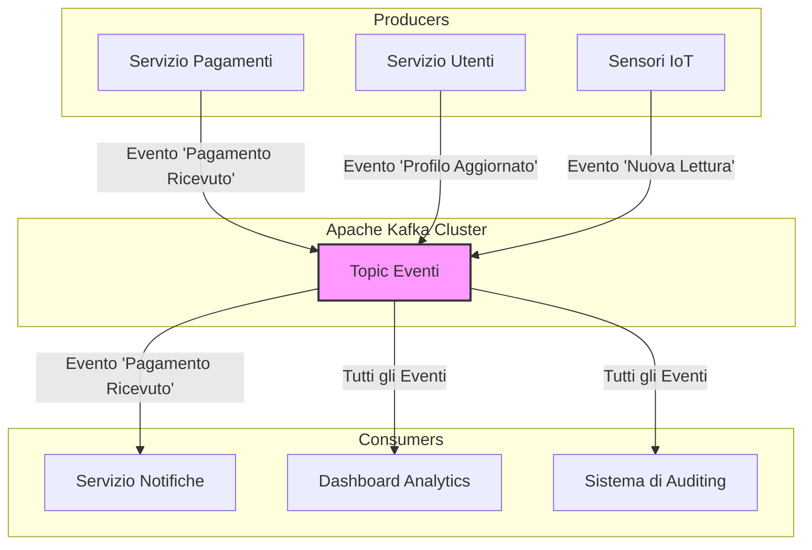
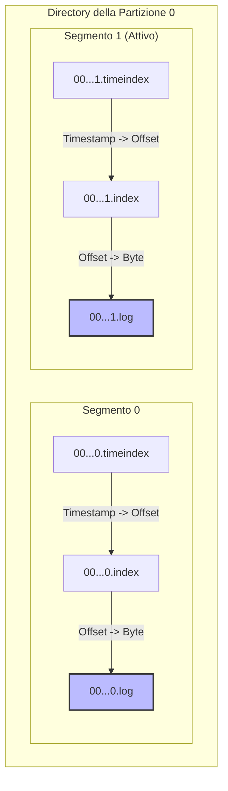

Foto di <a href="https://unsplash.com/it/@jonflobrant?utm_content=creditCopyText&utm_medium=referral&utm_source=unsplash">Jon Flobrant</a> su <a href="https://unsplash.com/it/foto/specchio-dacqua-tra-gli-alberi-sotto-il-cielo-nuvoloso-rB7-LCa_diU?utm_content=creditCopyText&utm_medium=referral&utm_source=unsplash">Unsplash</a>
      

## Da Chiamate Sincrone a Flussi di Eventi

Hai mai visto un singolo microservizio in timeout trascinare con sé l'intero sistema? Nei sistemi distribuiti, la comunicazione sincrona tra componenti introduce un accoppiamento che scala male. Quando ogni servizio deve chiamare e attendere un altro, una latenza di rete o un servizio in sovraccarico si propagano a catena. Il costo cresce in modo non lineare con il numero di componenti.

La soluzione non è semplicemente "usare una coda di messaggi". Il cambio di paradigma consiste nel passare da comandi diretti a **eventi di business**. Un evento non è una richiesta: è un fatto immutabile. "Un utente ha aggiornato il suo profilo". "Un sensore ha registrato una nuova temperatura". "Un veicolo ha trasmesso la sua posizione GPS".

[**Apache Kafka**](https://kafka.apache.org/) è una piattaforma di *event streaming* - un log distribuito e replicato che agisce come unica fonte di verità per gli eventi, permettendo ai componenti di reagire in modo asincrono, disaccoppiato e resiliente.



---

## Partizioni e Segmenti: Come Kafka Ottimizza Storage e Letture

Definire Kafka come "log di commit distribuito" è tecnicamente corretto, ma non spiega le scelte ingegneristiche che ne determinano le performance. Le sezioni seguenti analizzano la struttura interna.

### La Partizione: Un Log Immutabile e Segmentato

Un **Topic** è il concetto con cui interagiamo, ma l'unità di parallelismo, storage e performance è la **Partizione**. Ogni partizione è un log di eventi **immutabile e strettamente ordinato**. L'immutabilità è un concetto chiave: i dati non vengono mai modificati, solo aggiunti in coda. Questo semplifica drasticamente la logica di replica e di lettura.

La struttura interna è meno intuitiva di quanto sembri. Una partizione non è un singolo file di log monolitico, ma una **directory contenente file di segmento**.

- **Segmenti di Log (`.log`)**: File che contengono i record veri e propri. Un segmento è "attivo" finché non raggiunge una dimensione massima (es. `segment.bytes`, di default 1GB) o un tempo di vita (`segment.ms`). A quel punto viene chiuso e ne viene creato uno nuovo.
- **Indici (`.index`, `.timeindex`)**: Per ogni file di segmento `.log`, esistono file di indice corrispondenti. L'indice di offset mappa un offset a una posizione fisica (un byte) nel file di log, permettendo letture rapide senza scansionare il file. L'indice temporale mappa un timestamp al corrispondente offset, che viene poi risolto in posizione fisica tramite l'indice di offset (un lookup a due livelli).

Questa segmentazione ha due vantaggi enormi:
1.  **Gestione della Retention**: Per eliminare i dati vecchi, Kafka non deve scandagliare il log per cancellare record. Semplicemente, **elimina i file di segmento più vecchi**. Un'operazione `rm` sul file system, incredibilmente veloce ed efficiente.
2.  **Ricerca Rapida**: Gli indici, che sono molto più piccoli dei file di log, sono memory-mapped (mmap): il sistema operativo ne gestisce il caching nella page cache, permettendo a Kafka di localizzare rapidamente il punto da cui iniziare a leggere i dati, sia per offset che per timestamp.

Questo design è anche alla base della famosa ottimizzazione **zero-copy**. Quando un consumer richiede dei dati, Kafka può inviarli direttamente dal buffer del file system al buffer della scheda di rete, senza che i dati debbano mai essere copiati nello spazio di memoria dell'applicazione Kafka (user-space). Questo è possibile solo perché il formato dei dati su disco è lo stesso di quello inviato sulla rete.



### La Chiave del Messaggio: Il Patto con l'Ordinamento

La **chiave** di un messaggio è forse la sua proprietà più importante e fraintesa. Non è un semplice metadato. È un **contratto sull'ordinamento**.

Quando un producer invia un messaggio, il **Partitioner** di default applica una logica ferrea:
`hash(chiave) % numero_partizioni`

Questo significa che **tutti i messaggi con la stessa chiave finiscono nella stessa partizione**. Poiché una partizione è un log ordinato, questo fornisce una garanzia fondamentale: **l'ordine di invio per una data chiave è preservato**.

> **Nota**: questa garanzia vale a patto che il numero di partizioni del topic resti costante. Se si aggiungono partizioni, la formula `hash(key) % N` produce risultati diversi e messaggi con la stessa chiave possono finire in partizioni diverse.

Nel progetto di tracciamento GPS, usare `VehicleID` come chiave è la scelta più naturale in questo contesto. Garantisce che la sequenza di posizioni per il veicolo `vehicle-01` venga processata nell'ordine esatto in cui è stata emessa, permettendo di calcolare velocità o tracciare percorsi senza ambiguità. Inviare dati di posizione senza una chiave comporterebbe la perdita dell'ordinamento per veicolo.

E se la chiave è nulla? Le versioni più vecchie di Kafka usavano un semplice round-robin, ma questo era inefficiente (creava tanti piccoli batch). Il **Sticky Partitioner** (default da Kafka 2.4) è più intelligente: invia tutti i messaggi senza chiave a una singola partizione finché il batch non è pieno, per poi passare alla partizione successiva. Questo migliora la compressione e riduce la latenza.

---

## Meccaniche di Replicazione e Tolleranza ai Guasti

La durabilità in Kafka è una configurazione esplicita. Si basa su un modello di replica leader-follower e sul concetto di **In-Sync Replicas (ISR)**.

Ogni partizione ha un **leader** (l'unica replica che accetta scritture) e zero o più **follower**. L'insieme delle ISR è la lista dei follower che sono "sufficientemente al passo" con il leader (configurabile tramite `replica.lag.time.max.ms`).

Quando un producer scrive, la sua garanzia di durabilità è determinata dall'impostazione `acks`:
-   `acks=0`: "Spara e dimentica". Massima performance, ma alto rischio di perdita dati.
-   `acks=1`: Attende la conferma solo dal leader. Un buon compromesso, ma se il leader fallisce un istante dopo aver confermato ma prima che i follower abbiano replicato, il dato è perso. Era il default fino a Kafka 2.x.
-   `acks=all` (o `-1`): Attende la conferma dal leader *dopo* che tutte le repliche nell'insieme ISR hanno ricevuto il messaggio. Questa è la massima garanzia di durabilità. **Da Kafka 3.0 in poi è il default**, insieme a `enable.idempotence=true`.

Per evitare che un fallimento a catena delle repliche porti a scrivere con `acks=all` su una sola replica (il leader), si usa l'impostazione del broker `min.insync.replicas`. Se, ad esempio, è impostata a `2` e un producer usa `acks=all`, una scrittura fallirà se non ci sono almeno 2 repliche nell'insieme ISR pronte a ricevere il dato. Questo previene la perdita di dati in caso di fallimento del leader.

**E se il leader fallisce?** Il **Controller** del cluster (un broker eletto o un nodo KRaft) se ne accorge, sceglie un nuovo leader dall'insieme ISR e notifica a tutti i follower di iniziare a replicare dal nuovo leader. Questo processo di elezione è il cuore della tolleranza ai guasti di Kafka.

---

## Esempi Pratici con Go e la Nostra Demo

Per rendere concreti questi concetti, analizziamo il codice della nostra applicazione di monitoraggio GPS. Usiamo **Go** con la libreria [**`confluent-kafka-go`**](https://github.com/confluentinc/confluent-kafka-go) e un ambiente di sviluppo riproducibile basato su [**devcontainer**](https://containers.dev/).

### Il Producer: Inviare Dati GPS con una Chiave

Il nostro producer (`cmd/producer/main.go`) simula l'invio di dati da più veicoli. La parte cruciale è l'uso di `VehicleID` come **chiave** del messaggio per garantire l'ordinamento per ogni veicolo.

`cmd/producer/main.go`
```go
package main

import (
	"encoding/json"
	"fmt"
	"log"
	"math/rand"
	"time"

	"kafka-demo/internal/model" // Using our shared data model
	"github.com/confluentinc/confluent-kafka-go/v2/kafka"
)

func main() {
	p, err := kafka.NewProducer(&kafka.ConfigMap{"bootstrap.servers": "localhost:9092"})
	if err != nil {
		log.Fatalf("Failed to create producer: %s", err)
	}
	defer p.Close() // Crucial for sending buffered messages

	// Asynchronously handle delivery reports
	go func() {
		for e := range p.Events() {
			switch ev := e.(type) {
			case *kafka.Message:
				if ev.TopicPartition.Error != nil {
					fmt.Printf("[FAIL] Delivery failed: %v\n", ev.TopicPartition)
				} else {
					fmt.Printf("[OK] Message delivered to %v (Key: %s)\n", ev.TopicPartition, string(ev.Key))
				}
			}
		}
	}()

	topic := "gps_positions"
	for {
		vehicleId := fmt.Sprintf("vehicle-%d", rand.Intn(10))
		position := model.GpsPosition{
			VehicleID:   vehicleId,
			Latitude:    rand.Float64()*180 - 90,
			Longitude:   rand.Float64()*360 - 180,
			Speed:       rand.Float64() * 120, // Speed up to 120 km/h
			Timestamp:   time.Now(),
		}
		jsonData, _ := json.Marshal(position)

		p.Produce(&kafka.Message{
			TopicPartition: kafka.TopicPartition{Topic: &topic, Partition: kafka.PartitionAny},
			Key:            []byte(vehicleId),
			Value:          jsonData,
		}, nil)

		time.Sleep(500 * time.Millisecond)
	}
}
```

### Go Deep Dive: `defer` e Goroutine

Per un neofita di Go, due costrutti in questo codice potrebbero non essere immediatamente chiari:

1.  **`defer p.Close()`**: La parola chiave `defer` è un meccanismo potente e semplice per la gestione delle risorse. Registra una chiamata di funzione per essere eseguita *appena prima che la funzione circostante (in questo caso `main`) termini*. È il modo idiomatico in Go per garantire che le risorse (connessioni di rete, file, etc.) vengano sempre rilasciate, indipendentemente da come la funzione termina (sia normalmente che a causa di un `panic`). Qui, ci assicura che il producer venga chiuso correttamente, inviando tutti i messaggi ancora presenti nel suo buffer interno.

2.  **`go func() { ... }()`**: Questa è una **goroutine**. Le goroutine sono il cuore della concorrenza in Go. Sono thread "leggeri" gestiti dal runtime di Go. Con la semplice parola chiave `go`, stiamo lanciando una funzione anonima che viene eseguita in concorrenza con il resto della funzione `main`. In questo caso, è fondamentale: il producer invia i messaggi in modo asincrono per massimizzare le performance. Questa goroutine si mette in ascolto sul canale `p.Events()` per ricevere i report di consegna (successo o fallimento) senza bloccare il ciclo principale che produce i messaggi.

### Il Consumer di Base: Verificare il Flusso

Questo consumer (`cmd/consumer/main.go`) si iscrive al topic `gps_positions` e stampa i messaggi che riceve. È uno strumento diagnostico fondamentale.

`cmd/consumer/main.go`
```go
package main

import (
	"fmt"
	"log"
	"os"
	"os/signal"
	"syscall"

	"github.com/confluentinc/confluent-kafka-go/v2/kafka"
)

func main() {
	c, err := kafka.NewConsumer(&kafka.ConfigMap{
		"bootstrap.servers": "localhost:9092",
		"group.id":          "basic-checker-group",
		"auto.offset.reset": "earliest",
	})
	if err != nil { log.Fatalf("Failed to create consumer: %s", err) }
	defer c.Close()

	c.SubscribeTopics([]string{"gps_positions"}, nil)
	fmt.Println("Listening on topic 'gps_positions'... Press Ctrl+C to exit.")

	// Canale per intercettare segnali di terminazione dal sistema operativo
	sigchan := make(chan os.Signal, 1)
	signal.Notify(sigchan, syscall.SIGINT, syscall.SIGTERM)

	run := true
	for run {
		// select attende su più canali: segnali OS o messaggi Kafka
		select {
		case sig := <-sigchan:
			fmt.Printf("Caught signal %v: terminating...\n", sig)
			run = false
		default:
			// Poll con timeout 100ms: non bloccante grazie al default del select
			ev := c.Poll(100)
			if ev == nil { continue }

			switch e := ev.(type) {
			case *kafka.Message:
				fmt.Printf("Received: Key=%s, Value=%s\n", string(e.Key), string(e.Value))
			case kafka.Error:
				fmt.Fprintf(os.Stderr, "%% Error: %v\n", e)
			}
		}
	}
}
```

### Go Deep Dive: Canali e `select` per una Chiusura Pulita

Questo codice mostra un pattern comune in Go per gestire servizi che devono rimanere in esecuzione:

1.  **`sigchan := make(chan os.Signal, 1)`**: Creiamo un **canale**. I canali sono il modo principale in cui le goroutine comunicano tra loro. Puoi pensarli come delle "pipe" tipizzate attraverso cui puoi inviare e ricevere valori. Questo canale è specifico per i segnali del sistema operativo.

2.  **`signal.Notify(...)`**: Diciamo al runtime di Go di intercettare i segnali di interruzione (`SIGINT`, es. Ctrl+C) o di terminazione (`SIGTERM`) e, invece di terminare bruscamente il programma, di inviare un messaggio su `sigchan`.

3.  **`select`**: L'istruzione `select` è come uno `switch`, ma per i canali. Mette in pausa la goroutine e attende che uno dei suoi `case` diventi "pronto" (cioè che si possa leggere o scrivere sul canale corrispondente). Nel nostro ciclo `for`, il `select` fa due cose:
    *   `case sig := <-sigchan`: Prova a leggere dal canale dei segnali. Se un segnale arriva, questo `case` viene eseguito, e noi usciamo dal ciclo in modo pulito.
    *   `default`: Se nessun altro `case` è pronto (cioè non c'è nessun segnale), il `default` viene eseguito immediatamente. Questo ci permette di chiamare `c.Poll(100)` senza bloccare l'attesa del segnale di chiusura, realizzando un ciclo di polling non bloccante.

Questo pattern garantisce che, anche se premiamo Ctrl+C, il programma avrà la possibilità di eseguire le istruzioni `defer` (come `c.Close()`) per una chiusura pulita.

---

## Conclusioni

In questo articolo abbiamo analizzato le fondamenta di Apache Kafka:

1. **Il modello a eventi**: la differenza tra comandi sincroni e fatti immutabili, e perché Kafka è una piattaforma di event streaming, non una coda
2. **Partizioni e segmenti**: la struttura interna che abilita retention efficiente, ricerca rapida tramite indici memory-mapped e ottimizzazione zero-copy
3. **Il ruolo della chiave**: come il partitioner garantisce ordinamento per chiave (a patto che il numero di partizioni resti costante)
4. **Replicazione e ISR**: il modello leader-follower, la semantica di `acks` (con `acks=all` come default da Kafka 3.0) e il ruolo di `min.insync.replicas`
5. **Implementazione in Go**: producer con chiave e consumer di base usando `confluent-kafka-go` v2

Nel prossimo articolo della serie esploreremo i **Consumer Group**, le strategie di commit degli offset e i pattern per gestire il ribilanciamento delle partizioni.

---

## Risorse per Approfondire

Una selezione di risorse per approfondire.

### Libri

*   **Designing Data-Intensive Applications** di *Martin Kleppmann*: Non è un libro su Kafka, ma copre i principi fondamentali di sistemi distribuiti e gestione dei dati che stanno alla base di tecnologie come Kafka.
*   **Kafka: The Definitive Guide** di *Gwen Shapira, Neha Narkhede, e Todd Palino*: Scritto da ingegneri che hanno lavorato a Kafka in Confluent e LinkedIn. Copre tutto, dall'amministrazione alle best practice di sviluppo.
*   **I Heart Logs** di *Jay Kreps*: Un saggio breve del co-creatore di Kafka sulla filosofia dei log distribuiti e il loro ruolo nelle architetture moderne.

### Articoli e Documentazione

*   [**Documentazione `confluent-kafka-go`**](https://pkg.go.dev/github.com/confluentinc/confluent-kafka-go/v2/kafka): Riferimento API con esempi e configurazioni dettagliate.
*   [**Blog di Confluent**](https://www.confluent.io/blog/): Articoli tecnici su casi d'uso avanzati, ottimizzazioni e nuove feature di Kafka.
*   [**Blog di Jay Kreps**](https://medium.com/@jaykreps): Riflessioni sull'evoluzione delle architetture software e il ruolo dello streaming di eventi.
*   [**Documentazione ufficiale Kafka**](https://kafka.apache.org/documentation/): Riferimento completo su configurazione, design e API.
