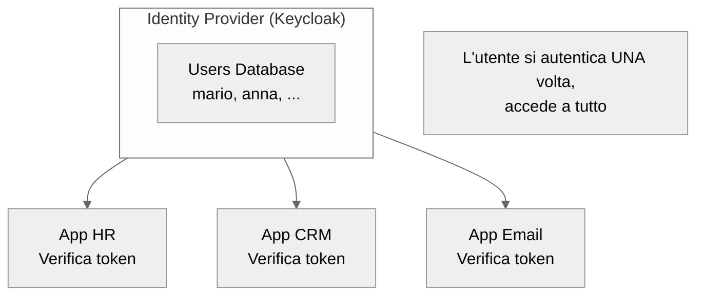
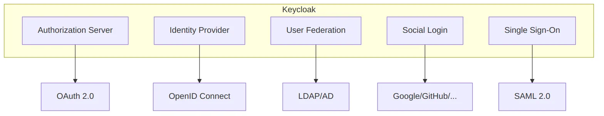

Se hai mai scritto un sistema di login da zero — registrazione, reset password, gestione sessioni, hash delle credenziali — sai quanto tempo porta via. E sai anche che, per quanto lo testi, resta quella sensazione fastidiosa: *stai davvero gestendo le password in modo sicuro?*

Poi arriva il secondo progetto e ti ritrovi a scrivere tutto da capo. Stesse tabelle, stessa logica e, ovviamente, gli stessi dubbi ma con password duplicate in più punti, e magari diverse.

C'è un modo migliore: usare un **Identity Provider**. In questo articolo vediamo cos'è, come funziona, e perché [Keycloak](https://www.keycloak.org/) è una delle scelte più solide per applicazioni web e microservizi.

---

## Il problema: i silos di identità

Immagina di avere tre applicazioni nella tua organizzazione: un'app HR, un CRM e un client email. Ognuna gestisce le proprie credenziali in modo indipendente.


I problemi di questo modello sono noti:

- **Password duplicate**: l'utente usa la stessa password ovunque, o ne dimentica alcune
- **Nessun Single Sign-On**: login separato per ogni applicazione
- **Gestione frammentata**: quando un dipendente lascia l'azienda, va disabilitato su *N* sistemi diversi
- **Sicurezza inconsistente**: ogni app implementa (o non implementa) MFA, lockout, audit a modo suo

E le architetture moderne non aiutano. Oggi un progetto può avere una SPA, un'API REST, cinque microservizi e un'app mobile. Ognuno di questi deve sapere chi sta chiamando. Riscrivere la logica di autenticazione in ognuno? Insostenibile.

---

## La soluzione: un Identity Provider centralizzato

L'idea è semplice: togli l'autenticazione dalle tue applicazioni e la centralizzi in un componente dedicato. Le app non gestiscono più credenziali ma ricevono **token firmati** dall'Identity Provider e li validano.

<!--  -->

In pratica, l'utente fa login *una sola volta* su Keycloak e, da quel momento, tutte le applicazioni collegate ricevono un token che conferma chi è e cosa può fare. È il principio del **Single Sign-On (SSO)**.

Le applicazioni non toccano più le credenziali — si limitano a verificare che il token sia valido e firmato dall'IdP. Se il codice non gestisce password, non può gestirle male. Un dipendente lascia l'azienda? Lo disabiliti in un punto solo e perde accesso a tutto.

<!-- TODO: link a sezione theory quando importata nel blog -->

---

## Qui entra in gioco Keycloak

[Keycloak](https://www.keycloak.org/) è un Identity Provider open source, nato in casa Red Hat e rilasciato con licenza Apache 2.0. Non è un framework da integrare nel codice ma un **servizio a sé stante**. Lo avvii, lo configuri, e lui si occupa di autenticazione, autorizzazione e gestione utenti.



Cosa offre, in concreto:

- **Authorization Server**: implementa OAuth 2.0 e OpenID Connect. Le app delegano l'autenticazione a Keycloak seguendo standard aperti.
- **User Federation**: hai già un LDAP o Active Directory con migliaia di utenti? Keycloak si collega e li usa senza migrazione.
- **Social Login**: login con Google, GitHub, Facebook — configurabile dall'admin console, zero codice.
- **Single Sign-On**: un login per tutte le app. Logout da una, logout da tutte.
- **Admin Console**: un'interfaccia web completa per gestire utenti, ruoli, client e configurazioni.

> Keycloak è container-ready: puoi avviarlo con [Docker](https://www.keycloak.org/getting-started/getting-started-docker) in un minuto. Ha anche un [Kubernetes Operator](https://www.keycloak.org/operator/installation) ufficiale per ambienti di produzione.

---

## I concetti chiave

Prima di toccare il codice, quattro concetti da conoscere:

- **Realm**: il contenitore principale, una specie di "tenant". Ogni realm ha i propri utenti, ruoli e configurazioni, isolati dagli altri. Ne crei uno per progetto.
- **Client**: ogni applicazione che si collega a Keycloak. Il frontend React è un client, l'API Express è un altro.
- **User**: gli utenti del sistema. Keycloak gestisce registrazione, credenziali, profili e sessioni.
- **Role**: i permessi. Li definisci in base a quello che serve al progetto. Finiscono nel token JWT e l'app li usa per decidere cosa mostrare.

Esempio: crei il realm `techstore`, registri due client (`shop-ui` e `shop-api`), aggiungi gli utenti Mario e Admin. Assegni il ruolo `admin` solo al secondo. Quando Mario fa login, il suo token dice all'app esattamente cosa può fare e cosa no.

---

## Come funziona il login

Il flusso standard per una web app si chiama **Authorization Code Flow**. Sembra complesso, ma dal punto di vista dell'utente sono tre passaggi:

1. L'utente clicca "Login" nell'app → viene reindirizzato alla pagina di login di Keycloak
2. L'utente inserisce le credenziali su Keycloak (non sull'app!)
3. Keycloak reindirizza l'utente all'app con un **token JWT** che contiene identità e ruoli

L'applicazione non tocca mai le credenziali. Riceve un **JWT** (JSON Web Token) che contiene chi è l'utente, i suoi ruoli e una scadenza. Keycloak lo firma con la propria chiave privata; l'app lo valida scaricando la chiave pubblica corrispondente. Se qualcuno modifica il token, la firma non corrisponde più e viene rifiutato.

> L'app non deve avere un form di login proprio. Se raccogli username e password nel frontend, le credenziali passano attraverso il codice — e torni al punto di partenza: devi proteggerle, trasmetterle in modo sicuro e gestire i casi d'errore. Il redirect a Keycloak esiste proprio per evitarlo.

<!-- TODO: link a theory/02-authorization-code-flow quando importata -->

---

## Provarlo in un minuto

Un comando Docker e sei operativo:

```bash
docker run -p 8080:8080 \
  -e KC_BOOTSTRAP_ADMIN_USERNAME=admin \
  -e KC_BOOTSTRAP_ADMIN_PASSWORD=admin \
  quay.io/keycloak/keycloak:26.0 start-dev
```

Apri `http://localhost:8080`, accedi con `admin/admin`, e hai la console di amministrazione davanti. Da lì puoi creare un realm, aggiungere utenti e configurare il primo client.

Lato Keycloak, per un primo login funzionante bastano pochi passi dall'interfaccia web: crea un realm, aggiungi un client di tipo "public" con il redirect URI dell'app, e crea un utente. Lato applicazione, serve integrare una libreria client — ad esempio `keycloak-js` per il frontend o un middleware JWT per il backend — ma la logica di autenticazione vera e propria resta tutta su Keycloak.

> `start-dev` avvia Keycloak in modalità sviluppo. **Non usarlo in produzione**: abilita HTTP senza TLS, usa un database H2 locale non adatto al carico, e rilassa diverse configurazioni di sicurezza.

---

## Errori comuni da evitare

Quando si comincia con Keycloak, queste sono le trappole più frequenti:

- **Form di login nell'app**: se raccogli username e password nel frontend, stai bypassando il senso di un IdP. Usa *sempre* il redirect a Keycloak.
- **`start-dev` in produzione**: è comodo per provare, ma in produzione serve `start` con un database esterno (PostgreSQL) e HTTPS configurato.
- **Ignorare i ruoli**: Keycloak offre un sistema di ruoli completo. Usalo. Non reinventare l'autorizzazione con logica custom nel backend.
- **Hardcodare URL**: l'URL di Keycloak cambia tra locale, staging e produzione. Rendilo configurabile fin dal primo giorno, sia nel backend che nel frontend. Altrimenti il primo deploy fuori da localhost accoglie con un 401 inspiegabile.

---

## Conclusione

Keycloak non è "un'altra cosa da imparare": è **una cosa in meno da scrivere**. Login, registrazione, reset password, SSO, MFA, gestione utenti — tutto gestito da un componente dedicato, testato, e mantenuto da una community attiva.

Se l'applicazione ha utenti, ha bisogno di autenticazione. E l'autenticazione è troppo critica per reinventarla ogni volta.

---

**Risorse utili:**
- [Keycloak Documentation](https://www.keycloak.org/documentation) — il punto di partenza ufficiale
- [Keycloak Getting Started Guide](https://www.keycloak.org/getting-started/getting-started-docker) — primo setup con Docker
- [OAuth 2.0 Simplified](https://www.oauth.com/) — guida accessibile a OAuth 2.0
- [OpenID Connect Specification](https://openid.net/connect/) — lo standard dietro il login delegato
