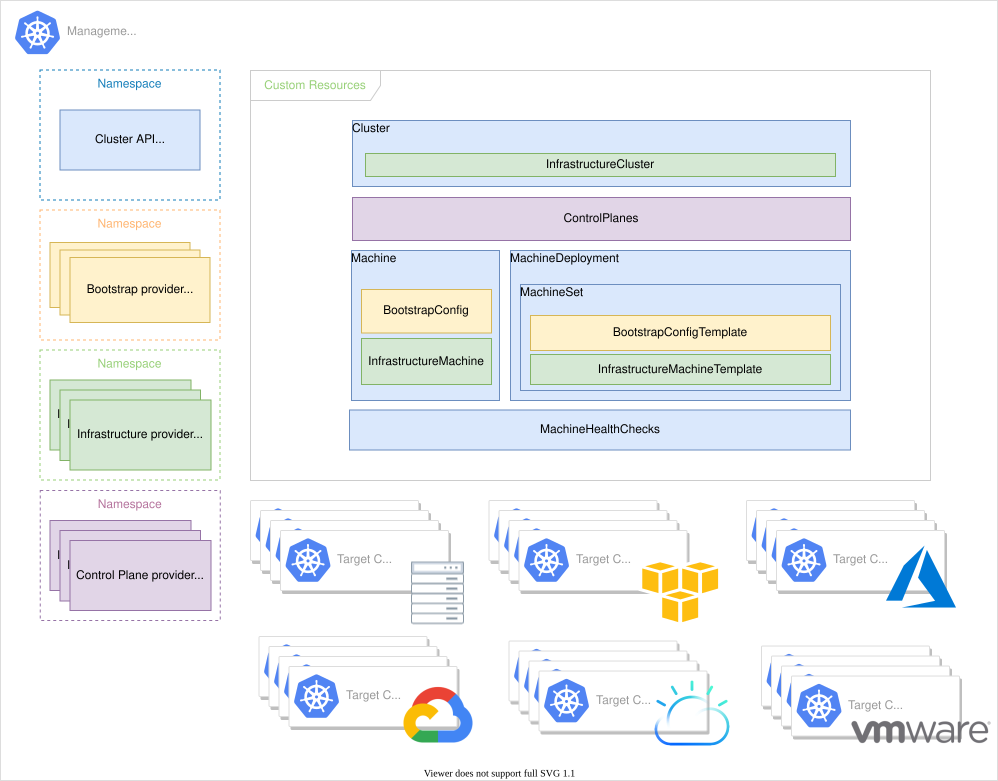

## CAPI Component Architecture

Cluster API implements a modular architecture based on the [Kubernetes controller pattern](https://kubernetes.io/docs/concepts/architecture/controller/), where each component has specific and well-defined responsibilities. This separation of responsibilities ensures extensibility, maintainability, and testability of the system.

### Management Cluster vs Workload Cluster

The fundamental distinction in CAPI is the separation between the cluster that manages infrastructure and the clusters that run application workloads.

#### Management Cluster

The Management Cluster serves as the **central control hub** for Kubernetes infrastructure. Its main characteristics include:

**Operational responsibilities:**
- Hosting [CAPI core controllers](https://cluster-api.sigs.k8s.io/developer/architecture/controllers/)
- Storing Custom Resource Definitions representing desired state
- Orchestrating the lifecycle of Workload Clusters
- Managing infrastructure access credentials

**Technical requirements:**
- Standard Kubernetes cluster (can be local with [kind](https://kind.sigs.k8s.io/))
- Network access to infrastructure providers
- Limited computational capacity (mainly for controllers)
- High availability optional but recommended for production environments

#### Workload Cluster

Workload Clusters represent the target Kubernetes clusters where business applications are deployed. Distinctive characteristics:

**Declaratively managed lifecycle:**
```yaml
apiVersion: cluster.x-k8s.io/v1beta1
kind: Cluster
metadata:
  name: workload-cluster-01
spec:
  controlPlaneRef:
    kind: TalosControlPlane
    name: workload-cluster-01-control-plane
  infrastructureRef:
    kind: ProxmoxCluster
    name: workload-cluster-01-proxmox
```

We only define the characteristics we desire, in this case a control plane managed through the `TalosControlPlane` controller, and the system takes care of _how_ to reach this state.

**Operational isolation:**
- No direct access to CAPI components
- Management via automatically generated `kubeconfig`
- Scaling and maintenance orchestrated by Management Cluster

---

## CAPI Core Components



### CAPI Core Controller

The [Core Controller](https://github.com/kubernetes-sigs/cluster-api/tree/main/controllers) represents the operational brain of CAPI, responsible for high-level orchestration of cluster lifecycles.

#### Cluster Controller

The [Cluster Controller](https://cluster-api.sigs.k8s.io/developer/core/controllers/cluster) manages the `Cluster` resource, coordinating the interaction between infrastructure provider and control plane provider:

**Main functions:**
- Cluster configuration validation
- Provisioning sequence orchestration
- Management of `controlPlaneReady` and `infrastructureReady` states
- Generation of `kubeconfig` for access to workload cluster

**Reconciliation logic:**
```go
// Pseudocode for reconciliation loop
func (r *ClusterReconciler) Reconcile(ctx context.Context, req ctrl.Request) {
    // 1. Fetch cluster object
    cluster := &clusterv1.Cluster{}

    // 2. Reconcile infrastructure
    if !cluster.Status.InfrastructureReady {
        return r.reconcileInfrastructure(ctx, cluster)
    }

    // 3. Reconcile control plane
    if !cluster.Status.ControlPlaneReady {
        return r.reconcileControlPlane(ctx, cluster)
    }

    // 4. Generate kubeconfig
    return r.reconcileKubeconfig(ctx, cluster)
}
```

#### Machine Controller

The [Machine Controller](https://cluster-api.sigs.k8s.io/developer/core/controllers/machine) manages the lifecycle of individual compute instances that compose the cluster:

**Operational responsibilities:**
- Coordination with Infrastructure Provider for VM provisioning
- Management of bootstrap process via Bootstrap Provider
- Node status monitoring and automatic recovery
- Implementation of replacement policies for immutable Machine objects

**Lifecycle states:**
```yaml
status:
  phase: "Running"  # Pending, Provisioning, Provisioned, Running, Deleting, Failed
  addresses:
    - type: "InternalIP"
      address: "192.168.1.100"
  nodeRef:
    kind: "Node"
    name: "workload-cluster-01-control-plane-abc123"
```

### Bootstrap Provider

The "bootstrap provider" in Kubernetes Cluster API is a fundamental component that handles initializing the first node of a new Kubernetes cluster, known as the "control plane node" or "master node". In simple terms, it's the engine that starts the cluster. There are several implementations depending on the "way" we want the cluster to be initialized.

#### Kubeadm Bootstrap Provider

The [kubeadm provider](https://github.com/kubernetes-sigs/cluster-api/tree/main/bootstrap/kubeadm) represents the reference implementation, using [kubeadm](https://kubernetes.io/docs/setup/production-environment/tools/kubeadm/) for node initialization:

**Cloud-init generation:**
```yaml
apiVersion: bootstrap.cluster.x-k8s.io/v1beta1
kind: KubeadmConfig
metadata:
  name: worker-node-config
spec:
  joinConfiguration:
    nodeRegistration:
      kubeletExtraArgs:
        cloud-provider: external
  preKubeadmCommands:
    - "swapoff -a"
    - "modprobe br_netfilter"
  postKubeadmCommands:
    - "kubectl label node ${HOSTNAME} node-role.kubernetes.io/worker="
```

#### Talos Bootstrap Provider

The [Talos Bootstrap Provider](https://github.com/siderolabs/cluster-api-bootstrap-provider-talos) generates configurations specific to Talos Linux:

**Talos Configuration:**
```yaml
apiVersion: bootstrap.cluster.x-k8s.io/v1alpha3
kind: TalosConfig
metadata:
  name: talos-worker-config
spec:
  generateType: "join"
  talosVersion: "v1.7.0"
  configPatches:
    - op: "add"
      path: "/machine/network/interfaces"
      value:
        - interface: "eth0"
          dhcp: true
```

### Control Plane Provider

The "control plane provider" in Kubernetes Cluster API is a key component that handles managing the cluster control plane after the first node has been initialized. Unlike the bootstrap provider, which simply starts the first node, the control plane provider manages the entire lifecycle of control plane nodes, ensuring the cluster remains stable and highly available.

As with the bootstrap provider, there are several implementations depending on the use case.

#### KubeadmControlPlane Provider

The [KubeadmControlPlane](https://cluster-api.sigs.k8s.io/tasks/automated-machine-management/control-plane/) provider uses kubeadm to manage the control plane:

**Declarative configuration:**
```yaml
apiVersion: controlplane.cluster.x-k8s.io/v1beta1
kind: KubeadmControlPlane
metadata:
  name: cluster-control-plane
spec:
  replicas: 3
  version: "v1.29.0"
  kubeadmConfigSpec:
    clusterConfiguration:
      etcd:
        local:
          dataDir: "/var/lib/etcd"
      networking:
        serviceSubnet: "10.96.0.0/16"
        podSubnet: "10.244.0.0/16"
```

**Rolling update strategy:**
- Sequential updates to maintain etcd quorum
- Component validation before next node
- Automatic rollback in case of failure

#### TalosControlPlane Provider

The [TalosControlPlane](https://github.com/siderolabs/cluster-api-control-plane-provider-talos) provider offers native management for Talos Linux:

**Specific advantages:**
- Immutable configuration via API
- Atomic upgrades without downtime
- Elimination of SSH and shell access
- Native integration with [Talos API](https://www.talos.dev/v1.9/reference/api/)

### Infrastructure Provider

The infrastructure provider is the component responsible for communicating with hardware resources, whether cloud or on-premise, with the purpose of initializing the resources that will form the cluster.

Unlike the bootstrap provider and control plane provider, which focus specifically on Kubernetes configuration, the infrastructure provider handles everything "under" the cluster.

#### Provider Pattern

All providers implement the [standard CAPI contract](https://cluster-api.sigs.k8s.io/developer/providers/contracts/):

**InfraCluster Resource:**
```yaml
apiVersion: infrastructure.cluster.x-k8s.io/v1beta1
kind: ProxmoxCluster
spec:
  controlPlaneEndpoint:
    host: "192.168.1.100"
    port: 6443
  ipv4Config:
    addresses: ["192.168.1.100-192.168.1.110"]
    prefix: 24
    gateway: "192.168.1.1"
```

**InfraMachine Resource:**
```yaml
apiVersion: infrastructure.cluster.x-k8s.io/v1beta1
kind: ProxmoxMachine
spec:
  sourceNode: "proxmox-node-01"
  templateID: 8700
  diskSize: "20G"
  memoryMiB: 4096
  numCores: 2
```

#### Proxmox Provider

The [Cluster API Provider Proxmox](https://github.com/ionos-cloud/cluster-api-provider-proxmox) provides native integration with Proxmox VE:

**Supported features:**
- VM provisioning via [Proxmox API](https://pve.proxmox.com/wiki/Proxmox_VE_API)
- Template cloning and customization
- Automatic network configuration
- Storage management for VM disks
- Integration with [cloud-init](https://cloud-init.io/) for bootstrap

---

## Custom Resource Definitions (CRDs)

[CRDs](https://kubernetes.io/docs/concepts/extend-kubernetes/api-extension/custom-resources/) represent the declarative language of CAPI, allowing definition of Kubernetes infrastructure through standard YAML manifests.

### Cluster CRD

The `Cluster` resource serves as the **declarative entry point** for defining a complete Kubernetes cluster:

```yaml
apiVersion: cluster.x-k8s.io/v1beta1
kind: Cluster
metadata:
  name: production-cluster
  namespace: default
spec:
  clusterNetwork:
    services:
      cidrBlocks: ["10.96.0.0/16"]
    pods:
      cidrBlocks: ["10.244.0.0/16"]
  controlPlaneEndpoint:
    host: "192.168.1.100"
    port: 6443
  controlPlaneRef:
    apiVersion: controlplane.cluster.x-k8s.io/v1beta1
    kind: TalosControlPlane
    name: production-control-plane
  infrastructureRef:
    apiVersion: infrastructure.cluster.x-k8s.io/v1beta1
    kind: ProxmoxCluster
    name: production-proxmox
```

**Critical fields:**
- `controlPlaneRef`: reference to provider managing control plane
- `infrastructureRef`: reference to infrastructure provider
- `clusterNetwork`: cluster network configuration
- `controlPlaneEndpoint`: endpoint for API server access

### Machine CRD

The `Machine` resource represents the **abstraction of a single compute instance** destined to become a Kubernetes node:

```yaml
apiVersion: cluster.x-k8s.io/v1beta1
kind: Machine
metadata:
  name: worker-node-01
spec:
  version: "v1.29.0"
  bootstrap:
    configRef:
      apiVersion: bootstrap.cluster.x-k8s.io/v1beta1
      kind: TalosConfig
      name: worker-bootstrap-config
  infrastructureRef:
    apiVersion: infrastructure.cluster.x-k8s.io/v1beta1
    kind: ProxmoxMachine
    name: worker-node-01-proxmox
status:
  phase: "Running"
  addresses:
    - type: "InternalIP"
      address: "192.168.1.101"
  nodeRef:
    kind: "Node"
    name: "worker-node-01"
```

**Immutability principle:**
Machines are designed as [immutable infrastructure](https://www.hashicorp.com/resources/what-is-mutable-vs-immutable-infrastructure). Changes to the specification require complete instance replacement rather than in-place updates.

### MachineSet CRD

`MachineSet` implements the [ReplicaSet](https://kubernetes.io/docs/concepts/workloads/controllers/replicaset/) pattern to manage groups of identical Machines:

```yaml
apiVersion: cluster.x-k8s.io/v1beta1
kind: MachineSet
metadata:
  name: worker-machines
spec:
  replicas: 3
  selector:
    matchLabels:
      cluster.x-k8s.io/cluster-name: "production-cluster"
  template:
    metadata:
      labels:
        cluster.x-k8s.io/cluster-name: "production-cluster"
    spec:
      version: "v1.29.0"
      bootstrap:
        configRef:
          apiVersion: bootstrap.cluster.x-k8s.io/v1beta1
          kind: TalosConfig
          name: worker-bootstrap-config
```

**Features:**
- Maintains constant desired number of machines
- Replaces machines in case of failure
- Handles scale up/down
- Template-based configuration

### MachineDeployment CRD

`MachineDeployment` provides **declarative updates and rolling changes** for Machine fleets:

```yaml
apiVersion: cluster.x-k8s.io/v1beta1
kind: MachineDeployment
metadata:
  name: worker-deployment
spec:
  replicas: 5
  selector:
    matchLabels:
      cluster.x-k8s.io/cluster-name: "production-cluster"
  template:
    # Machine template specification
  strategy:
    type: "RollingUpdate"
    rollingUpdate:
      maxUnavailable: 1
      maxSurge: 1
```

**Rolling update process:**
1. Creates a new MachineSet with updated configuration
2. Scales the new MachineSet according to defined strategy
3. Reduces the old MachineSet as new machines become ready
4. Deletes the old MachineSet at the end of migration

---

## Reconciliation Loop and Control Theory

### Control Loop Principles

CAPI implements Kubernetes's [controller pattern](https://kubernetes.io/docs/concepts/architecture/controller/), based on principles of [control theory](https://en.wikipedia.org/wiki/Control_theory):

```
┌─────────────┐    ┌──────────────┐    ┌─────────────┐
│   Desired   │───▶│  Controller  │───▶│   Actual    │
│    State    │    │              │    │    State    │
│  (Spec)     │    │              │    │  (Status)   │
└─────────────┘    └──────────────┘    └─────────────┘
       ▲                  ▲                     │
       │                  │                     │
       │            ┌──────────────┐            │
       └────────────│  Feedback    │◀───────────┘
                    │    Loop      │
                    └──────────────┘
```

### Reconciliation Algorithm

Every CAPI controller implements the same basic logic:

```go
func (r *Reconciler) Reconcile(ctx context.Context, req ctrl.Request) (ctrl.Result, error) {
    // 1. Observe - Fetch current state
    obj := &v1beta1.Object{}
    if err := r.Get(ctx, req.NamespacedName, obj); err != nil {
        return ctrl.Result{}, client.IgnoreNotFound(err)
    }

    // 2. Analyze - Compare desired vs actual state
    if obj.DeletionTimestamp != nil {
        return r.reconcileDelete(ctx, obj)
    }

    // 3. Act - Take corrective action
    return r.reconcileNormal(ctx, obj)
}
```

### Idempotency and Error Handling

#### Idempotency Principles

CAPI operations are designed to be [idempotent](https://en.wikipedia.org/wiki/Idempotence), allowing safe multiple execution:

**Examples of idempotent operations:**
- VM provisioning: verify existence before creation
- Configuration update: apply only if different from current state
- Resource cleanup: ignore "not found" errors during deletion

#### Error Handling and Retry

CAPI implements sophisticated retry strategies to handle transient errors:

```go
// Exponential backoff for retries
return ctrl.Result{
    Requeue: true,
    RequeueAfter: time.Duration(math.Pow(2, float64(retryCount))) * time.Second,
}, nil
```

**Error categories:**
- **Transient errors**: network timeouts, temporary API unavailability
- **Configuration errors**: invalid specifications, missing resources
- **Infrastructure errors**: quota exceeded, hardware failures

---

## End-to-End Flow: From Manifest to Cluster

### Phase 1: Resource Creation

```bash
kubectl apply -f cluster-manifest.yaml
```

**Event sequence:**
1. **API Server**: validates and persists resources in cluster
2. **CAPI Core Controller**: detects new `Cluster` resource
3. **Admission Controllers**: apply policies and defaults
4. **Event Recording**: records events for debugging

### Phase 2: Infrastructure Provisioning

```
Cluster Controller ──→ Infrastructure Provider ──→ Proxmox API
      │                        │                        │
      │                        ▼                        ▼
      │              ProxmoxCluster Created    VM Template Cloned
      │                        │                        │
      ▼                        ▼                        ▼
  Status Update        Infrastructure Ready      VM Started
```

**Proxmox Provider activities:**
- Clone VM template for each machine
- Configure network interfaces
- Inject cloud-init configuration
- Start VM instances
- Update ProxmoxMachine status

### Phase 3: Bootstrap Process

```
Machine Controller ──→ Bootstrap Provider ──→ TalosConfig Generation
      │                       │                        │
      │                       ▼                        ▼
      │              Cloud-Init Generated      Config Applied to VM
      │                       │                        │
      ▼                       ▼                        ▼
  Bootstrap Ready       Node Joins Cluster    Kubernetes Ready
```

**Bootstrap Provider activities:**
- Generates node-specific configurations
- Generates join tokens and certificates
- Configures kubelet parameters
- Sets up container runtime
- Applies security policies

### Phase 4: Control Plane Initialization

For control plane nodes, the process includes additional steps:

1. First node: initializes etcd cluster
2. Generates certificates for cluster
3. Starts API server, controller-manager, scheduler
4. Subsequent nodes: join to existing cluster
5. Configures endpoint for load balancer

### Phase 5: Kubeconfig Generation

Once the API server is accessible, a secret containing the `kubeconfig` necessary to connect to the workload cluster is generated within the management cluster:

```go
// Controller generates kubeconfig
kubeconfig := &corev1.Secret{
    ObjectMeta: metav1.ObjectMeta{
        Name: fmt.Sprintf("%s-kubeconfig", cluster.Name),
        Namespace: cluster.Namespace,
    },
    Data: map[string][]byte{
        "value": kubeconfigBytes,
    },
}
```

**Kubeconfig content:**
- Cluster Certificate Authority
- Client certificate for admin access
- API server endpoint configuration
- Context configuration for `kubectl`

---

## Debugging and Resource Inspection

### Monitoring Controller Health

```bash
# Check controller pod status
kubectl get pods -n capi-system
kubectl get pods -n capx-system  # Infrastructure provider
kubectl get pods -n capi-bootstrap-talos-system

# Review controller logs
kubectl logs -n capi-system deployment/capi-controller-manager
kubectl logs -n capx-system deployment/capx-controller-manager
```

### Resource Status Inspection

```bash
# Check cluster status
kubectl get cluster production-cluster -o wide

# Examine machine lifecycle
kubectl get machines -A -o wide

# Review events for troubleshooting
kubectl describe cluster production-cluster
kubectl get events --sort-by='.lastTimestamp' -A
```

### Common Debugging Patterns

**Infrastructure provisioning failures:**
```bash
# Check infrastructure resources
kubectl get proxmoxclusters,proxmoxmachines -A -o wide
kubectl describe proxmoxmachine <machine-name>

# Verify Proxmox connectivity
curl -k -H "Authorization: PVEAPIToken=$PROXMOX_TOKEN=$PROXMOX_SECRET" \
     "$PROXMOX_URL/version"
```

**Bootstrap failures:**
```bash
# Examine bootstrap configuration
kubectl get talosconfigs -A -o yaml
kubectl describe talosconfig <config-name>

# Check cloud-init logs on VM
# (requires VM console access)
tail -f /var/log/cloud-init-output.log
```

---

CAPI's modular architecture, based on specialized controllers and extensible CRDs, provides a robust framework for managing Kubernetes clusters on any infrastructure. Understanding these components and their interaction patterns is essential for production-ready implementations.

For in-depth information on custom controller implementation and CAPI extension, consult the [Developer Guide](https://cluster-api.sigs.k8s.io/developer/guide/) and the [Kubebuilder Book](https://book.kubebuilder.io/).

*The next part will explore Talos Linux and its native integration with CAPI, showing how immutable OS simplifies Kubernetes node management.*
