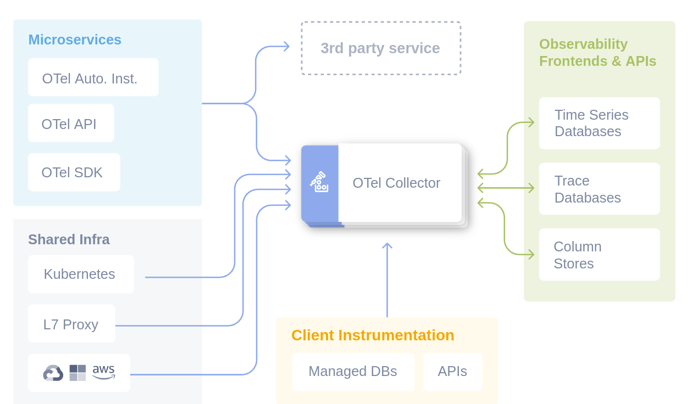
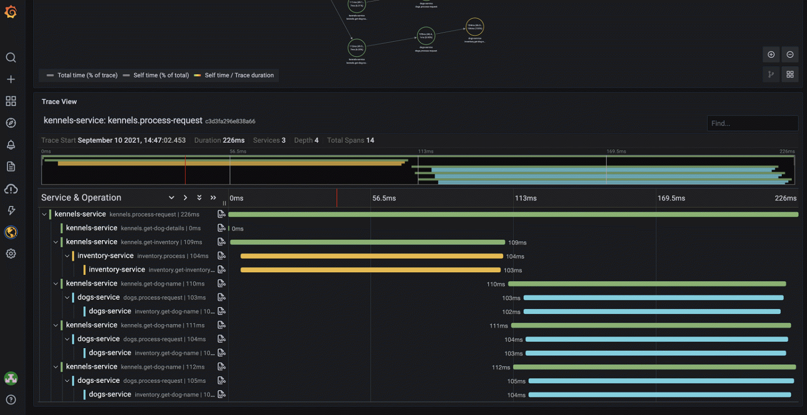
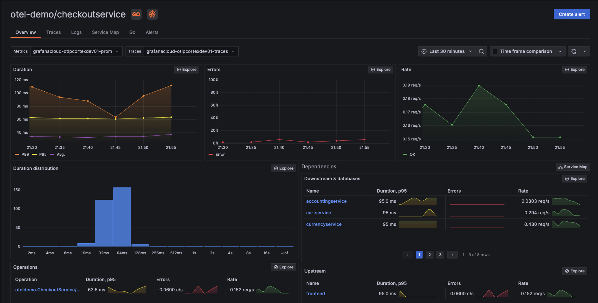

## The Pre-OpenTelemetry Fragmentation Problem

Before the advent of OpenTelemetry, the observability ecosystem was a maze of protocols, APIs, and proprietary formats. Each vendor had developed their own "dialect":

  * **Jaeger** used its own span format and ingestion protocol.
  * **Zipkin** had a different data model and specific REST APIs.
  * **Prometheus** required metrics in a specific format with rigid naming conventions.
  * **AWS X-Ray**, **Google Cloud Trace**, **Azure Monitor** - each with proprietary SDKs.

This fragmentation created systemic problems:

  * **Vendor lock-in**: Changing tools meant rewriting instrumentation.
  * **Data silos**: It was impossible to correlate telemetry from different sources, compromising the ability to understand end-to-end behavior in a distributed system.
  * **Learning overhead**: Each team had to master different APIs and concepts for each tool.
  * **Duplicated effort**: The same instrumentation and integration work was repeated for each backend.

This situation not only caused high costs in terms of development and maintenance, but also prevented a complete and correlated view of the system's state. It was precisely to address these challenges that the community pushed for unification of standards,[ culminating in the merger of OpenTracing and OpenCensus under the CNCF umbrella to create OpenTelemetry](https://opensource.microsoft.com/blog/2019/05/23/announcing-opentelemetry-cncf-merged-opencensus-opentracing/).

-----

## OpenTelemetry: The Unifying Architecture



OpenTelemetry solves this fragmentation through a layered architecture that clearly separates:

  * **Data generation** (SDK)
  * **Data collection** (Collector)
  * **Data consumption** (Backends)

Thanks to its adoption by a broad coalition of companies and its promotion as a **[Graduated project from the Cloud Native Computing Foundation (CNCF)](https://www.cncf.io/blog/2021/08/26/opentelemetry-becomes-a-cncf-incubating-project/)**, OpenTelemetry has quickly established itself as the de-facto standard for cloud-native telemetry.

### The Architectural Principles

**1. Separation of Concerns**

  * The application produces standardized data.
  * The Collector handles routing and processing.
  * Backends only handle storage and query.

**2. Protocol Standardization**

  * **OTLP** (OpenTelemetry Protocol) as the common language.
  * Support for backward compatibility with legacy protocols.
  * Extensibility for future requirements.

**3. Zero-Dependency Deployment**

  * Lightweight SDKs without direct backend dependencies.
  * Collector deployable independently from the application.
  * "Hot-swappable" configuration without needing to restart applications.

-----

## Anatomy of the Data Model

### Trace Data Model


OpenTelemetry uses a hierarchical data model to represent **distributed traces**, offering an end-to-end view of operations in a distributed system:

```
Trace (Root Container)
├── TraceID: Globally unique identifier for the entire transaction.
├── Spans: Array of individual operations.
│   ├── Span
│   │   ├── SpanID: Unique identifier for this single operation.
│   │   ├── ParentSpanID: Hierarchical link to the span that invoked this operation.
│   │   ├── OperationName: Semantic name for the operation (e.g. "UserService.GetUserById").
│   │   ├── StartTime/EndTime: Temporal boundaries of the span's execution.
│   │   ├── Status: Status of the operation (SUCCESS/ERROR/UNSET).
│   │   ├── Attributes: Key-value pairs of contextual metadata.
│   │   ├── Events: Timestamped log entries associated with the span.
│   │   └── Links: References to other traces (for complex correlations).
│   └── ...other spans
└── Resource: Metadata identifying the service that generated the trace.
```

The **Attributes** are crucial for enriching telemetry data. To ensure consistency and compatibility between different tools and services, OpenTelemetry promotes the use of **[Semantic Conventions](https://opentelemetry.io/docs/specs/semconv/)**, a standard for attribute names and their values.

**SpanContext Propagation**
The mechanism that maintains the continuity of traces across process boundaries is **SpanContext Propagation**. This is based on standards like **[W3C Trace Context](https://www.w3.org/TR/trace-context/)**, which defines HTTP headers like `traceparent` for context transmission between services, ensuring that trace IDs are propagated in an interoperable way.

  * **TraceID**: Remains constant for the entire distributed request.
  * **SpanID**: Changes for each new operation within the trace.
  * **TraceFlags**: Metadata for sampling decisions.
  * **TraceState**: Vendor-specific propagation data.


### Metrics Data Model



OpenTelemetry adopts the **pull-based** paradigm of Prometheus with extensions for **push-based** systems:

```
MetricData
├── Resource: Service identification.
├── InstrumentationScope: Library or component that generated the metric.
├── Metrics: Array of time series.
│   ├── Metric
│   │   ├── Name: Identifier for the metric.
│   │   ├── Description: Human-readable description.
│   │   ├── Unit: Standard unit of measurement (seconds, bytes, etc.).
│   │   ├── Type: Counter, Gauge, Histogram, Summary.
│   │   └── DataPoints: Actual measurements.
│   │       ├── Value: Numerical value of the measurement.
│   │       ├── Timestamp: Time when the measurement was taken.
│   │       └── Attributes: Dimensional labels for data segmentation.
│   └── ...other metrics
```

**Instrument Types**:

  * **Counter**: Values that increase monotonically (e.g. `requests_total`).
  * **Gauge**: Point-in-time values that can increase or decrease (e.g. `memory_usage_bytes`).
  * **Histogram**: Distribution of sampled values across configurable buckets (e.g. `request_duration_seconds`).
  * **Summary**: Pre-calculated quantiles and counts, similar to histograms but with different storage overhead.

-----

## OpenTelemetry Collector Internals


### Component Architecture

The Collector is built on a **pipeline-based** architecture with three types of components:

**Receivers**: Input endpoints for data.

  * **OTLP**: Native OpenTelemetry protocol (gRPC/HTTP).
  * **Jaeger**: Support for legacy Jaeger protocol.
  * **Zipkin**: Support for legacy Zipkin protocol.
  * **Prometheus**: Scraping of metrics in Prometheus format.
  * **StatsD**: Support for StatsD protocol.

**Processors**: Data transformation pipelines.

  * **Batch**: Performs batching to improve efficiency and throughput.
  * **Memory Limiter**: A safety circuit for Collector resource protection.
  * **Resource**: Adds or modifies resource attributes.
  * **Sampling**: Implements traffic reduction strategies.
  * **Filter**: Allows discarding unwanted data.
  * **Transform**: Allows modification of telemetry data.

**Exporters**: Output destinations for data.

  * **OTLP**: Sends to OTLP-compatible backends.
  * **Prometheus**: Converts metrics to Prometheus format.
  * **Jaeger**: Exports traces to Jaeger.
  * **Logging**: Exports to structured logs.
  * **File**: Writes to local files.


### Pipeline Configuration

```yaml
# collector.yaml
receivers:
  otlp:
    protocols:
      grpc:
        endpoint: 0.0.0.0:4317
      http:
        endpoint: 0.0.0.0:4318

  prometheus:
    config:
      scrape_configs:
        - job_name: 'app-metrics'
          static_configs:
            - targets: ['app:8080']

processors:
  batch:
    timeout: 1s
    send_batch_size: 1024
    send_batch_max_size: 2048

  memory_limiter:
    limit_mib: 512
    spike_limit_mib: 128

  resource:
    attributes:
      - key: environment
        value: production
        action: upsert

exporters:
  otlp/tempo:
    endpoint: http://tempo:4317
    tls:
      insecure: true

  prometheus:
    endpoint: "0.0.0.0:8889"

  logging:
    loglevel: debug

service:
  pipelines:
    traces:
      receivers: [otlp]
      processors: [memory_limiter, batch, resource]
      exporters: [otlp/tempo, logging]

    metrics:
      receivers: [otlp, prometheus]
      processors: [memory_limiter, batch, resource]
      exporters: [prometheus]
```

### Performance Optimizations

**Batching Strategy**

```yaml
processors:
  batch:
    # Optimized for throughput
    timeout: 1s              # Maximum wait time before sending
    send_batch_size: 1024    # Preferred batch size
    send_batch_max_size: 2048 # Hard maximum limit for batch
```

**Memory Management**

```yaml
processors:
  memory_limiter:
    limit_mib: 512           # "Soft" memory limit for the Collector
    spike_limit_mib: 128     # Additional quota for temporary spikes
    check_interval: 5s       # Frequency of memory checks
```

**Connection Pooling**

  * Reuse of HTTP/gRPC connections.
  * `Connection keep-alive` to reduce overhead.
  * Circuit breakers to handle downstream system failures.

-----

## OTLP Protocol Deep Dive

### Protocol Buffers Schema

OTLP uses **Protocol Buffers** for efficient and lightweight serialization of telemetry data, reducing network overhead:

```protobuf
// Simplified trace schema
message TracesData {
  repeated ResourceSpans resource_spans = 1;
}

message ResourceSpans {
  Resource resource = 1;
  repeated ScopeSpans scope_spans = 2;
}

message ScopeSpans {
  InstrumentationScope scope = 1;
  repeated Span spans = 2;
}

message Span {
  bytes trace_id = 1;
  bytes span_id = 2;
  string name = 3;
  SpanKind kind = 4;
  uint64 start_time_unix_nano = 5;
  uint64 end_time_unix_nano = 6;
  repeated KeyValue attributes = 7;
  Status status = 8;
}
```

### Transport Protocols

**gRPC Transport** (Recommended)

  * Binary serialization for maximum efficiency.
  * HTTP/2 multiplexing for parallel data sending.
  * Support for bidirectional streaming.
  * Built-in compression (gzip).

**HTTP/JSON Transport** (For compatibility)

  * REST-like endpoints.
  * JSON serialization for easy debugging.
  * More "firewall-friendly" (ports 80/443).
  * Higher bandwidth overhead compared to gRPC.

## Advanced Features

### Custom Processors

The Collector's **Processors** are intermediate components that transform, enrich, or filter telemetry before it's exported. OpenTelemetry provides several official processors (e.g. `batch`, `memory_limiter`, `transform`), but it's also possible to **write custom ones** by implementing the appropriate Go interface. This allows full extensibility of the Collector.

Basic example:

```go
type myProcessor struct {
    next consumer.Traces
}

func (p *myProcessor) ConsumeTraces(ctx context.Context, td ptrace.Traces) error {
    resourceSpans := td.ResourceSpans()
    for i := 0; i < resourceSpans.Len(); i++ {
        rs := resourceSpans.At(i)
        rs.Resource().Attributes().PutStr("custom.processor", "v1.0")
    }
    return p.next.ConsumeTraces(ctx, td)
}
````

> Source: [OpenTelemetry Collector – Processor Developer Guide](https://opentelemetry.io/docs/collector/custom-components/#processors)


### Custom Exporters

**Exporters** send telemetry to external systems (e.g. Prometheus, Jaeger, OTLP, Tempo). It's possible to define custom exporters to support proprietary backends or special formats. This requires implementing the `component.TracesExporter`, `component.MetricsExporter` or `component.LogsExporter` interface.

Basic example:

```go
type customExporter struct {
    endpoint string
    client   *http.Client
}

func (e *customExporter) ConsumeTraces(ctx context.Context, td ptrace.Traces) error {
    payload := convertToCustomFormat(td)
    resp, err := e.client.Post(e.endpoint, "application/json", payload)
    if err != nil {
        return err
    }
    defer resp.Body.Close()
    return nil
}
```

> Source: [OpenTelemetry Collector – Exporter Developer Guide](https://opentelemetry.io/docs/collector/custom-components/#exporters)

### Resource Detection

The **Resource Detector** automatically adds contextual metadata to telemetry, identifying the execution environment (e.g. cloud provider, container runtime, orchestrator). Supports AWS, GCP, Azure, Kubernetes, local hosts, and can be extended via custom detectors.

Example in Python:

```python
from opentelemetry.sdk.resources import Resource
from opentelemetry.resourcedetector import get_aggregated_resources
from opentelemetry.resourcedetector.aws_ec2 import AWSEC2ResourceDetector
from opentelemetry.resourcedetector.gcp import GoogleCloudResourceDetector

resource = get_aggregated_resources([
    AWSEC2ResourceDetector(),
    GoogleCloudResourceDetector(),
]).merge(Resource.create({
    "service.name": "my-service",
    "service.version": "1.0.0"
}))
```

> Source: [OpenTelemetry Python SDK – Resource Detection](https://opentelemetry.io/docs/instrumentation/python/resources/#detecting-resources)


-----

## Deployment Patterns

OpenTelemetry Collector can be deployed in various configurations, depending on the architecture requirements and complexity of the distributed system.

### Agent Pattern (Sidecar)

**Use case**: Microservices with granular control, often in containerized environments like Kubernetes.
**Pros**:

  * Resource isolation per service.
  * Independent scaling of the agent.
  * Service-specific configuration.
  * Eliminates the need for the application to make direct network calls to backends.
    **Cons**:
  * Resource overhead for each pod/instance.
  * Increases deployment configuration complexity.

### Gateway Pattern (Centralized)

**Use case**: Enterprise environments with centralized operations or for aggregating telemetry from multiple sources.
**Pros**:

  * Centralized configuration management.
  * Cost efficiency (shared resources).
  * Simplified network topology for backends.
    **Cons**:
  * Potential "single point of failure".
  * Additional network latency between the application and the gateway.
  * Scaling bottlenecks if not properly sized.

### Hybrid Pattern

Combines the two approaches, leveraging the advantages of both:

  * **Agent** for local data collection and basic processing (e.g. batching).
  * **Gateway** for advanced processing (e.g. tail-based sampling, complex transformations) and routing to final backends.

-----

## Performance Considerations

An efficient OpenTelemetry implementation requires attention to performance, especially in high-volume distributed systems.

### Memory Usage Patterns

  * **SDK overhead**: \~2-5MB base per application.
  * **Collector overhead**: \~50-100MB base + buffer size.
  * **Buffer sizing**: Batch size × average telemetry size.
  * **GC pressure**: Minimized through object pooling.

### CPU Impact

  * **Instrumentation**: Generally **less than 1%** CPU overhead with auto-instrumentation.
  * **Serialization**: Approximately 0.1ms per batch of 1000 spans.
  * **Network I/O**: Dominated by network latency, not CPU.

### Network Bandwidth

  * **Uncompressed OTLP**: Approximately 1KB per span on average.
  * **Compressed OTLP (gRPC + gzip)**: Approximately 200 bytes per span.
  * **Batching efficiency**: With batches of 1000 spans, a 95% overhead reduction is achieved.

---

## The Future of OpenTelemetry

OpenTelemetry is evolving rapidly, consolidating its position as the backbone of modern observability. The roadmap is ambitious and aims to make telemetry even more powerful and accessible.

### OpenTelemetry Transformation Language (OTTL)

OTTL is a domain-specific language (DSL) introduced for telemetry transformation directly in the Collector, without writing custom code. It offers flexible manipulation of incoming data through expressive and powerful syntax. Starting from version 0.120.0, automatic support for context inference is available.

Usage example:

```yaml
processors:
  transform:
    traces:
      statements:
        # Modify an attribute to group similar URLs
        - set(attributes["http.route"], "/api/v1/*") where name == "GET /api/v1/users"
        # Remove attributes containing sensitive data
        - delete_key(attributes, "sensitive.data")
```

> Source: [OTTL Context Inference – OpenTelemetry](https://opentelemetry.io/blog/2025/ottl-contexts-just-got-easier/)
> Tool: [OTTL Playground – Elastic](https://www.elastic.co/observability-labs/blog/introducing-the-ottl-playground-for-opentelemetry)

### Profiling Signal Support

Continuous profiling integration is ongoing within OpenTelemetry, with a new OTLP signal type for CPU and memory profiles. The goal is to correlate low-level profiles with distributed transaction traces, automatically identifying application "hot paths".

Planned features:

* CPU profiling correlated to traces.
* Memory allocation tracking.
* Automatic identification of critical areas ("hot paths").

The standard is currently **unstable** and not recommended for production environments.

> Source: [State of Profiling – OpenTelemetry](https://opentelemetry.io/blog/2024/state-profiling/)
> Elastic Donation: [Elastic donates eBPF agent to OpenTelemetry](https://www.elastic.co/observability-labs/blog/elastic-profiling-agent-acceptance-opentelemetry)

### Enhanced Sampling (not yet implemented)

Among the explored directions (but **not yet implemented**) are new dynamic and intelligent sampling strategies, potentially based on ML or business value. These features **are not included in the priority roadmap** of the project.

> Source: [OpenTelemetry Community Roadmap](https://opentelemetry.io/community/roadmap/)

## Ecosystem Evolution

### Cloud Native Integration

There are ongoing initiatives for deeper OpenTelemetry integration with cloud-native environments, including:

* Service mesh (e.g. Istio, Linkerd).
* Kubernetes Operators for Collector auto-configuration.
* **eBPF-based zero-instrumentation**: under development, allows collecting telemetry data from the Linux kernel without modifying application code. eBPF integration is currently classified as **P2 priority**, so **not yet stable or officially supported**.

> Source: [OpenTelemetry Network Roadmap](https://github.com/open-telemetry/opentelemetry-network/blob/main/docs/roadmap.md)
> eBPF Deep Dive: [eBPF and Observability – Cilium](https://www.cilium.io/blog/2021/04/06/ebpf-and-observability/)

### AI/ML Workloads (not priority roadmap)

Observability applied to Machine Learning workloads (GPU metrics collection, training job tracing, model inference) **is not a current priority** of the public roadmap. Some external tools are exploring these areas, but they are not part of the official OpenTelemetry core.

