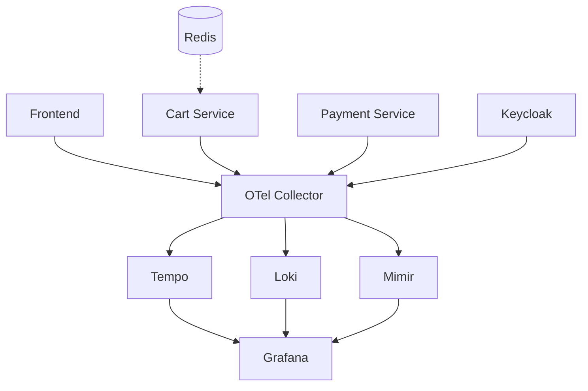

# LGTM Stack e OpenTelemetry: Setup Completo per Osservabilità

> **Scheletro articolo - Tutorial hands-on (versione 3 - fix applicati)**

---

## 1. Introduzione (300 parole)

**Obiettivo:**
Configurare un ambiente di osservabilità completo con LGTM stack (Loki, Grafana, Tempo, Mimir) e OpenTelemetry Collector per raccogliere e correlare traces, logs e metriche.

**Componenti del setup:**
- Stack LGTM per storage e visualizzazione
- OpenTelemetry Collector come hub di telemetria
- Applicazione e-commerce demo instrumentata (frontend + microservizi)
- Keycloak come servizio aggiuntivo che genera telemetria
- Script di generazione traffico

**Flusso dati:**
1. Applicazioni demo → OTLP → OpenTelemetry Collector
2. Collector processa e instrada:
   - Tempo (traces)
   - Loki (logs)
   - Mimir (metrics)
3. Grafana interroga i tre backend per visualizzazione unificata

**Configurazione risultante:**
Ambiente locale per analisi della correlazione tra traces, logs e metriche. Gli screenshot nelle sezioni successive mostrano esempi di navigazione tra i tre segnali tramite `trace_id` condiviso.

**Repository:**
Codice completo disponibile su GitHub con docker-compose, configurazioni e app demo pre-instrumentate.

Nota sul contesto: questo setup è ottimizzato per apprendimento e sperimentazione locale. Configurazioni per produzione (TLS, autenticazione, HA) non sono trattate.

---

## 2. Architettura e Componenti (500 parole)

### 2.1 Topologia Sistema

**Applicazione E-commerce:**
- **Frontend** (Python/Flask): interfaccia web, proxy per servizi backend
- **Cart Service** (Go): gestione carrello, persistenza Redis
- **Payment Service** (Go): elaborazione pagamenti, simulazione latenza/errori
- **Keycloak**: servizio di identity management, instrumentato con OpenTelemetry

**Pipeline Telemetria:**
- **SDK OpenTelemetry**: integrati in Frontend, Cart Service, Payment Service
- **Collector**: riceve dati OTLP, applica processing, instrada ai backend

**Backend LGTM:**
- **Tempo**: storage traces, query per TraceID
- **Loki**: aggregazione log con indicizzazione per etichette
- **Mimir**: database serie temporali per metriche
- **Grafana**: interfaccia unificata per query e visualizzazione

**Diagramma relazioni:**



*(Nota: il diagramma Mermaid può essere renderizzato come immagine con `scripts/render-mermaid.sh` disponibile nel repository)*

### 2.2 Scelta dello Stack

Questo setup utilizza LGTM per l'integrazione nativa tra componenti e il supporto formato OTLP. La compatibilità tra Tempo, Loki, Mimir e Grafana riduce la complessità operativa rispetto a stack eterogenei.

**Keycloak nel setup:**
Keycloak è incluso come esempio di servizio Java enterprise instrumentato con OpenTelemetry. Genera traces, logs e metriche che vengono inviate al collector insieme ai dati dell'applicazione e-commerce. La telemetria di Keycloak è presente nel sistema ma non viene analizzata nelle sezioni pratiche del tutorial, che si concentrano sui servizi applicativi.

---

## 3. Prerequisiti e Setup Iniziale (300 parole)

**Sistema richiesto:**
- Docker 24+ e Docker Compose 2.x
- 4 GB RAM disponibili (consumo effettivo ~2.5 GB con tutti i servizi)
- 15 GB spazio disco
- Sistema operativo: Linux o macOS (Windows con WSL2)

**Porte utilizzate:**
- 3000: Grafana UI
- 3100: Loki API
- 3200: Tempo API
- 4317: OTLP gRPC (Collector)
- 4318: OTLP HTTP (Collector)
- 6379: Redis
- 8080: Frontend app
- 8081-8082: Microservizi backend
- 8180: Keycloak (porta custom per evitare conflitto con frontend su 8080)
- 8888: Collector metrics (self-monitoring)
- 9009: Mimir API

**Verifica prerequisiti:**
```bash
docker --version  # >= 24.0
docker compose version  # >= 2.0
```

**Clone repository:**
```bash
git clone https://github.com/user/lgtm-otel-demo
cd lgtm-otel-demo
```

**Struttura repository:**
```
lgtm-otel-demo/
├── docker-compose.yml
├── config/
│   ├── otel-collector.yaml
│   ├── tempo.yaml
│   ├── loki.yaml
│   ├── mimir.yaml
│   └── grafana/
│       ├── datasources.yaml
│       └── dashboards/          # (opzionali, esempi pre-configurati)
├── apps/
│   ├── frontend/
│   ├── cart-service/
│   ├── payment-service/
│   └── load-test.sh
└── README.md
```

**Tempo stimato:**
- Download immagini: 10-15 min (prima volta)
- Avvio stack: 2-3 min
- Setup e verifica configurazione: 5-15 min (dipende da conflitti porte)
- Esplorazione hands-on e test: 30-60 min
- **Totale:** 50-90 min (1-1.5 ore)

---

## 4. Applicazione Demo (500 parole)

### 4.1 Architettura Applicazione

**Frontend (Python/Flask):**
- Rendering UI per catalogo prodotti
- Proxy per chiamate a cart-service e payment-service
- Auto-instrumentazione OpenTelemetry per Flask

**Cart Service (Go):**
- API REST per gestione carrello
- Persistenza in Redis con TTL
- Instrumentazione manuale Go SDK
- Genera span per ogni operazione Redis

**Payment Service (Go):**
- Simulazione elaborazione pagamenti
- Introduce latenza variabile (50-500ms)
- Failure rate configurabile (5% default)
- Instrumentazione manuale con attributi custom

**Keycloak:**
- Configurato su porta 8180
- Instrumentato con OpenTelemetry (variabili ambiente OTEL_*)
- Genera telemetria per operazioni interne (startup, admin API, autenticazione)
- Telemetria disponibile in Tempo/Loki/Mimir ma non analizzata nel tutorial

### 4.2 Instrumentazione OpenTelemetry

**Configurazione SDK (variabili ambiente):**
```bash
OTEL_EXPORTER_OTLP_ENDPOINT=http://otel-collector:4317
OTEL_SERVICE_NAME=<nome-servizio>
OTEL_RESOURCE_ATTRIBUTES=environment=demo,cluster=local
```

**Python (Frontend) - Auto-instrumentazione:**
```python
# Configurazione all'avvio applicazione
from opentelemetry import trace
from opentelemetry.sdk.trace import TracerProvider
from opentelemetry.sdk.trace.export import BatchSpanProcessor
from opentelemetry.exporter.otlp.proto.grpc.trace_exporter import OTLPSpanExporter
from opentelemetry.instrumentation.flask import FlaskInstrumentor
from opentelemetry.instrumentation.requests import RequestsInstrumentor

# Setup provider e exporter
provider = TracerProvider()
processor = BatchSpanProcessor(OTLPSpanExporter())
provider.add_span_processor(processor)
trace.set_tracer_provider(provider)

# Auto-instrument Flask e requests
FlaskInstrumentor().instrument_app(app)
RequestsInstrumentor().instrument()
```

**Go (Microservizi) - Instrumentazione manuale:**
```go
import (
    "go.opentelemetry.io/otel"
    "go.opentelemetry.io/otel/exporters/otlp/otlptrace/otlptracegrpc"
    sdktrace "go.opentelemetry.io/otel/sdk/trace"
)

// Setup all'avvio
exporter, _ := otlptracegrpc.New(ctx,
    otlptracegrpc.WithEndpoint("otel-collector:4317"),
    otlptracegrpc.WithInsecure(),
)
tp := sdktrace.NewTracerProvider(
    sdktrace.WithBatcher(exporter),
)
otel.SetTracerProvider(tp)

// Uso in handler
tracer := otel.Tracer("cart-service")
ctx, span := tracer.Start(r.Context(), "AddToCart")
defer span.End()

span.SetAttributes(
    attribute.String("user.id", userID),
    attribute.Int("cart.items", len(items)),
)
```

### 4.3 Propagazione Context e Log Correlation

**Injection trace_id nei log (Python):**
```python
import logging
from opentelemetry.instrumentation.logging import LoggingInstrumentor

# Configurazione formatter con trace context
logging.basicConfig(
    format='%(asctime)s [%(levelname)s] trace_id=%(otelTraceID)s span_id=%(otelSpanID)s %(message)s',
    level=logging.INFO
)
LoggingInstrumentor().instrument(set_logging_format=True)

# I log automaticamente includono trace_id
logger.info("User checkout initiated")
# Output: 2025-02-01 10:15:30 [INFO] trace_id=abc123... span_id=def456... User checkout initiated
```

**Injection trace_id nei log (Go):**
```go
import (
    "go.opentelemetry.io/otel/trace"
    "log/slog"
)

func LogWithTrace(ctx context.Context, msg string, args ...any) {
    span := trace.SpanFromContext(ctx)
    sc := span.SpanContext()

    slog.InfoContext(ctx, msg,
        append(args,
            "trace_id", sc.TraceID().String(),
            "span_id", sc.SpanID().String(),
        )...,
    )
}

// Uso
LogWithTrace(ctx, "Payment processed", "amount", 99.99, "currency", "EUR")
```

> ⚠️ **Correlazione trace-log**
>
> Il trace_id nei log è fondamentale per la correlazione in Grafana. Loki indicizza questi campi automaticamente se presenti in formato structured.

---

## 5. Configurazione OpenTelemetry Collector (700 parole)

**File: `config/otel-collector.yaml`**

Il Collector è configurato per ricevere dati OTLP, applicare processing essenziale e instradare ai backend appropriati.

```yaml
receivers:
  otlp:
    protocols:
      grpc:
        endpoint: 0.0.0.0:4317
      http:
        endpoint: 0.0.0.0:4318

processors:
  # Batch: raggruppa span/log/metric prima dell'export (riduce overhead rete)
  batch:
    send_batch_size: 1024
    timeout: 10s
    send_batch_max_size: 2048

  # Memory limiter: previene OOM del collector
  memory_limiter:
    check_interval: 1s
    limit_mib: 512
    spike_limit_mib: 128

  # Resource: aggiunge attributi globali a tutti i segnali
  resource:
    attributes:
      - key: environment
        value: demo
        action: insert
      - key: cluster
        value: local
        action: insert

  # Attributes: manipola attributi per ridurre cardinalità
  attributes:
    actions:
      # Rimuovi URL completi (contengono token/ID variabili)
      - key: http.url
        action: delete
      # Mantieni solo http.target (path senza query params)
      - key: http.target
        action: upsert
        from_attribute: http.route

exporters:
  # Tempo: traces via OTLP
  otlp/tempo:
    endpoint: tempo:4317
    tls:
      insecure: true
    retry_on_failure:
      enabled: true
      initial_interval: 1s
      max_interval: 30s
    sending_queue:
      enabled: true
      queue_size: 1000

  # Loki: logs
  loki:
    endpoint: http://loki:3100/loki/api/v1/push
    labels:
      resource:
        service.name: "service_name"
        environment: "environment"
      attributes:
        level: "level"

  # Mimir: metrics via Prometheus Remote Write
  prometheusremotewrite:
    endpoint: http://mimir:9009/api/v1/push
    retry_on_failure:
      enabled: true

  # Debug: logging per troubleshooting
  debug:
    verbosity: detailed
    sampling_initial: 5
    sampling_thereafter: 200

service:
  pipelines:
    traces:
      receivers: [otlp]
      processors: [memory_limiter, batch, resource, attributes]
      exporters: [otlp/tempo]

    logs:
      receivers: [otlp]
      processors: [memory_limiter, batch, resource]
      exporters: [loki]

    metrics:
      receivers: [otlp]
      processors: [memory_limiter, batch, resource]
      exporters: [prometheusremotewrite]

  # Self-monitoring del collector
  telemetry:
    logs:
      level: info
    metrics:
      address: 0.0.0.0:8888
```

### 5.1 Dettaglio Processors

**batch:**
- Raggruppa dati per ridurre chiamate di rete ai backend
- `send_batch_size`: numero elementi prima di inviare
- `timeout`: invia anche se batch incompleto dopo X secondi
- Trade-off: latenza vs throughput

**memory_limiter:**
- Monitora memoria usata dal collector ogni secondo
- Se supera `limit_mib`, blocca ricezione dati fino a scendere sotto soglia
- `spike_limit_mib`: margine per picchi temporanei
- Fondamentale per evitare OOM in ambienti con volume dati variabile

**resource:**
- Aggiunge attributi a livello risorsa (applicati a tutti i segnali)
- Utile per tagging environment/cluster senza modificare SDK
- Attributi visibili in Grafana per filtering

**attributes:**
- Manipola attributi specifici per ridurre cardinalità
- Rimuove `http.url` (contiene ID/token variabili → cardinalità alta)
- Mantiene `http.target` o `http.route` (path normalizzato)

### 5.2 Configurazione Exporters

**otlp/tempo:**
- Usa protocollo OTLP nativo (più efficiente di Jaeger/Zipkin)
- `tls.insecure: true`: connessione plaintext per setup locale
- `retry_on_failure`: backoff esponenziale se Tempo non disponibile
- `sending_queue`: buffer in-memory per gestire picchi

**loki:**
- Formato Loki-native (non OTLP)
- `labels.resource`: estrae service.name/environment come etichette Loki
- `labels.attributes`: estrae `level` dai log attributes
- Etichette sono indicizzate, il resto è contenuto grezzo

**prometheusremotewrite:**
- Mimir compatibile con API Prometheus Remote Write
- Metriche OTLP convertite automaticamente in formato Prometheus
- Retry abilitato per gestire indisponibilità temporanea

### 5.3 Verifica Configurazione

Prima di avviare, validare sintassi:
```bash
docker run --rm -v $(pwd)/config:/config \
  otel/opentelemetry-collector-contrib:0.91.0 \
  validate --config=/config/otel-collector.yaml
```

Output atteso:
```
Config is valid.
```

---

## 6. Configurazione Backend LGTM (400 parole)

### 6.1 Tempo

**File: `config/tempo.yaml`**

```yaml
server:
  http_listen_port: 3200

distributor:
  receivers:
    otlp:
      protocols:
        grpc:
          endpoint: 0.0.0.0:4317

storage:
  trace:
    backend: local
    local:
      path: /tmp/tempo/traces
    wal:
      path: /tmp/tempo/wal

query_frontend:
  search:
    max_duration: 0s  # illimitato per demo
```

**Punti chiave:**
- `backend: local`: filesystem locale (produzione userebbe S3/GCS)
- `wal`: write-ahead log per durabilità
- Query illimitata per esplorazione

### 6.2 Loki

**File: `config/loki.yaml`**

```yaml
auth_enabled: false

server:
  http_listen_port: 3100

ingester:
  lifecycler:
    ring:
      kvstore:
        store: inmemory
      replication_factor: 1
  chunk_idle_period: 5m
  max_chunk_age: 1h

schema_config:
  configs:
    - from: 2020-05-15
      store: boltdb-shipper
      object_store: filesystem
      schema: v11
      index:
        prefix: index_
        period: 24h

storage_config:
  boltdb_shipper:
    active_index_directory: /loki/boltdb-shipper-active
    cache_location: /loki/boltdb-shipper-cache
  filesystem:
    directory: /loki/chunks

limits_config:
  enforce_metric_name: false
  reject_old_samples: false
```

**Punti chiave:**
- `auth_enabled: false`: no multi-tenancy
- `replication_factor: 1`: single instance
- Storage locale con BoltDB per indici

### 6.3 Mimir

**File: `config/mimir.yaml`**

```yaml
multitenancy_enabled: false

server:
  http_listen_port: 9009

ingester:
  ring:
    kvstore:
      store: inmemory
    replication_factor: 1

storage:
  backend: filesystem
  filesystem:
    dir: /data/tsdb
```

**Punti chiave:**
- Setup single-instance (no clustering)
- Storage filesystem locale

---

## 7. Docker Compose (600 parole)

**File: `docker-compose.yml`**

```yaml
version: '3.9'

services:
  # ===== APPLICAZIONI =====
  frontend:
    build: ./apps/frontend
    ports:
      - "8080:8080"
    environment:
      - OTEL_EXPORTER_OTLP_ENDPOINT=http://otel-collector:4317
      - OTEL_SERVICE_NAME=frontend
      - OTEL_RESOURCE_ATTRIBUTES=environment=demo,cluster=local
      - CART_SERVICE_URL=http://cart-service:8081
      - PAYMENT_SERVICE_URL=http://payment-service:8082
    depends_on:
      - otel-collector
      - cart-service
      - payment-service

  cart-service:
    build: ./apps/cart-service
    ports:
      - "8081:8081"
    environment:
      - OTEL_EXPORTER_OTLP_ENDPOINT=http://otel-collector:4317
      - OTEL_SERVICE_NAME=cart-service
      - OTEL_RESOURCE_ATTRIBUTES=environment=demo,cluster=local
      - REDIS_URL=redis:6379
    depends_on:
      - redis
      - otel-collector

  payment-service:
    build: ./apps/payment-service
    ports:
      - "8082:8082"
    environment:
      - OTEL_EXPORTER_OTLP_ENDPOINT=http://otel-collector:4317
      - OTEL_SERVICE_NAME=payment-service
      - OTEL_RESOURCE_ATTRIBUTES=environment=demo,cluster=local
    depends_on:
      - otel-collector

  redis:
    image: redis:7-alpine
    volumes:
      - redis-data:/data

  keycloak:
    image: quay.io/keycloak/keycloak:23.0
    command: start-dev
    ports:
      - "8180:8180"
    environment:
      - KEYCLOAK_ADMIN=admin
      - KEYCLOAK_ADMIN_PASSWORD=admin
      - KC_HTTP_PORT=8180
      - OTEL_EXPORTER_OTLP_ENDPOINT=http://otel-collector:4317
      - OTEL_SERVICE_NAME=keycloak
    volumes:
      - keycloak-data:/opt/keycloak/data

  # ===== OPENTELEMETRY =====
  otel-collector:
    image: otel/opentelemetry-collector-contrib:0.91.0
    command: ["--config=/etc/otel-collector.yaml"]
    volumes:
      - ./config/otel-collector.yaml:/etc/otel-collector.yaml
    ports:
      - "4317:4317"  # OTLP gRPC
      - "4318:4318"  # OTLP HTTP
      - "8888:8888"  # Prometheus metrics (self-monitoring)
    depends_on:
      - tempo
      - loki
      - mimir

  # ===== LGTM STACK =====
  tempo:
    image: grafana/tempo:2.3.1
    command: ["-config.file=/etc/tempo.yaml"]
    volumes:
      - ./config/tempo.yaml:/etc/tempo.yaml
      - tempo-data:/tmp/tempo
    ports:
      - "3200:3200"
      - "4317"  # Internal OTLP

  loki:
    image: grafana/loki:2.9.3
    command: ["-config.file=/etc/loki.yaml"]
    volumes:
      - ./config/loki.yaml:/etc/loki.yaml
      - loki-data:/loki
    ports:
      - "3100:3100"

  mimir:
    image: grafana/mimir:2.11.0
    command: ["-config.file=/etc/mimir.yaml"]
    volumes:
      - ./config/mimir.yaml:/etc/mimir.yaml
      - mimir-data:/data
    ports:
      - "9009:9009"

  grafana:
    image: grafana/grafana:10.2.3
    volumes:
      - ./config/grafana/datasources.yaml:/etc/grafana/provisioning/datasources/datasources.yaml
      - ./config/grafana/dashboards:/etc/grafana/provisioning/dashboards
      - grafana-data:/var/lib/grafana
    environment:
      - GF_AUTH_DISABLE_LOGIN_FORM=true
      - GF_AUTH_ANONYMOUS_ENABLED=true
      - GF_AUTH_ANONYMOUS_ORG_ROLE=Admin
      - GF_FEATURE_TOGGLES_ENABLE=traceqlEditor
    ports:
      - "3000:3000"
    depends_on:
      - tempo
      - loki
      - mimir

volumes:
  tempo-data:
  loki-data:
  mimir-data:
  grafana-data:
  redis-data:
  keycloak-data:
```

### 7.1 Note Operative

**Avvio:**
```bash
docker-compose up -d
```

Sequenza avvio:
1. Backend (Tempo/Loki/Mimir) - ~10-15s per readiness
2. Collector - attende backend, poi diventa ready
3. Applicazioni - attendono Collector

**Verifica health:**
```bash
# Collector riceve dati
curl http://localhost:8888/metrics | grep receiver_accepted_spans

# Tempo operativo
curl http://localhost:3200/ready

# Loki operativo
curl http://localhost:3100/ready

# Grafana accessibile
curl http://localhost:3000/api/health
```

**Logs utili per debugging:**
```bash
# Collector errors
docker-compose logs -f otel-collector | grep -i error

# Tempo ingest
docker-compose logs -f tempo | grep "trace"

# Loki ingest
docker-compose logs -f loki | grep "push"
```

---

## 8. Generazione Traffico e Verifica (400 parole)

### 8.1 Script Load Test

**File: `apps/load-test.sh`**

```bash
#!/bin/bash

BASE_URL="http://localhost:8080"
DURATION=300  # 5 minuti

echo "Avvio load test per $DURATION secondi..."

# Funzione per simulare utente
simulate_user() {
  USER_ID=$((RANDOM % 100))

  # 1. Visualizza catalogo
  curl -s "$BASE_URL/products" > /dev/null
  sleep 0.5

  # 2. Aggiungi prodotto al carrello
  PRODUCT_ID=$((RANDOM % 20 + 1))
  curl -s -X POST "$BASE_URL/cart/add" \
    -H "Content-Type: application/json" \
    -d "{\"user_id\": $USER_ID, \"product_id\": $PRODUCT_ID, \"quantity\": 1}" \
    > /dev/null
  sleep 0.3

  # 3. Visualizza carrello
  curl -s "$BASE_URL/cart/$USER_ID" > /dev/null
  sleep 0.2

  # 4. Checkout (50% degli utenti)
  if [ $((RANDOM % 2)) -eq 0 ]; then
    curl -s -X POST "$BASE_URL/payment/checkout" \
      -H "Content-Type: application/json" \
      -d "{\"user_id\": $USER_ID, \"amount\": $((RANDOM % 200 + 10))}" \
      > /dev/null
  fi
}

# Esegui load test
START_TIME=$(date +%s)
END_TIME=$((START_TIME + DURATION))

while [ $(date +%s) -lt $END_TIME ]; do
  simulate_user &
  sleep 0.1  # 10 req/sec
done

wait
echo "Load test completato."
```

**Esecuzione:**
```bash
chmod +x apps/load-test.sh
./apps/load-test.sh
```

### 8.2 Verifica Dati in Grafana

**Accesso:** http://localhost:3000

**Datasources pre-configurati:**
- Tempo: traces
- Loki: logs
- Mimir: metrics

**Verifica rapida (Explore):**

1. **Traces in Tempo:**
   - Explore → Tempo datasource
   - Query: `{service.name="frontend"}`
   - Verifica presenza traces con span tree completo

2. **Logs in Loki:**
   - Explore → Loki datasource
   - Query: `{service_name="payment-service"} |= "error"`
   - Verifica log con `trace_id` e `span_id` nei campi

3. **Metriche in Mimir:**
   - Explore → Mimir datasource
   - Query PromQL: `rate(http_server_duration_count[1m])`
   - Verifica metriche per tutti i servizi

---

## 9. Correlazione in Grafana (600 parole)

### 9.1 Scenario: Investigare Errore di Pagamento

**Contesto:** Il dashboard mostra spike nel tasso di errori HTTP 500 su payment-service alle 15:42.

**Step 1: Identificare anomalia in metriche**

Dashboard panel con query:
```promql
sum(rate(http_server_requests_total{service_name="payment-service",status_code=~"5.."}[1m]))
```

Grafico mostra spike da 0.05 req/s a 2.3 req/s alle 15:42.

**Step 2: Drill-down su traces correlati**

Dalla visualizzazione metrica:
1. Hover sul punto anomalo → appare tooltip con timestamp esatto
2. Click destro sul punto → menu contestuale → "Explore traces"
3. Grafana imposta automaticamente time range: 15:42:00 - 15:43:00

Explore si apre con Tempo datasource e filtro:
```
{service.name="payment-service" && status.code="STATUS_CODE_ERROR"}
```

Risultati: 23 traces con errori nel minuto selezionato.

Ordinamento per durata (span più lenti prima).

**Step 3: Analisi trace specifico**

Selezione trace con durata 3.2s (vs baseline 200ms).

Waterfall view mostra:
```
frontend [200ms]
  └─ cart-service [50ms]
  └─ payment-service [3100ms]
       └─ processPayment [3050ms]
            └─ callFraudAPI [3000ms] ❌ ERROR
```

Span `callFraudAPI` ha:
- Status: ERROR
- Attributes:
  - `http.status_code`: 503
  - `error.message`: "Service Unavailable"
  - `trace_id`: `7a8f3c2d1e9b4f5a6c7d8e9f0a1b2c3d`

**Step 4: Correlazione con log**

Dal trace view:
1. Identificare bottone "Logs" nel pannello span details
2. Click su "Logs" → Grafana apre nuova tab Explore con Loki
3. Query automatica generata: `{service_name="payment-service"} | json | trace_id="7a8f3c2d1e9b4f5a6c7d8e9f0a1b2c3d"`

Log entries:
```
2025-02-01 15:42:18 [ERROR] trace_id=7a8f3c2d... span_id=... Fraud API timeout after 3s
2025-02-01 15:42:18 [WARN] trace_id=7a8f3c2d... Retrying fraud check (attempt 2/3)
2025-02-01 15:42:21 [ERROR] trace_id=7a8f3c2d... Fraud API still unavailable, failing payment
```

**Risultato analisi:**
- Root cause: dipendenza esterna (Fraud API) non disponibile
- Impact: 23 pagamenti falliti in 60s
- Latenza: 3s timeout prima di fallback
- Azione: aumentare resilienza con circuit breaker o cache

### 9.2 Split View Dashboard

**Layout dashboard correlazione:**

Panel 1 (top): Grafico serie temporale
```promql
rate(http_server_duration_sum[1m]) / rate(http_server_duration_count[1m])
```
Latenza media per servizio.

Panel 2 (middle): Tempo traces table
- Filtro: servizio selezionato da Panel 1
- Colonne: TraceID, Duration, Status, Timestamp
- Link: click su TraceID apre waterfall

Panel 3 (bottom): Loki logs stream
- Query con variabile `$trace_id` da Panel 2
- Highlighting su livelli ERROR/WARN

**Interazione:**
1. Click su spike latenza in Panel 1 → filtra Panel 2 per time range
2. Click su trace in Panel 2 → popola `$trace_id` → filtra Panel 3
3. Log in Panel 3 mostrano contesto applicativo del trace

Screenshot dashboard con le tre view simultanee, evidenziando `trace_id` condiviso tra metriche, traces e log.

---

## 10. Troubleshooting (600 parole)

### Problema 1: Container Collector Restart Loop

**Sintomo:**
```bash
docker-compose logs otel-collector
# Output: Exited with code 1, restarting...
```

**Cause possibili:**
- Configurazione YAML malformata
- Backend (Tempo/Loki/Mimir) non raggiungibili
- Memoria insufficiente

**Debug:**
```bash
# Valida config YAML
docker run --rm -v $(pwd)/config:/config \
  otel/opentelemetry-collector-contrib:0.91.0 \
  validate --config=/config/otel-collector.yaml

# Verifica connettività backend
docker-compose exec otel-collector wget -O- http://tempo:4317
```

**Fix:**
- Correggi sintassi YAML
- Verifica `depends_on` in docker-compose
- Aumenta `memory_limiter.limit_mib` se necessario (con 4GB RAM disponibili, 512MB dovrebbero essere sufficienti)

### Problema 2: Grafana Non Mostra Datasources

**Sintomo:** Explore vuoto, "No data sources found".

**Cause:**
- File `datasources.yaml` non montato correttamente
- Errori nel file datasources

**Debug:**
```bash
# Verifica mount
docker-compose exec grafana ls /etc/grafana/provisioning/datasources/

# Log Grafana provisioning
docker-compose logs grafana | grep -i datasource
```

**Fix:**
Verifica `config/grafana/datasources.yaml`:
```yaml
apiVersion: 1

datasources:
  - name: Tempo
    type: tempo
    access: proxy
    url: http://tempo:3200
    uid: tempo-ds

  - name: Loki
    type: loki
    access: proxy
    url: http://loki:3100
    uid: loki-ds

  - name: Mimir
    type: prometheus
    access: proxy
    url: http://mimir:9009/prometheus
    uid: mimir-ds
```

### Problema 3: Traces Non Appaiono in Tempo

**Sintomo:** Explore Tempo restituisce "No traces found".

**Cause:**
- App non inviano dati
- Collector non riceve
- Tempo non salva

**Debug step-by-step:**
```bash
# 1. App generano traffico?
curl http://localhost:8080/products
# Deve restituire 200 OK

# 2. Collector riceve span?
curl http://localhost:8888/metrics | grep otelcol_receiver_accepted_spans
# Deve mostrare counter > 0

# 3. Collector esporta a Tempo?
curl http://localhost:8888/metrics | grep otelcol_exporter_sent_spans
# Deve mostrare counter > 0

# 4. Tempo ha ricevuto?
docker-compose logs tempo | grep "POST /otlp"
# Deve mostrare richieste HTTP 200
```

**Fix:** Identifica step fallito e correggi configurazione relativa.

### Problema 4: Log Senza trace_id

**Sintomo:** Log appaiono in Loki ma nessun link a traces.

**Cause:**
- SDK non inietta trace context in logger
- Formato log non structured (plain text)

**Verifica:**
```bash
# Log raw da applicazione
docker-compose logs payment-service | grep trace_id
# Deve contenere campo trace_id
```

**Fix:**
- Python: verifica `LoggingInstrumentor().instrument()`
- Go: usa `LogWithTrace()` helper con span context
- Formato log deve essere JSON o key=value

### Problema 5: Out of Memory (OOM)

**Sintomo:** Sistema lento, Docker Desktop segnala RAM 100%.

**Cause:**
- Volume dati troppo alto per memory_limiter
- Retention infinita su backend
- Memory leak in app

**Fix immediato:**
```bash
# Riduce load
pkill -f load-test.sh

# Pulisci volumi
docker-compose down
docker volume prune
docker-compose up -d
```

**Fix permanente:**
- Aumenta `memory_limiter.limit_mib` a 1024 (considerando che il setup richiede 4GB RAM, l'aumento è sostenibile)
- Configura retention Tempo/Loki (es: 24h per demo, sufficiente per esplorazioni ripetute)
- Riduci batch size nel Collector

### Problema 6: Errore "Connection Refused" su Backend

**Sintomo:**
```
Failed to export: connection refused
```

**Causa:** Backend non ancora ready quando Collector tenta connessione.

**Comportamento atteso:** Normale nei primi 10-15s di avvio. Retry automatici risolveranno.

**Fix:** Attendi 30s dopo `docker-compose up`, poi verifica health:
```bash
sleep 30
docker-compose ps | grep healthy
```

### Problema 7: Dashboard Vuoto Dopo Primo Avvio

**Sintomo:** Grafana accessibile ma dashboard senza dati.

**Causa:** Nessun traffico generato.

**Fix:**
```bash
# Genera traffico
./apps/load-test.sh &

# Attendi 1-2 minuti per accumulo dati
# Poi ricarica dashboard
```

### Problema 8: Conflitto Porte

**Sintomo:**
```
Error: port 3000 already in use
```

**Fix:**
```bash
# Identifica processo
lsof -ti:3000

# Kill processo o cambia porta in docker-compose
sed -i 's/3000:3000/3001:3000/' docker-compose.yml
```

---

## 11. Conclusioni e Risorse (300 parole)

### Configurazione Completata

L'articolo ha trattato:
- Setup stack LGTM con storage locale
- Configurazione OpenTelemetry Collector per processing essenziale
- Instrumentazione applicazione multi-servizio (Python, Go)
- Correlazione tra segnali tramite trace_id
- Navigazione da metrica a trace a log in Grafana

### Limitazioni Setup Attuale

Questo ambiente è ottimizzato per apprendimento:
- Storage locale (non scalabile)
- Single-instance backend (no HA)
- Autenticazione Grafana disabilitata (anonymous admin)
- TLS disabilitato (plaintext traffic)
- Retention non configurata (volumi crescono indefinitamente)

### Estensioni Possibili

**Approfondimenti tecnici:**
- Implementare alerting in Grafana (Prometheus AlertManager)
- Configurare sampling tail-based nel Collector
- Aggiungere metriche custom business-level
- Integrare service mesh (Istio) per telemetria automatica

**Evoluzione verso produzione:**
- Migrare storage a S3/GCS per Tempo/Loki
- Deployare su Kubernetes con Helm charts
- Configurare autenticazione (OAuth, LDAP) su Grafana
- Abilitare TLS su tutti gli endpoint
- Setup HA per Collector e backend (replica 3+)
- Definire retention policies (es: traces 7gg, log 30gg, metriche 90gg per produzione)

### Repository e Risorse

**Codice completo:** 👉 [github.com/user/lgtm-otel-demo](https://github.com/user/lgtm-otel-demo)

Include:
- docker-compose.yml funzionante
- Configurazioni complete (Collector, Tempo, Loki, Mimir, Grafana)
- Applicazioni instrumentate (Python, Go)
- Script load testing
- Dashboard Grafana di esempio (opzionali)

**Documentazione ufficiale:**
- [OpenTelemetry Collector](https://opentelemetry.io/docs/collector/)
- [Grafana Tempo](https://grafana.com/docs/tempo/latest/)
- [Grafana Loki](https://grafana.com/docs/loki/latest/)
- [Grafana Mimir](https://grafana.com/docs/mimir/latest/)

**Articoli correlati:**
- [Introduzione a OpenTelemetry](link) - Concetti base e architettura
- [Lo Stack LGTM e OpenTelemetry](link) - Panoramica teorica (articolo attuale riadattato)

---

## Metriche Articolo (Aggiornate)

- **Parole:** ~6500
- **Code blocks:** 22
- **Screenshot:** 8-10
- **Sezioni:** 11
- **Tempo lettura:** 30-35 minuti
- **Tempo esecuzione:**
  - Download immagini: 10-15 min
  - Setup e verifica: 5-15 min
  - Esplorazione hands-on: 30-60 min
  - Totale: 50-90 min (1-1.5 ore)

## Frontmatter

```yaml
---
title: "LGTM Stack e OpenTelemetry: Setup Completo per Osservabilità"
date: 2025-02-01T10:00:00+01:00
description: "Configurazione hands-on di un ambiente di osservabilità con Loki, Grafana, Tempo, Mimir e OpenTelemetry. Include app demo instrumentata e correlazione end-to-end."
menu:
  sidebar:
    name: Setup LGTM
    identifier: lgtm-setup
    weight: 40
    parent: OBS
tags: ["OpenTelemetry", "LGTM", "Grafana", "Tempo", "Loki", "Mimir", "Docker", "Observability", "Tracing", "Logging", "Metrics", "Tutorial"]
categories: ["Tutorial", "DevOps", "Monitoring"]
---
```
