Chi ha strumentato un'applicazione con OpenTelemetry ha trace e log centralizzati. Resta una domanda pratica: come si usa concretamente questa telemetria per risolvere problemi? Questo tutorial risponde con tre scenari di debug reali. Per chi non ha familiarita con i concetti base di OTel (spans, traces, context propagation), si consiglia prima la lettura di [Introduzione a OpenTelemetry](https://theredcode.it/devops/observability-monitoring-intro/).

**Struttura dell'articolo:**
1. Quick Start - avvia la demo
2. Tre scenari di debug - silent failure, latency spike, fan-out
3. Quando NON usare OTel - limiti e alternative
4. **Appendice** - setup dettagliato (opzionale, per chi vuole replicare)

---

## Architettura Demo

Useremo [MockMart](https://github.com/monte97/MockMart), un e-commerce con architettura a microservizi:

```text
Gateway (nginx:80)
├── Shop UI (:3000)
├── Shop API (:3001)
│   ├── Inventory Service (:3011)
│   ├── Payment Service (:3010)
│   └── Notification Service (:3009)
├── Keycloak (:8080)
└── Grafana LGTM (:3000, via gateway :80)
```

**Flusso checkout (fan-out pattern):**
```text
POST /api/checkout
├─ Inventory Service  → verifica disponibilità
├─ Payment Service    → processa pagamento
├─ Inventory Service  → riserva prodotti
├─ PostgreSQL         → salva ordine
└─ Notification       → invia conferma
```

**Stack tecnico:**
- Shop API: Node.js, Express, `pg` driver
- Payment Service: Node.js, simulazione gateway pagamento
- Inventory Service: Node.js, gestione stock in-memory
- Notification Service: Node.js con template rendering
- Database: PostgreSQL
- Autenticazione: Keycloak (OAuth2/OIDC)

---

## Quick Start

```bash
# Clone e avvia
git clone https://github.com/monte97/MockMart
cd MockMart
make up

# Verifica
docker ps  # tutti i container healthy
open http://localhost/grafana  # Grafana

# Scenari demo
./scripts/scenario-1-silent-failure.sh   # Silent failure
./scripts/scenario-2-latency-spike.sh    # Latency spike
./scripts/scenario-3-fanout-debug.sh     # Fan-out debug (complex)

# Esplora in Grafana
# Explore → Tempo → Query TraceQL

# Cleanup
make down
```

> **Nota:** La demo include già OpenTelemetry configurato. Per i dettagli di setup, vedi l'[Appendice](#appendice-setup-opentelemetry).

---

## Scenario 1: Silent Failure

### Il checkout risponde 200, la notifica non parte

L'utente completa il checkout, riceve conferma ("Ordine completato!"), ma non riceve mai la notifica email.

**Dalla prospettiva API:** 200 OK restituito al client.
**Dalla prospettiva utente:** Nessuna email.

Questo è un **silent failure**: il sistema sembra funzionare ma ha un problema non visibile.

### Riproduzione

```bash
# Clona la demo
git clone https://github.com/monte97/MockMart
cd MockMart

# Avvia lo stack
make up

# Esegui lo scenario (simula email validation failure)
./scripts/scenario-1-silent-failure.sh
```

Lo script:
1. Autentica un utente via Keycloak
2. Configura il notification service per simulare un errore di validazione email
3. Esegue un checkout
4. Mostra che l'ordine viene salvato ma la notifica fallisce

### Il waterfall rivela lo span che fallisce

**Step 1:** Apri [Grafana](http://localhost/grafana) → Explore → Tempo

Query:
```text
{ resource.service.name = "shop-api" }
```

Con l'order ID (mostrato dallo script):
```text
{ resource.service.name = "shop-api" && span.order_id = <ID> }
```

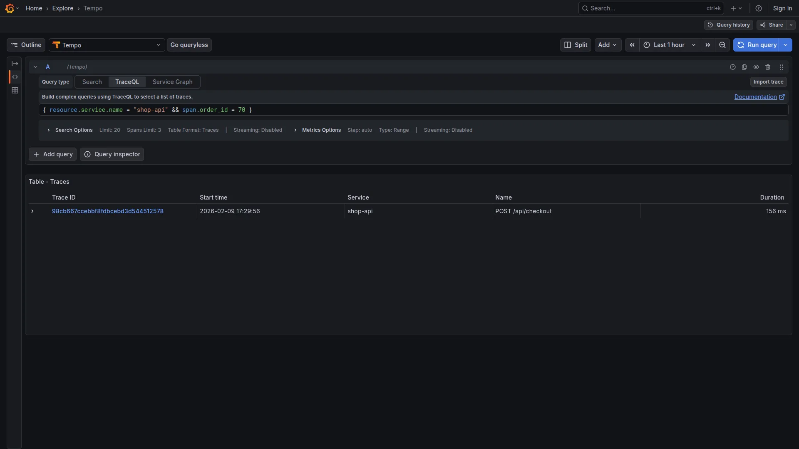

**Step 2:** Esamina la trace

```text
POST /api/checkout (320ms) [STATUS: OK]
├─ pg.query SELECT user (45ms) [OK]
├─ pg.query INSERT INTO orders (180ms) [OK]
└─ HTTP POST /api/notifications/order (45ms) [ERROR: 400]
```

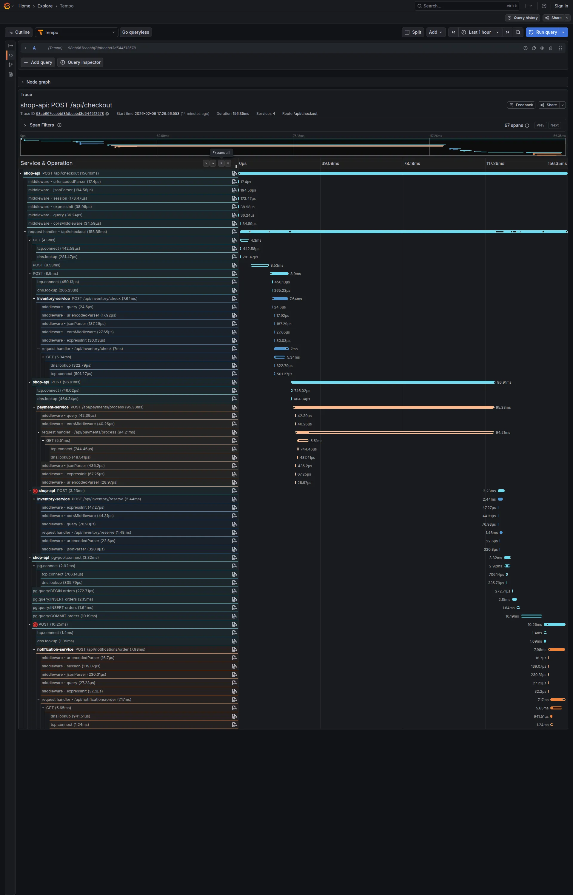

Lo span della chiamata a notification service mostra:
- `http.status_code: 400`
- `error: true`

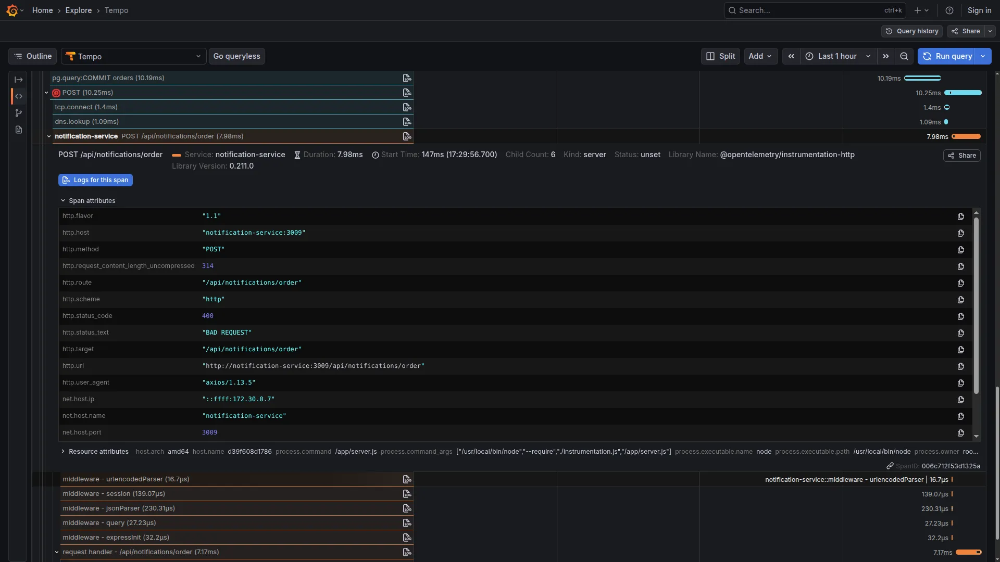

**Step 3:** Click "View Logs" sullo span con errore

```json
{"msg":"Received order notification request","orderId":8472,"userId":"abc-123","userEmail":"mario.rossi@example.com","traceId":"...","spanId":"..."}
{"msg":"Validating email address...","orderId":8472,"userEmail":"mario.rossi@example.com","traceId":"...","spanId":"..."}
{"msg":"Cannot send notification - invalid email address","orderId":8472,"userEmail":"mario.rossi@example.com","reason":"Email validation failed: invalid domain or format","traceId":"...","spanId":"..."}
```

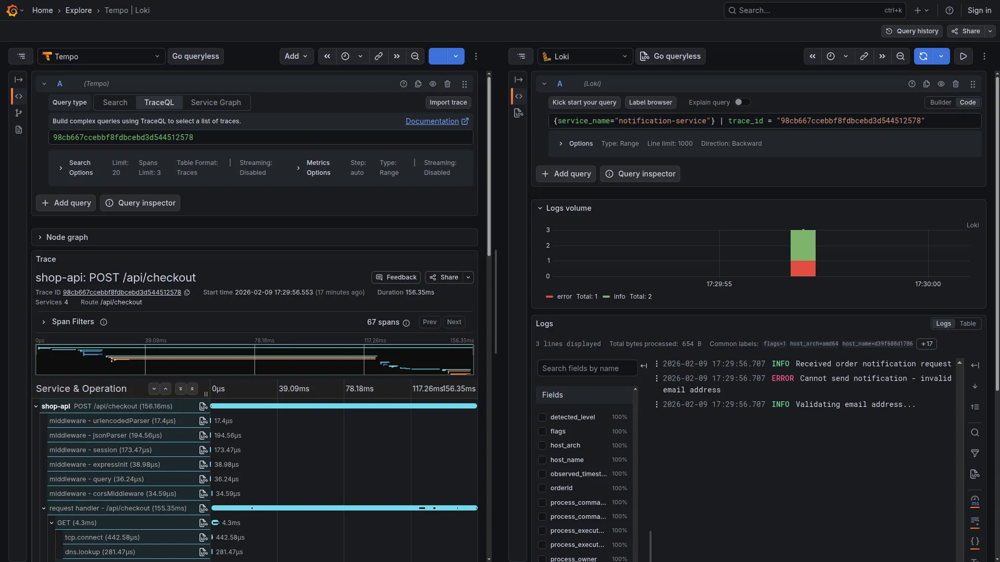

**Root cause identificato:** Il notification service ha ricevuto la richiesta, ha tentato di validare l'email, e ha risposto 400 perché la validazione è fallita (scenario simulato).

### Cosa Ci Mostra Questo Scenario

1. **Visibilità cross-service**: Vediamo che la chiamata è stata effettuata e ha ricevuto risposta
2. **Error attribution**: Sappiamo quale servizio ha causato l'errore
3. **Correlazione automatica**: Log del notification service visibili dal contesto della trace
4. **Senza OTel**: Avremmo dovuto grep su più file log, correlare timestamp manualmente, e sperare di trovare la causa

---

## Scenario 2: Latency Spike

### Stesso endpoint, tempi diversi

Report utenti:
- "Il checkout è lentissimo, 3-4 secondi!" (Luigi)
- "A me va veloce, 200ms" (Mario)

Problema intermittente, non immediatamente chiaro come riprodurre.

### Riproduzione

```bash
./scripts/scenario-2-latency-spike.sh
```

Lo script:
1. Autentica due utenti (Mario e Luigi)
2. Configura il notification service per usare un template "premium" lento per Luigi
3. Esegue checkout per entrambi gli utenti
4. Mostra la differenza di timing

> **Nota sulla simulazione:** Il template "premium" simula un'operazione lunga con un delay artificiale. In un sistema reale potrebbe essere: rendering PDF complesso, chiamate a servizi esterni, query database non ottimizzate, etc. La simulazione serve a creare uno scenario riproducibile per imparare il flusso di debug.

### La trace mostra dove si accumula il tempo

**Step 1:** Query trace lente

```text
{ resource.service.name = "shop-api" && duration > 2s }
```

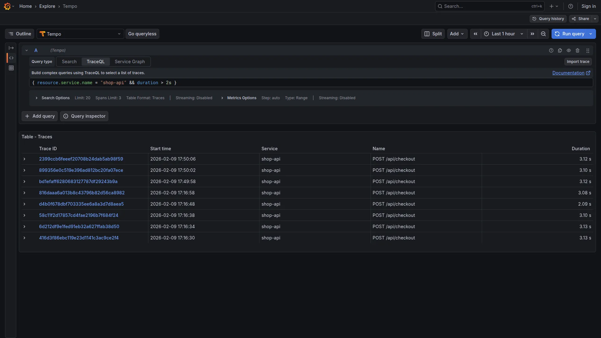

**Step 2:** Confronta trace

**Trace Luigi (~3100ms):**
```text
POST /api/checkout (3100ms)
├─ pg-pool.connect (3ms)
├─ pg.query:INSERT orders (2ms)
└─ POST /api/notifications/order (3050ms) ← bottleneck
```

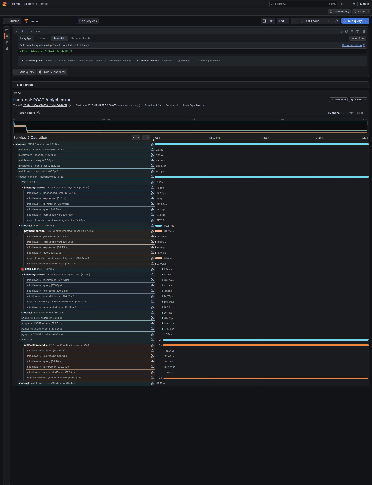

**Trace Mario (~150ms):**
```text
POST /api/checkout (150ms)
├─ pg-pool.connect (3ms)
├─ pg.query:INSERT orders (2ms)
└─ POST /api/notifications/order (50ms)
```

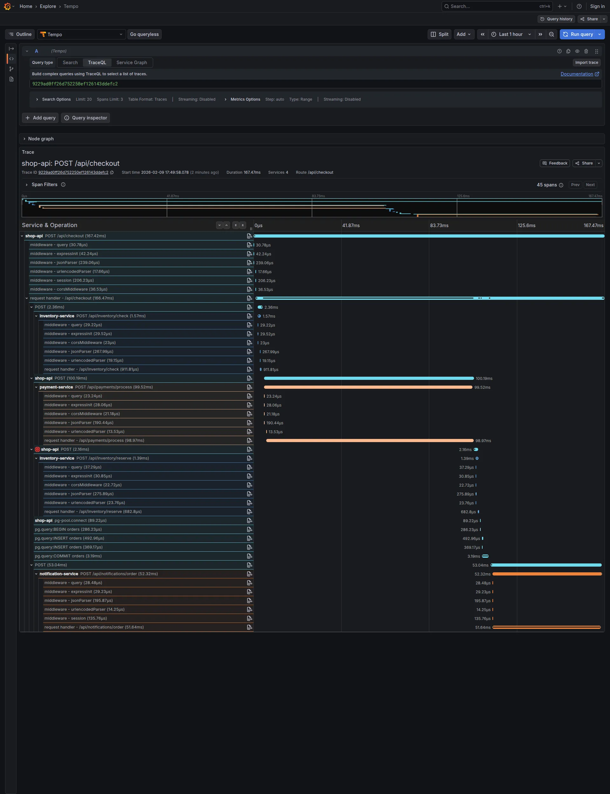

**Pattern:** Database sempre veloce. La differenza è nel notification service.

**Step 3:** Drill-down nei log

Click "View Logs" sulla trace di Luigi:
```json
{"msg":"Received order notification request","orderId":20,"userId":"luigi-uuid","userEmail":"luigi.verdi@example.com","traceId":"..."}
{"msg":"Processing order notification","orderId":20,"template":"order_confirmation_premium","traceId":"..."}
{"msg":"Rendering premium template...","orderId":20,"template":"order_confirmation_premium","traceId":"..."}
{"msg":"Template rendering took long","orderId":20,"renderTimeMs":3000,"traceId":"..."}
{"msg":"Email notification sent","orderId":20,"userEmail":"luigi.verdi@example.com","traceId":"..."}
```

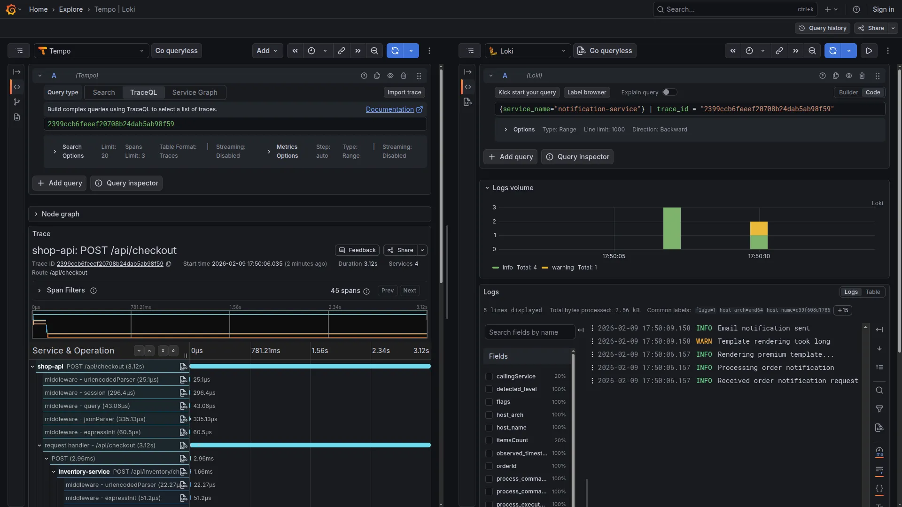

Click "View Logs" sulla trace di Mario:
```json
{"msg":"Received order notification request","orderId":17,"userId":"mario-uuid","userEmail":"mario.rossi@example.com","traceId":"..."}
{"msg":"Processing order notification","orderId":17,"template":"order_confirmation_basic","traceId":"..."}
{"msg":"Email notification sent","orderId":17,"userEmail":"mario.rossi@example.com","traceId":"..."}
```

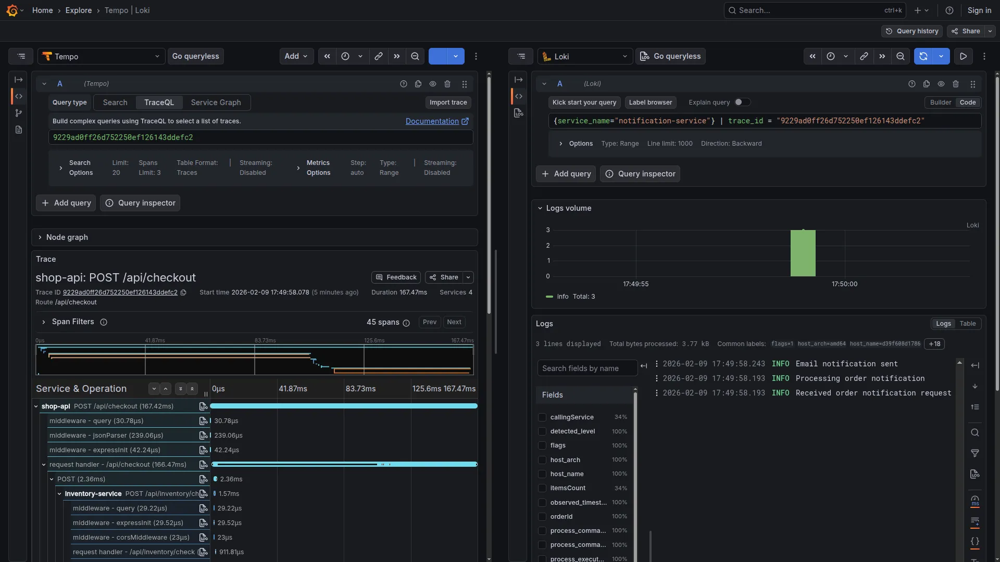

**Root cause:** Il template `order_confirmation_premium` richiede ~3 secondi di rendering vs ~50ms del `order_confirmation_basic`.

### Metriche Derivate (Service Graph)

Per analisi aggregate, LGTM genera metriche dalle trace. In Grafana → Explore → Prometheus (modalità Code):

```promql
histogram_quantile(0.95,
  rate(traces_service_graph_request_server_seconds_bucket{server="shop-api"}[5m])
)
```

> **Nota:** Queste metriche sono derivate dal service graph di Tempo, non metriche SDK esplicite.

---

## Scenario 3: Fan-out Debug

### Quattro servizi, ventiquattro combinazioni

Questo scenario dimostra il distributed tracing applicato a un **[pattern fan-out](https://en.wikipedia.org/wiki/Fan-out_(software))** dove una singola richiesta attraversa piu servizi in parallelo.

Ticket di supporto:
> "Il checkout è lentissimo, ci mette più di 3 secondi!"

**La sfida:** Il checkout chiama 4 servizi diversi. Quale causa il rallentamento?

```text
POST /api/checkout (3200ms totali)
├─ Inventory check    (??ms)
├─ Payment process    (??ms)
├─ Inventory reserve  (??ms)
├─ DB save            (??ms)
└─ Notification       (??ms)
```

### Riproduzione

```bash
# Esegui lo scenario che testa ogni servizio singolarmente
./scripts/scenario-3-fanout-debug.sh
```

**Output dello script:**

```text
3️⃣  Baseline checkout (all services normal)...
   ⏱️  Baseline: 206ms
   🔗 Trace: 3d9e2441545eb8c0c1050b51daa4489f

4️⃣  Checkout with SLOW PAYMENT SERVICE (2s delay)...
   ⏱️  With slow payment: 2117ms
   🔗 Trace: ae1799f3ed5836602288d4c39ea156a2

5️⃣  Checkout with SLOW INVENTORY SERVICE (1.5s delay)...
   ⏱️  With slow inventory: 1678ms
   🔗 Trace: 6325d443f6aa4c6f1ab1d6f7c31c0c5e

6️⃣  Checkout with SLOW NOTIFICATION SERVICE (3s delay)...
   ⏱️  With slow notification: 3138ms
   🔗 Trace: e43750f867a144eec9396095c39bb6da

📊 Results Summary:
   Scenario           | Duration | Trace ID
   -------------------|----------|----------------------------------
   Baseline (normal)  | 206ms    | 3d9e2441545eb8c0c1050b51daa4489f
   + Slow Payment     | 2117ms   | ae1799f3ed5836602288d4c39ea156a2
   + Slow Inventory   | 1678ms   | 6325d443f6aa4c6f1ab1d6f7c31c0c5e
   + Slow Notification| 3138ms   | e43750f867a144eec9396095c39bb6da
```

Lo script fornisce il **Trace ID** per ogni scenario, permettendo di aprire direttamente la traccia in Grafana.

### Approccio Tradizionale

```bash
# Log dell'API
docker logs shop-api | grep "checkout"
# [10:45:23] INFO Processing checkout
# [10:45:26] INFO Order saved  ← 3 secondi dopo, ma DOVE?

# Log di ogni servizio
docker logs payment-service | grep "order"
# [10:45:23] INFO Payment processed  ← sembra veloce

docker logs inventory-service | grep "order"
# [10:45:23] INFO Stock checked
# [10:45:24] INFO Stock reserved  ← 1 secondo?

docker logs notification-service | grep "order"
# [10:45:24] INFO Notification sent  ← sembra veloce
```

**Problema:** I timestamp sono su macchine diverse, non sincronizzati. Non è possibile sommare i tempi né determinare quali chiamate sono sequenziali e quali parallele.

### Il fan-out visibile in un unico waterfall

**Grafana → Explore → Tempo**

Usare il Trace ID dall'output dello script per cercare la traccia direttamente:

```text
ae1799f3ed5836602288d4c39ea156a2
```

Oppure cercare tutte le tracce lente:

```text
{ resource.service.name = "shop-api" && duration > 2s }
```

**Waterfall della trace "Slow Payment" (2117ms):**

```text
POST /api/checkout (2117ms) [shop-api]
│
├─ POST /api/inventory/check (4ms) [inventory-service]
│
├─ POST /api/payments/process (2020ms) [payment-service] ← BOTTLENECK!
│
├─ POST /api/inventory/reserve (4ms) [inventory-service]
│
├─ pg.query INSERT orders (12ms) [shop-api]
│
└─ POST /api/notifications/order (55ms) [notification-service]
```

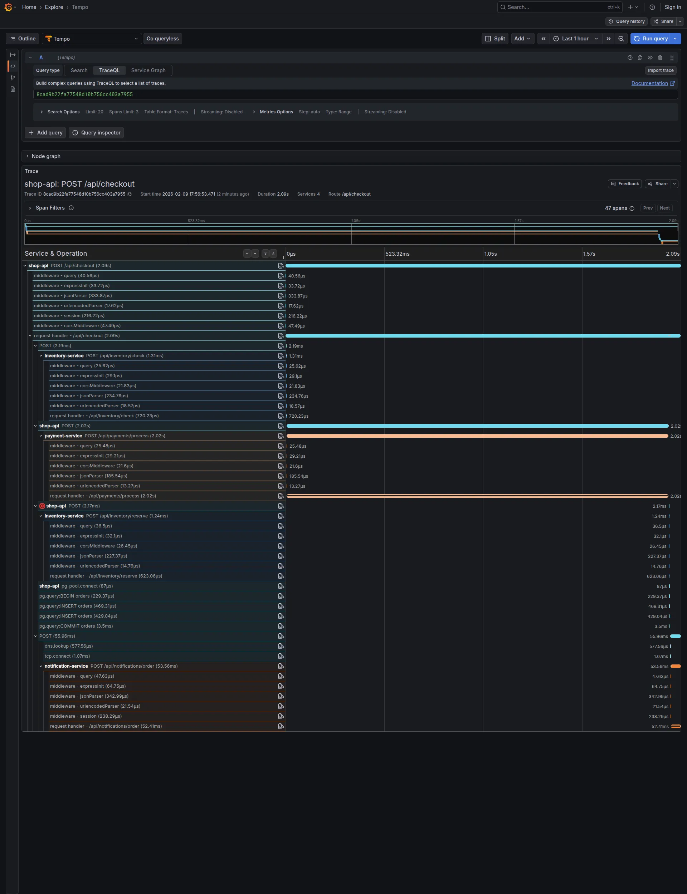

**Confronto con trace Baseline (~200ms):**

```text
POST /api/checkout (206ms) [shop-api]
│
├─ POST /api/inventory/check (5ms) [inventory-service]
├─ POST /api/payments/process (85ms) [payment-service]
├─ POST /api/inventory/reserve (4ms) [inventory-service]
├─ pg.query INSERT orders (15ms) [shop-api]
└─ POST /api/notifications/order (54ms) [notification-service]
```

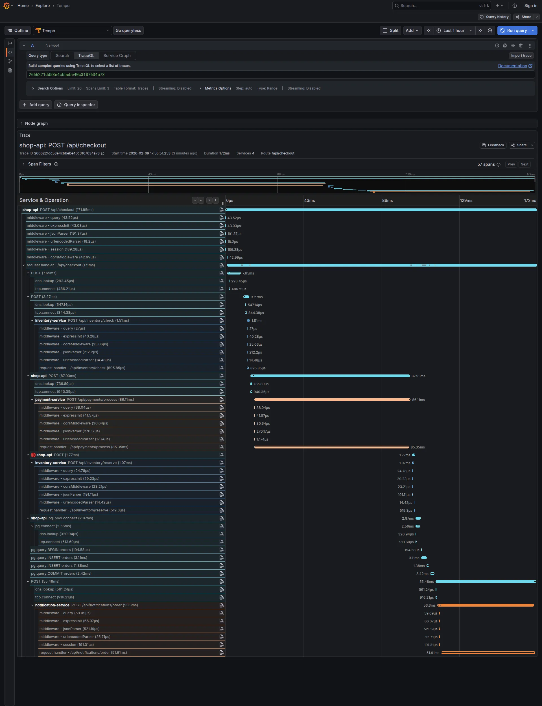

### Root Cause Identification

Confrontando i waterfall dei 4 scenari, il bottleneck è immediato:

| Scenario | Servizio lento | Duration | Baseline |
|----------|---------------|----------|----------|
| Slow Payment | `POST /api/payments/process` | 2020ms | 85ms |
| Slow Inventory | `POST /api/inventory/check` | ~1500ms | 5ms |
| Slow Notification | `POST /api/notifications/order` | ~3000ms | 54ms |

Ogni test isola un singolo servizio. Il waterfall mostra **esattamente** quale span contribuisce alla latenza totale.

**Click sugli span lenti → View Logs:**

```json
// Payment service (scenario slow payment)
{"msg":"Processing payment","orderId":18,"traceId":"..."}
{"msg":"Payment gateway slow response","orderId":18,"responseTimeMs":2000,"traceId":"..."}

// Notification service (scenario slow notification)
{"msg":"Processing order notification","orderId":24,"template":"order_confirmation_premium","traceId":"..."}
{"msg":"Template rendering took long","orderId":24,"renderTimeMs":3000,"traceId":"..."}
```

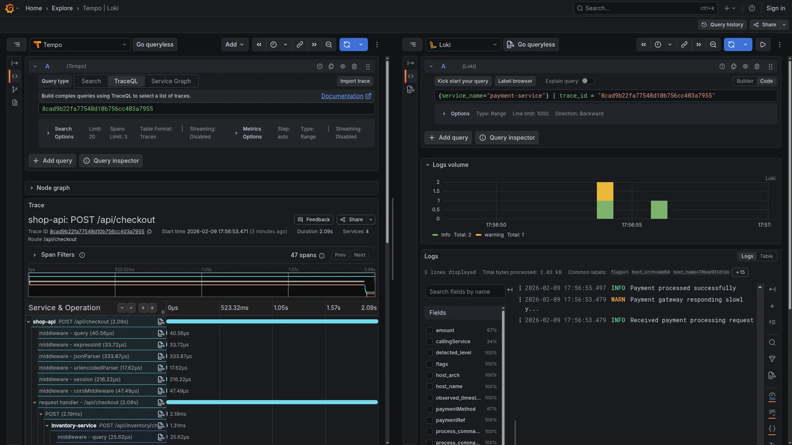

### Cosa Mostra Questo Scenario

| Senza OTel | Con OTel |
|------------|----------|
| "Il checkout è lento" | Waterfall mostra ESATTAMENTE quale servizio |
| Timestamp non correlabili | Timeline unificata con parent-child |
| "Forse è il database?" | DB query visibile: 12ms (non è lui) |
| Ipotesi su 4 servizi | Certezza: inventory check + notification |
| Debug per esclusione su 4 servizi | Root cause visibile nel waterfall |

### Dove il distributed tracing ripaga

Questo scenario dimostra dove il distributed tracing offre il vantaggio maggiore:

1. **Fan-out visibility**: Vedi tutte le chiamate parallele e sequenziali
2. **Proportional blame**: Il waterfall mostra quanto ogni servizio contribuisce
3. **Cross-service correlation**: I log di 4 servizi correlati automaticamente
4. **Clock skew mitigato**: Il waterfall usa timestamp assoluti e relazioni parent-child per ricostruire il flusso. NTP sui nodi e' raccomandato per minimizzare il clock skew tra servizi

**Senza tracing distribuito**, con 4 servizi, ci sono 4! = 24 possibili combinazioni da investigare. **Con il tracing**, il bottleneck è visibile nel waterfall in pochi minuti.

### Cleanup

Al termine degli scenari, per fermare e rimuovere tutti i container:

```bash
# Cleanup
make down
```

---

## Quando NON Usare Distributed Tracing

Il distributed tracing non è sempre la soluzione giusta. Considera alternative quando:

### 1. Architettura Monolitica

Con un singolo servizio, il tracing distribuito aggiunge overhead senza benefici. Alternative:
- Profiler applicativo (Node.js inspector, py-spy)
- APM tradizionale
- Log strutturati con request ID

### 2. Problemi di Performance Locali

Se il bottleneck è dentro una singola funzione (CPU-bound, memory leak), il tracing non aiuta. Usa:
- Flame graphs
- Memory profiler
- Load testing con profiling

### 3. Debug di Errori Noti

Se conosci già dove cercare, grep sui log è più veloce di una query TraceQL.

### 4. Ambienti con Risorse Limitate

L'auto-instrumentation ha overhead:
- CPU: ~2-5% per servizio
- Memoria: ~10-30MB per SDK Node.js (con auto-instrumentation)
- Network: dipende dal volume di trace
- Storage: può crescere rapidamente senza sampling

Se le risorse sono critiche, valuta attentamente il trade-off.

### 5. Team Piccoli con Architettura Semplice

Con 2-3 servizi in catena lineare (A→B→C) e un team che conosce bene il sistema, l'investimento nel distributed tracing potrebbe non ripagare. Il beneficio cresce con:
- **Pattern fan-out** (come il checkout di MockMart: 4 servizi chiamati da una request)
- Numero di servizi (5+)
- Dimensione del team
- Turnover del personale
- Frequenza di incidenti

### Regola Pratica

**Usa il distributed tracing quando:** Il tempo medio di debug di un incidente cross-service supera le ore, specialmente con pattern fan-out dove una request attraversa più servizi (come il checkout demo).

**Evitalo quando:** Gli incidenti sono rari, localizzati, l'architettura è lineare (A→B→C), o il team ha già strumenti efficaci.

---

## Limiti di Questo Tutorial

### Cosa Non È Coperto

1. **Production deployment**: LGTM all-in-one non scala. Servono deployment separati con:
   - Storage persistente (S3, GCS per Tempo/Loki)
   - Retention policies
   - High availability
   - Autenticazione e autorizzazione

2. **Sampling**: In production, non è possibile mantenere il 100% delle trace. Servono strategie di:
   - Head sampling (percentuale fissa)
   - Tail sampling (100% errori, sample del resto)
   - Rate limiting

3. **Costi e storage**: Il volume di dati può crescere rapidamente. Calcola:
   - ~500 bytes per span (media compressa su disco)
   - 100 req/s x 5 span/req x 500B x 86400s = ~21.6 GB/giorno
   - Con sampling 10%: ~2.16 GB/giorno

4. **Security**: Attenzione a non loggare:
   - Token e credenziali
   - PII (email, nomi, indirizzi)
   - Dati sensibili nei span attributes

### Simulazioni vs Realtà

Gli scenari demo usano simulazioni controllate:
- Il "template premium lento" è un `setTimeout(3000)`
- L'"email invalida" è un flag di configurazione
- I "servizi lenti" nel fan-out sono endpoint `/config/simulate-slow` che aggiungono delay

In produzione, i problemi reali sono:
- Più difficili da riprodurre
- Spesso intermittenti
- Causati da combinazioni di fattori

OTel aiuta proprio perché cattura questi scenari quando accadono in produzione, senza doverli riprodurre in dev.

---

## Appendice: Setup OpenTelemetry

> Questa sezione è opzionale. La demo MockMart include già tutto configurato. Utile per chi vuole replicare il setup in un progetto proprio.

### Cosa Serve Configurare (Realisticamente)

Prima di iniziare, chiariamo cosa significa "auto-instrumentation" e che richiede comunque una fase di setup.

> **Documentazione ufficiale:** Per approfondire, consulta la guida [Automatic Instrumentation for Node.js](https://opentelemetry.io/docs/languages/js/automatic/) e la lista delle [librerie supportate](https://opentelemetry.io/docs/languages/js/libraries/).

### Lato Applicazione

**1. Dipendenze da installare:**
```bash
npm install @opentelemetry/sdk-node \
  @opentelemetry/auto-instrumentations-node \
  @opentelemetry/exporter-trace-otlp-grpc \
  @opentelemetry/exporter-logs-otlp-grpc \
  @opentelemetry/sdk-logs \
  @opentelemetry/resources \
  @opentelemetry/api \
  pino
```

| Package | Scopo |
|---------|-------|
| `sdk-node` | SDK principale per Node.js, orchestra tutti i componenti |
| `auto-instrumentations-node` | Bundle di instrumentazioni automatiche (Express, HTTP, pg, etc.) |
| `exporter-trace-otlp-grpc` | Esporta trace via protocollo OTLP su gRPC |
| `exporter-logs-otlp-grpc` | Esporta log via protocollo OTLP su gRPC |
| `sdk-logs` | SDK per la gestione dei log record (processor, exporter) |
| `resources` | Definizione delle risorse (service name, attributi) |
| `api` | API per interagire con trace nel codice applicativo |
| `pino` | Logger ad alte prestazioni per Node.js |

**2. File `instrumentation.js` da creare (e caricare PRIMA di tutto):**

> **Importante:** Questo file deve essere caricato **prima** di qualsiasi altro import. L'auto-instrumentation funziona tramite [monkey-patching](https://en.wikipedia.org/wiki/Monkey_patch) dei moduli Node.js (Express, pg, Pino, etc.) al momento del loro caricamento. Se i moduli vengono importati prima dell'inizializzazione OTel, non saranno instrumentati.

```javascript
// instrumentation.js - Inizializza OpenTelemetry PRIMA di qualsiasi altro import
const { NodeSDK } = require('@opentelemetry/sdk-node');
const { getNodeAutoInstrumentations } = require('@opentelemetry/auto-instrumentations-node');
const { OTLPTraceExporter } = require('@opentelemetry/exporter-trace-otlp-grpc');
const { OTLPLogExporter } = require('@opentelemetry/exporter-logs-otlp-grpc');
const { BatchLogRecordProcessor } = require('@opentelemetry/sdk-logs');
const { resourceFromAttributes } = require('@opentelemetry/resources');

const serviceName = process.env.OTEL_SERVICE_NAME || 'my-service';
const otlpEndpoint = process.env.OTEL_EXPORTER_OTLP_ENDPOINT || 'http://localhost:4317';

const resource = resourceFromAttributes({
  'service.name': serviceName,
});

const sdk = new NodeSDK({
  resource,
  traceExporter: new OTLPTraceExporter({ url: otlpEndpoint }),
  logRecordProcessors: [
    new BatchLogRecordProcessor(new OTLPLogExporter({ url: otlpEndpoint })),
  ],
  instrumentations: [
    getNodeAutoInstrumentations({
      '@opentelemetry/instrumentation-fs': { enabled: false },
    }),
  ],
});

sdk.start();
console.log(`OpenTelemetry initialized for ${serviceName}`);

process.on('SIGTERM', () => {
  sdk.shutdown()
    .then(() => console.log('Tracing terminated'))
    .catch((err) => console.error('Error terminating', err))
    .finally(() => process.exit(0));
});
```

**3. Avvio applicazione modificato:**
```bash
# --require carica instrumentation.js PRIMA di server.js
node --require ./instrumentation.js server.js
```

In `package.json`:
```json
{
  "scripts": {
    "start": "node --require ./instrumentation.js server.js"
  }
}
```

> **Nota:** Nel repo MockMart, il flag `--require` e' specificato nel `command` del docker-compose (vedi sezione [Lato Infrastruttura](#lato-infrastruttura)), e lo start script del package.json rimane `"start": "node server.js"`. Per esecuzione locale senza Docker, modificare lo start script come mostrato sopra.

**4. Logger con Pino (trace context iniettato automaticamente):**

```javascript
// lib/logger.js
const pino = require('pino');

// PinoInstrumentation inietta automaticamente trace_id e span_id
const logger = pino({
  level: process.env.LOG_LEVEL || 'info',
});

module.exports = logger;
```

**Esempio di utilizzo nel codice applicativo:**

```javascript
const logger = require('./lib/logger');
const { trace } = require('@opentelemetry/api');

app.post('/api/checkout', requireAuth, async (req, res) => {
  const user = req.user;
  const cart = carts[req.session.id];

  // Log con attributi strutturati - trace_id/span_id iniettati da PinoInstrumentation
  logger.info({ userId: user.id, itemCount: cart.length }, 'Processing checkout');

  try {
    // ... inserimento ordine nel database ...
    const orderId = orderResult.rows[0].id;

    // Aggiungi order_id allo span per query TraceQL: { span.order_id = 123 }
    trace.getActiveSpan()?.setAttribute('order_id', orderId);

    logger.info({ orderId, userId: user.id, total }, 'Order saved to database');

    // Chiama notification service
    logger.info({ orderId, url: NOTIFICATION_SERVICE_URL }, 'Calling notification service');

    await axios.post(`${NOTIFICATION_SERVICE_URL}/api/notifications/order`, {...});

    logger.info({ orderId }, 'Notification sent successfully');

    res.json({ success: true, order });
  } catch (err) {
    // Gli errori includono automaticamente il trace context per correlazione
    logger.error({ error: err.message }, 'Checkout failed');
    res.status(500).json({ error: 'Checkout failed' });
  }
});
```

**Output nei log (Pino con trace context):**
```json
{
  "level": 30,
  "time": 1770291707877,
  "pid": 1,
  "hostname": "shop-api",
  "trace_id": "b0b197c5337c4b07f80e2ef7b130f2f4",
  "span_id": "e8815f03044501df",
  "trace_flags": "01",
  "orderId": 8472,
  "total": 99.99,
  "msg": "Order saved to database"
}
```

`trace_id` e `span_id` sono iniettati automaticamente da `PinoInstrumentation`.

### Lato Infrastruttura

**LGTM all-in-one (per sviluppo/staging):**
```yaml
grafana:
  image: grafana/otel-lgtm:0.17.1
  ports:
    - "3005:3000"   # Grafana UI
    - "4317:4317"   # OTLP gRPC
    - "4318:4318"   # OTLP HTTP
```

**Variabili ambiente e comando nei servizi (da `docker-compose.yml`):**
```yaml
shop-api:
  environment:
    - OTEL_SERVICE_NAME=shop-api
    - OTEL_EXPORTER_OTLP_ENDPOINT=http://grafana:4317
  # Carica instrumentation.js PRIMA di server.js
  command: ["node", "--require", "./instrumentation.js", "server.js"]

notification-service:
  environment:
    - OTEL_SERVICE_NAME=notification-service
    - OTEL_EXPORTER_OTLP_ENDPOINT=http://grafana:4317
  command: ["node", "--require", "./instrumentation.js", "server.js"]
```

> **Nota:** Per production, LGTM all-in-one non è adeguato. Servono deploy separati di Tempo, Loki, Mimir con storage persistente, retention policies, e sampling. Questi aspetti saranno trattati in un articolo dedicato.

### Personalizzare l'Instrumentazione

#### Attributi Custom

L'auto-instrumentation cattura attributi standard (HTTP method, URL, status code, query SQL). Per facilitare le ricerche, aggiungi attributi business-specific.

> **Approfondimento:** La guida [Manual Instrumentation](https://opentelemetry.io/docs/languages/js/instrumentation/) spiega come creare span custom, aggiungere attributi, e gestire il context manualmente.

```javascript
const { trace } = require('@opentelemetry/api');

app.post('/api/checkout', async (req, res) => {
  // ... logica checkout ...

  const orderId = result.rows[0].id;

  // --- Aggiungi attributo business allo span corrente ---
  // trace.getActiveSpan() restituisce lo span creato dall'auto-instrumentation
  // per questa richiesta HTTP (span "POST /api/checkout")
  // L'optional chaining (?.) gestisce il caso (raro) in cui non ci sia span attivo
  trace.getActiveSpan()?.setAttribute('order_id', orderId);

  // È possibile aggiungere più attributi - utili per filtering e grouping
  trace.getActiveSpan()?.setAttributes({
    'order_id': orderId,
    'user_tier': req.user.tier,        // es. "premium", "basic"
    'cart_item_count': cart.length,
    'order_total': order.total,
  });

  // ... resto del codice ...
});
```

**Query TraceQL con attributi custom:**
```text
# Trova tutte le trace per un ordine specifico
{ span.order_id = 8472 }

# Trova checkout lenti di utenti premium
{ span.user_tier = "premium" && duration > 1s }

# Combina con attributi standard
{ resource.service.name = "shop-api" && span.order_total > 100 }
```

#### Span Manuali (per operazioni non instrumentate)

Per tracciare un'operazione specifica non coperta dall'auto-instrumentation:

```javascript
const { trace, SpanStatusCode } = require('@opentelemetry/api');

async function processPayment(order) {
  // Ottieni il tracer (usa lo stesso nome del servizio per consistenza)
  const tracer = trace.getTracer('shop-api');

  // Crea uno span manuale - sarà child dello span HTTP corrente
  return tracer.startActiveSpan('process-payment', async (span) => {
    try {
      // Aggiungi attributi specifici di questa operazione
      span.setAttributes({
        'payment.method': order.paymentMethod,
        'payment.amount': order.total,
        'payment.currency': 'EUR',
      });

      // ... logica pagamento ...
      const result = await paymentGateway.charge(order);

      // Aggiungi risultato
      span.setAttribute('payment.transaction_id', result.transactionId);

      return result;
    } catch (error) {
      // Marca lo span come errore e registra l'eccezione
      span.setStatus({ code: SpanStatusCode.ERROR, message: error.message });
      span.recordException(error);
      throw error;
    } finally {
      // IMPORTANTE: chiudi sempre lo span
      span.end();
    }
  });
}
```

**Risultato nella trace:**
```text
POST /api/checkout (850ms)
├─ pg.query:INSERT orders (15ms)
├─ process-payment (500ms)          ← span manuale
│   └─ payment.method: "credit-card"
│   └─ payment.amount: 99.99
│   └─ payment.transaction_id: "txn_123"
└─ HTTP POST /api/notifications (320ms)
```

#### Cosa NON Viene Catturato Automaticamente

L'auto-instrumentation cattura:
| Catturato | Esempi |
|-----------|--------|
| HTTP request metadata | method, url, status_code, user_agent |
| Database queries | query SQL (sanitizzata), operation name, db.system |
| Timing | duration di ogni operazione |
| Errori | status code, exception type |

**Non catturato** (richiede intervento manuale):
| Non catturato | Soluzione |
|---------------|-----------|
| Contenuto body HTTP | `setAttribute()` (attenzione a PII) |
| Valori business (orderId, userId) | `setAttribute()` |
| Operazioni custom (es. calcoli) | Span manuali con `startActiveSpan()` |
| Log applicativi | Logger OTel (sezione precedente) |

---

## Risorse

**Repository demo:**
- [MockMart su GitHub](https://github.com/monte97/MockMart)

**Documentazione OpenTelemetry (Node.js):**
- [Getting Started with Node.js](https://opentelemetry.io/docs/languages/js/getting-started/nodejs/) - Setup base
- [Automatic Instrumentation](https://opentelemetry.io/docs/languages/js/automatic/) - Auto-instrumentation dettagliata
- [Supported Libraries](https://opentelemetry.io/docs/languages/js/libraries/) - Lista librerie instrumentate automaticamente
- [Manual Instrumentation](https://opentelemetry.io/docs/languages/js/instrumentation/) - Span e attributi custom

**LGTM Stack:**
- [Grafana LGTM](https://grafana.com/oss/lgtm-stack/) - Overview dello stack
- [Tempo Documentation](https://grafana.com/docs/tempo/latest/) - Backend per distributed tracing
- [Loki Documentation](https://grafana.com/docs/loki/latest/) - Backend per log aggregation

---

## Prossimi Articoli

- **Sampling strategies**: Head vs tail sampling, quando usare quale
- **Production deployment**: LGTM in Kubernetes con storage persistente
- **Cost optimization**: Calcolare e controllare i costi di observability
- **Security**: Filtrare PII e dati sensibili dalle trace

---

*Per domande o feedback: [francesco@montelli.dev](mailto:francesco@montelli.dev) | [LinkedIn](https://www.linkedin.com/in/francesco-montelli/) | [GitHub](https://github.com/monte97)*
