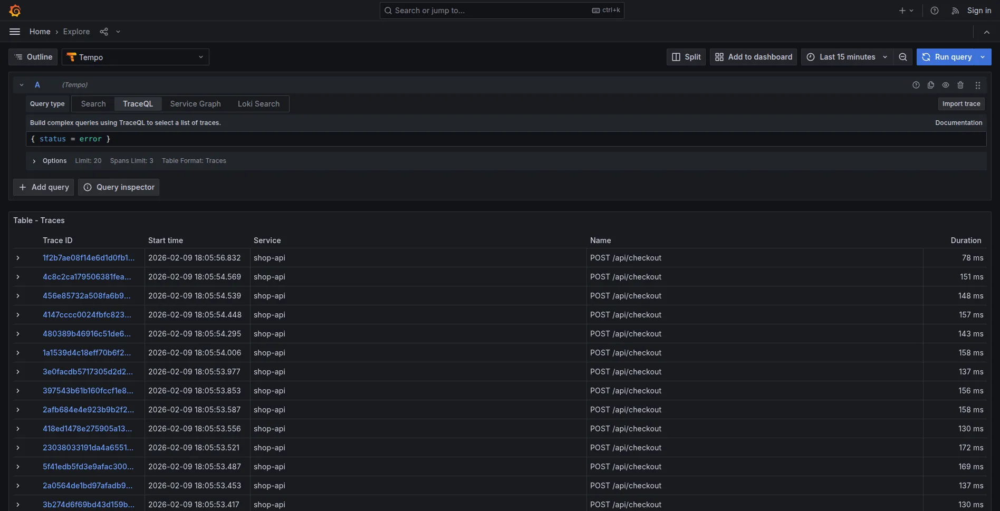
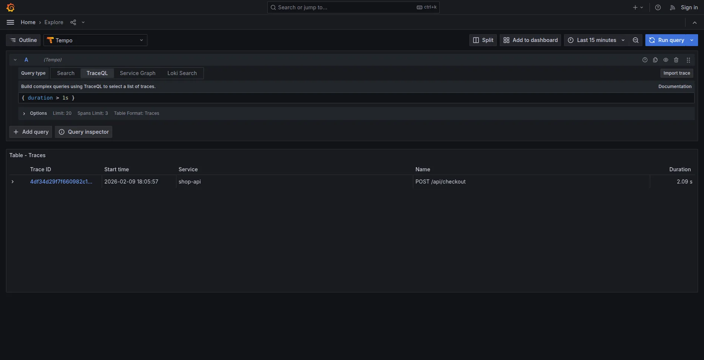
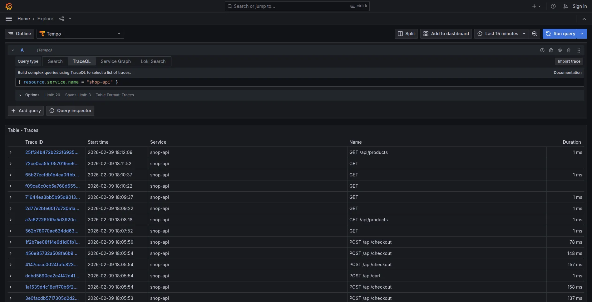
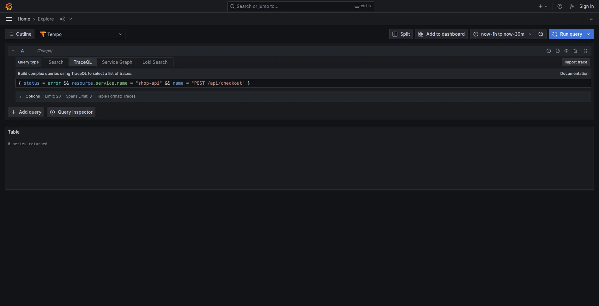
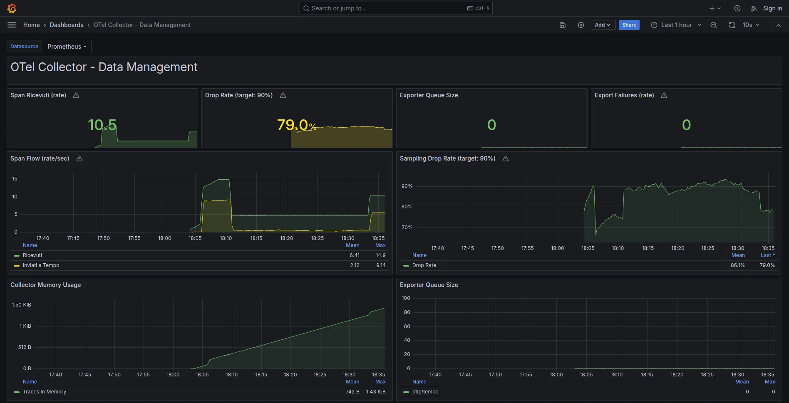

Questo articolo mostra come gestire il volume di dati OpenTelemetry in un ambiente simil-produzione. Per chi non ha familiarità con distributed tracing e OTel, consiglio prima la lettura del [tutorial introduttivo](../01_correlation_OK/article_tutorial.md).

**Struttura dell'articolo:**
1. Il problema: volume e crescita infinita
2. Stima del volume: calcolo per scenario
3. Tail Sampling: decidere cosa tenere
4. Retention: raggiungere lo steady state
5. Scenario demo: verificare che funzioni
6. Monitoring: verificare il funzionamento
7. Cardinality explosion: un rischio da considerare
8. Analisi costi: con e senza observability
9. Checklist finale

---

## Il Problema: Volume e Crescita Infinita

Il tutorial precedente traccia tutto al 100%. In sviluppo funziona. In produzione, i numeri cambiano.

### Problema 1: Volume di Ingest

**Esempio concreto (MockMart in produzione simulata):**

| Parametro | Valore |
|-----------|--------|
| Request/sec | 100 |
| Span per trace | ~8 (checkout flow) |
| Dimensione span | ~500 bytes |

**Calcolo volume giornaliero:**

```
100 req/s x 8 span x 500 bytes x 86400 sec = 34 GB/giorno
```

**In un mese:** ~1 TB di sole trace.

### Problema 2: Crescita Infinita

Anche riducendo l'ingest, senza retention policy lo storage cresce per sempre:

```
Mese 1:   1 TB
Mese 2:   2 TB
Mese 6:   6 TB
Mese 12: 12 TB
```

**Il valore delle trace decade nel tempo:**

| Periodo | Valore | Uso tipico |
|---------|--------|------------|
| Giorno 0-7 | Alto | Debug attivo, incident response |
| Giorno 7-30 | Medio | Post-mortem, pattern analysis |
| Giorno 30+ | Basso | Audit (solo operazioni critiche) |

Conservare trace di 6 mesi fa senza una necessità specifica rappresenta un consumo di risorse non giustificato.

### La Soluzione: Due Leve

1. **Tail Sampling** - Riduce ciò che entra (~90%)
2. **Retention Policy** - Elimina ciò che è vecchio

**Risultato:** Storage che raggiunge un plateau invece di crescere linearmente.

---

## Stima del Volume: Calcolo per Scenario

Prima di implementare, è utile quantificare il problema per lo scenario specifico.

### Input Necessari

**Tre parametri da determinare:**

1. **Quante request/sec gestisce il sistema?**
   - Verificabile dal load balancer o API gateway
   - Comando: `grep "GET\|POST" /var/log/nginx/access.log | wc -l` (dividi per secondi)

2. **Quanti span per trace?**
   - Regola empirica: servizi nel path critico × 2 span/servizio
   - Default sicuro: **8 span/trace**

3. **Quanti giorni di retention?**
   - Debug: 7 giorni
   - Post-mortem: 30 giorni
   - Compliance: 90 giorni

### Calculator: 3 Scenari Tipici

| Scenario | Volume/Giorno (RAW) | Con Sampling 10% | Storage Steady (7d) | Costo/Mese |
|----------|---------------------|------------------|---------------------|------------|
| **Low traffic (100 req/s)** | 34 GB | 3.4 GB | 24 GB | ~$0.55 |
| **Medium traffic (1K req/s)** | 345 GB | 34 GB | 238 GB | ~$5.50 |
| **High traffic (10K req/s)** | 3.4 TB | 345 GB | 2.4 TB | ~$55 |

**Assunzioni:** Span ~500 bytes, sampling 10% + 100% errori, storage S3 $0.023/GB.

### Formula Generale

```
1. Span/sec = req/sec × span_per_trace × sampling_rate
2. GB/giorno = span/sec × 500 bytes × 86400 / 1e9
3. Storage steady = GB/giorno × retention_days
4. Costo/mese = storage_GB × $0.023
```

**Esempio (1000 req/s, 10% sampling, 7d retention):**

```
Span/sec = 1000 × 8 × 0.1 = 800
GB/giorno = 800 × 500 × 86400 / 1e9 = 34 GB
Storage = 34 × 7 = 238 GB
Costo = 238 × $0.023 = $5.50/mese
```

Una volta stimati i numeri, si può procedere con la configurazione.

---

## Tail Sampling: Decidere Dopo

### Head vs Tail Sampling

**Head sampling** decide all'inizio della trace: "questa la tengo al 10%".
Problema: se quel 10% scartato conteneva un errore, è perso.

**Tail sampling** decide alla fine: aspetta che la trace sia completa, poi valuta.

```
Head Sampling:            Tail Sampling:

Request -> Keep 10%       Request -> Trace completa -> Errore? -> KEEP
           Drop 90%                                 -> Lenta?  -> KEEP
                                                    -> Normale -> Sample 10%
```

**Vantaggio:** 100% degli errori catturati, anche con 90% di riduzione (purché tutte le trace passino dallo stesso Collector e il `decision_wait` sia sufficiente).

> **Nota sulla logica delle policy:** Con le policy di tipo `status_code`, `latency`, `string_attribute` e `probabilistic`, la logica è di fatto OR: basta che una policy decida "Sampled" perché la trace venga mantenuta. Policy di tipo `and` o `composite` permettono logiche più complesse.

### Le 4 Policy Fondamentali

| Policy | Cosa fa | Rationale |
|--------|---------|-----------|
| `errors` | KEEP 100% trace con errori | Non perdere mai un problema |
| `latency` | KEEP 100% trace >1s | Performance issue visibili |
| `audit` | KEEP 100% operazioni critiche | Checkout (nella demo), login e payment in produzione |
| `probabilistic` | SAMPLE 10% del resto | Baseline per capire il "normale" |

### Configurazione OTel Collector

```yaml
processors:
  tail_sampling:
    # Aspetta che la trace sia completa (default: 30s)
    decision_wait: 10s
    num_traces: 50000
    expected_new_traces_per_sec: 100

    policies:
      # 1. KEEP tutti gli errori
      - name: errors-policy
        type: status_code
        status_code:
          status_codes: [ERROR]

      # 2. KEEP request lente (>1s)
      - name: latency-policy
        type: latency
        latency:
          threshold_ms: 1000

      # 3. KEEP audit events (richiede attributo nel codice)
      - name: audit-policy
        type: string_attribute
        string_attribute:
          key: audit.event
          values: ["true"]
          enabled_regex_matching: false

      # 4. SAMPLE 10% del resto
      - name: probabilistic-policy
        type: probabilistic
        probabilistic:
          sampling_percentage: 10
```

> **Pipeline completa:** In produzione, il tail sampling va affiancato da `memory_limiter` (per evitare OOM) e `batch` (per efficienza di rete). L'ordine nella pipeline è importante: `[memory_limiter, tail_sampling, batch]`. La config completa è in `otel-config/data-management/otel-collector-config.yaml`.

### Marcare Audit Events nel Codice

Per la policy `audit`, serve un attributo sullo span:

```javascript
const { trace } = require('@opentelemetry/api');

app.post('/api/checkout', async (req, res) => {
  // Marca come audit event - questa trace verrà SEMPRE salvata
  trace.getActiveSpan()?.setAttribute('audit.event', 'true');
  // ... resto della logica
});
```

MockMart ha già questo attributo configurato nel checkout.

---

## Retention: Raggiungere lo Steady State

Il tail sampling riduce l'ingest. Ma senza retention, lo storage continua a crescere.

### Il Concetto di Steady State

**Senza retention:**
```
Giorno 1:   34 GB
Giorno 7:  238 GB
Giorno 30:   1 TB
Giorno 90:   3 TB   <- cresce per sempre
```

**Con retention 7 giorni:**
```
Giorno 1:   34 GB
Giorno 7:  238 GB
Giorno 8:  238 GB   <- steady state
Giorno 30: 238 GB
```

Il compactor elimina i dati più vecchi della retention, lo storage si stabilizza.

### Configurazione Tempo

```yaml
# tempo-config.yaml
compactor:
  compaction:
    # Produzione: 168h (7 giorni) | Demo MockMart: 5m (per test rapidi)
    block_retention: 168h
```

> **Nota:** La demo MockMart usa `block_retention: 5m` per rendere il test riproducibile in pochi minuti. In produzione, 7 giorni (168h) è un buon punto di partenza.

### Due Stack, Due Approcci

MockMart offre due configurazioni:

| Stack | Comando | Setup OTel | Uso |
|-------|---------|------------|-----|
| **Base** | `make up` | grafana-lgtm all-in-one, 100% sampling | Sviluppo, tutorial (scenari 1-2-3) |
| **Data Management** | `make up-data-management` | Collector separato, tail sampling, retention | Simil-produzione (scenario 4) |

Gli scenari 1-2-3 del tutorial precedente usano lo stack base.
Questo articolo usa lo stack data management.

### Verifica Configurazione

```bash
# Avvia lo stack data management
make up-data-management

# Verifica health
make health-data-management

# Verifica che il Collector abbia tail sampling attivo
make check-sampling
```

---

## Scenario 4: Data Management in Azione

Questo scenario dimostra tail sampling e retention su MockMart.

### Setup

```bash
# Ferma eventuale stack base
make down

# Avvia stack data management
make up-data-management

# Verifica health
make health-data-management
```

### Esecuzione Demo Completa

```bash
# Esegui lo scenario completo
make scenario-4
```

Lo script:
1. Mostra le metriche iniziali del Collector
2. Genera 50 request normali (saranno campionate al 10%)
3. Genera 1 request con errore (sarà mantenuta al 100%)
4. Genera 1 request lenta >1s (sarà mantenuta al 100%)
5. Mostra le metriche finali con drop rate

**Output atteso:**

```
Tail Sampling Metrics:
  Span ricevuti (accepted):    ~400
  Span scartati (dropped):     ~350
  Span esportati (to Tempo):   ~50

  Drop rate: ~87%
  Tail sampling funziona correttamente (target: ~90%)
```

### Verifica in Grafana

In Grafana (`http://localhost:3005`) -> Explore -> Tempo:

**1. Trace con errore (deve esistere):**
```
{ status = error }
```



**2. Trace lenta (deve esistere):**
```
{ duration > 1s }
```



**3. Trace normali (solo ~10% esistono):**
```
{ resource.service.name = "shop-api" }
```



### Verifica Retention

La demo usa una retention di 5 minuti per rendere il test riproducibile.

1. Annotare un trace ID dall'output dello script
2. Cercarlo in Grafana: la trace esiste
3. Attendere 5+ minuti
4. Cercare di nuovo: "Trace not found"

Il compactor ha eliminato la trace.



> **Nota:** In produzione il valore tipico è `block_retention: 168h` (7 giorni), non 5 minuti.

### Comandi Aggiuntivi

```bash
# Genera solo traffico normale
./scripts/scenario-4-data-management.sh --traffic

# Genera solo una request con errore
./scripts/scenario-4-data-management.sh --error

# Genera solo una request lenta
./scripts/scenario-4-data-management.sh --slow

# Controlla metriche tail sampling
./scripts/scenario-4-data-management.sh --check
```

---

## Monitoring: Verificare il Funzionamento

Con tail sampling e retention configurati, è importante verificare che tutto funzioni correttamente.

### Metriche Chiave del Collector

```bash
# Accedi alle metriche
curl http://localhost:8888/metrics
```

| Metrica | Significato | Valore Atteso |
|---------|-------------|---------------|
| `otelcol_receiver_accepted_spans` | Span in ingresso | Proporzionale al traffico |
| `otelcol_processor_tail_sampling_count_spans_sampled` | Span campionati/scartati (label `decision`) | ~90% `not_sampled` |
| `otelcol_exporter_sent_spans` | Span inviati a Tempo | ~10% degli accepted |

> **Nota:** Nella versione 0.96.0 del Collector (usata nella demo) esiste anche `otelcol_processor_dropped_spans`, deprecata nelle versioni successive. Le metriche `tail_sampling_count_spans_sampled` con label `decision=sampled|not_sampled` sono più stabili tra le versioni.

**Formula drop rate:**
```
drop_rate = (dropped / accepted) * 100
```

Se drop rate < 50%, il tail sampling non sta funzionando come atteso.

### Dashboard Grafana

Lo stack data management include una dashboard pre-configurata:

```
Grafana -> Dashboards -> Data Management -> OTel Collector - Data Management
```



Pannelli principali:
- **Span Ricevuti (rate):** Span/sec in arrivo
- **Drop Rate (target: 90%):** Percentuale di span scartati dal tail sampling
- **Export Failures (rate):** Target 0
- **Collector Memory Usage:** Consumo RAM del Collector

### Alert Configurati

Prometheus ha alert pronti in `otel-config/data-management/alerts/` (8 alert in totale, tra cui anche `OtelCollectorDown`, `OtelCollectorHighMemory`, `TempoIngestionFailures`). I tre principali:

| Alert | Trigger | Significato |
|-------|---------|-------------|
| `OtelCollectorBackpressure` | Queue > 5000 | Collector sovraccarico |
| `OtelCollectorExportFailures` | Export failure rate > 100 span/sec (finestra 5m) | Tempo non raggiungibile |
| `OtelSamplingRateTooLow` | Drop rate < 50% | Config sampling errata |

```bash
# Verifica alert in Prometheus
open http://localhost:9090/alerts
```

---

## Cardinality Explosion: Un Rischio da Considerare

Oltre alle trace, un altro aspetto rilevante riguarda **le metriche**.

### Il Problema

**Metrics cardinality** = numero di time series uniche nel sistema.

**Esempio con cardinality elevata:**

```javascript
// ❌ MALE - Cardinality explosion
const counter = meter.createCounter('http_requests_total');

counter.add(1, {
  service: 'api',
  endpoint: '/users',
  user_id: 'user123',  // ← 10,000+ valori unici!
  status_code: '200'
});
```

**Calcolo:**
```
5 services × 50 endpoints × 10000 users × 5 status codes
= 12.5 MILIONI di time series

Storage: 12.5M × 1 sample/sec × 1 byte = 12.5 MB/sec = 1 TB/giorno
```

Un volume superiore a quello delle trace.

### La Soluzione

**Principio fondamentale:** evitare `user_id`, `session_id`, o valori unbounded come label.

```javascript
// ✅ BENE - Cardinality limitata
counter.add(1, {
  service: 'api',
  endpoint: '/users',
  status_code: '200'
  // NO user_id!
});
```

**Cardinality risultante:**
```
5 services × 50 endpoints × 5 status codes = 1,250 time series
Storage: ~108 MB/giorno - un volume gestibile
```

### Verificare la Cardinality

```promql
# Top 10 metriche per cardinality
topk(10, count by(__name__)({__name__=~".+"}))
```

Metriche con >1000 series richiedono investigazione.

### Alert Cardinality

```yaml
- alert: HighCardinalityMetric
  expr: count by(__name__) ({__name__=~".+"}) > 10000
  labels:
    severity: critical
  annotations:
    summary: "Metrica con cardinality eccessiva"
```

---

## Analisi Costi: Con e Senza Observability

Un'obiezione frequente riguarda il costo di OTel (~$20/mese per lo stack self-hosted). I numeri seguenti sono stime illustrative per un e-commerce medio e aiutano a contestualizzare il trade-off.

### Costo del Downtime

**Scenario senza observability:**
```
- Incident ogni 2 mesi
- Tempo diagnosi: 4 ore (grep logs, tentativi manuali)
- Tempo fix: 2 ore
- Downtime totale: 6 ore/incident
```

**Scenario con observability:**
```
- Stesso numero di incident
- Tempo diagnosi: 15 minuti (trace mostra subito il problema)
- Tempo fix: 2 ore
- Downtime totale: 2.25 ore/incident
```

**Risparmio: 3.75 ore per incident.**

### Calcolo ROI

```
Revenue/ora (e-commerce medio): $5000
Risparmio/incident: 3.75 ore × $5000 = $18,750
Incident/anno: 6
Risparmio/anno: $112,500

Costo OTel: $20/mese = $240/anno

ROI: 468x
```

### Costo del Debug Manuale

**Senza observability:**
- Un engineer dedica circa 5 ore/settimana al debug senza strumenti adeguati
- Costo: 5h × 52 settimane × $100/h = $26,000/anno

**Con observability:**
- Debug time: -70%
- Risparmio: ~$18,000/anno

### Trade-off Finale

| Aspetto | Senza Observability | Con OTel (gestito) |
|---------|--------------------|--------------------|
| Setup | $0 | 1-2 giorni |
| Costo mensile | $0 | ~$20 |
| Downtime/anno | ~$112k | ~$30k |
| Debug time/anno | ~$26k | ~$8k |
| **Net cost** | **-$138k** | **+$100k risparmio** |

In molti scenari, il costo dell'assenza di observability supera di gran lunga quello dell'infrastruttura.

---

## Riepilogo

| Problema | Soluzione | Configurazione |
|----------|-----------|----------------|
| Volume alto | Tail sampling | `processors.tail_sampling` nel Collector |
| Crescita infinita | Retention | `compactor.block_retention` in Tempo |
| Cardinality explosion | No unbounded labels | Review codice metriche |
| Verifica funzionamento | Monitoring | Metriche Collector + Dashboard Grafana |

**Risultato con MockMart:**

| Metrica | Senza gestione | Con gestione |
|---------|---------------|--------------|
| Ingest/giorno | 34 GB | ~3.4 GB |
| Storage dopo 30 giorni | 1 TB | ~24 GB (steady state) |
| Errori catturati | 100% | 100% |
| Request lente catturate | 100% | 100% |

90% riduzione volume, nessuna perdita di errori e slow request per il debug.

---

## Checklist Finale

### Prima di Andare in Production

**Setup:**
- [ ] Volume stimato per lo scenario (con il calculator)
- [ ] Collector con tail sampling configurato
- [ ] Tempo con retention policy configurata
- [ ] Audit events marcati nel codice (nella demo: checkout; in produzione anche login, payment)

**Monitoring:**
- [ ] Metriche Collector esposte (:8888/metrics)
- [ ] Alert configurati (backpressure, export failures)
- [ ] Dashboard Grafana creata
- [ ] Alert cardinality configurato

**Cardinality:**
- [ ] Nessun label con valori unbounded (user_id, session_id, email)
- [ ] Cardinality totale < 10,000 time series

### Dopo 7 Giorni di Traffico

- [ ] Drop rate ~90% (check metriche Collector)
- [ ] Storage steady state (non cresce linearmente)
- [ ] Zero alert fired (no backpressure, no export failures)
- [ ] Errori e slow request catturati (verifica in Grafana)

Se tutti i check passano, la configurazione di observability è pronta per un roll-out iniziale.

### Next Steps

1. **Week 1:** Deploy su 1 servizio in production
2. **Week 2-3:** Monitor, valida numeri reali
3. **Week 4+:** Roll out graduale ad altri servizi
4. **Ongoing:** Tune sampling rate e retention in base ai dati reali

---

## Risorse

**Repository demo:**
- [MockMart su GitHub](https://github.com/monte97/MockMart)

**Documentazione:**
- [OTel Collector Tail Sampling](https://github.com/open-telemetry/opentelemetry-collector-contrib/tree/main/processor/tailsamplingprocessor)
- [Tempo Compactor](https://grafana.com/docs/tempo/latest/operations/compaction/)

**Prossimi argomenti:**
- Sampling strategies avanzate (composite policy)
- Multi-tenant sampling
- Cost optimization in cloud

---

*Per domande o feedback: [francesco@montelli.dev](mailto:francesco@montelli.dev) | [LinkedIn](https://www.linkedin.com/in/francesco-montelli/) | [GitHub](https://github.com/monte97)*
