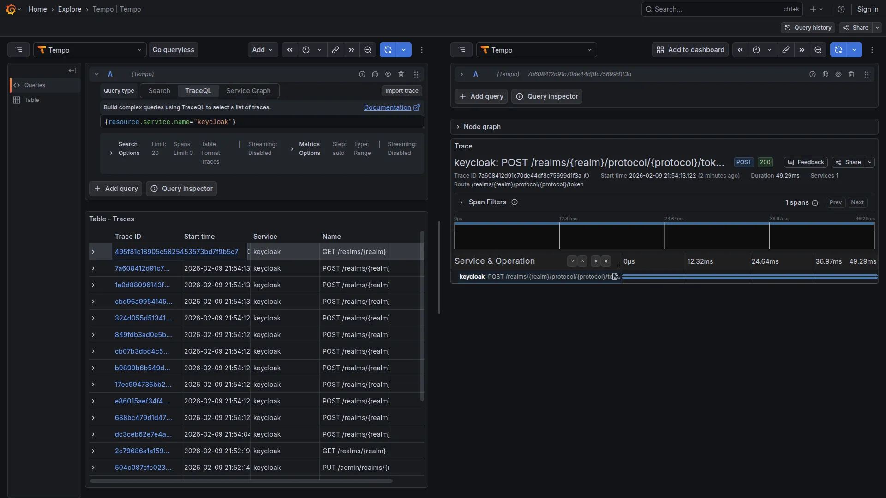

Cosa succede quando abiliti il tracing su un identity provider e ti ritrovi username, password e token JWT leggibili in chiaro su Grafana? I dati sensibili che Keycloak gestisce - credenziali, token, sessioni - finiscono nel backend di observability insieme ai trace, creando un rischio concreto di data breach e violazione GDPR.

Instrumentare servizi third-party come identity provider o payment gateway aggiunge un problema spesso sottovalutato: senza filtering, ogni span diventa un potenziale vettore di esposizione PII.

---

## I trace registrano tutto, anche i dati sensibili

Aggiungere observability a un servizio di autenticazione come Keycloak presenta un problema: unified logs, distributed tracing e metriche finiscono tutti nel backend di observability. Il primo trace rivela subito il rischio.

**Scenario tipico:**

```
User → Frontend → Backend API → Keycloak (authentication)
                                    ↓
                                 Postgres (users, sessions)
```

Abilitando il tracing nativo di Keycloak (dalla versione 26.0 come feature stabile), l'instrumentazione funziona immediatamente. Ma in Grafana appare questo:

```json
{
  "trace_id": "abc123...",
  "service.name": "keycloak",
  "http.method": "POST",
  "http.url": "/auth/realms/techstore/protocol/openid-connect/token?username=mario",
  "enduser.id": "mario",
  "db.statement": "SELECT * FROM user_entity WHERE username = 'mario'"
}
```

> **Nota:** Il tracing nativo non cattura il body delle request HTTP. I dati sensibili finiscono comunque nei trace tramite URL query parameters, database statements e span attributes.

**Problemi:**
- **Username esposto** in URL query parameters e database queries
- **Session ID e token** tracciabili
- **Potenziale violazione GDPR** (Art. 5: data minimization, Art. 32: security measures)
- **Rischio data breach** se il backend Grafana/Tempo è compromesso

> **Nota:** L'esposizione di PII non gestita può configurare una violazione degli articoli 5 e 32 del GDPR, con obbligo di notifica in caso di data breach (Art. 33).

Il tracing nativo instrumenta le operazioni interne, ma non distingue cosa è sensibile. Il problema non è l'instrumentazione - è cosa passa nel backend di observability.

Semplicemente non tracciare Keycloak non è un'opzione: si perde visibilità su un componente critico. L'alternativa è filtrare i dati sensibili nell'OTel Collector, prima che raggiungano il backend. Le prossime sezioni coprono il setup, quattro tecniche di filtering e i requisiti di compliance.

---

## Keycloak si instrumenta in 5 righe di config

Prima di parlare di filtering, è utile vedere quanto è semplice instrumentare Keycloak e quali rischi comporta senza filtering.

A partire dalla versione 26, Keycloak supporta OpenTelemetry nativamente, senza bisogno del Java Agent.

> **Setup**: il codice completo è nel [repository MockMart](https://github.com/monte97/MockMart).
> ```bash
> git clone https://github.com/monte97/MockMart
> cd MockMart
> ```

**Stack completo (estratto semplificato da `docker-compose.keycloak-pii.yml`):**

> **Nota:** L'estratto seguente è semplificato per leggibilità. Il compose completo include Postgres, application services (shop-api, shop-ui), healthcheck, volumes e configurazioni aggiuntive. Vedi il [repository](https://github.com/monte97/MockMart) per il setup completo.

```yaml
services:
  keycloak:
    image: quay.io/keycloak/keycloak:26.0
    command: >
      start-dev
      --tracing-enabled=true
      --metrics-enabled=true
    ports:
      - "8080:8080"
    environment:
      KC_DB: postgres
      KC_DB_URL: jdbc:postgresql://keycloak-postgres:5432/keycloak
      KC_HTTP_RELATIVE_PATH: /auth
      KEYCLOAK_ADMIN: admin
      KEYCLOAK_ADMIN_PASSWORD: admin
      # OpenTelemetry - tracing nativo
      KC_TRACING_ENABLED: "true"
      KC_TRACING_ENDPOINT: http://otel-collector:4317
      KC_TRACING_SERVICE_NAME: keycloak
      KC_METRICS_ENABLED: "true"

  otel-collector:
    image: otel/opentelemetry-collector-contrib:0.120.0
    ports:
      - "4317:4317"   # OTLP gRPC
      - "4318:4318"   # OTLP HTTP
    volumes:
      - ./otel-config/keycloak-pii/${OTEL_CONFIG:-otel-collector-config.yaml}:/etc/otel-collector-config.yaml:ro

  grafana:
    image: grafana/grafana:11.4.0
    ports:
      - "3005:3000"
```

**Configurazione:**

1. **Abilita il tracing nativo** nel command: `--tracing-enabled=true`
2. **Configura l'endpoint OTel** via environment: `KC_TRACING_ENDPOINT`
3. **Abilita le metriche**: `--metrics-enabled=true`

> **Nota sulle variabili Keycloak:** Keycloak 26.0 usa le variabili `KC_TRACING_*` per il tracing. Le variabili unificate `KC_TELEMETRY_*` (che coprono tracing, logs e metrics) sono disponibili con i feature flag `opentelemetry-logs,opentelemetry-metrics` in 26.0, o nativamente in versioni successive (26.1+). Il compose completo nel repository usa `KC_TRACING_*` per compatibilità con la 26.0.

**Cosa viene auto-instrumentato:**
- **HTTP requests** (incoming/outgoing)
- **Database queries** (JDBC - Postgres)
- **Context propagation** (W3C traceparent)

**Zero modifiche** al codice di Keycloak - solo configurazione container.

**Test del problema:**

```bash
docker compose -f docker-compose.keycloak-pii.yml up -d

# Login tramite password grant (deprecated in OAuth 2.1, solo per demo)
curl -X POST http://localhost/auth/realms/techstore/protocol/openid-connect/token \
  -H "Content-Type: application/x-www-form-urlencoded" \
  -d "grant_type=password" \
  -d "client_id=shop-ui" \
  -d "username=mario" \
  -d "password=mario123"
```

**Output atteso:**

```json
{"access_token":"eyJhbG...","token_type":"bearer","expires_in":300}
```

In Grafana (http://localhost/grafana) → Explore → Tempo, con la query:

`{service.name="keycloak"}`


**Risultato:** il trace rivela l'intera struttura del database di autenticazione: query su `USER_ENTITY`, `CREDENTIAL`, `USER_ATTRIBUTE`, tutte visibili nel waterfall:


Questo è il problema da risolvere.


---

## Filtrare senza perdere visibilità

L'OTel Collector supporta quattro tecniche di filtering, ciascuna adatta a un tipo diverso di dato sensibile.

### Ogni dato sensibile richiede una tecnica diversa

1. **DELETE**: Rimuovi attributi interi (es. `http.request.header.authorization`)
2. **REDACT**: Elimina attributi il cui valore matcha un pattern PII (es. URL con `username=...`)
3. **HASH**: Anonimizza ma mantieni correlazione (es. `sha256:8f14e45f...`)
4. **SANITIZE**: Elimina query/logs con valori PII embedded

### La configurazione che rimuove PII prima dello storage

File: `otel-config/keycloak-pii/otel-collector-config.yaml`

La configurazione è strutturata in processor separati, ciascuno con una responsabilità specifica.

**Receivers e memory protection:**

```yaml
receivers:
  otlp:
    protocols:
      grpc:
        endpoint: 0.0.0.0:4317
      http:
        endpoint: 0.0.0.0:4318

processors:
  # MEMORY PROTECTION (sempre primo)
  memory_limiter:
    check_interval: 1s
    limit_mib: 512
    spike_limit_mib: 128
```

**1. DELETE - Rimuovi attributi sensibili interi:**

```yaml
  attributes/delete-pii:
    actions:
      - key: http.request.header.authorization
        action: delete
      - key: http.request.header.cookie
        action: delete
      - key: http.response.header.set-cookie
        action: delete
      - key: auth.token
        action: delete
```

**2. REDACT - Elimina URL con parametri sensibili:**

Il `transform` processor con OTTL permette di eliminare un attributo **in base al suo valore**, non al nome della chiave:

```yaml
  transform/redact-urls:
    error_mode: ignore
    trace_statements:
      - context: span
        statements:
          - delete_key(attributes, "http.url") where IsMatch(attributes["http.url"], ".*(username|email|password|token|client_secret).*")
          - delete_key(attributes, "url.full") where IsMatch(attributes["url.full"], ".*(username|email|password|token|client_secret).*")
          - delete_key(attributes, "url.query") where IsMatch(attributes["url.query"], ".*(username|email|password|client_secret).*")
```

> **Nota:** L'`attributes` processor supporta `pattern` solo per matchare **nomi di chiavi** (attribute key names), non valori. Per filtrare in base al valore, serve il `transform` processor con clausole `where`.

**3. HASH - User identifiers (SHA-256, mantieni correlazione):**

```yaml
  # CAVEAT: non è anonimizzazione completa se input space è limitato
  attributes/hash-users:
    actions:
      - key: enduser.id
        action: hash
      - key: enduser.username
        action: hash
      - key: user.id
        action: hash
      - key: user.email
        action: hash
```

**4. SANITIZE - Elimina database queries con valori PII:**

```yaml
  transform/sanitize-db:
    error_mode: ignore
    trace_statements:
      - context: span
        statements:
          - delete_key(attributes, "db.statement") where IsMatch(attributes["db.statement"], ".*(email|username|password|user_id)\\s*=.*")
```

**Batch, exporters e pipeline:**

```yaml
  batch:
    timeout: 10s
    send_batch_size: 1024

exporters:
  otlp/tempo:
    endpoint: tempo:4317
    tls:
      insecure: true

  prometheusremotewrite:
    endpoint: http://prometheus:9090/api/v1/write
    tls:
      insecure: true

service:
  pipelines:
    traces:
      receivers: [otlp]
      processors: [
        memory_limiter,
        attributes/delete-pii,
        transform/redact-urls,
        attributes/hash-users,
        transform/sanitize-db,
        batch
      ]
      exporters: [otlp/tempo]

    metrics:
      receivers: [otlp]
      processors: [memory_limiter, batch]
      exporters: [prometheusremotewrite]
```

> **Nota sulle semantic conventions:** La configurazione copre sia i nomi vecchi (`http.url`, `http.target`) che i nuovi (`url.full`, `url.query`), introdotti con la stabilizzazione delle HTTP semantic conventions. A seconda della versione del SDK, Keycloak potrebbe emettere gli uni o gli altri.

### Cosa cambia nei trace dopo il filtering

| Span Attribute | Before (UNSAFE) | After (SAFE) |
|----------------|-----------------|--------------|
| `http.request.header.authorization` | `Bearer eyJhbGciOi...` | **DELETED** |
| `http.url` / `url.full` | `/token?username=mario` | **DELETED** (contiene PII) |
| `enduser.id` | `mario` | `a8f14e45fceea167...` (HASH SHA-256) |
| `db.statement` | `SELECT ... WHERE username = 'mario'` | **DELETED** (contiene PII) |
| `auth.token` | `eyJhbGciOiJSUzI1NiIsInR5cCI6IkpXVCJ9...` | **DELETED** |



### Confrontare il prima e il dopo in un comando

Per passare tra config safe e unsafe, si usa la variabile `OTEL_CONFIG`:

```bash
# Config UNSAFE (mostra il problema)
OTEL_CONFIG=otel-collector-unsafe.yaml \
  docker compose -f docker-compose.keycloak-pii.yml up -d

# Config SAFE (con PII filtering)
docker compose -f docker-compose.keycloak-pii.yml down
OTEL_CONFIG=otel-collector-config.yaml \
  docker compose -f docker-compose.keycloak-pii.yml up -d

# Ripeti login (password grant - solo per demo)
curl -X POST http://localhost/auth/realms/techstore/protocol/openid-connect/token \
  -d "grant_type=password" \
  -d "client_id=shop-ui" \
  -d "username=mario" \
  -d "password=mario123"
```

**Verifica in Grafana:**

- **No password visible**
- **No email in plaintext**
- **Database queries sanitized**
- **User IDs hashed**

**Cleanup:**

```bash
docker compose -f docker-compose.keycloak-pii.yml down -v
```

### Il debug resta intatto

PII filtering non riduce la capacità di debug. I dati disponibili dopo il filtering includono:

- **Trace ID** — Correlazione end-to-end
- **Span timing** — Performance analysis (quanto tempo login?)
- **Service topology** — Quali servizi chiamati (Keycloak → Postgres)
- **HTTP status codes** — Success/failure (200, 401, 500)
- **Error messages** — Stack traces (senza PII)
- **Hashed user ID** — Per-user analysis (hash deterministico, stesso utente = stesso hash)

**Dati rimossi:**

- **Username/email in chiaro** — rimossi
- **Passwords** — rimosse
- **Token content** — rimosso
- **Session IDs** — rimossi
- **Valori in database queries** — rimossi

**Trade-off: Hash Lookup**

Con `enduser.id: a8f14e45fceea167...` (hash SHA-256) nel trace, per risalire all'utente:

**Opzione 1: On-demand hash**
```bash
echo -n "mario" | sha256sum
# Match con trace!
```

**Opzione 2: Lookup table separata** (solo Security team ha accesso)

Trade-off accettabile per GDPR compliance.

### Metriche: Osservabilità Oltre i Trace

Oltre ai trace, Keycloak 26 esporta metriche via OTLP (con `--metrics-enabled=true` e `KC_METRICS_ENABLED`). Le metriche native sono basate su Micrometer/Quarkus: JVM, HTTP server, database connection pool.

**Problema:** Alcune metriche custom o label possono contenere **user identifiers**. Se configurate estensioni o SPI aggiuntive, il rischio di PII nelle label aumenta.

**Soluzione:** Il Collector può filtrare le metriche con un transform processor:

```yaml
processors:
  transform/metrics-pii:
    error_mode: ignore
    metric_statements:
      - context: datapoint
        statements:
          - delete_key(attributes, "user_id")
          - delete_key(attributes, "username")
          - delete_key(attributes, "email")
```

**Metriche aggregate utili per il monitoraggio:**
- JVM memory pressure e garbage collection
- HTTP request rate e latency
- Database connection pool saturation
- Active sessions (senza user identifiers)

---

## Lo stesso approccio per qualsiasi servizio con PII

Keycloak è solo un esempio. Questo pattern funziona per **qualsiasi servizio che gestisce PII**.

### Cosa verificare prima di instrumentare

**Prima di instrumentare:**

**1. Quali dati sensibili gestisce?**
- [ ] User credentials (username, password, email)
- [ ] Authentication tokens (JWT, session IDs)
- [ ] Payment info (credit cards, billing)
- [ ] Personal identifiers (SSN, tax IDs)
- [ ] Location data (GPS, IP addresses)

**2. Dove possono finire nei trace?**
- [ ] HTTP request/response body
- [ ] URL query parameters
- [ ] HTTP headers (Authorization, Cookie)
- [ ] Database queries (WHERE, VALUES)
- [ ] Custom span attributes

**3. Quale tecnica di filtering?**

| Tipo di Dato | Condizione | Tecnica | Rationale |
|--------------|------------|---------|-----------|
| Password/Secret | Sempre | DELETE | Mai loggare |
| Token (JWT, API key) | Sempre | DELETE | Rimuovi completamente |
| User identifier | In URL/query param | REDACT (transform) | Elimina se valore matcha |
| User identifier | Come attributo span | HASH | Per-user analysis anonimizzato |
| Database query | Con valori PII | SANITIZE (transform) | Elimina se contiene PII |
| Credit Card | Sempre | DELETE | PCI-DSS compliance |
| Non chiaro | Sempre | DELETE (data minimization) | Principio di cautela |

### Tre processor bastano come base

**Pattern applicabile a qualsiasi servizio:**

```yaml
processors:
  # DELETE - Rimuovi attributi sensibili interi
  attributes/<service-name>-delete:
    actions:
      - key: <sensitive-header-or-token>
        action: delete

  # REDACT - Elimina attributo se il valore contiene PII
  transform/<service-name>-redact:
    error_mode: ignore
    trace_statements:
      - context: span
        statements:
          - delete_key(attributes, "<field>") where IsMatch(attributes["<field>"], "<pii-pattern>")

  # HASH - Identifiers per correlazione anonimizzata (SHA-256)
  attributes/<service-name>-hash:
    actions:
      - key: <user-identifier>
        action: hash
```

**Esempi rapidi:**
- **Payment (Stripe)**: DELETE card numbers, REDACT CVV
- **CRM (Salesforce)**: HASH contact IDs, REDACT emails in queries
- **Analytics (Mixpanel)**: HASH user traits, DELETE event properties con PII

Il pattern si adatta alle specificità di ogni servizio.

---

## Il filtering non basta: retention, accesso e cancellazione

PII filtering risolve il problema principale, ma GDPR richiede altro.

### Data Retention (GDPR Art. 5)

**Principio:** Dati personali tenuti solo per il tempo necessario.

**Tempo retention configuration:**

```yaml
compactor:
  compaction:
    block_retention: 168h  # 7 giorni - unica retention globale
```

Tempo supporta una sola retention globale (`block_retention`). Non è possibile configurare retention differenziata per-attributo (es. errori vs normali) nella stessa istanza.

**Se servono retention diversificate:**
- **Istanze Tempo separate** per flussi diversi (es. audit vs debug)
- **Grafana Cloud** supporta retention per-tenant
- **Tail sampling** a monte per separare i flussi verso backend diversi

Trace oltre la retention vengono **automaticamente eliminate** dal compactor.

### Access Control

**Chi può vedere i trace?**

Grafana gestisce l'accesso ai trace tramite permessi sulle datasource e sull'accesso a Explore. I permessi rilevanti sono:

- `datasources:read` e `datasources:query` - accesso in lettura ai dati
- `datasources:explore` - accesso alla sezione Explore

La configurazione avviene tramite l'API RBAC o il provisioning YAML, non in `grafana.ini`.

**Best practice:**
- **Developers**: Ruolo Viewer con accesso Explore per debug
- **Security team**: Ruolo Admin sulla datasource Tempo per gestione completa
- **Audit log** degli accessi (chi ha visto cosa?)

### Right to be Forgotten (GDPR Art. 17)

Se un utente richiede la cancellazione dei propri dati, anche con hashing è necessario poter dimostrare che i dati verranno rimossi.

**Limitazione importante:** Tempo **non supporta** la cancellazione selettiva di singole trace. Le trace vengono rimosse solo tramite compaction alla scadenza della retention.

**Strategia pratica:**

1. **PII filtering a monte** (questo articolo) - minimizza i dati personali che arrivano nel backend
2. **Retention breve** (7 giorni) - le trace vengono automaticamente eliminate
3. **Hash senza salt** - con hash deterministico, la correlazione è possibile senza esporre l'identità in chiaro. Caveat: su input a bassa entropia (email comuni) l'hash SHA-256 è reversibile con rainbow tables. Non è anonimizzazione completa.
4. **Distruggi la lookup table** per l'utente che richiede la cancellazione

```bash
# Verifica: dopo retention, le trace non esistono più
# Con block_retention: 168h, tutte le trace > 7 giorni vengono eliminate
curl -s http://tempo:3200/api/traces/<trace-id> | jq .
# "trace not found"
```

**In pratica:** La combinazione di PII filtering + retention breve soddisfa il requisito nella maggior parte dei casi. Per cancellazione immediata, valuta Grafana Cloud che offre API di delete per-tenant.

### Data Sovereignty e Audit Trail

Se il backend Tempo risiede fuori EU, il filtering da solo non soddisfa il requisito di data residency. Le opzioni sono: Tempo self-hosted in datacenter EU, Grafana Cloud EU (Frankfurt/Amsterdam), o S3 con bucket in `eu-central-1`.

Resta inoltre necessario tracciare chi accede ai trace. Grafana Enterprise offre audit logging nativo. Con Grafana OSS, le alternative sono un reverse proxy con access log o i log applicativi di Grafana (`GF_LOG_LEVEL=info`).

---

## Conclusioni

La configurazione descritta nell'articolo copre:

- **Instrumentato Keycloak** con tracing nativo (zero code changes)
- **PII filtering** con tecniche di delete, redact, hash e sanitize
- **Metriche filtrate** (OTLP export con label sanitization)
- **Mantenuto debug capability** senza esporre dati sensibili
- **Pattern riutilizzabile** per payment, CRM, analytics
- **Supporto ai requisiti GDPR** (data minimization, retention, access control)

**In sintesi:**

> Con PII filtering nell'OTel Collector, è possibile mantenere observability senza esporre dati sensibili nel backend.

**Confronto:**

| Aspetto | Senza Filtering | Con Filtering |
|---------|----------------|---------------|
| GDPR | Rischio esposizione PII | Contribuisce alla compliance |
| Data breach risk | Alto (PII esposti) | Ridotto (PII rimossi) |
| Debug capability | Completo | Completo (via hashed IDs) |
| Audit readiness | Carente | Baseline soddisfatta |

Il filtering PII consente l'adozione di strumenti di observability senza conflitto con le policy di sicurezza.

---

## Prossimi Passi

Il codice completo, comprese le configurazioni safe e unsafe, è disponibile nel [repository MockMart](https://github.com/monte97/MockMart). Per lanciare la demo con un solo comando: `make up-keycloak-pii` (safe) oppure `make up-keycloak-pii-unsafe` (unsafe).

**Prossimi articoli:**

1. **Metrics Deep Dive** - RED Method, custom metrics, cardinality control
2. **Tail Sampling** - Sampling intelligente per high-volume services
3. **Multi-Tenancy Filtering** - Filtering diverso per tenant
4. **Keycloak Extensions** - Custom event listeners per audit dettagliato

**Risorse:**

* **OTel Docs**: [opentelemetry.io/docs/collector](https://opentelemetry.io/docs/collector/processors)
* **GDPR Guide**: [gdpr.eu](https://gdpr.eu)
* **Workshop completo**: [github.com/monte97/otel-workshop](https://github.com/monte97/otel-workshop)

*Per domande o feedback: [francesco@montelli.dev](mailto:francesco@montelli.dev) | [LinkedIn](https://www.linkedin.com/in/francesco-montelli/) | [GitHub](https://github.com/monte97)*
