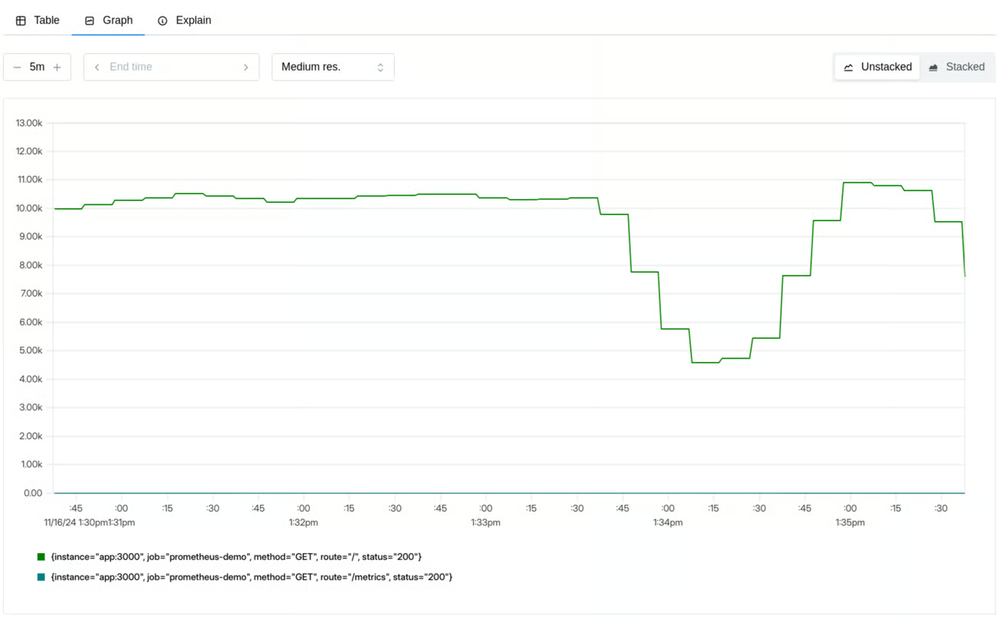

## Introduction

> What, how, why

Performance testing is a fundamental activity in the software development lifecycle, but often underestimated or performed suboptimally. In this guide, we will explore the theoretical and practical foundations needed to approach performance analysis effectively, starting from definition and objectives, up to the most effective measurement methods.

### Definition

Performance testing is the process aimed at determining the responsiveness, throughput, reliability and scalability of a system under a given workload. It's important to note that the "system" refers to the interaction of different components, and not to a single isolated part. Sometimes, a performance issue could simply be resolved by moving the problematic block to another subsystem.

### Why do we measure?

Non-performant applications generally cannot perform the function for which they were designed or intended. Performance testing represents an additional step beyond operational acceptance tests, which only verify if the application works or not.

But what do we mean by "performance"? An application is performant when it allows a user to perform a given task without perceiving delays or irritation. Measuring performance allows us to:

* Be certain we are ready for release.
* Verify infrastructure adequacy: do we have enough resources? Does the system remain stable?
* Evaluate different deployment modes: are we certain the more expensive configuration is really worth it?
* Define optimizations: it makes no sense to optimize elements that don't actually impact the metrics of interest.

### What can we measure?

The key metrics we can measure include:

* Availability
* Response Time
* Throughput
* Utilization
* Scalability

### Why do performance problems exist?

As with many other problems in software development, the later a performance issue emerges, the greater the cost to resolve it. Therefore, there needs to be a "shift-left" in solving these problems, just as happens with security or other areas.

But why aren't these tests executed earlier? The reasons can be multiple:

* Cultural issues
* Poor perceived utility
* Bad developer experience (complex tools, difficult to configure)

### What activities does it include?

The performance testing process includes several fundamental activities:

1.  Identifying the test environment: what do we have to work with?
2.  Determining the acceptance criteria: how do we know we've done well?
3.  Planning the tests: what are the scenarios? Do they resemble real product usage? It makes no sense to run tests simulating millions of users if we only have hundreds.
4.  Setting up the environment
5.  Implementing the tests
6.  Execution
7.  Test analysis

### Project Context

More than in other types of testing, the result of performance testing is not black/white but must be interpreted and the perimeter delineated. Without defining the project context, it's extremely easy to focus on wrong areas of analysis. We must take into account:

* **Project Vision**: the project vision defines its ultimate purpose and desired future state, allowing alignment of stakeholder strategic decisions.
* **System Purpose**: if we don't know the system's intent, certainly we can't even hypothesize the areas on which to focus.
* **User Expectations**: put yourself in the users' shoes. Their happiness doesn't necessarily reflect requirements written on paper by a manager.
* **Business Objectives**: as with every other project, respect deadlines and budget.
* **Reason why tests are being executed**: can vary during development phases, it's important to know how to question them.
* **Value that tests bring to the project**: knowing how to map business requirements to appropriate tests and determine the value they bring.
* Project management
* Processes
* Compliance criteria
* Project schedule

### Types of Tests

There are several types of performance tests, each with a specific objective:

* **Performance Testing**: determine speed, scalability and stability of a system. It's important to understand response times, throughput and resource usage.
* **Load Testing**: simulate high load on the system to see how it behaves while still remaining within design limits (initial estimates on usage).
* **Stress Testing**: go beyond design conditions. Determine what happens with little memory, insufficient space, server failures. The important thing is to understand how and why the system "crashes".

### Baseline Definition

Defining a baseline means determining the "as-is" conditions of the system in order to have a comparison for our improvements or to identify future regressions.

### Risks Addressed Through Performance Testing

Performance testing is a fundamental process to mitigate certain business risks and identify areas of interest regarding usability, functionality and security that cannot be obtained in other ways.

* **Speed Related Risk**: related, but not limited to, end-user satisfaction. Other examples may include data consumption and output production within a certain time frame or before data becomes obsolete. It's important to try to replicate real operating conditions as much as possible, for example how the system behaves if the load occurs during an update or during a backup.
* **Scalability Related Risk**: not only related to the number of users but also to the varying volume of processed data. We must ask ourselves:
    * Does the application remain stable for all users?
    * Is the application able to collect all the data of its lifecycle?
    * Do we have a way to realize if we're approaching maximum capacity?
    * Are functionality and security compromised with high load?
    * Are we able to handle unexpected peaks?

------

## The Measurement Pillars: Methodology and Key Signals

> well, I understand it's important! what can I do?

### RED Method

The RED (Rate, Errors, Duration) method is a user-experience-oriented monitoring framework and service behavior. It's particularly effective for microservices and request-driven applications, providing a clear view of how the workload is handled from the service perspective.

The RED method answers the question "What's going wrong from the user's point of view?" and is excellent for setting up meaningful alarms and measuring SLAs (Service Level Agreements).

#### Rate

> How much is our service being used?

Counts how many requests our system is handling; in the case of a web service these could be received requests, while for a database they could be received queries, for a queue manager the number of messages received, etc...

They represent the foundation for many other measurements, allowing, for example, to relate error increases to traffic increases or to better contextualize a decline in other metrics

#### Errors

> How many requests are failing?

This generally means every request that completes with a different result than expected, regardless of the reason (explicit error, timeout, incorrect results)

It's possible to measure errors both as a percentage of requests and as a number of errors per second, in order to have an absolute measure.

#### Durations

> How long do requests take?

Typically measured in seconds or milliseconds, it allows having an estimate of performance from the users' perspective.

When capturing this type of metric, it's important to think in terms of distribution rather than average: problems, even serious ones, that affect a small number of requests are easily hidden by computing an average.

The typical representation for this type of measurement is histograms grouped in percentiles:
- 50th percentile: represents the median, i.e. the experience of a typical user
- 90th percentile: represents the experience of the slowest 10%
- 99th percentile: represents the experience of the slowest 1%

Thinking in percentiles allows sophisticated reasoning:
- we analyze the entire range of possible user experiences,
- allows making decisions about SLO definition,
- makes performance degradation more evident as it's immediately visible in the 99th percentile,
- segmenting by endpoint allows determining the most interesting intervention areas

#### Dashboard Suggestions

> What should a good dashboard for these metrics allow?

Dual need: both to have overall visibility quickly and to investigate more deeply

Request rate: shows traffic volume over time, broken down by endpoint, method or other useful dimensions, to identify anomalous trends.

Errors: displays both absolute number and percentage of errors, with details by error type and endpoints involved. Add alerts if they exceed SLOs.

Duration: shows latency percentiles (p50, p90, p99) over time, broken down by endpoint, to identify bottlenecks and improve performance.

### USE Method

While the RED method focuses on the service and user perspective, the [USE method](https://www.brendangregg.com/usemethod.html) (Utilization, Saturation, Errors) focuses on the underlying infrastructure resources. Created by Brendan Gregg, it's a simple but powerful approach to analyze system performance, helping quickly identify resource bottlenecks or errors.

It uses a very simple and empirical approach that can be summarized as:
> For every resource, check utilization, saturation, and errors.

Its purpose is to allow rapid identification of system bottlenecks and is based on some basic definitions:

- resources: system resources, whether hardware, software or imposed limits
- utilization: average time for which resources are busy
- saturation: degree to which resources are unable to handle load
- errors: count of error events

USE collected metrics can also be used within a simple flowchart to identify bottlenecks.

#### Resources

> What are the system components? How do they communicate with each other?

First we need to determine what resources compose our system. In this phase it's extremely useful to consult, or create, diagrams that highlight communication flows.
Having an idea of how components interact is extremely useful for identifying bottlenecks, real or suspected.

#### Utilization

> How busy are the resources?

Utilization: Measures the percentage of time a resource is occupied. For example, CPU, memory, disk or network utilization. High utilization (near 100%) can indicate that the resource is becoming a bottleneck.

Utilization near 100% is almost always a sign of bottleneck; in this case it can be very useful to verify the presence of saturation.
Also high values (eg: 70%) can be problematic:
- if we're using aggregated values they might hide even worse bursts
- some resources, such as disks, cannot be interrupted during an operation even if a second operation has higher priority. Having high resource utilization might result in higher priority tasks having to wait

#### Saturation

> How much work can't I handle right now?

Saturation: Indicates the degree of additional, unmanaged work that a resource must face. It often manifests as queue lengths or waiting times. High saturation means that the resource cannot keep up with demand, even if its utilization is not 100%.
In this case, any value different from zero represents a problem

If utilization measures how busy a resource is, now we're measuring how many problems we're experiencing.

Some key metrics might be:

- CPU load average
- SWAP memory usage
- disk I/O queue
- Thread pool queue length

#### Errors

> How much is breaking?

Errors: In this context, it refers to resource-level errors, such as disk I/O errors, network errors or hardware errors. These errors can indicate problems that might not manifest immediately as application errors, but compromise its stability.

Error metrics include:
- network errors
- filesystem errors
- disk I/O errors

Very important to be able to correlate them with other metrics, for example relating network errors to the degree of utilization of the same.

#### Dashboard Suggestions

> What should a good dashboard for these metrics allow?

A complete USE dashboard provides visibility on the health and capacity of infrastructure resources

Utilization: shows percentage usage over time of CPU, memory, disk space and network bandwidth, to evaluate load and predict bottlenecks.

Saturation: highlights overload situations with metrics such as CPU load average, swap usage, disk and network I/O queue lengths.

Errors: shows resource-level errors over time, such as memory allocation failures, network errors, disk I/O errors, to intercept hardware or systemic problems before they become critical.

---

## The Strategic Integration of RED and USE Metrics: A Systemic Approach to Performance Monitoring

Real strength manifests when the RED and USE methods are used together. They are complementary: RED metrics tell you when something is wrong from the user's perspective, while USE metrics help you understand why it's happening at the infrastructure level. This duality offers complete understanding of system behavior, covering both user interactions and resource reactions.

Start implementing RED monitoring to have immediate visibility of user-perceived performance, and when you identify a problem, use the USE method to dive deeper and identify the root cause at the resource level.

Adopting these methodologies in your performance testing and monitoring strategies will allow you to build more robust, scalable and performant systems.
