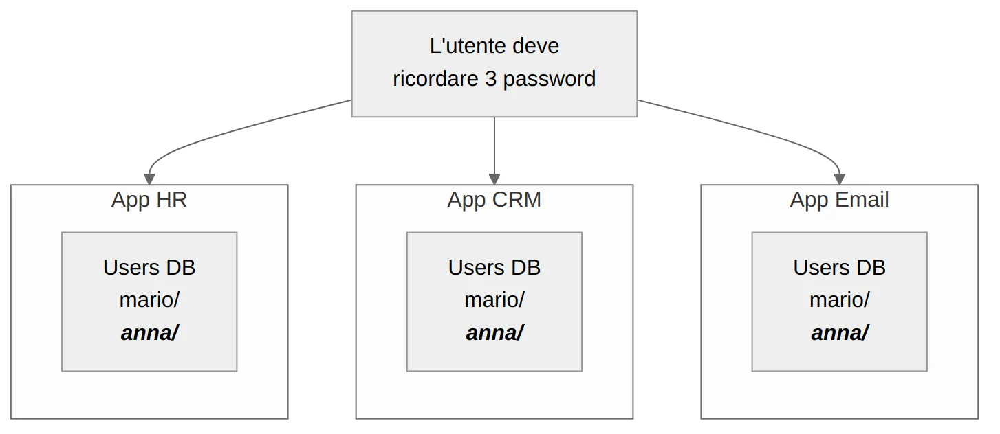

Scrivere un sistema di login da zero è noioso, ma si fa. Registrazione, reset password, hash delle credenziali, gestione delle sessioni: una settimana, forse due, e funziona.

Il conto arriva alla seconda applicazione. Perché la seconda non riusa la prima: riscrive le stesse tabelle, ripete gli stessi dubbi, e aggiunge un secondo posto in cui le password di una persona sono conservate — magari diverse dalle prime.

E il momento in cui quel conto diventa visibile a tutti è preciso: **è il giorno in cui qualcuno lascia l'azienda.** Perché a quel punto disattivarlo non è un'operazione, sono N operazioni su N sistemi, ognuna che può essere dimenticata. E quella dimenticata non fa rumore.

## Perché i silos di identità si pagano dopo, non subito

Tre applicazioni in un'organizzazione — un gestionale HR, un CRM, un client di posta — ognuna con il proprio database utenti.



Finché sono tre, sembra gestibile. I costi che crescono sono altri quattro, e nessuno si vede il primo giorno:

- **Le password si duplicano.** L'utente usa la stessa ovunque — e allora una compromissione le apre tutte — oppure ne usa tre diverse e ne dimentica due, il che diventa carico per chi fa supporto.
- **Non c'è Single Sign-On.** Login separato per ogni applicazione, ogni volta.
- **La sicurezza diverge.** MFA, lockout dopo N tentativi falliti, audit degli accessi: ogni app li implementa a modo suo, o non li implementa. Nessuno sa quale sia messa peggio.
- **La disattivazione è N interventi.** Quello di cui sopra.

E le architetture di oggi peggiorano il conto invece di migliorarlo. Un singolo prodotto può avere una SPA, un'API REST, cinque microservizi e un'app mobile: ognuno deve sapere chi sta chiamando. Riscrivere l'autenticazione in ognuno non è faticoso, è insostenibile.

## Se il codice non tocca le password, non può gestirle male

La soluzione è togliere l'autenticazione dalle applicazioni e metterla in un componente dedicato — un **Identity Provider**. Le app smettono di gestire credenziali: ricevono un **token firmato** e ne verificano la firma.

Il punto non è la comodità. È che **il rischio si sposta in un punto solo**, e un punto solo si può presidiare davvero: si aggiorna quando esce una patch, si configura MFA una volta, si guarda un log di accessi invece di quattro.

Da qui discendono le due conseguenze che contano:

- L'utente fa login **una volta sola** e accede a tutto. È il Single Sign-On.
- Un dipendente esce? **Lo disattivi in un posto** e perde accesso ovunque.

Va detta anche l'altra faccia: quel punto solo è anche un punto singolo di guasto. Se l'IdP non risponde, non si autentica nessuno da nessuna parte. È un rischio che si progetta — repliche, cache dei token, tolleranza alla scadenza — non che si ignora.

## Cosa deleghi a Keycloak, e cosa resta tuo

[Keycloak](https://www.keycloak.org/) è un Identity Provider open source nato in casa Red Hat, licenza Apache 2.0. Non è una libreria da integrare: è un **servizio a sé stante** che si avvia accanto alle applicazioni.


Quello che smette di essere codice tuo:

- **Authorization server** — implementa OAuth 2.0 e OpenID Connect. Le app delegano seguendo standard aperti, non un protocollo inventato in casa.
- **Federazione utenti** — se esiste già un LDAP o un Active Directory con migliaia di utenti, Keycloak ci si collega e li usa. Nessuna migrazione.
- **Social login** — Google, GitHub e gli altri si configurano dalla console, senza scrivere niente.
- **Gestione utenti** — registrazione, reset password, sessioni, MFA.

Quello che resta tuo, e va detto perché è la parte che sorprende: **decidere cosa un utente può fare.** Keycloak dice *chi è* e trasporta i ruoli; è la vostra applicazione a decidere cosa quei ruoli aprono. Dove finisce l'autenticazione e comincia l'autorizzazione è una linea che va tracciata a mano, ed è il tema di [OPA come motore di policy](/blog/progettare/keycloak/05-keycloak-opa/).

## Realm, client, ruolo: i tre concetti che decidono la struttura

Prima di toccare qualsiasi cosa, tre parole. Sono tre perché sono le tre decisioni che poi è costoso cambiare.

- **Realm** — il contenitore isolato: utenti, ruoli e configurazioni propri. Uno per progetto, o uno per ambiente. Due realm non si vedono fra loro, ed è esattamente questo che li rende utili.
- **Client** — ogni applicazione che si collega. Il frontend React è un client, l'API che sta dietro è un altro. Non è burocrazia: è ciò che permette di dire che un token emesso per l'uno non vale per l'altro.
- **Ruolo** — i permessi che finiscono nel token e che l'app userà per decidere.

Un esempio concreto: realm `techstore`, due client `shop-ui` e `shop-api`, gli utenti Mario e Admin, e il ruolo `admin` assegnato solo al secondo. Quando Mario fa login, il suo token dice all'applicazione chi è e cosa gli è consentito, senza che l'applicazione debba chiederlo a nessuno.

## Il login, in tre passaggi

Il flusso standard per un'applicazione web si chiama **Authorization Code Flow**, e dal punto di vista dell'utente sono tre cose:

1. clicca "Login" nell'app e viene reindirizzato alla pagina di Keycloak
2. inserisce le credenziali **su Keycloak**, non sull'app
3. torna all'app con un **token JWT** che contiene identità, ruoli e scadenza

Keycloak firma quel token con la propria chiave privata; l'app lo valida scaricando la chiave pubblica. Se qualcuno lo modifica, la firma non torna e il token viene rifiutato.

Il passaggio 2 è quello su cui si sbaglia più spesso: **l'app non deve avere un form di login proprio.** Se raccogliete username e password nel vostro frontend, quelle credenziali passano di nuovo attraverso il vostro codice — e siete tornati al punto di partenza, con tutti i problemi che l'IdP doveva togliere. Il redirect esiste precisamente per evitarlo.

Il flusso completo, con PKCE e la configurazione di client e middleware, è il tema del [prossimo articolo della serie](/blog/progettare/keycloak/02-authorization-code-pkce/).

## Le quattro trappole del primo giorno

- **Il form di login nell'app.** Quello di sopra. È l'errore che annulla il senso dell'operazione.
- **`start-dev` in produzione.** Comodo per provare, inadatto oltre: abilita HTTP senza TLS, usa un database H2 locale e rilassa diverse configurazioni di sicurezza. In produzione serve `start`, con PostgreSQL e HTTPS.
- **Ignorare i ruoli.** Keycloak ha un sistema di ruoli completo. Reinventare l'autorizzazione con logica custom nel backend significa riportare dentro il codice quello che si era appena tolto.
- **URL hardcoded.** L'indirizzo di Keycloak cambia fra locale, staging e produzione. Se non è configurabile dal primo giorno, il primo deploy fuori da localhost vi accoglie con un 401 senza spiegazione.

## Provarlo in un minuto

```bash
docker run -p 8080:8080 \
  -e KC_BOOTSTRAP_ADMIN_USERNAME=admin \
  -e KC_BOOTSTRAP_ADMIN_PASSWORD=admin \
  quay.io/keycloak/keycloak:26.0 start-dev
```

Su `http://localhost:8080`, con `admin/admin`, c'è la console. Da lì: un realm, un client di tipo public con il redirect URI dell'app, un utente. Lato applicazione serve una libreria client — `keycloak-js` per il frontend, un middleware JWT per il backend — ma la logica di autenticazione resta tutta di là.

## Quanto vale, detto a chi non scrive codice

Il beneficio non è "una cosa in meno da scrivere", che è un argomento da sviluppatori. È questo: **l'uscita di una persona dall'azienda passa da N interventi su N sistemi, ognuno dimenticabile, a un interruttore solo** — e insieme a quello, MFA e audit degli accessi diventano una decisione presa una volta invece di N implementazioni scritte da persone diverse in momenti diversi.

Il che si traduce nella domanda a cui una direzione tecnica deve saper rispondere: *quanto tempo passa, oggi, fra il momento in cui una persona lascia e il momento in cui non può più entrare in nulla?* Se la risposta richiede di aprire una lista di sistemi e spuntarli a mano, il numero non lo sapete.

## Da dove partire

Contate i posti in cui esiste una tabella `users` nei vostri progetti. Se sono più di uno, avete già il problema di questo articolo — semplicemente non l'avete ancora pagato.

Poi lanciate il comando qui sopra e create un realm con due client. Dieci minuti servono a capire se i tre concetti della sezione precedente reggono il vostro caso, che è la sola domanda che conta prima di adottarlo.
