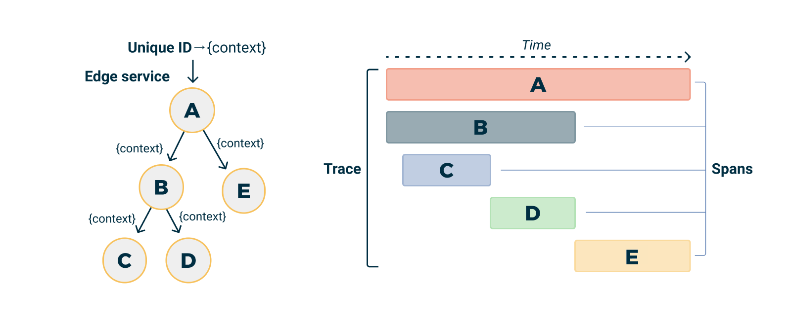
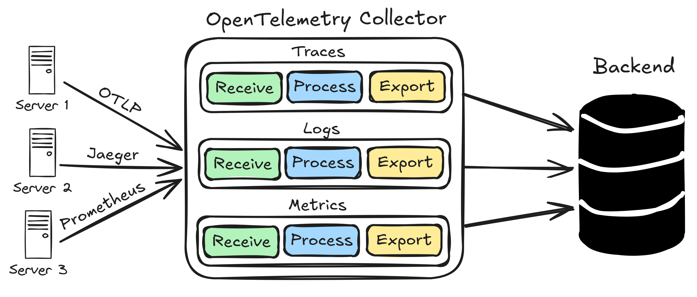

## Il Problema della Frammentazione Pre-OpenTelemetry

Prima dell'avvento di OpenTelemetry, l'ecosistema dell'observability era un labirinto di protocolli, API e formati proprietari. Ogni vendor aveva sviluppato il proprio "dialetto":

  * **Jaeger** utilizzava il proprio formato di span e protocollo di ingest.
  * **Zipkin** aveva un data model diverso e API REST specifiche.
  * **Prometheus** richiedeva metriche in formato specifico con naming conventions rigide.
  * **AWS X-Ray**, **Google Cloud Trace**, **Azure Monitor** - ognuno con SDK proprietari.

Questa frammentazione creava problemi sistemici:

  * **Vendor lock-in**: Cambiare strumento significava riscrivere l'instrumentazione.
  * **Silos di dati**: Era impossibile correlare telemetria da fonti diverse, compromettendo la capacità di comprendere il comportamento end-to-end in un sistema distribuito.
  * **Overhead di apprendimento**: Ogni team doveva padroneggiare API e concetti diversi per ogni strumento.
  * **Duplicazione di effort**: Lo stesso lavoro di instrumentazione e integrazione veniva ripetuto per ogni backend.

Questa situazione non solo causava costi elevati in termini di sviluppo e manutenzione, ma impediva anche una visione completa e correlata dello stato del sistema. È stato proprio per affrontare queste sfide che la comunità ha spinto per un'unificazione degli standard,[ culminata nella fusione di OpenTracing e OpenCensus sotto l'ombrello della CNCF per creare OpenTelemetry](https://opensource.microsoft.com/blog/2019/05/23/announcing-opentelemetry-cncf-merged-opencensus-opentracing/). 

-----

## OpenTelemetry: L'Architettura Unificante


OpenTelemetry risolve questa frammentazione attraverso un'architettura a layer che separa chiaramente:

  * **Data generation** (SDK)
  * **Data collection** (Collector)
  * **Data consumption** (Backends)

Grazie alla sua adozione da parte di un'ampia coalizione di aziende e alla sua promozione come progetto **[Graduated dalla Cloud Native Computing Foundation (CNCF)](https://www.cncf.io/blog/2021/08/26/opentelemetry-becomes-a-cncf-incubating-project/)**, OpenTelemetry si è rapidamente affermato come lo standard de-facto per la telemetria cloud-native.

### I Principi Architetturali

**1. Separation of Concerns**

  * L'applicazione produce dati standardizzati.
  * Il Collector gestisce routing e processing.
  * I backend si occupano solo di storage e query.

**2. Protocol Standardization**

  * **OTLP** (OpenTelemetry Protocol) come lingua comune.
  * Supporto della backward compatibility per protocolli legacy.
  * Estensibilità per requisiti futuri.

**3. Zero-Dependency Deployment**

  * SDK leggeri senza dipendenze dirette sui backend.
  * Collector deployabile indipendentemente dall'applicazione.
  * Configurazione "hot-swappable" senza necessità di riavviare le applicazioni.

-----

## Anatomia del Data Model

### Trace Data Model


OpenTelemetry utilizza un data model gerarchico per rappresentare i **distributed traces**, offrendo una visione end-to-end delle operazioni in un sistema distribuito:

```
Trace (Root Container)
├── TraceID: Identificatore globale unico per l'intera transazione.
├── Spans: Array di operazioni individuali.
│   ├── Span
│   │   ├── SpanID: Identificatore unico di questa singola operazione.
│   │   ├── ParentSpanID: Link gerarchico allo span che ha invocato questa operazione.
│   │   ├── OperationName: Nome semantico dell'operazione (es. "UserService.GetUserById").
│   │   ├── StartTime/EndTime: Limiti temporali dell'esecuzione dello span.
│   │   ├── Status: Stato dell'operazione (SUCCESS/ERROR/UNSET).
│   │   ├── Attributes: Coppie chiave-valore di metadati contestuali.
│   │   ├── Events: Timestamped log entries associate allo span.
│   │   └── Links: Riferimenti ad altri traces (per correlazioni complesse).
│   └── ...altri span
└── Resource: Metadati di identificazione del servizio che ha generato il trace.
```

Gli **Attributes** sono cruciali per arricchire i dati di telemetria. Per garantire la coerenza e la compatibilità tra i diversi strumenti e servizi, OpenTelemetry promuove l'uso di **[Semantic Conventions](https://opentelemetry.io/docs/specs/semconv/)**, uno standard per i nomi degli attributi e i loro valori.

**SpanContext Propagation**
Il meccanismo che mantiene la continuità dei traces attraverso i confini di processo è la **SpanContext Propagation**. Questo si basa su standard come il **[W3C Trace Context](https://www.w3.org/TR/trace-context/)**, che definisce header HTTP come `traceparent` per la trasmissione del contesto tra servizi, garantendo che i trace ID siano propagati in modo interoperabile.

  * **TraceID**: Rimane costante per tutta la richiesta distribuita.
  * **SpanID**: Cambia per ogni nuova operazione all'interno del trace.
  * **TraceFlags**: Metadati per le decisioni di sampling.
  * **TraceState**: Dati di propagazione specifici del vendor.



### Metrics Data Model


OpenTelemetry adotta il paradigma **pull-based** di Prometheus con estensioni per sistemi **push-based**:

```
MetricData
├── Resource: Identificazione del servizio.
├── InstrumentationScope: Libreria o componente che ha generato la metrica.
├── Metrics: Array di serie temporali.
│   ├── Metric
│   │   ├── Name: Identificatore della metrica.
│   │   ├── Description: Descrizione leggibile.
│   │   ├── Unit: Unità di misura standard (secondi, bytes, etc.).
│   │   ├── Type: Counter, Gauge, Histogram, Summary.
│   │   └── DataPoints: Misure effettive.
│   │       ├── Value: Valore numerico della misura.
│   │       ├── Timestamp: Momento in cui è stata presa la misura.
│   │       └── Attributes: Etichette dimensionali per segmentare i dati.
│   └── ...altre metriche
```

**Instrument Types**:

  * **Counter**: Valori che aumentano monotonicamente (es. `requests_total`).
  * **Gauge**: Valori puntuali che possono aumentare o diminuire (es. `memory_usage_bytes`).
  * **Histogram**: Distribuzione di valori campionati in bucket configurabili (es. `request_duration_seconds`).
  * **Summary**: Quantili pre-calcolati e conteggi, simili agli istogrammi ma con un overhead di storage diverso.

-----

## OpenTelemetry Collector Internals


### Component Architecture

Il Collector è costruito su un'architettura **pipeline-based** con tre tipi di componenti:

**Receivers**: Endpoint di input per i dati.

  * **OTLP**: Protocollo nativo OpenTelemetry (gRPC/HTTP).
  * **Jaeger**: Supporto per il protocollo legacy Jaeger.
  * **Zipkin**: Supporto per il protocollo legacy Zipkin.
  * **Prometheus**: Scraping di metriche in formato Prometheus.
  * **StatsD**: Supporto per il protocollo StatsD.

**Processors**: Pipeline di trasformazione dei dati.

  * **Batch**: Effettua il batching per migliorare efficienza e throughput.
  * **Memory Limiter**: Un circuito di sicurezza per la protezione delle risorse del Collector.
  * **Resource**: Aggiunge o modifica gli attributi delle risorse.
  * **Sampling**: Implementa strategie di riduzione del traffico.
  * **Filter**: Permette di scartare dati indesiderati.
  * **Transform**: Consente di modificare i dati di telemetria.

**Exporters**: Destinazioni di output per i dati.

  * **OTLP**: Invia a backend compatibili con OTLP.
  * **Prometheus**: Converte le metriche in formato Prometheus.
  * **Jaeger**: Esporta i trace a Jaeger.
  * **Logging**: Esporta in log strutturati.
  * **File**: Scrive su file locali.




### Pipeline Configuration

```yaml
# collector.yaml
receivers:
  otlp:
    protocols:
      grpc:
        endpoint: 0.0.0.0:4317
      http:
        endpoint: 0.0.0.0:4318

  prometheus:
    config:
      scrape_configs:
        - job_name: 'app-metrics'
          static_configs:
            - targets: ['app:8080']

processors:
  batch:
    timeout: 1s
    send_batch_size: 1024
    send_batch_max_size: 2048

  memory_limiter:
    limit_mib: 512
    spike_limit_mib: 128

  resource:
    attributes:
      - key: environment
        value: production
        action: upsert

exporters:
  otlp/tempo:
    endpoint: http://tempo:4317
    tls:
      insecure: true

  prometheus:
    endpoint: "0.0.0.0:8889"

  logging:
    loglevel: debug

service:
  pipelines:
    traces:
      receivers: [otlp]
      processors: [memory_limiter, batch, resource]
      exporters: [otlp/tempo, logging]

    metrics:
      receivers: [otlp, prometheus]
      processors: [memory_limiter, batch, resource]
      exporters: [prometheus]
```

### Performance Optimizations

**Batching Strategy**

```yaml
processors:
  batch:
    # Ottimizzato per throughput
    timeout: 1s              # Tempo massimo di attesa prima dell'invio
    send_batch_size: 1024    # Dimensione preferita del batch
    send_batch_max_size: 2048 # Limite massimo rigido per il batch
```

**Memory Management**

```yaml
processors:
  memory_limiter:
    limit_mib: 512           # Limite di memoria "soft" per il Collector
    spike_limit_mib: 128     # Quota aggiuntiva per picchi temporanei  
    check_interval: 5s       # Frequenza dei controlli di memoria
```

**Connection Pooling**

  * Riutilizzo delle connessioni HTTP/gRPC.
  * `Connection keep-alive` per ridurre l'overhead.
  * Circuit breakers per gestire fallimenti dei sistemi a valle.

-----

## OTLP Protocol Deep Dive

### Protocol Buffers Schema

OTLP utilizza **Protocol Buffers** per una serializzazione efficiente e leggera dei dati di telemetria, riducendo l'overhead di rete:

```protobuf
// Simplified trace schema
message TracesData {
  repeated ResourceSpans resource_spans = 1;
}

message ResourceSpans {
  Resource resource = 1;
  repeated ScopeSpans scope_spans = 2;
}

message ScopeSpans {
  InstrumentationScope scope = 1;
  repeated Span spans = 2;
}

message Span {
  bytes trace_id = 1;
  bytes span_id = 2;
  string name = 3;
  SpanKind kind = 4;
  uint64 start_time_unix_nano = 5;
  uint64 end_time_unix_nano = 6;
  repeated KeyValue attributes = 7;
  Status status = 8;
}
```

### Transport Protocols

**gRPC Transport** (Consigliato)

  * Serializzazione binaria per massima efficienza.
  * Multiplexing HTTP/2 per invio parallelo di dati.
  * Supporto allo streaming bidirezionale.
  * Compressione integrata (gzip).

**HTTP/JSON Transport** (Per compatibilità)

  * Endpoint REST-like.
  * Serializzazione JSON per facilitare il debugging.
  * Più "firewall-friendly" (porte 80/443).
  * Maggiore overhead di larghezza di banda rispetto a gRPC.

## Advanced Features

### Custom Processors

I **Processor** del Collector sono componenti intermedi che trasformano, arricchiscono o filtrano la telemetria prima che venga esportata. OpenTelemetry fornisce diversi processor ufficiali (es. `batch`, `memory_limiter`, `transform`), ma è anche possibile **scriverne di personalizzati** implementando l'interfaccia Go appropriata. Questo consente una piena estendibilità del Collector.

Esempio base:

```go
type myProcessor struct {
    next consumer.Traces
}

func (p *myProcessor) ConsumeTraces(ctx context.Context, td ptrace.Traces) error {
    resourceSpans := td.ResourceSpans()
    for i := 0; i < resourceSpans.Len(); i++ {
        rs := resourceSpans.At(i)
        rs.Resource().Attributes().PutStr("custom.processor", "v1.0")
    }
    return p.next.ConsumeTraces(ctx, td)
}
````

> Fonte: [OpenTelemetry Collector – Processor Developer Guide](https://opentelemetry.io/docs/collector/custom-components/#processors)


### Custom Exporters

Gli **Exporter** inviano la telemetria verso sistemi esterni (es. Prometheus, Jaeger, OTLP, Tempo). È possibile definire Exporter personalizzati per supportare backend proprietari o formati speciali. Richiede l’implementazione dell’interfaccia `component.TracesExporter`, `component.MetricsExporter` o `component.LogsExporter`.

Esempio base:

```go
type customExporter struct {
    endpoint string
    client   *http.Client
}

func (e *customExporter) ConsumeTraces(ctx context.Context, td ptrace.Traces) error {
    payload := convertToCustomFormat(td)
    resp, err := e.client.Post(e.endpoint, "application/json", payload)
    if err != nil {
        return err
    }
    defer resp.Body.Close()
    return nil
}
```

> Fonte: [OpenTelemetry Collector – Exporter Developer Guide](https://opentelemetry.io/docs/collector/custom-components/#exporters)

### Resource Detection

Il **Resource Detector** aggiunge automaticamente metadati contestuali alla telemetria, identificando l’ambiente di esecuzione (es. cloud provider, container runtime, orchestrator). Supporta AWS, GCP, Azure, Kubernetes, host locali, e può essere esteso tramite detector personalizzati.

Esempio in Python:

```python
from opentelemetry.sdk.resources import Resource
from opentelemetry.resourcedetector import get_aggregated_resources
from opentelemetry.resourcedetector.aws_ec2 import AWSEC2ResourceDetector
from opentelmetry.resourcedetector.gcp import GoogleCloudResourceDetector

resource = get_aggregated_resources([
    AWSEC2ResourceDetector(),
    GoogleCloudResourceDetector(),
]).merge(Resource.create({
    "service.name": "my-service",
    "service.version": "1.0.0"
}))
```

> Fonte: [OpenTelemetry Python SDK – Resource Detection](https://opentelemetry.io/docs/instrumentation/python/resources/#detecting-resources)


-----

## Deployment Patterns

OpenTelemetry Collector può essere deployato in diverse configurazioni, a seconda delle esigenze dell'architettura e della complessità del sistema distribuito.

### Agent Pattern (Sidecar)

**Caso d'uso**: Microservizi con controllo granulare, spesso in ambienti containerizzati come Kubernetes.
**Pro**:

  * Isolamento delle risorse per servizio.
  * Scaling indipendente dell'agente.
  * Configurazione specifica per il servizio.
  * Elimina la necessità per l'applicazione di fare chiamate di rete dirette ai backend.
    **Contro**:
  * Overhead di risorse per ogni pod/istanza.
  * Aumenta la complessità della configurazione di deployment.

### Gateway Pattern (Centralizzato)

**Caso d'uso**: Ambienti enterprise con operazioni centralizzate o per aggregare telemetria da molteplici fonti.
**Pro**:

  * Gestione centralizzata della configurazione.
  * Efficienza dei costi (risorse condivise).
  * Topologia di rete semplificata per i backend.
    **Contro**:
  * Potenziale "single point of failure".
  * Latenza di rete aggiuntiva tra l'applicazione e il gateway.
  * Colli di bottiglia di scaling se non dimensionato correttamente.

### Hybrid Pattern

Combina i due approcci, sfruttando i vantaggi di entrambi:

  * **Agent** per la raccolta dati locale e l'elaborazione di base (es. batching).
  * **Gateway** per l'elaborazione avanzata (es. campionamento tail-based, trasformazioni complesse) e il routing verso i backend finali.

-----

## Performance Considerations

Un'implementazione efficiente di OpenTelemetry richiede attenzione alle performance, specialmente in sistemi distribuiti ad alto volume.

### Memory Usage Patterns

  * **SDK overhead**: \~2-5MB di base per applicazione.
  * **Collector overhead**: \~50-100MB di base + dimensione del buffer.
  * **Buffer sizing**: Dimensione del batch × dimensione media della telemetria.
  * **GC pressure**: Minimizzo attraverso il pooling di oggetti.

### CPU Impact

  * **Instrumentation**: Generalmente **meno dell'1%** di overhead CPU con l'auto-instrumentation.
  * **Serialization**: Circa 0.1ms per un batch di 1000 span.
  * **Network I/O**: Dominato dalla latenza di rete, non dalla CPU.

### Network Bandwidth

  * **OTLP non compresso**: Circa 1KB per span in media.
  * **OTLP compresso (gRPC + gzip)**: Circa 200 bytes per span.
  * **Batching efficiency**: Con batch da 1000 span si ottiene una riduzione dell'overhead del 95%.

---

## Il Futuro di OpenTelemetry

OpenTelemetry si sta evolvendo rapidamente, consolidando la sua posizione come la spina dorsale dell'observability moderna. La roadmap è ambiziosa e mira a rendere la telemetria ancora più potente e accessibile.

### OpenTelemetry Transformation Language (OTTL)

L'OTTL è un linguaggio di dominio specifico (DSL) introdotto per la trasformazione della telemetria direttamente nel Collector, senza scrivere codice custom. Offre una manipolazione flessibile dei dati in ingresso attraverso una sintassi espressiva e potente. A partire dalla versione 0.120.0 è disponibile il supporto automatico per l'inferenza del contesto.

Esempio d'uso:

```yaml
processors:
  transform:
    traces:
      statements:
        # Modifica un attributo per raggruppare URL simili
        - set(attributes["http.route"], "/api/v1/*") where name == "GET /api/v1/users"
        # Elimina attributi contenenti dati sensibili
        - delete_key(attributes, "sensitive.data")
```

> Fonte: [OTTL Context Inference – OpenTelemetry](https://opentelemetry.io/blog/2025/ottl-contexts-just-got-easier/)
> Tool: [OTTL Playground – Elastic](https://www.elastic.co/observability-labs/blog/introducing-the-ottl-playground-for-opentelemetry)

### Profiling Signal Support

È in corso l'integrazione del profiling continuo all'interno di OpenTelemetry, con un nuovo tipo di segnale OTLP per profili CPU e memoria. L’obiettivo è correlare i profili di basso livello con i trace delle transazioni distribuite, identificando automaticamente i “hot path” delle applicazioni.

Funzionalità previste:

* Profilazione CPU correlata ai trace.
* Tracciamento delle allocazioni di memoria.
* Identificazione automatica delle aree critiche (“hot path”).

Lo standard è attualmente **instabile** e non consigliato in ambienti di produzione.

> Fonte: [State of Profiling – OpenTelemetry](https://opentelemetry.io/blog/2024/state-profiling/)
> Donazione Elastic: [Elastic donates eBPF agent to OpenTelemetry](https://www.elastic.co/observability-labs/blog/elastic-profiling-agent-acceptance-opentelemetry)

### Enhanced Sampling (non ancora implementato)

Tra le direzioni esplorate (ma **non ancora implementate**) si trovano nuove strategie di sampling dinamico e intelligente, potenzialmente basate su ML o valore di business. Queste funzionalità **non sono incluse nella roadmap prioritaria** del progetto.

> Fonte: [OpenTelemetry Community Roadmap](https://opentelemetry.io/community/roadmap/)

## Evoluzione dell’Ecosistema

### Integrazione Cloud Native

Sono in corso iniziative per un’integrazione più profonda di OpenTelemetry con ambienti cloud-native, tra cui:

* Service mesh (es. Istio, Linkerd).
* Operator Kubernetes per l’autoconfigurazione del Collector.
* **eBPF-based zero-instrumentation**: in fase di sviluppo, permette di raccogliere dati di telemetria dal kernel Linux senza modificare il codice applicativo. L’integrazione eBPF è attualmente classificata come **priorità P2**, quindi **non ancora stabile né supportata ufficialmente**.

> Fonte: [OpenTelemetry Network Roadmap](https://github.com/open-telemetry/opentelemetry-network/blob/main/docs/roadmap.md)
> Approfondimento eBPF: [eBPF and Observability – Cilium](https://www.cilium.io/blog/2021/04/06/ebpf-and-observability/)

### AI/ML Workloads (non roadmap prioritaria)

L’osservabilità applicata ai workload di Machine Learning (collezione di metriche GPU, tracing dei job di training, inferenza dei modelli) **non è una priorità attuale** della roadmap pubblica. Alcuni strumenti esterni esplorano queste aree, ma non sono parte del core ufficiale OpenTelemetry.

