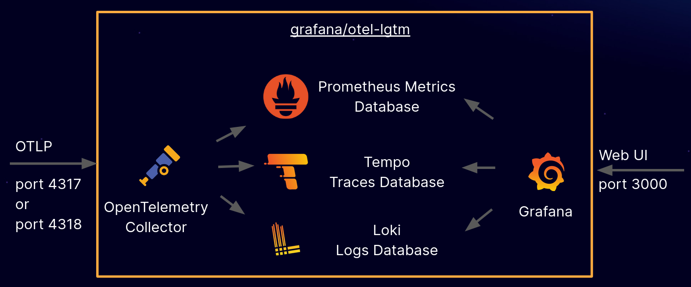

We have explored the principles of observability and the fundamental role of OpenTelemetry as a unifying standard for telemetry. OpenTelemetry provides us with the tools to **generate and collect** high-quality data (metrics, logs and traces) in an agnostic and consistent format. But once these valuable signals have been collected, where are they stored, queried and, most importantly, displayed in a meaningful way?

This is where the **LGTM** stack comes into play, a powerful combination of open source tools that form a complete and integrated observability solution, developed and primarily supported by **Grafana Labs**.

LGTM is an acronym that stands for:

  * **L**oki (for **L**ogs)
  * **G**rafana (for **G**raphics and Visualization)
  * **T**empo (for **T**races)
  * **M**imir (for **M**etrics)

This stack is designed to work in perfect synergy with OpenTelemetry, providing the scalable and resilient backends needed to store and query the enormous volume of telemetry data generated by modern distributed systems. Its cloud-native architecture makes it ideal for dynamic environments like Kubernetes, offering a holistic view of application health and performance.

-----

## The Essential Components of the LGTM Stack

Each component of LGTM is specialized in managing a specific type of telemetry signal, but they all converge in Grafana, which acts as the unified interface for analysis and correlation.

### 1\. Loki: Aggregated, Scalable and Cost-Effective Logging

**[Loki](https://grafana.com/oss/loki/)** is a log aggregation system inspired by Prometheus's design, but optimized for logs. Its distinctive philosophy is "Don't index the content of logs, but only the labels." This approach makes it extremely efficient in terms of storage and costs, especially for high volumes of data.

  * **Operational Principle**: Instead of indexing every word or field within logs (as traditional ELK/Splunk systems do), Loki focuses on indexing only the **metadata** (labels) associated with logs. Raw logs are compressed and stored in low-cost object storage (e.g. S3, GCS) or local file systems.
  * **Data Flow**: Logs are sent to Loki along with a set of labels (e.g. `app=checkout-service`, `env=prod`, `cluster=us-east-1`). When a query is executed, Loki first uses the labels to quickly filter the relevant log streams, and only then retrieves the raw log content to apply further textual filters or transformations.
  * **Query Language**: **LogQL**. Similar to PromQL, LogQL allows querying logs based on labels and applying parsing, filtering and aggregation functions on the log content.
      * Example: `{namespace="production", app="web-app"} |= "error" != "connection refused"` (search for errors in production web app logs, excluding "connection refused" ones).
      * Aggregation example: `sum(rate({app="my-service"} |= "login failed" [1m])) by (username)` (calculate the frequency of failed logins per username in the last minute).
  * **OpenTelemetry Integration**: The **OpenTelemetry Collector**, through the Loki exporter or a `Grafana Agent` (which includes Promtail functionality), is the ideal bridge for sending logs generated by OpenTelemetry-instrumented applications to Loki. It's crucial that logs include attributes like `trace_id` and `span_id` (through the [OpenTelemetry Semantic Conventions for logs](https://www.google.com/search?q=https://opentelemetry.io/docs/specs/semconv/general/trace-context/)) for easy correlation with Tempo.
  * **Key Benefits**: **Cost-effectiveness** (allows handling much larger volumes of logs at lower costs), **horizontal scalability** and **simplified operability**.

### 2\. Tempo: High-Scalability Tracing for Distributed Traces

**[Tempo](https://grafana.com/oss/tempo/)** is Grafana Labs' distributed tracing backend, specifically designed to store and query an extremely high volume of traces with maximum efficiency and cost-effectiveness. Its innovation lies in being a "zero-index" (trace ID-indexed) **trace store**.

  * **Operational Principle**: Unlike traditional solutions that index every attribute within each span (generating storage overhead and complexity), Tempo indexes only the `TraceID` and stores the complete trace in low-cost object storage (e.g. S3, GCS, or others).
  * **Data Flow**: Traces (in OTLP format) are sent to the **OpenTelemetry Collector**, which in turn forwards them to Tempo. When searching for a specific trace, you provide the `TraceID` and Tempo retrieves the complete trace directly from storage.
  * **Query Language**: Primarily search by `TraceID`. With the introduction of **TraceQL**, Tempo supports more advanced queries based on attributes, but its real power emerges when correlated with LogQL (from Loki) or PromQL (from Mimir) through Grafana. Search by TraceID is the most efficient and cost-effective mode, and for this reason cross-correlation is fundamental.
  * **OpenTelemetry Integration**: Tempo is natively compatible with OpenTelemetry. The **OpenTelemetry Collector**, configured with the OTLP exporter, is the preferred mechanism for sending traces directly to Tempo. This is the smoothest integration, given that OpenTelemetry generates traces in the standard format desired by Tempo.
  * **Key Benefits**: **Cost-effectiveness** (drastic reduction in storage costs for traces), **practically unlimited scalability** and **operational simplicity** thanks to the architecture without complex indexes.

### 3\. Mimir: Unlimited Scalability for Metrics

**[Mimir](https://grafana.com/oss/mimir/)** is Grafana Labs' distributed metrics backend, designed to be a multi-tenant, highly scalable and long-term solution for Prometheus-style metrics. It is the answer to the need to handle petabytes of time series, overcoming the limitations of a single Prometheus server.

  * **Operational Principle**: Mimir is a distributed time series database that accepts metrics in Prometheus format (via Remote Write) or, more modernly, directly OTLP. Internally, it is a resilient and horizontally scalable cluster, using object storage for long-term data durability and various caching layers for fast queries.
  * **Data Flow**: Metrics generated by OpenTelemetry-instrumented applications are sent to the **OpenTelemetry Collector**. The Collector exports them to Mimir using the `prometheusremotewrite` exporter or directly the OTLP exporter, making Mimir the unified backend for all distributed system metrics.
  * **Query Language**: **PromQL**. Mimir is 100% compatible with PromQL, the standard query language for Prometheus. This means that any existing Prometheus dashboard or alerting rule will work directly with Mimir, ensuring a seamless transition for Prometheus users.
  * **OpenTelemetry Integration**: The OpenTelemetry Collector is the primary ingestion point for Mimir. Its ability to receive OTLP metrics and then forward them to Mimir in a compatible format (OTLP or Prometheus Remote Write) ensures full interoperability.
  * **Key Benefits**: **Unlimited horizontal scalability** (handles enormous workloads), **resilience** (high availability and fault tolerance), **multi-tenancy** (secure isolation for shared environments) and **reliable long-term storage**.

### 4\. Grafana: The Unified Dashboard for Correlation

**[Grafana](https://grafana.com/oss/)** is the premiere open-source visualization and analysis platform, and it is the central component of LGTM that unites all the pieces of the observability puzzle. It works as a "dashboard" universal, allowing the creation of interactive and customizable dashboards from various data sources.

  * **Role in the LGTM Stack**: Grafana connects to Loki, Mimir (or Prometheus) and Tempo as **data source**, providing a unified user interface for querying and visualizing logs, metrics and traces.
  * **Key Features**:
      * **Advanced Dashboarding**: Creation of dashboards with a wide range of visualizations (line charts, bars, tables, indicators, etc.).
      * **Intuitive Query Editor**: Dedicated interfaces for LogQL (Loki), PromQL (Mimir/Prometheus) and TraceQL (Tempo), facilitating the writing of complex queries.
      * **Alerting**: Configuration of sophisticated alerting rules based on displayed data, with notifications to various channels (Slack, PagerDuty, email).
      * **Exploration and Correlation**: The most powerful feature of Grafana in the LGTM stack is its ability to correlate the three telemetry signals. From the graph of an anomalous metric, it's possible to drill down directly into correlated logs or traces (e.g. clicking on a latency spike on a graph can bring you to traces of slow requests or error logs from that period). This is vital for *root cause analysis* in distributed systems.
  * **OpenTelemetry Integration**: Grafana does not interact directly with OpenTelemetry for data collection. Its role is to consume the data that OpenTelemetry has contributed to generate and that has been stored in the LGTM backends, providing the visualization and analysis platform.
  * **Key Benefits**: **Centralization** (a single UI for all telemetry data), **flexibility** (support for countless data sources), **powerful correlation** (native integration between metrics, logs and traces) and a **vast community** that provides pre-built dashboards and plugins.

-----

## LGTM and OpenTelemetry: The Perfect Synergy for Distributed Systems

The true strength of the LGTM stack emerges when combined with the standardization offered by OpenTelemetry. OpenTelemetry handles **agnostic instrumentation** and **standardized generation** of telemetry data, while LGTM provides the **scalable and integrated backends** for storing, querying and visualizing this data. Together, they form a complete and highly effective end-to-end observability solution.

**Data Flow in the Integrated Stack:**

1.  **Applications/Services**: Your distributed services are instrumented with **OpenTelemetry SDKs** (or through auto-instrumentation). They generate **Metrics**, **Logs** and **Traces** in an agnostic and standardized format (OTLP).
2.  **OpenTelemetry Collector**: This data is sent to the **OpenTelemetry Collector**. The Collector acts as the crucial intermediate hub:
      * Receives data in OTLP from all applications.
      * Applies processors (e.g. batching, filtering, enriching with resource attributes, sampling).
      * Routes data to appropriate backends:
          * **Traces (OTLP)** $\\rightarrow$ **Tempo**
          * **Metrics (OTLP or Prometheus Remote Write)** $\\rightarrow$ **Mimir**
          * **Logs (via Loki exporter or Grafana Agent)** $\\rightarrow$ **Loki**
3.  **LGTM Backends**:
      * **Tempo** stores the traces.
      * **Mimir** stores the metrics.
      * **Loki** stores the logs.
4.  **Grafana**: **Grafana** connects to Tempo, Mimir and Loki as data source. Users can build custom dashboards, run queries on individual data types and, crucially, **correlate the data** with each other, providing a holistic and contextualized view of the system.

This integrated workflow is extremely powerful and drastically reduces the time to identify and resolve the root cause of problems (MTTR) in complex distributed systems. From detecting an anomaly in metrics, drilling down into the correlated trace, and finally analyzing specific logs, teams can quickly navigate between signals to understand system behavior.

## Deployment and Operational Considerations

Deploying the LGTM stack in a production environment requires planning, but the benefits in terms of observability are significant.

### Typical Architecture in Kubernetes

In a Kubernetes environment, the LGTM stack and OpenTelemetry are often deployed as follows:

  * **OpenTelemetry SDKs**: Integrated directly into application images (as libraries or auto-instrumentation).
  * **OpenTelemetry Collector**:
      * As **Sidecar** for each application pod: collects pod-specific telemetry with minimal network overhead and sends it to a central Collector Gateway.
      * As **DaemonSet** on each node: collects node-level metrics and logs from the node (e.g. `kubelet`, `/var/log`).
      * As **Deployment (Gateway)**: A centralized instance that receives data from all sidecar/daemonset, applies processors (e.g. tail-based sampling, complex transformations) and routes data to Loki, Tempo and Mimir.
  * **Loki, Tempo, Mimir**: Deployed as scalable and resilient clusters. They often use S3-compatible storage (e.g. MinIO, AWS S3, Google Cloud Storage) for their durability and cost-effectiveness.
  * **Grafana**: Deployed as a central instance that users access through a browser.

### Challenges and Best Practices

  * **Scalability**: Each LGTM component is designed to scale horizontally. It's crucial to properly size resources (CPU, RAM, storage) based on the expected volume of telemetry.
  * **Storage Costs**: Although Loki and Tempo are inherently cost-effective, the overall data volume can still be high. Aggressive retention policies and intelligent sampling (in the Collector) are fundamental for managing costs.
  * **Configuration Management**: Use Infrastructure as Code (IaC) tools like Helm, Terraform or Pulumi to manage the deployment and configuration of all components, ensuring reproducibility.
  * **Internal Monitoring**: It's essential to monitor the health and performance of each LGTM component and the Collector itself. All expose Prometheus metrics for their internal observability.
  * **Updates**: Keep components updated to benefit from the latest optimizations, features and security patches.

-----

## Conclusions: LGTM as the Foundation of Modern Observability

The LGTM stack, in perfect symbiosis with OpenTelemetry, is not just a collection of tools; it is a **complete, scalable, cost-effective and deeply integrated observability platform**. It represents a fundamental pillar for companies operating in **cloud-native** environments and with **microservices** architectures, where understanding system behavior has become a crucial challenge.

Adopting LGTM means investing in an observability strategy that not only allows you to "see" what's happening in your systems, but to "understand why", accelerating debugging, improving reliability and driving innovation. It demonstrates how open-source standards and targeted engineering can address the intrinsic complexities of modern distributed systems, providing developers and operators with the tools needed to master them and ensure the stability and performance of their applications.
