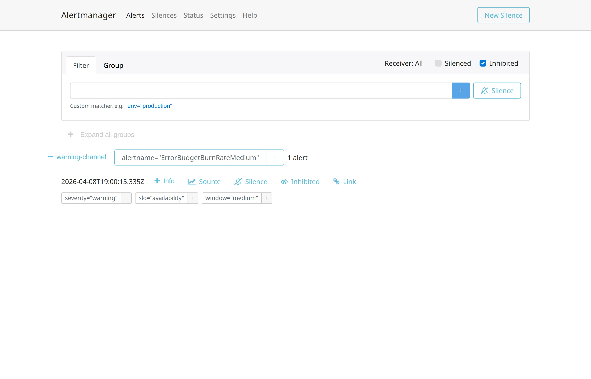

## Il Gap tra la Regola `firing` e l'Umano che Deve Agire

I due articoli precedenti della serie si sono fermati al momento in cui una regola Prometheus passa in stato `firing`. Il primo ha mostrato come anticipare la saturazione di una risorsa fisica con `predict_linear`, il secondo come alertare sul ritmo di consumo dell'error budget con burn-rate multi-window. In entrambi il traguardo implicito era la stessa riga di alertmanager: l'espressione PromQL che diventa vera. Ma la regola che scatta è solo l'inizio del percorso.

L'assunzione nascosta nella maggior parte dei repo di alerting è che il tratto che va dalla regola alla persona che deve agire sia un dettaglio di configurazione, da risolvere con un webhook Slack e poco altro. La conseguenza è osservabile in produzione: alert precisi e ben scritti che finiscono tutti nello stesso canale, senza severity differenziata, senza runbook, con più notifiche per lo stesso incidente.

Il problema non è la PromQL, è che manca un contratto con chi riceve il messaggio.

Tre domande a cui un repo di alerting maturo deve poter rispondere, e che questo articolo prova a coprire con gli strumenti nativi di Alertmanager: chi riceve ciascun alert e con quale urgenza, cosa succede quando due regole correlate scattano insieme, cosa trova chi apre il messaggio di notifica.


## Severity come Contratto, non come Etichetta

La label `severity` nelle regole Prometheus viene spesso trattata come un'annotazione descrittiva, un tag per sapere "quanto è grave" leggendo la regola. In realtà ha una funzione operativa precisa: è l'input del routing tree di Alertmanager. È il contratto tra chi scrive la regola e chi configura il routing, e come ogni contratto vale solo se entrambe le parti lo rispettano.

Nel demo della serie le due regole burn-rate hanno severity diverse: `ErrorBudgetBurnRateFast` è `critical`, `ErrorBudgetBurnRateMedium` è `warning`. Il routing tree di Alertmanager fa match su quella label e instrada ciascun alert verso un receiver diverso:

```yaml
# alertmanager/config.yml
route:
  receiver: warning-channel
  group_by: [alertname]
  group_wait: 10s
  group_interval: 30s
  repeat_interval: 5m
  routes:
    - matchers:
        - severity="critical"
      receiver: critical-channel

receivers:
  - name: critical-channel
    webhook_configs:
      - url: http://mock-receiver:8080/critical
        send_resolved: true
  - name: warning-channel
    webhook_configs:
      - url: http://mock-receiver:8080/warning
        send_resolved: true
```

La route di default è `warning-channel`; le route figlie intercettano gli alert con `severity="critical"` e li reindirizzano a `critical-channel`. È una strategia semplice, ma è il mattone base: qualsiasi regola instradata per severity eredita automaticamente il comportamento del canale corrispondente (rate limiting, grouping, eventuali integrazioni verso PagerDuty o Slack) senza dover essere modificata.

Avviato lo stack, la UI di Alertmanager mostra ciascun alert nel gruppo del receiver corretto. L'effetto è visibile direttamente nella pagina Alerts:


Il vantaggio concreto è che il mapping severity-receiver diventa leggibile in un solo file, non distribuito tra le regole. Quando serve cambiare il canale di destinazione degli alert critici, si tocca solo l'`alertmanager.yml`, non le decine di regole che usano `severity: critical`.

## Un Incidente, una Notifica: le Inhibit Rules

Il problema successivo emerge quando due regole correlate scattano insieme. Nel demo, il burn-rate fast e il burn-rate medium sono progettati apposta per attivarsi in sequenza ravvicinata su condizioni di errore elevato: il fast cattura il bruciare rapido su finestra breve, il medium conferma che il pattern è sostenuto. Entrambi descrivono lo stesso incidente visto a due velocità diverse. Senza inibizione, Alertmanager invia due notifiche per lo stesso evento: una al canale critical e una al warning.

Le `inhibit_rules` risolvono questa duplicazione a livello di Alertmanager, senza toccare le regole Prometheus:

```yaml
# alertmanager/config.yml
inhibit_rules:
  - source_matchers:
      - alertname="ErrorBudgetBurnRateFast"
    target_matchers:
      - alertname="ErrorBudgetBurnRateMedium"
    equal: [slo]
```

La regola dice: quando un alert che matcha `source_matchers` è firing, sopprimi ogni alert che matcha `target_matchers` purché abbiano lo stesso valore per le label elencate in `equal`. Nel demo entrambe le regole portano la label `slo: availability`, quindi l'inibizione è mirata a quel singolo SLO. Se in futuro si aggiungessero regole burn-rate per altri SLO (`slo: latency`, `slo: throughput`), il matching su `equal: [slo]` garantirebbe che l'inibizione resti isolata allo SLO in cui il fast è firing, senza mettere a tacere per errore un medium di un servizio diverso.

La vista Alerts con il filtro `Inhibited` attivo mostra il comportamento: il medium è presente ma in stato `suppressed`, e l'icona `Inhibited` accanto alle azioni conferma che Alertmanager sta applicando la regola.



L'API v2 lo rende esplicito nel payload: l'alert inibito riporta `status.state: "suppressed"` e `status.inhibitedBy` con il fingerprint dell'alert sorgente. È un dettaglio utile per debug: se un alert che ci si aspetta non arriva al receiver, la prima verifica è se qualcun altro lo sta inibendo.

## Runbook come Parte Obbligatoria della Regola

Il terzo mattone è il più ignorato: cosa trova chi apre la notifica. Alertmanager non inventa niente, propaga quello che la regola Prometheus dichiara nel campo `annotations`. Se la regola non contiene `runbook_url`, il payload che arriva al canale non lo avrà.

Nel demo entrambe le regole dichiarano l'annotation:

```yaml
# prometheus/rules.yml (estratto)
- alert: ErrorBudgetBurnRateFast
  expr: ...
  for: 30s
  labels:
    severity: critical
    slo: availability
    window: fast
  annotations:
    summary: "Error budget burning 14.4x faster than target"
    runbook_url: "https://runbooks.example.com/slo-burn-rate-fast"
```

Il receiver mock riceve questo payload JSON da Alertmanager, e il `runbook_url` è presente sia nelle `annotations` del singolo alert sia nelle `commonAnnotations` del gruppo:

```json
[CRITICAL] {
  "receiver": "critical-channel",
  "status": "firing",
  "alerts": [{
    "labels": {
      "alertname": "ErrorBudgetBurnRateFast",
      "severity": "critical",
      "slo": "availability",
      "window": "fast"
    },
    "annotations": {
      "summary": "Error budget burning 14.4x faster than target",
      "runbook_url": "https://runbooks.example.com/slo-burn-rate-fast"
    }
  }],
  "commonAnnotations": {
    "runbook_url": "https://runbooks.example.com/slo-burn-rate-fast"
  },
  "groupKey": "{}/{severity=\"critical\"}:{alertname=\"ErrorBudgetBurnRateFast\"}"
}
```

La posizione nella struttura conta: un template Slack o un'integrazione PagerDuty possono estrarre `commonAnnotations.runbook_url` per renderlo cliccabile nel messaggio senza dover decidere quale alert del gruppo interrogare. È il caso tipico in cui `commonAnnotations` è la chiave giusta, `alerts[0].annotations` è un fallback.

La tesi operativa è semplice: `runbook_url` dovrebbe essere trattato come un campo obbligatorio della definizione della regola, al pari di `summary`, non come un extra facoltativo. Va detto che non è un campo formalizzato nella documentazione Prometheus core: è una convenzione dell'ecosistema, adottata da kube-prometheus e dal Prometheus Operator, e come tale non c'è nulla che forzi la sua presenza. È proprio per questo che conviene imporla per policy interna. Regola senza runbook, regola incompleta. Vale anche la nota meno ovvia: è meglio puntare a una pagina runbook minimale che esiste (anche solo tre righe con "controlla X, chiedi a Y, contatto Z") che a un link 404. Il link rotto erode la fiducia nell'intero sistema di notifica, e l'oncall smette di seguirli.

## Chiusura della Serie

La serie `saturation-alerting` chiude con tre articoli che coprono livelli diversi della stessa domanda, "quando va detto che qualcosa non funziona":

- **Forecast di saturation fisica** (articolo #1): anticipare l'esaurimento di una risorsa misurabile e monotonicamente consumata, con `predict_linear` come strumento.
- **Burn-rate multi-window** (articolo #2): spostare il monitoring dalla risorsa all'impatto utente, alertando sul ritmo di consumo dell'error budget invece che sulla soglia statica.
- **Routing, severity, runbook** (questo articolo): chiudere il cerchio sul lato operativo, perché un'espressione PromQL elegante che raggiunge un canale sbagliato o un destinatario sprovvisto di contesto produce lo stesso effetto pratico di non avere alert.

Il filo comune è che alertare bene non è una proprietà di una singola query. È una proprietà del sistema nel suo insieme: dalla metrica alla regola, dalla regola al routing, dal routing al payload, dal payload alla persona. I tre mattoni di questo articolo (severity contract, inhibit rules, runbook_url) coprono il 70% del gap tra "la regola scatta" e "qualcuno risolve il problema", con costo di implementazione basso e ritorno molto concreto. Il restante 30% (testing delle regole, templating avanzato dei messaggi, gestione delle silenze, cluster Alertmanager in alta affidabilità) è materiale per approfondimenti successivi, ma niente di tutto ciò ha senso se i tre mattoni di base non sono presenti.

## Riferimenti

- [Alertmanager docs - Configuration](https://prometheus.io/docs/alerting/latest/configuration/)
- [Alertmanager docs - Webhook receiver](https://prometheus.io/docs/alerting/latest/configuration/#webhook_config)
- [SRE Workbook cap. 5 - Alerting on SLOs](https://sre.google/workbook/alerting-on-slos/)
- Codice della demo: [`burn-rate-demo`](https://github.com/monte97/burn-rate-demo) (GitHub)
