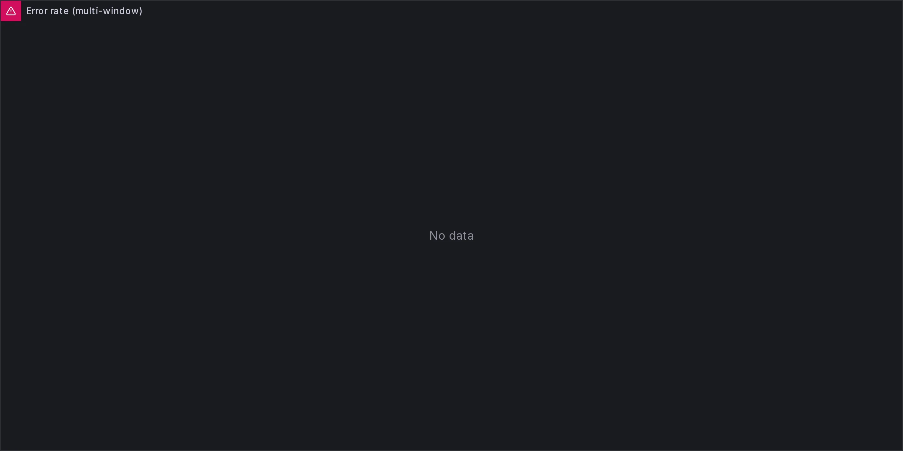
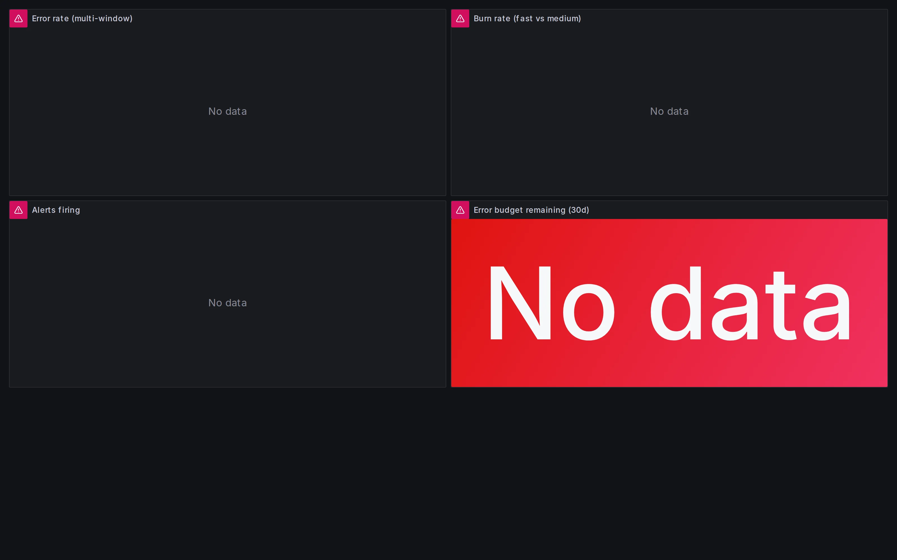
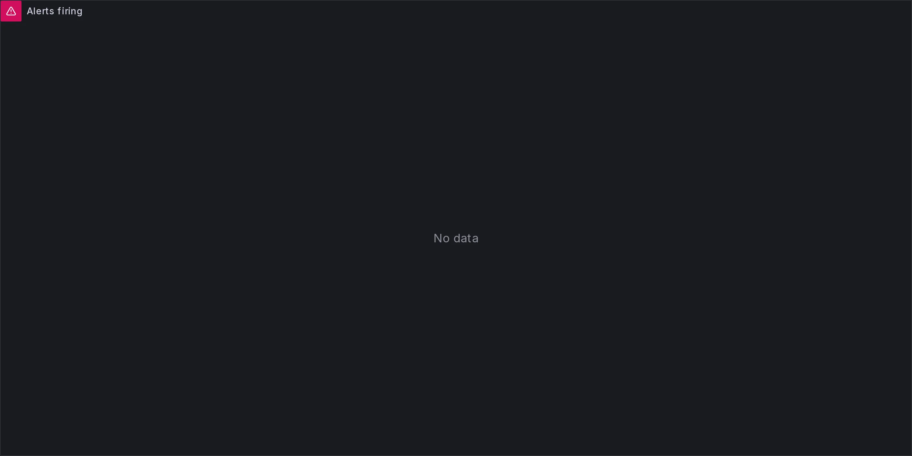

## The problem: the availability alert that fires too late

Anyone who has configured a classic alert of the form `error_rate > 1%` has probably already experienced the two mirror-image failures of that rule. Either it fires on every transient spike of errors and becomes noise the oncall learns to ignore, or it is so permissive that by the time it fires the week's error budget is already burnt and the service has been out of its SLO for hours. Both outcomes are consequences of the same conceptual error: alerting on the instantaneous metric instead of on the **budget consumed over time**.

The previous article in the series showed how to anticipate the saturation of a physical resource (disk, heap, connection pool) using `predict_linear` and the Golden Signals definition of saturation. Here the question changes level of abstraction: no longer "when will the hardware resource run out" but "how fast are we burning the service's error budget as seen by the user". The anticipation logic is the same, but the subject of the monitoring moves from the resource to the user impact, and that has very concrete operational consequences for how the alerts have to be formulated.

## SLO, SLI, error budget: the operational definitions

Before talking about alerting, three operational definitions need fixing — operational, not philosophical. There are two sources: the **Google SRE Book, chapter 4 "Service Level Objectives"** for SLO and SLI, and the **SRE Workbook, chapter 5 "Alerting on SLOs"** for the burn-rate part that comes after.

An **SLI (Service Level Indicator)** is a metric measuring the quality of the service as the user sees it, not as the infrastructure sees it. The canonical form the Workbook recommends is a ratio: `good_events / valid_events`. Concrete examples: the proportion of HTTP requests returning a 2xx or 3xx status over a five-minute window, or the proportion of requests answering within a p99 latency of 300ms. What matters is that the SLI is observable end-to-end from the user's point of view, not measured on an internal component of the system.

An **SLO (Service Level Objective)** is the quantitative target for the SLI over a calendar time window. Example: "99.9% of HTTP requests to `/api/v1/*` must return a 2xx or 3xx status over a rolling thirty-day window". Two numbers and a window, nothing more: the target on the SLI and the reference period.

The **error budget** is simply the complement of the SLO, expressed as the amount of error tolerated in the same window. If the SLO is 99.9% over thirty days, the error budget is 0.1%, which translated into degraded service time becomes about 43.2 minutes in a month. It is a **finite quantity that renews at the start of every period**, and it can be burnt continuously (a sustained 0.1% error) or in a concentrated way (five minutes at 100% error, then nothing).

The SRE Book fixes the definition operationally: the error budget is *"a clear, objective metric that determines how unreliable the service is allowed to be"* within a single quarter.

> Source: sre.google/sre-book/embracing-risk/

The operational takeaway of this section is a single one, and it is the hinge for everything that follows: **the SLO is a contract with the user expressed in terms of a consumable budget**. Reasonable alerts should answer the question "are we consuming the budget at a rate sustainable for the current window?", not the question "has the instantaneous metric crossed an arbitrary threshold at this precise moment?". These are two different questions, and they produce two different kinds of alert with very different error profiles.

## Why the static threshold alert is not enough

The operational question becomes: why is an alert of the form `error_rate[5m] > X` not sufficient, whatever `X` is? The answer is that there are two mirror-image failure modes, each emerging when you pick `X` from one end of the spectrum or the other, and no intermediate value of `X` really solves both.

The first failure concerns aggressive thresholds. A rule like `error_rate[5m] > 0.001` (0.1%, exactly the SLO limit) fires on every transient burst of errors. A batch job failing ten requests out of a thousand in thirty seconds fires the alert, the oncall gets paged, investigates, finds nothing systemic, and the alert gets silenced quickly. After a few weeks of this pattern the alert is progressively disregarded by the team and ignored even when it would be signalling something real. Alert fatigue is guaranteed, with the consequence of having a noisy signalling channel that no longer communicates useful information.

The second failure is the opposite, and it is the more insidious one, because it stays invisible until it is too late. A rule like `error_rate[5m] > 0.01` (1%, ten times the SLO) is far more permissive and almost never fires, except when the service is visibly broken and somebody else has already noticed by other means. Meanwhile, a sustained 0.5% error for an hour has already burnt about 30% of the monthly error budget, and nobody knows until the end-of-month review arrives and the graph shows the service did not meet its SLO.

The key point is that the static threshold answers the wrong question. A "fixed" threshold presumes there is a value of error rate above which something is "broken", but that assumption ignores the temporal dimension of the error budget. The right question, the one the SRE Workbook formalises, is very different: **at what rate are we consuming the budget compared to the rate sustainable for the whole SLO window?**

From here comes the concept of the **burn rate**, which is a pure number with no unit of measure. It is defined as the ratio between the current rate of budget consumption and the sustainable rate that would make it last exactly for the whole SLO window. For a 99.9% SLO over thirty days, the reference burn rate of 1× corresponds to a constant error rate of 0.1%, which burns the entire budget in exactly thirty days (the maximum rate sustainable while just meeting the SLO).

A burn rate of 2× corresponds to an error rate of 0.2%, which burns the entire budget in fifteen days. A burn rate of 14.4× corresponds to an error rate of 1.44%, which burns 2% of the budget in a single hour. Table 5-2 of the SRE Workbook reports these canonical values for different detection horizons.

Reasoning in burn rate instead of absolute error rate makes the number automatically comparable across services with different SLOs: 2× always means "we are burning twice what is sustainable", regardless of whether the SLO is 99.9% or 99.95%. And above all it becomes the basis for alerts that finally answer the right question.

## Multi-window multi-burn-rate: the Workbook's solution

Burn-rate alerting was formalised by Google in the **2018 SRE Workbook, chapter 5 "Alerting on SLOs"**, as an explicit evolution of the alerting techniques in the original SRE Book. The second part of the chapter introduces the technique of **multi-window multi-burn-rate alerts** to solve two distinct problems at once that single-window alerts do not handle well: the **detection time** (how quickly an alert fires when the problem starts) and the **reset time** (how quickly it resets once the problem is mitigated).

The mechanism rests on three combined ingredients:

1. You pick a pair of time windows: a **long window** serving for stability (for example 1h) and a **short window** serving for reset responsiveness (for example 5m).
2. The alert fires only if **both** windows are above the burn rate threshold. It is a logical AND, not an OR.
3. This conjunction solves the flapping: if a burst dies out in a few minutes, the short window drops back below threshold almost immediately and the alert resets quickly, while the long window prevents minor fluctuations of the short window from firing the alert in the first place.

The operational formula for turning a burn rate threshold into an error ratio threshold is simple:

> `burn_rate > X  ⟺  error_ratio > X * (1 - SLO)`

Concrete example for a 99.9% SLO and a burn rate threshold of 14.4×: the threshold on the error ratio becomes `14.4 * 0.001 = 0.0144`, meaning an error rate of 1.44%. Above this value on both windows, the alert fires.

Translated into Prometheus, the first useful thing is to define two **recording rules** computing the SLI over the two windows of interest, so that the alerting query is then lightweight:

```yaml
# Recording rules for the SLI over multiple windows
- record: job:slo_errors:ratio_rate5m
  expr: |
    sum(rate(http_requests_total{status=~"5.."}[5m]))
    /
    sum(rate(http_requests_total[5m]))

- record: job:slo_errors:ratio_rate1h
  expr: |
    sum(rate(http_requests_total{status=~"5.."}[1h]))
    /
    sum(rate(http_requests_total[1h]))
```

Recording rules are essential for two reasons. The first is performance: computing `rate(http_requests_total[1h])` at every alert evaluation (every fifteen or thirty seconds) is far more expensive than pre-computing it once and reading it. The second is reusability: the same value `job:slo_errors:ratio_rate1h` is used by several alerts (fast burn, medium burn) and also by Grafana dashboards, so centralising the computation reduces the chance of inconsistencies between similar rules.

On top of the recording rules you build the `ErrorBudgetBurnRateFast` alert, which implements exactly the AND conjunction between short and long window:

```yaml
# Fast burn alert: 5m + 1h window, threshold 14.4×
- alert: ErrorBudgetBurnRateFast
  expr: |
    job:slo_errors:ratio_rate5m > (14.4 * 0.001)
    and
    job:slo_errors:ratio_rate1h > (14.4 * 0.001)
  for: 2m
  labels:
    severity: critical
    slo: availability
  annotations:
    summary: "Error budget fast burn rate (14.4x) on availability"
    description: "The service is burning the error budget at over 14.4x the sustainable rate. At this rate, 2% of the monthly budget is burnt in one hour."
```

The `for: 2m` is an extra buffer filtering micro-oscillations on the edge of the threshold. The `severity: critical` label is the hook for routing in Alertmanager: the fast burn goes to PagerDuty, not to a Slack channel. The rest of the section is the generalisation of this scheme to the other window pairs.

## The three canonical pairs: table 5-8 row by row

The SRE Workbook, in the "Multiwindow, Multi-Burn-Rate Alerts" section of chapter 5, does not stop at a single pair of windows. It proposes **three canonical pairs** for monthly SLOs, each with a specific operational vocation, and these three pairs are to be installed together in production, not chosen one against the other. Table 5-8 of the Workbook ("Recommended time windows and burn rates for alerts") is the reference source, reconstructed below with the relevant columns.

> **A note on terminology**: the labels "fast burn", "medium burn", "slow burn" do not appear literally in the Workbook, which speaks only of burn rate + severity (`Page` or `Ticket`). They are conventions widespread in the community (Sloth, grafana-mixins, public SRE posts) that attach an operational name to each row of the table. They are used here in the same sense.

| Severity | Long window | Short window | Burn rate threshold | Budget consumed at firing | Reset time | Operational vocation |
|---|---|---|---|---|---|---|
| **Critical (fast burn)** | 1h | 5m | 14.4× | 2% of the monthly budget | 5 min | Page the oncall, incident in progress |
| **Critical (medium burn)** | 6h | 30m | 6× | 5% of the monthly budget | 30 min | Page the oncall, sustained problem |
| **Warning (slow burn)** | 3d | 6h | 1× | 10% of the monthly budget | 6h | Ticket for investigation, wakes nobody |

It is worth taking the table apart row by row, because the numbers in the middle columns are not arbitrary: they come from a precise calculation.

The formula linking burn rate, window and budget consumed at firing is:

> `budget_consumed = burn_rate * window / SLO_window`

Applying it to the **fast burn** (burn rate 14.4×, long window 1h, monthly SLO reference window = 720h): `14.4 * 1 / 720 = 0.02`, meaning 2% of the budget consumed at the moment the alert fires. For the **medium burn** (6×, 6h over 720h): `6 * 6 / 720 = 0.05`, 5% of the budget. For the **slow burn** (1×, 3d = 72h over 720h): `1 * 72 / 720 = 0.1`, 10% of the budget. These three numbers (2%, 5%, 10%) are the cost in budget you accept paying before the corresponding alert fires: less is better for detection, but lower also implies more noise from transient bursts.

The **reset time** is determined entirely by the short window, not by the long one. When the problem is mitigated, the long window takes hours to drop back below threshold because it still holds the memory of the incident, but the AND conjunction requires the short window to be above threshold too, and that one empties quickly: five minutes for the fast burn, thirty minutes for the medium burn, six hours for the slow burn. This is exactly the problem multi-window solves compared to single-window: with a long window alone, the alert would stay firing hours after mitigation, and the oncall would keep receiving pages for an incident already closed.

The **operational vocation** of each row is the least technical and most important point to keep in mind. The fast burn fires only if something serious and immediate is happening: it is the right channel for waking the oncall at night, because 2% of the budget in an hour is a rate that, if sustained, would burn everything in two days. The medium burn catches the less violent but more persistent problems, typically sustained degradations the fast burn would not see because they are below its 14.4× burn rate. The slow burn is different in nature: its 1× burn rate corresponds to the maximum sustainable rate, so it fires when the service is meeting the SLO right at the limit, without ever exceeding it sharply, and a human should understand why before the safety margin runs out. This is investigation work, not incident response, and it goes on a daytime channel (ticket, team Slack) without waking anybody.

The key insight, which the Workbook repeats explicitly, is that the three pairs are **complementary, not alternatives**. You install all three in production, and the routing in Alertmanager distinguishes by severity: `severity: critical` goes to PagerDuty with a 24/7 policy, `severity: warning` goes to Slack or email during business hours. The first common mistake when adopting burn-rate alerting is to copy-paste only the fast burn and leave the other two behind: that loses coverage on sustained low-intensity problems (medium) and on the silent erosion of the safety margin (slow), which are exactly the cases where the static threshold was failing.

The exact source for the values in this table is:

> Google SRE Workbook, ch. 5 "Alerting on SLOs", section "Multiwindow, Multi-Burn-Rate Alerts" and table 5-8.
>
> Source: sre.google/workbook/alerting-on-slos/

Seeing these three pairs work together on a real service makes their behaviour during an incident clearer than any table. The next section shows a minimal Docker Compose demo with Prometheus and Grafana simulating an HTTP service with an injected error, loads the three pairs as alert rules, and lets you observe which fires first, when each resets, and how severity routing sends them to different channels.

## The demo: both alerts fire at 37 seconds

The [burn-rate-demo](https://github.com/monte97/burn-rate-demo) repository contains a minimal Docker Compose stack letting you observe the canonical pairs in under five minutes of wall-clock time. There are four services: a fake HTTP service (`fake-http-service`, FastAPI + `prometheus_client`) exposing a `/` endpoint configured to return a 500 status with probability `ERROR_RATE`, a `load-generator` that `curl`s the service at a constant rate, a Prometheus with the four recording rules (`ratio_rate5m`, `ratio_rate30m`, `ratio_rate1h`, `ratio_rate6h`) and the two alerts (`ErrorBudgetBurnRateFast`, `ErrorBudgetBurnRateMedium`), and a Grafana with a provisioned dashboard visualising the rates and the firing state.

The demo's target SLO is `99.9%`, so an error budget of `0.1%`. The environment variable `ERROR_RATE: "0.50"` injected into the service is deliberately aggressive: with 50% sustained errors the rate windows cross the threshold far more quickly than in a realistic incident, and that is necessary to compress the firing times into a demo observable in a few minutes. The command to start the stack and check the rules:

```bash
git clone https://github.com/monte97/burn-rate-demo
cd burn-rate-demo
docker compose up --build -d
# Prometheus at http://localhost:9090, Grafana (anonymous admin) at http://localhost:3000
```

During a verified run, both alerts go into the `firing` state around 37 seconds after the load generator starts. The reason is that the rate is computed as a moving average over the window, and with a sustained 50% error rate from `t=0` even the longer windows (6h) quickly reflect the real average of the samples available. This behaviour is not a bug in the demo, it is a direct consequence of the fact that `rate()` in PromQL does not wait for the window to be "full" before returning a value: it computes the rate over the data it finds. In the "Error rate (multi-window)" panel the four curves 5m, 30m, 1h, 6h rise in parallel until they settle around `0.5`, far above the fast burn threshold of `0.0144` and the medium burn threshold of `0.006`.



The "Burn rate (fast vs medium)" panel divides the rate by the SLO budget (`0.001`), so the vertical scale is directly the burn rate in "×" units. The two horizontal guide lines at `14.4` and `6` make visible the moment each threshold is crossed: with `ERROR_RATE=0.50` the effective burn rate is `500×`, two orders of magnitude above the fast burn threshold, so in practice both alerts fire in the first usable evaluation window.



The "Alerts firing" panel shows the firing state as a step function: `0` when the alert is inactive, `1` when it is firing. With 50% sustained, both lines go to `1` almost simultaneously and stay there until teardown.



To observe **differentiated detection** (the fast burn firing before the medium burn) you have to lower `ERROR_RATE` to a more modest value, for example `0.03` (3% errors), and wait longer. In that regime the rate over the 5m window crosses `0.0144` before the rate over the 30m window crosses `0.006`, because the shorter window is more responsive to changes. The operational pattern to observe is: the fast burn will fire first, paging the oncall; if the incident persists long enough to saturate the longer windows too, the medium burn will fire as confirmation of the sustained regime.

To shut the stack down: `docker compose down`. No persistent volumes, everything recreatable from zero in under thirty seconds.

## What the demo does not show: the slow burn

Table 5-8 provides for **three** canonical pairs, but the demo implements only two. The slow burn (`3d + 6h`, burn rate `1×`) was left out for a very concrete reason: with a long window of three days, the recording rule `rate(http_requests_total[3d])` needs three days of real data to return a stable value. In a Docker Compose demo starting from zero there is no way to observe it in useful time, and forcing it to fire with `ERROR_RATE=0.50` would only produce a useless result (the rate saturates the window in seconds and the alert fires immediately, providing no information about "slow" behaviour).

In production the slow burn gets installed anyway, alongside the other two, with the same formula from the Workbook:

```yaml
- alert: ErrorBudgetBurnRateSlow
  expr: |
    job:slo_errors:ratio_rate6h > (1 * 0.001)
    and
    job:slo_errors:ratio_rate3d > (1 * 0.001)
  for: 15m
  labels:
    severity: warning
    slo: availability
  annotations:
    summary: "Error budget slow burn rate (1x) on availability"
    description: "The service is burning the error budget at the maximum sustainable rate. Investigate before the safety margin runs out."
```

The `for: 15m` is deliberately generous, because the slow burn is not an incident: it is a signal that the safety margin is eroding, to be investigated during working hours, not after three minutes of observation.

## Typical traps in adoption

While adopting burn-rate alerting a few mistakes come up repeatedly, and they are worth spelling out because they appear even in codebases with otherwise well-tended observability.

The first mistake is **copy-pasting only the fast burn** and forgetting medium and slow. It is the most common trap: the fast burn is pedagogically the easiest to explain, it fires first during demos, and it seems to cover the "important" incidents. But it leaves uncovered every sustained low-intensity error regime (the ones the medium burn catches) and the silent erosion of the margin (the one the slow burn catches). The Workbook's recommendation is to install **all three** pairs together, with different routing by severity, not to pick one as "good enough".

The second mistake is **computing the rate on the wrong metric**. The SLI has to measure the quality of the service from the user's point of view, not the infrastructure's. A rate computed on `http_requests_total{job="my-service"}` is fine, but a rate computed on `container_cpu_usage_seconds_total` or `nginx_upstream_errors_total` is measuring an internal component and does not reflect the user experience. If an infrastructure error is masked by client retries, the user does not see it and the burn-rate alert should not count it.

The third mistake is **getting the SLO reference window wrong** in the consumed-budget formula. Table 5-8 is built for a monthly SLO (720 hours). If the SLO is quarterly (2160 hours) or weekly (168 hours), the percentages of budget consumed at firing change and the burn rate thresholds should be rescaled proportionally. Applying the table's values to a weekly SLO without rescaling is a conceptual error leading to alerts that are far too noisy (a fast burn firing for episodes consuming 30% of the weekly budget in an hour, not 2% of the monthly one).

The fourth mistake is **using multi-window for non-SLO metrics**. Burn-rate makes sense for service quality metrics as seen by the user (availability, p99 latency, end-to-end error ratio). Applying it to physical saturation metrics (CPU, memory, disk) is a misuse: for those the right question is "when will the resource run out", and the correct tool is projection (`predict_linear`), as seen in the previous article of the series. The two techniques are complementary but answer different questions and operate on different domains.

## When to use what: a selection table

The table summarises the three alerting tools seen so far and helps work out which is appropriate in which context.

| Technique | Question it answers | When to use it | When not to use it |
|---|---|---|---|
| **Static threshold** (`error_rate > X`) | Has this metric crossed a threshold? | Never on service SLOs. Useful only for liveness/presence alarms (e.g. "the service is down", `up == 0`). | For metrics needing temporal context, like error rate or latency. |
| **Predict\_linear** (previous article) | When will this resource run out at the current rate? | Physical saturation with monotonic consumption: disk, heap, connection pool, file descriptors, K8s limits. | For non-monotonic metrics (error rate, latency), because linear extrapolation is meaningless. |
| **Multi-window burn-rate** (this article) | At what rate are we consuming the error budget? | Service SLOs as seen by the user: availability, p99 latency, freshness, data correctness. | For physical resource saturation, because there is no consumable "budget". |

The selection criterion is the operational question, not the type of metric in the strict sense. If you are asking when something will run out, the tool is `predict_linear`. If you are asking at what rate a budget is being consumed, the tool is multi-window burn-rate. If you are only asking "is it up or down", a static threshold is enough — but do not call it SLO alerting, call it what it is: a health check.

## What to install tomorrow

The minimal SLO alerting package to take into production contains, for every service with a formalised SLO, four components.

1. **Recording rules** for the SLI over four windows: `ratio_rate5m`, `ratio_rate30m`, `ratio_rate1h`, `ratio_rate6h`. The slow burn also needs `ratio_rate3d`, which Prometheus computes without trouble provided the retention is sufficient.
2. **Three alerts**: `ErrorBudgetBurnRateFast` (5m+1h @ 14.4×, severity critical), `ErrorBudgetBurnRateMedium` (30m+6h @ 6×, severity critical), `ErrorBudgetBurnRateSlow` (6h+3d @ 1×, severity warning).
3. **Routing in Alertmanager** by severity: critical → PagerDuty 24/7, warning → the team's Slack during business hours.
4. **A Grafana dashboard** with the four rates side by side and the firing state of the three pairs, so that during an incident the oncall sees at a glance which pair fired and the consumption rate of the remaining budget.

What stays out are the two questions that close the circle: who receives each of the three pairs and with what urgency, and what the person opening the notification finds. They are the subject of [severity, routing and runbook](/blog/verificare/observability/alert-routing-severity-inhibition/), the last article in the series: a well-written rule reaching the wrong channel produces the same practical effect as not having written it.

## References

- **Google SRE Book**, ch. 4 "Service Level Objectives": [sre.google/sre-book/service-level-objectives/](https://sre.google/sre-book/service-level-objectives/)
- **Google SRE Workbook**, ch. 5 "Alerting on SLOs", section "Multiwindow, Multi-Burn-Rate Alerts" and table 5-8: [sre.google/workbook/alerting-on-slos/](https://sre.google/workbook/alerting-on-slos/)
- **Prometheus recording rules**: [prometheus.io/docs/prometheus/latest/configuration/recording_rules/](https://prometheus.io/docs/prometheus/latest/configuration/recording_rules/)
- **Demo repository**: [github.com/monte97/burn-rate-demo](https://github.com/monte97/burn-rate-demo)
- **Previous article in the series**: [Prometheus predict\_linear: predictive alerts on saturation](/blog/verificare/observability/prometheus-predict-linear-alert-predittivi/)
