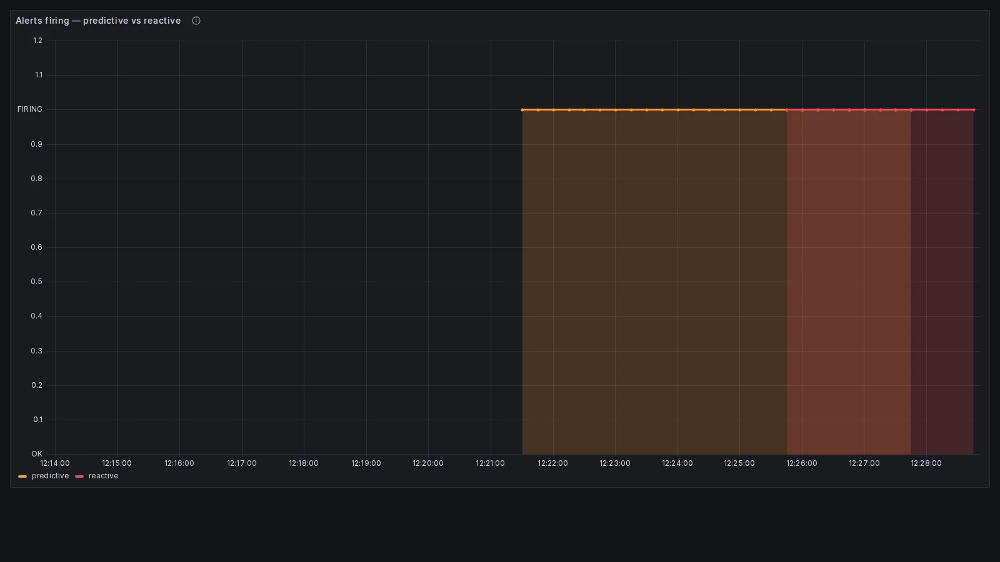

## The problem: the alert that always fires late

Anyone who has written even one alerting rule in Prometheus has probably already met something very close to this:

```promql
node_filesystem_avail_bytes / node_filesystem_size_bytes < 0.1
```

It is the rule that ends up copied from the first tutorial you find, and it populates at least half the `alerts.yml` files in the world. The problem with this rule is not the syntax, nor the value of the threshold: the problem is **the question it is answering**. The query signals that the disk is full *now*, at this precise moment. By the time it fires, occupancy is already at 90%, the logs are probably failing to write to disk and some service is already returning `ENOSPC` to its clients.

A different question, and a far more useful one operationally, would be *"will the disk fill up within a time window where it is still possible to act without waking anybody in the middle of the night?"*. That is a different question, and it needs a different alert: not an adjustment to the threshold, but a query reasoning about the **trend** instead of the **state**.

This distinction is not an academic curiosity: it has precise theoretical roots in two frameworks anybody working in observability has heard of, USE and the Golden Signals. The two frameworks use the same word and do not mean the same thing, and that is where two different kinds of alert come from.

## USE vs Golden Signals: two definitions of saturation

Let us start from the primary sources, because the details matter here. The **USE method** was formalised by **Brendan Gregg in 2012**, out of his performance engineering work on Solaris first and Linux later. The acronym stands for Utilization, Saturation, Errors, and it is meant as an operational checklist for diagnosing performance problems at the level of the hardware resource: CPU, memory, disk, network.

The **Four Golden Signals** arrive a few years later, codified in the **2016 Google SRE Book**, in chapter 6 "Monitoring Distributed Systems". The approach is different: instead of starting from the physical resource, it starts from the service seen from the outside. Latency, traffic, errors, saturation: the four dimensions an SRE should build their baseline monitoring on.

Both frameworks use the word "saturation", but they define it in subtly different ways. Gregg is explicit:

> "the degree to which the resource has extra work which it can't service, often queued"
>
> Source: brendangregg.com/usemethod.html

USE saturation is, literally, the **queue of work the resource cannot clear right now**. It is an instantaneous measure: CPU run queue length, pages in swap, packets waiting in the network buffer. The SRE book, in the chapter on the Golden Signals, uses instead a definition that explicitly includes the future dimension: *"saturation is also concerned with predictions of impending saturation"*, and it illustrates the point with a database expected to fill its hard drive in four hours.

> Source: sre.google/sre-book/monitoring-distributed-systems/

That sentence appears literally in the book, in a paragraph discussing how to instrument saturation, so this is not a creative reading of the text. The key point, too often missed in discussions about alerting, is that **USE measures saturation as current state, while the Golden Signals define it including predictions**. They are two compatible frameworks with different focus, and that difference translates directly into the kind of alert each one enables.

| | **USE (Brendan Gregg, 2012)** | **Golden Signals (Google SRE, 2016)** |
|---|---|---|
| **What it measures** | Work queued *right now* | How "full" the resource is, **including predictions** |
| **When it fires** | When the problem is degrading the service | When the trend predicts it within a horizon |
| **Action enabled** | Reactive mitigation | Planning, preventive scaling |

Keeping this distinction in mind makes it much easier to answer the question "what kind of alert do I need here?", because it forces you to say out loud whether the object of the monitoring is a state or a trend.

## Symptom-based vs cause-based: when you get paged

There is another axis to reason on, orthogonal to the previous one, which the SRE literature identifies as **symptom-based vs cause-based**. A reactive alert is typically symptom-based: it fires when the problem is manifesting, it is late but very precise, because it is not predicting anything but observing. A predictive alert is cause-based with a time horizon: it tries to anticipate the symptom by watching an indicator of cause tending towards a known limit. Proactive, but by definition estimated, and therefore exposed to false positives when the underlying model breaks. Neither approach is universally better than the other, and treating them as alternatives is a common mistake.

To pin the difference down, consider the same system with two different alerts on the same metric, the used heap of a JVM in production. The first is a classic reactive alert: "if the heap goes above 90% for more than five minutes, page the oncall". It fires at 3am, because the metric really did touch that threshold. The heap is at 92%, the JVM has entered a GC storm, the p99 latencies are already an order of magnitude worse and some endpoint is returning timeouts. The oncall wakes up, diagnoses, does an emergency restart and mitigates under pressure. The alert did its job and the service is saved, but the operational cost is very high.

The second alert is predictive, on the same metric: it uses `predict_linear` with a window of six hours of history and a horizon of two hours. It fires at 17:00, with the heap still at 60%, but the growth trend says the maximum limit will be reached within two hours. The oncall on the daytime shift opens a ticket, coordinates a planned restart during the evening maintenance window, nobody wakes up at night and no user sees a timeout.

Both alerts make sense and answer different operational needs: the predictive one does not replace the reactive one, they are complementary. The reactive one is the safety net for when the prediction fails — for example when the heap suddenly grows non-linearly because of a change in load. Understanding which alert answers which question is the point of the whole article, and without that clarity you inevitably end up writing rules that fire too often, too late, or both at once.

## predict_linear: anatomy of the function

Before moving to the examples, the function at the centre of all this is worth examining. The PromQL signature is this:

```promql
predict_linear(v range-vector, t scalar)
```

What it does, in one line: it computes a **simple linear regression** over the window `v` passed as a range-vector and projects the result `t` seconds into the future, returning the estimated value of the metric at time `now + t`. A concrete example makes it clearer:

```promql
# Estimate the value of a gauge in 4 hours based on the last hour of data
predict_linear(some_metric[1h], 4 * 3600)
```

What `predict_linear` **assumes**: that growth within the observed window is substantially linear. What it **does not** do: it does not model seasonality, it does not recognise regime changes, it does not notice exponential curves or step jumps. It is a deliberately simple model, and that simplicity is both its strength (predictable, fast, easy to reason about) and its limit.

It is worth comparing it with two nearby functions that sometimes do the same job better:

- `rate(counter[1m])`: average per-second change of a monotonically increasing counter, used to compute throughput and error rate
- `deriv(gauge[5m])`: slope of the linear regression line computed over a gauge, expressed as change per second
- `predict_linear(gauge[1h], t)`: extrapolation of the estimated value `t` seconds into the future, based on the same regression

The key thing to remember is that `predict_linear(v, t)` is conceptually equivalent to `deriv(v) * t + current_value`: nothing more sophisticated than a straight line extrapolated forwards. When the linear assumption holds — and it does for plenty of real resources, like heap growth in a healthy JVM or the occupancy of a log disk — the function does exactly what is needed. When it breaks, different strategies are needed: those are the traps further down.

## Five real PromQL examples

The filling disk is the textbook example, but it risks giving the impression that `predict_linear` is a single-purpose hammer. In reality the spectrum of real cases is much wider, and it includes scenarios where the function is perfect, scenarios where it is the wrong choice, and scenarios where the prediction is already encapsulated in the metric itself. Five examples follow that cover this spectrum, from the most reactive to the most predictive.

### 5.1 TLS certificate expiring

```promql
(probe_ssl_earliest_cert_expiry - time()) / 86400 < 7
```

This is the predictive case par excellence, but one thing is worth noticing: **there is no `predict_linear`**. The reason is that the metric `probe_ssl_earliest_cert_expiry`, exposed by the `blackbox_exporter`, is already defined as "Unix timestamp of the nearest expiry". Subtracting `time()` (the current instant) and dividing by 86400 (the seconds in a day) gives the days remaining before expiry. The cleanest form of predictive alert requires no extrapolation: it is simple arithmetic between two timestamps. The "predictive" part in this case lives in the metric itself, not in the query, and it is typically the pattern to prefer whenever the metric allows it: fewer assumptions, fewer models, fewer ways to get it wrong.

### 5.2 Progressive memory leak in the JVM

```promql
predict_linear(jvm_memory_used_bytes{area="heap"}[6h], 2 * 3600)
  > on(instance) jvm_memory_max_bytes{area="heap"}
```

The names `jvm_memory_used_bytes` and `jvm_memory_max_bytes` with the label `area="heap"` are the ones exposed by Micrometer (Spring Boot Actuator) and equivalents, and it is the most common pattern in production on modern JVM stacks. The window is long (six hours of history) deliberately, to filter the noise of the garbage collection cycles that make the heap "breathe" up and down with sometimes considerable swings. A short window would be dominated by those oscillations and would produce a very noisy slope; six hours capture the underlying trend, which is the relevant one for spotting a progressive leak. The two-hour projection gives a daytime oncall enough time to open a ticket, coordinate a planned restart and act without drama before the JVM ends in OOM. The `on(instance)` join is critical: it pairs each `jvm_memory_used_bytes` with the `jvm_memory_max_bytes` of the same instance, and without it Prometheus refuses the operation because the two vectors have different label sets. Important note: this is the "realistic production" version. The accompanying demo in the repository uses a custom metric `jvm_heap_used_bytes` (without the `area` label) and a much shorter window, so it is observable in minutes rather than hours.

### 5.3 Monthly API quota

```promql
# Pseudocode: predict_linear over a 24h window projected to the end of the month
predict_linear(api_calls_total[24h], 7 * 86400) > monthly_quota
```

A classic case for integrations with services like Stripe, Twilio, OpenAI, or any provider billing against a monthly budget of calls. The last thing you want is to discover at 23:00 on the 28th of the month that the budget is exhausted, with the service stopping until the first of the next month. An important technical warning: **PromQL has no built-in `days_until_month_end()` function**, so the query shown above is a teaching simplification. To do the right thing in production there are two options:

- a **recording rule** computing `days_to_month_end` using `month()`, `day_of_month()` and day-by-day arithmetic, then reused as a scalar in the alert query
- a **metric exposed by the application itself** (for example `billing_period_seconds_remaining`) encapsulating the billing period logic on the producer side, moving the problem outside Prometheus

The example above uses a fixed seven-day horizon for simplicity, but the real production query depends on the recording rule or the custom metric chosen to expose the remaining period.

### 5.4 Kafka consumer lag growing steadily

```promql
deriv(kafka_consumergroup_lag[15m]) > 1000 / 60
```

Here `deriv()` does a better job than `predict_linear`, and it is instructive to understand why. The relevant information for a Kafka consumer is not the absolute value of the lag in two hours, but the **sustained rate of growth**: if the lag grows steadily by a thousand messages a minute (about sixteen a second), there is a structural capacity problem with the consumer even starting from low numbers, and the problem will get worse until somebody acts. The rule fires when the slope of the regression line over fifteen minutes goes above sixteen messages a second, sustained over time. The prediction here is implicit: a trend is already a prediction, simply expressed as a slope instead of an extrapolated value.

### 5.5 Saturated connection pool (reactive counter-example)

```promql
(db_connection_pool_active / db_connection_pool_max) > 0.9
```

No prediction, no `predict_linear` function, no trend: just a static threshold on the current state. The reason is operational: a connection pool saturates in seconds, not hours, and the only useful alert is "it is happening now, act immediately". There is no window of intervention to anticipate: when the request rate jumps suddenly, the pool fills faster than any `predict_linear[5m]` with a sensible horizon, and by the time the prediction would fire the problem has been going on for minutes. This is a deliberate counter-example: **not everything should be made predictive**. The right alert is the one matching the time scale of the problem, and for problems that explode in seconds the right time scale is the present.

> **Selection rule**: `predict_linear` is suitable when there is a clear absolute threshold (heap limit, monthly quota, certificate expiry) and a horizon of hours or days in which to act. `deriv` is the choice when the relevant information is the rate of change regardless of the absolute value. A reactive static threshold is what you need when the resource saturates in seconds and there is no window of intervention to anticipate.

## Let's see it in action: a Prometheus + Grafana demo

The theory so far was necessary, but seeing the behaviour of the two alerts on the same metric in real time makes the difference clear far more quickly. The linked repository contains a minimal Docker Compose demo simulating exactly the JVM scenario seen above: a JVM with a linear memory leak, and the same two alerts (one reactive, one predictive) competing on the same metric. The goal is to make concrete the lead time gap discussed so far only in formulas.

> 👉 [github.com/monte97/saturation-predittiva-demo](https://github.com/monte97/saturation-predittiva-demo)

The stack is three containers: a fake Python exporter using `prometheus_client` to expose a gauge `jvm_heap_used_bytes` growing linearly at 2 MB/s from 100 MB towards 1 GB, an instance of **Prometheus** with both alert rules loaded, and a **Grafana** with the dashboard pre-provisioned. No registration, no login: three commands start the whole stack. The fake exporter is deliberately trivial because the interest is not in simulating a realistic JVM but in observing how the PromQL rules react to a clean linear curve.

```bash
git clone https://github.com/monte97/saturation-predittiva-demo
cd saturation-predittiva-demo
docker compose up --build
```

After a few seconds of build, the three services are live. Grafana answers at `http://localhost:3000`, anonymous entry as admin, dashboard `Saturation: Predictive vs Reactive`. The timeline below describes what happens in real time.

```text
t=0:00   heap = 100 MB  | no alert
t=2:00   heap = 340 MB  | predictive starts evaluating (needs 2min of history)
t=3:30   heap = 520 MB  | PREDICTIVE firing: 5min projection breaks through 1GB
t=6:50   heap = 920 MB  | REACTIVE firing: heap > 90%
t=7:40   heap = 1 GB    | real saturation
```

The interesting thing is the gap between the `t=3:30` line and the `t=6:50` line. That is **about three minutes of lead time** the predictive alert offers in a compressed teaching scenario. In a real system, where the leak is on the order of tens of MB/hour instead of 2 MB/sec, the exact same pattern would give hours or days of warning. The ratio between the observation window and the speed of the leak determines the multiplier.


> *The green line is the heap actually used by the simulated JVM, the dashed red line is the maximum limit (1 GiB), the dashed orange line is the `predict_linear` projection at 5 minutes. The orange line crosses the red one around 12:20, while the green one reaches it only towards 12:26: those six minutes of warning are exactly the lead time of the predictive alert.*

The first panel shows the raw metrics, but the second is even more direct: two step charts indicating when each alert is in the `firing` state. Here the time gap becomes visually impossible to ignore, and it lets you read the operational advantage without having to interpret the geometry of the curves.



> *The predictive alert (orange) goes into `firing` around 12:21:30, the reactive alert (pink) around 12:25:30. Four clear minutes of warning in the compressed demo. In production, with a leak of 50 MB/hour instead of 2 MB/sec, the same pattern would give over four hours of warning: enough for a planned restart during the day instead of a night page.*

The `docker-compose.yml` exposes three environment variables (`START_HEAP_MB`, `MAX_HEAP_MB`, `GROWTH_MB_PER_SEC`) letting you slow the leak down to simulate more realistic scenarios, or speed it up to observe the pattern quickly. The alert rules live in `prometheus/alerts.yml` and need no rebuild: restarting the `prometheus` container reloads them.

## The traps of predictive saturation

`predict_linear` is a powerful tool, but it has four typical failure modes in production. They are worth knowing before putting a predictive rule on a pager, because each of these traps shows up as operational noise that is hard to diagnose after the fact.

### Non-linear growth

The function assumes, by definition, a straight line. There are at least three families of real cases where this assumption breaks systematically. The first is the memory leak that gets exponentially worse, typically a loop of references accumulating objects faster and faster as the structure grows. The second is allocations slowing down as they approach the limit, because garbage collector pressure increases and every new allocation costs progressively more. The third is step growth, like a cronjob adding a hundred megabytes every night and staying flat for the other twenty-three hours of the day.

In all these cases the linear regression is wrong: under-estimating if the curve is convex, over-estimating if it is concave. The typical symptom is an alert that fires too early and becomes ignored noise, or too late and loses its usefulness as a warning.

### Window too short

A query like `predict_linear(metric[5m], 4 * 3600)` reacts heavily to the noise of the window. Five minutes of history projected four hours ahead amplify every random fluctuation, and the regression becomes unstable to the point where today it predicts saturation in thirty minutes, five minutes later it predicts it in six hours, and so on in a pattern that serves nobody.

The practical rule of thumb is that the history window should be at least **a quarter** of the projection horizon. A four-hour projection implies a window of at least an hour; a twenty-four-hour projection implies a window of at least six hours. The longer the window relative to the horizon, the more stable the regression and the less reactive it is to instantaneous noise.

### Cyclical patterns (guaranteed false positives)

The canonical example is the disk of an application server growing during the day because of application logs and emptied at night by log rotation. `predict_linear` applied to a window captured mid-morning sees a rising line and calmly predicts "full by tonight", but the nightly rotation will reset everything and the alert will be a certain false positive.

The pragmatic workaround is to use a window of at least twenty-four hours for any metric with a daily pattern, so the regression sees at least one complete rotation cycle. The more solid solution is to move to forecasting with Holt-Winters or Prophet, which model seasonality explicitly: the subject of the third article in the series.

### Static threshold vs working hours

"Full within four hours" is not the same as "full within four working hours". A predictive alert firing at two in the morning with four hours of lead time is operationally useless if nobody is watching the system until nine: the result is an alert that woke somebody without providing a usable window of action.

Handling this means splitting the routing: predictive alert to a low-urgency channel (team Slack, email) during working hours, reactive alert to PagerDuty 24/7 as the safety net. Recording rules applying the prediction only during business hours through conditions like `hour() >= 9 and hour() < 18` are another useful tool for reducing night-time false positives without giving up the reactive coverage.

## When to use which: a decision table

The theory is interesting, but in practice what you need to know is "for this specific resource, which alert do I actually need?". The table below summarises ten common resources and indicates which kind of alert makes sense in each case, taking into account the resource's typical time-to-saturation and the time scale over which the problem manifests. The goal is not to be exhaustive but to give a concrete starting point for reasoning about real cases.

| Resource | Reactive | Predictive | Notes |
|---|---|---|---|
| CPU run queue | Yes | No | Too volatile for linear regression |
| Memory / JVM heap | Yes (imminent OOM) | Yes (progressive leak) | Both, different windows |
| Disk space | Marginal | **Yes** | The classic use case |
| Connection pool | **Yes** | Marginal | Saturates in seconds |
| TLS certificate | No | **Yes** | Predictive by nature |
| Monthly API quota | No | **Yes** | Capacity planning |
| Kafka consumer lag | **Yes** | Yes | `deriv` better than `predict_linear` |
| Thread pool | **Yes** | Marginal | Behaves like the connection pool |
| Log retention | No | **Yes** | Weeks/months |
| Database row count | No | **Yes** | Long horizon |

> **Heuristic rule**: the predictive version makes sense when the time-to-saturation is on the order of hours or days and there is room to act before user impact. For anything saturating in seconds or minutes, the reactive version is the only sensible choice. Making alerts predictive by default is an anti-pattern: every predictive alert has to be justified by the actual lead time it offers over its reactive counterpart.

## Conclusion and next steps

The USE/Golden Signals distinction on saturation is not an academic subtlety: it operationally changes when and to whom the page arrives, and it is the difference between a night-time wake-up with the service already degraded and a daytime ticket opened with room to act.

- The USE/Golden Signals distinction on saturation is spelled out in the original texts of the two frameworks, it is not a personal interpretation, and it changes the kind of question alerts should be answering
- `predict_linear` is the base tool for predictive alerts in Prometheus, but it has concrete traps: non-linear growth, wrong windows, cyclical patterns, thresholds that are not time-aware
- The choice between reactive and predictive depends on the resource's time-to-saturation, not on the reference framework: both should be used where they make sense, without making everything predictive by default

> [The next article in the series](/en/blog/verificare/observability/burn-rate-alerts-slo-multi-window/) takes this logic a level further: no longer "when will the resource saturate" but "at what rate are we burning the error budget". For metrics with seasonal patterns, where `predict_linear` stops working, the road is forecasting with Holt-Winters or Prophet: that stays outside this series.


## Resources

The primary sources this article refers to, plus a few useful readings for going into the details only touched on here.

**Primary definitions**

- [Google SRE Book: Monitoring Distributed Systems](https://sre.google/sre-book/monitoring-distributed-systems/): chapter 6, which introduces the Four Golden Signals
- [Brendan Gregg: The USE Method](https://www.brendangregg.com/usemethod.html): the canonical definition of reactive saturation
- [Tom Wilkie: The RED Method](https://www.slideshare.net/weaveworks/monitoring-microservices): why RED does not include saturation

**PromQL and implementation**

- [Prometheus: `predict_linear()` documentation](https://prometheus.io/docs/prometheus/latest/querying/functions/#predict_linear)
- [Prometheus: Alerting best practices](https://prometheus.io/docs/practices/alerting/)
- [Robust Perception blog](https://www.robustperception.io/blog): practical examples and traps of `predict_linear`

**SRE reading**

- Alex Hidalgo, *Implementing Service Level Objectives* (O'Reilly, 2020)
- Niall Murphy et al., *The Site Reliability Workbook* (O'Reilly, 2018): chapter 5 on SLO-based alerting
