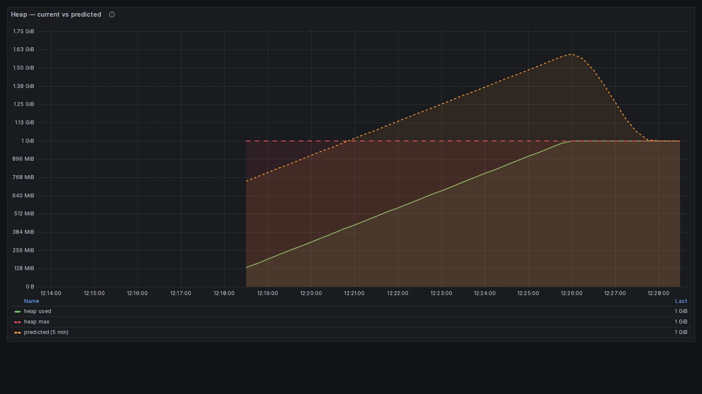

## L'alert scatta quando il disco è già pieno

Chi ha scritto anche solo una regola di alerting in Prometheus ha probabilmente già incontrato qualcosa di molto simile a questa:

```promql
node_filesystem_avail_bytes / node_filesystem_size_bytes < 0.1
```

È la regola che finisce copiata dal primo tutorial trovato, e che popola almeno metà dei file `alerts.yml` in giro per il mondo. Il problema di questa regola non è la sintassi, né il valore della soglia: il problema è **la domanda a cui sta rispondendo**. La query segnala che il disco è pieno *adesso*, in questo momento preciso. Quando scatta, l'occupazione è già al 90%, i log stanno probabilmente fallendo a scrivere su disco e qualche servizio sta già restituendo `ENOSPC` ai suoi client.

Una domanda diversa, e molto più utile dal punto di vista operativo, sarebbe *"il disco si riempirà entro una finestra temporale in cui è ancora possibile intervenire senza svegliare nessuno nel cuore della notte?"*. È una domanda diversa, e richiede un alert diverso: non un aggiustamento di soglia, ma una query che ragiona sul **trend** invece che sullo **stato**.

Questa distinzione non è una curiosità accademica: ha radici teoriche precise in due framework che chiunque si occupi di observability ha sentito nominare, USE e Golden Signals. I due framework usano la stessa parola e non intendono la stessa cosa, ed è da lì che nascono due tipi di alert diversi.

## USE e Golden Signals non intendono la stessa cosa

Partiamo dalle fonti primarie, perché qui i dettagli contano. Il **metodo USE** è stato formalizzato da **Brendan Gregg nel 2012**, partendo dal suo lavoro di performance engineering su Solaris prima e Linux poi. L'acronimo sta per Utilization, Saturation, Errors, ed è pensato come checklist operativa per diagnosticare problemi di performance a livello di risorsa hardware: CPU, memoria, disco, rete.

I **Four Golden Signals** arrivano qualche anno dopo, codificati nel **Google SRE Book del 2016**, nel capitolo 6 "Monitoring Distributed Systems". L'approccio è diverso: invece di partire dalla risorsa fisica, parte dal servizio visto dall'esterno. Latency, traffic, errors, saturation: le quattro dimensioni su cui un SRE dovrebbe costruire il proprio monitoring di base.

Entrambi i framework usano la parola "saturation", ma la definiscono in modo sottilmente diverso. Gregg è esplicito:

> "the degree to which the resource has extra work which it can't service, often queued"
>
> Fonte: brendangregg.com/usemethod.html

La saturation USE è, letteralmente, la **coda di lavoro che la risorsa non riesce a smaltire adesso**. È una misura istantanea: lunghezza della run queue della CPU, pagine in swap, pacchetti in attesa nel buffer di rete. Il libro SRE, nel capitolo sui Golden Signals, usa invece una definizione che include esplicitamente la dimensione temporale futura:

> "saturation is also concerned with predictions of impending saturation, such as 'It looks like your database will fill its hard drive in 4 hours.'"
>
> Fonte: sre.google/sre-book/monitoring-distributed-systems/

Questa frase compare letteralmente nel libro, in un paragrafo che discute come strumentare la saturation, quindi non si tratta di una lettura creativa del testo. Il punto chiave, che troppo spesso passa inosservato nelle discussioni su alerting, è che **USE misura saturation come stato corrente, mentre i Golden Signals la definiscono includendo le predizioni**. Sono due framework compatibili ma con focus diversi, e questa differenza si traduce direttamente nel tipo di alert che ciascuno abilita.

| | **USE (Brendan Gregg, 2012)** | **Golden Signals (Google SRE, 2016)** |
|---|---|---|
| **Cosa misura** | Coda di lavoro in attesa *adesso* | Quanto è "piena" la risorsa, **incluse predizioni** |
| **Quando scatta** | Quando il problema sta degradando il servizio | Quando il trend lo prevede entro un orizzonte |
| **Azione abilitata** | Mitigazione reattiva | Pianificazione, scaling preventivo |

Tenere a mente questa distinzione rende molto più facile rispondere alla domanda "che tipo di alert mi serve qui?", perché costringe a esplicitare se l'oggetto del monitoraggio è uno stato o un trend.

## Symptom-based e cause-based: quando ricevi la pagina

C'è un altro asse su cui ragionare, ortogonale al precedente, e che la letteratura SRE identifica come **symptom-based vs cause-based**. Un alert reattivo è tipicamente symptom-based: scatta quando il problema si sta manifestando, è tardivo ma molto preciso, perché non sta prevedendo nulla ma osservando. Un alert predittivo è cause-based con un orizzonte temporale: cerca di anticipare il sintomo osservando un indicatore di causa che tende verso un limite noto. Proattivo ma per definizione stimato, quindi esposto a falsi positivi quando il modello sottostante si rompe. Nessuno dei due approcci è universalmente migliore dell'altro, e trattarli come alternative è un errore comune.

Per fissare la differenza, si consideri lo stesso sistema con due alert diversi sulla stessa metrica, l'heap usato di una JVM in produzione. Il primo è un classico alert reattivo: "se l'heap supera il 90% per più di cinque minuti, pagina l'oncall". Scatta alle 3 di notte, perché la metrica ha effettivamente toccato quella soglia. L'heap è al 92%, la JVM è entrata in una GC storm, le latenze p99 sono già degradate di un ordine di grandezza e qualche endpoint sta restituendo timeout. L'oncall si sveglia, diagnostica, fa un restart di emergenza e mitiga sotto pressione. L'alert ha fatto il suo lavoro e il servizio è salvo, ma il costo operativo è altissimo.

Il secondo alert è predittivo, sulla stessa metrica: usa `predict_linear` con una finestra di sei ore di storia e un orizzonte di due ore. Scatta alle 17:00, con l'heap ancora al 60%, ma il trend di crescita dice che entro due ore si toccherà il limite massimo. L'oncall in turno diurno apre un ticket, coordina un restart pianificato durante la maintenance window serale prevista, nessuno si sveglia di notte e nessun utente vede timeout.

Entrambi gli alert hanno senso e rispondono a bisogni operativi diversi: il predittivo non sostituisce il reattivo, sono complementari. Il reattivo è la rete di sicurezza quando la predizione fallisce, ad esempio quando l'heap cresce improvvisamente in modo non lineare per un cambio di carico. Capire quale alert risponde a quale domanda è il punto di tutto l'articolo, e senza questa chiarezza si finisce inevitabilmente per scrivere regole che scattano troppo spesso, troppo tardi, o entrambe le cose insieme.

## predict_linear è una retta estrapolata in avanti

Prima di passare agli esempi, vale la pena esaminare la funzione al centro di tutto. La firma in PromQL è questa:

```promql
predict_linear(v range-vector, t scalar)
```

Cosa fa, in una riga: calcola una **regressione lineare semplice** sulla finestra `v` passata come range-vector e proietta il risultato `t` secondi nel futuro, restituendo il valore stimato della metrica al tempo `now + t`. Un esempio concreto rende tutto più chiaro:

```promql
# Stima il valore di una gauge fra 4 ore basandosi sull'ultima ora di dati
predict_linear(some_metric[1h], 4 * 3600)
```

Cosa `predict_linear` **assume**: che la crescita nella finestra osservata sia sostanzialmente lineare. Cosa invece **non fa**: non modella stagionalità, non riconosce cambi di regime, non si accorge di curve esponenziali o di salti a scalini. È un modello volutamente semplice, e questa semplicità è sia il suo punto di forza (prevedibile, veloce, facile da ragionare) sia il suo limite.

Vale la pena confrontarla con due funzioni vicine che a volte fanno lo stesso lavoro meglio:

- `rate(counter[1m])`: variazione media al secondo di un counter monotono crescente, usato per calcolare throughput ed error rate
- `deriv(gauge[5m])`: pendenza della retta di regressione lineare calcolata su una gauge, espressa come variazione per secondo
- `predict_linear(gauge[1h], t)`: estrapolazione del valore stimato a `t` secondi nel futuro, basata sulla stessa regressione

Il punto chiave da ricordare è che `predict_linear(v, t)` equivale concettualmente a `deriv(v) * t + valore_corrente`: niente di più sofisticato di una retta estrapolata in avanti. Quando l'assunzione lineare regge (è il caso di parecchie risorse reali, come la crescita dell'heap in una JVM sana o l'occupazione di un disco di log) la funzione fa esattamente quello che serve. Quando si rompe, servono strategie diverse: sono le trappole più avanti.

## Gli stessi due alert sulla stessa metrica, in tempo reale

La teoria fin qui è stata necessaria, ma vedere il comportamento dei due alert sulla stessa metrica in tempo reale chiarisce la differenza molto più velocemente. Il repository collegato contiene un demo Docker Compose minimale che simula esattamente lo scenario della JVM visto sopra: una JVM con un memory leak lineare, e gli stessi due alert (uno reattivo, uno predittivo) che competono sulla stessa metrica. L'obiettivo è rendere concreto il gap di lead time discusso finora solo in formule.

> 👉 [github.com/monte97/saturation-predittiva-demo](https://github.com/monte97/saturation-predittiva-demo)

Lo stack è composto da tre container: un fake exporter Python che usa `prometheus_client` per esporre una gauge `jvm_heap_used_bytes` che cresce linearmente a 2 MB/s da 100 MB verso 1 GB, una istanza di **Prometheus** con entrambe le regole alert caricate, e una **Grafana** con la dashboard pre-provisionata. Niente registrazione, niente login: tre comandi avviano l'intero stack. Il fake exporter è volutamente banale perché l'interesse non è simulare una JVM realistica ma osservare come le regole PromQL reagiscono a una curva lineare pulita.

```bash
git clone https://github.com/monte97/saturation-predittiva-demo
cd saturation-predittiva-demo
docker compose up --build
```

Dopo qualche secondo di build, i tre servizi sono live. Grafana risponde su `http://localhost:3000`, ingresso anonimo come admin, dashboard `Saturation: Predictive vs Reactive`. La timeline qui sotto descrive cosa succede in tempo reale.


La cosa interessante è il gap fra la riga `t=3:30` e la riga `t=6:50`. Sono **circa tre minuti di lead time** che l'alert predittivo offre in uno scenario didattico compresso. In un sistema reale, dove il leak è dell'ordine di decine di MB/ora invece che 2 MB/sec, lo stesso identico pattern darebbe ore o giorni di anticipo. Il rapporto tra finestra di osservazione e velocità del leak determina il moltiplicatore.



> *La linea verde è l'heap effettivamente usato dalla JVM simulata, la linea rossa tratteggiata è il limite massimo (1 GiB), la linea arancione tratteggiata è la proiezione `predict_linear` a 5 minuti. La linea arancione incrocia la rossa intorno alle 12:20, mentre la verde la raggiunge solo verso le 12:26: quei sei minuti di anticipo sono esattamente il lead time dell'alert predittivo.*

Il primo pannello mostra le metriche grezze, ma il secondo è ancora più diretto: due step chart che indicano quando ciascun alert è in stato `firing`. Qui il gap temporale diventa visivamente impossibile da ignorare, e permette di leggere il vantaggio operativo senza dover interpretare la geometria delle curve.


> *L'alert predittivo (arancione) entra in `firing` intorno alle 12:21:30, l'alert reattivo (rosa) intorno alle 12:25:30. Quattro minuti netti di anticipo nel demo compresso. In produzione, con un leak di 50 MB/ora invece di 2 MB/sec, lo stesso pattern darebbe oltre quattro ore di anticipo: abbastanza per un restart pianificato durante il giorno invece di una pagina notturna.*

Il `docker-compose.yml` espone tre variabili d'ambiente (`START_HEAP_MB`, `MAX_HEAP_MB`, `GROWTH_MB_PER_SEC`) che permettono di rallentare il leak per simulare scenari più realistici, o di accelerarlo per osservare il pattern in tempi brevi. Le regole alert vivono in `prometheus/alerts.yml` e non richiedono rebuild: basta riavviare il container `prometheus` per ricaricarle.

## Cosa cambia per chi paga

La distinzione USE/Golden Signals su saturation non è una sottigliezza accademica: cambia operativamente quando e a chi arriva la pagina, ed è **la differenza tra una sveglia notturna a servizio già degradato e un ticket diurno aperto con margine d'intervento**. Il costo di un incidente non è solo il downtime: è l'ora di lavoro fatta sotto pressione da chi il giorno dopo non è al pieno delle sue capacità.

## Da dove partire

Prendete la risorsa che vi ha svegliato l'ultima volta e chiedetevi in quanto tempo si è saturata. Se la risposta è "ore", c'era una finestra d'intervento e l'alert non ve l'ha data: quella risorsa è candidata a un alert predittivo. Se è "secondi", la soglia reattiva era lo strumento giusto e il problema sta altrove.

Quali risorse stanno da una parte e quali dall'altra è la domanda del [pezzo successivo](/blog/verificare/observability/prometheus-predict-linear-alert-predittivi/): cinque casi PromQL reali, le quattro trappole della regressione lineare, e una tabella di dieci risorse con l'alert che serve a ciascuna.

## Risorse

- [Google SRE Book: Monitoring Distributed Systems](https://sre.google/sre-book/monitoring-distributed-systems/): il capitolo 6 che introduce i Four Golden Signals
- [Brendan Gregg: The USE Method](https://www.brendangregg.com/usemethod.html): la definizione canonica di saturation reattiva
- [Tom Wilkie: The RED Method](https://www.slideshare.net/weaveworks/monitoring-microservices): perché RED non include saturation
- Alex Hidalgo, *Implementing Service Level Objectives* (O'Reilly, 2020)
- Niall Murphy et al., *The Site Reliability Workbook* (O'Reilly, 2018): capitolo 5 su alerting basato su SLO

**Repo della demo**

> 👉 [github.com/monte97/saturation-predittiva-demo](https://github.com/monte97/saturation-predittiva-demo)
