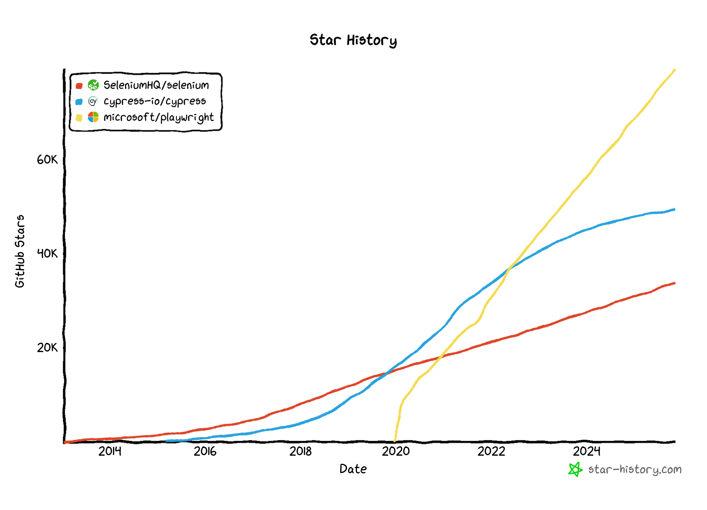
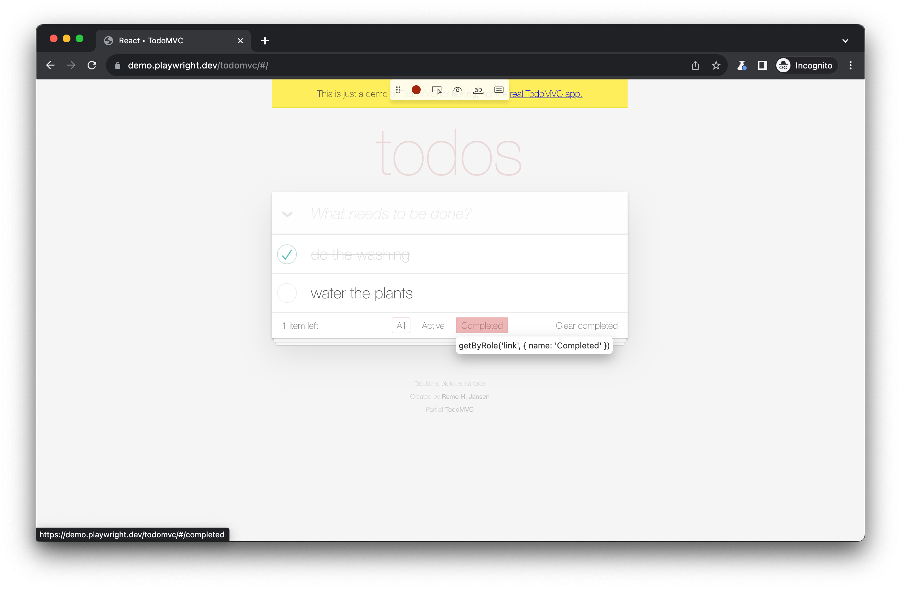
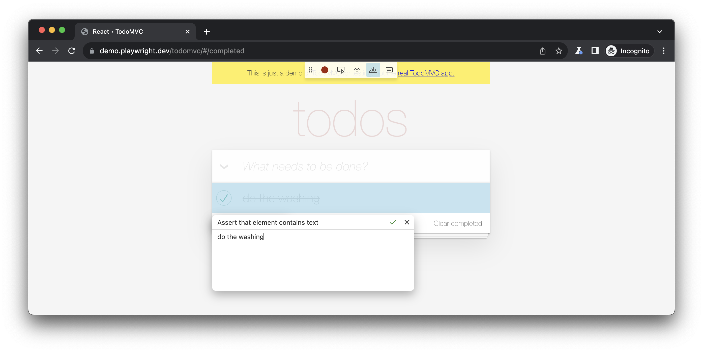
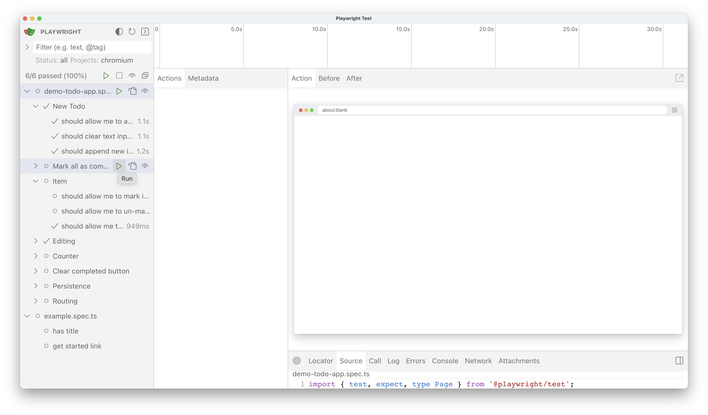
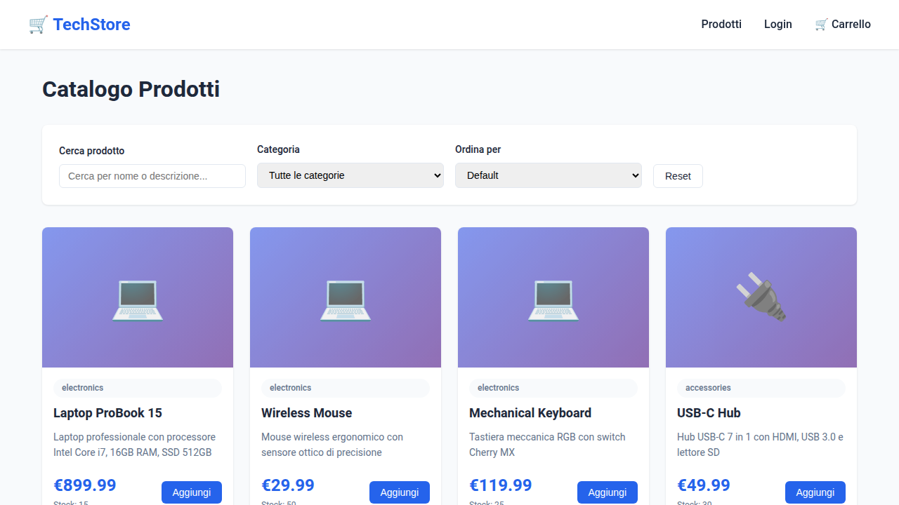

Test che passano al terzo tentativo, `sleep(5000)` disseminati nel codice, suite che girano per 20 minuti e falliscono in modo non deterministico. Il testing end-to-end resta un pilastro per la qualità delle applicazioni web moderne - simulare l'esperienza utente reale fornisce un livello di confidenza impossibile da ottenere con test unitari o di integrazione isolati - ma troppo spesso i costi superano i benefici.

Playwright risolve sistematicamente queste problematiche attraverso un'architettura moderna e un'eccezionale developer experience. In questo articolo ne analizziamo architettura, tooling e pattern avanzati. 

👉 Questo è pprofondimento dell'overview pubblicata su TheRedCode: [Testing E2E: perché iniziare con Playwright](https://theredcode.it/testing/testing-e2e-perche-iniziare-con-playwright/).

👉 Il codice completo degli esempi è nel repository: [monte97/workshop-playwright](https://github.com/monte97/workshop-playwright)

## La Sfida del Testing End-to-End

Secondo la [Test Automation Pyramid](https://martinfowler.com/articles/practical-test-pyramid.html), i test E2E occupano il vertice della piramide proprio per le loro caratteristiche problematiche.


### Vantaggi

I test E2E offrono benefici significativi:

**Confidenza nel Rilascio**
- Simulano l'esperienza utente reale attraverso il browser
- Verificano il flusso completo dell'applicazione, dall'interfaccia al database
- Aumentano drasticamente la fiducia nel processo di deployment

**Copertura Completa**
- Testano l'integrazione di tutti i componenti dell'applicazione
- Rilevano bug che sfuggono ai test unitari (problemi di integrazione, race conditions, timing issues)
- Coprono scenari complessi e realistici che riflettono il comportamento degli utenti

**Qualità Percepita**
- Garantiscono il corretto funzionamento delle funzionalità critiche per il business
- Migliorano la qualità percepita dall'utente finale
- Riducono significativamente i rischi di regressione in produzione

### Le Sfide

Nonostante i vantaggi, i test E2E presentano problematiche ben note che ne hanno limitato l'adozione:

**Costi Operativi Elevati** - L'implementazione di test E2E richiede investimenti considerevoli:
- **Setup complesso**: configurazione di ambienti di test completi con tutti i servizi necessari
- **Gestione dati**: creazione e manutenzione di dataset di test realistici
- **Manutenzione alta**: i test tendono a rompersi frequentemente con modifiche all'UI
- **Infrastruttura dedicata**: necessità di risorse per eseguire browser completi

**Performance Problematiche** - I test E2E sono notoriamente lenti:
- **Browser rendering**: tempo necessario per il rendering completo delle pagine
- **Network calls**: latenza delle chiamate HTTP/API
- **Attese UI**: tempi di caricamento, animazioni, transizioni
- **Esecuzione sequenziale**: difficoltà nell'eseguire test in parallelo

**Fragilità e Flakiness** - Il problema più critico dei test E2E tradizionali è la loro inaffidabilità:

```javascript
// Approccio tradizionale con Selenium (API legacy, parzialmente mitigato in Selenium 4 con WebDriver BiDi)
const button = driver.findElement(By.css('.submit-button'));
await button.click(); // Può fallire se l'elemento non è ancora visibile/cliccabile

// Workaround comuni (anti-pattern)
await driver.sleep(3000); // Hard-coded wait - fragile e lento
await driver.wait(until.elementLocated(By.css('.result')), 5000); // Timeout arbitrario
```

Questi problemi portano a test "flaky" che falliscono in modo non deterministico, causando:
- **Falsi positivi**: test che falliscono segnalando un problema inesistente
- **Falsi negativi**: test che passano senza rilevare un bug reale
- **Perdita di fiducia**: i team iniziano a ignorare i risultati dei test
- **Debugging costoso**: ore perse a investigare fallimenti non riproducibili

---

## Playwright: Un Approccio Moderno

**[Playwright](https://playwright.dev/)** è un framework open source sviluppato da Microsoft che affronta queste problematiche con un'architettura pensata per la stabilità e una developer experience moderna.

### Adozione e Ecosistema

L'adozione di Playwright è cresciuta esponenzialmente dal suo rilascio nel 2020. Confrontato con alternative consolidate come Selenium e Cypress, Playwright ha rapidamente guadagnato terreno in termini di popolarità su GitHub e trend di adozione.




### Setup Immediato

A differenza di tool tradizionali che richiedono configurazioni complesse, Playwright è operativo in pochi secondi:

```bash
# Inizializzazione progetto
npm init playwright@latest

# Esecuzione test
npx playwright test
```

L'[estensione VS Code ufficiale](https://marketplace.visualstudio.com/items?itemName=ms-playwright.playwright) migliora ulteriormente la developer experience, permettendo di eseguire, debuggare e visualizzare i test direttamente dall'editor.

---

## I Tre Pilastri Architetturali

Playwright si basa su tre principi fondamentali che lo differenziano dalle soluzioni tradizionali.

### 1. Affidabilità: Auto-Waiting e Resilienza

Il problema della fragilità nei test E2E deriva principalmente da race conditions e timing issues. Playwright risolve questo alla radice con il **meccanismo di auto-waiting**.

In pratica, ogni azione in Playwright esegue automaticamente una serie di controlli prima di procedere:

```javascript
import { test, expect } from '@playwright/test';

test('get started link', async ({ page }) => {
  await page.goto('https://playwright.dev/');

  // Auto-waiting applicato automaticamente
  await page.getByRole('link', { name: 'Get started' }).click();

  await expect(page.getByRole('heading', { name: 'Installation' })).toBeVisible();
});
```

Prima di eseguire il click, Playwright verifica automaticamente che:
1. Il selettore identifichi **un solo elemento** (univocità)
2. L'elemento sia **visibile** (non `display: none` o `visibility: hidden`)
3. L'elemento sia **stabile** (non in movimento/animazione)
4. L'elemento **non sia coperto** da altri elementi
5. L'elemento **non sia disabilitato**

Questi controlli vengono ripetuti automaticamente con retry fino al timeout delle azioni (`actionTimeout`, che di default non ha un valore proprio e eredita il test timeout globale di 30s), eliminando completamente la necessità di `sleep()` o wait espliciti.

### Web-First Assertions

Le assertion di Playwright sono progettate per il web e includono retry automatico:

```javascript
// Aspetta fino a 5s (default assertion timeout) che il testo appaia
await expect(page.getByText('Success')).toBeVisible();

// Verifica con retry automatico
await expect(page.locator('.count')).toHaveText('5');

// Aspetta navigazione con assertion sull'URL
await expect(page).toHaveURL(/dashboard/);
```

Secondo la [documentazione ufficiale](https://playwright.dev/docs/actionability), questo approccio riduce drasticamente i test flaky, incrementando in modo considerevole l'affidabilità dei test.

### 2. Velocità: Parallelizzazione e Architettura Efficiente

### Esecuzione Parallela Nativa

Playwright è progettato per la parallelizzazione fin dalla sua architettura:

```javascript
// playwright.config.ts
export default defineConfig({
  workers: process.env.CI ? 2 : 4,  // Worker multipli
  fullyParallel: true,               // Parallelizzazione completa
  retries: process.env.CI ? 2 : 0,  // Retry automatici in CI
});
```

**Risultati concreti:**
- Test suite di 100 test: ~10 minuti con 1 worker → ~2.5 minuti con 4 workers
- **Speedup 4x** out-of-the-box senza modifiche ai test
- Ogni worker esegue test in contesti completamente isolati

### Sharding per CI/CD Distribuita

Per test suite molto grandi, Playwright supporta lo [sharding](https://playwright.dev/docs/test-sharding) per distribuire i test su più macchine:

```bash
# Pipeline CI/CD con 4 job paralleli
npx playwright test --shard=1/4  # Job 1
npx playwright test --shard=2/4  # Job 2
npx playwright test --shard=3/4  # Job 3
npx playwright test --shard=4/4  # Job 4
```

### Comunicazione Efficiente

Playwright utilizza protocolli proprietari specifici per ciascun browser engine (Chromium, Firefox, WebKit), tutti basati su WebSocket. Anche per Chromium, Playwright non usa direttamente il Chrome DevTools Protocol (CDP) ma un [protocollo custom](https://playwright.dev/docs/api/class-cdpsession) che opera a un livello più basso, ottenendo maggiore controllo e affidabilità. Questo approccio risulta più efficiente rispetto al classico protocollo HTTP di WebDriver, anche se Selenium 4+ ha introdotto WebDriver BiDi (basato su WebSocket) per ridurre il divario.

### 3. Semplicità: Developer Experience Superiore

### Multi-Browser con API Unificata

Playwright supporta Chromium, Firefox e WebKit (Safari) attraverso una singola API consistente:

```javascript
// playwright.config.ts
export default defineConfig({
  projects: [
    { name: 'chromium', use: { ...devices['Desktop Chrome'] } },
    { name: 'firefox', use: { ...devices['Desktop Firefox'] } },
    { name: 'webkit', use: { ...devices['Desktop Safari'] } },
    { name: 'iPhone 13', use: { ...devices['iPhone 13'] } },
  ],
});
```

I test vengono eseguiti automaticamente su tutti i browser configurati senza modifiche al codice.

### Selettori Semantici e Accessibilità

Playwright promuove best practice attraverso **selettori basati sull'accessibility tree**:

```javascript
// Selettori semantici (consigliati)
await page.getByRole('button', { name: 'Submit' });     // Role-based
await page.getByLabel('Email');                          // Label
await page.getByPlaceholder('Search...');                // Placeholder
await page.getByText('Login');                           // Text content

// Fallback per elementi dinamici
await page.getByTestId('submit-btn');                    // Test ID
```

Questi selettori sono:
- **Resilienti**: non si rompono con refactoring CSS o modifiche alla struttura DOM
- **Semantici**: leggibili e self-documenting
- **Accessibili**: seguono le [best practice di selezione basata sull'accessibilità](https://playwright.dev/docs/locators#locate-by-role)
- **Stabili**: minimizzano la manutenzione dei test

### Accessibility Tree

Playwright si basa sull'[Accessibility Tree](https://developer.chrome.com/blog/full-accessibility-tree) del browser, una rappresentazione semantica del DOM:

```html
<!-- HTML -->
<main>
  <h1>Login</h1>
  <form>
    <label for="user">Username:</label>
    <input id="user" type="text" placeholder="mario.rossi">
    <button aria-label="Submit login form">
      <svg>...</svg> Enter
    </button>
  </form>
</main>
```

```
Accessibility Tree:
ROLE: main
 ├── ROLE: heading, NAME: "Login"
 └── ROLE: form
      ├── ROLE: textbox, NAME: "Username:"
      └── ROLE: button, NAME: "Submit login form"
```

---

## Tooling Avanzato e Developer Experience

Oltre ai tre pilastri architetturali, Playwright offre un set di strumenti che rendono lo sviluppo di test un'esperienza produttiva.

### Codegen: Generazione Automatica di Test

Il **[Code Generator](https://playwright.dev/docs/codegen)** di Playwright genera automaticamente test interagendo con l'applicazione:

```bash
# Avvia Codegen
npx playwright codegen http://localhost:3000
```

Il tool:
1. Apre un browser controllato
2. Registra le interazioni dell'utente
3. Genera codice Playwright ottimizzato con i selettori migliori
4. Supporta generazione di assertions con un click



**Codice generato automaticamente:**
```javascript
await page.goto('http://localhost:3000/');
await page.getByRole('link', { name: 'Products' }).click();
await page.getByPlaceholder('Search...').fill('laptop');
await page.getByRole('button', { name: 'Search' }).click();
await expect(page.getByRole('heading', { name: 'Laptop Pro' })).toBeVisible();
```



L'integrazione con l'estensione VS Code permette di avviare Codegen direttamente dall'editor e inserire il codice generato nel file di test.

### UI Mode: Debugging Interattivo

La **[UI Mode](https://playwright.dev/docs/test-ui-mode)** fornisce un'interfaccia grafica completa per esplorare, eseguire e debuggare i test:

```bash
npx playwright test --ui
```



**Funzionalità principali:**
- **Watch mode**: esecuzione automatica dei test al salvataggio del file
- **Timeline visuale**: visualizzazione cronologica di navigazioni e azioni
- **Inspector integrato**: snapshot del DOM per ogni azione
- **Pick Locator**: tool per identificare selettori ottimali con hover
- **Network tab**: monitoring delle richieste HTTP
- **Console logs**: output del browser e degli script di test
- **Screenshots step-by-step**: stato visivo dell'applicazione ad ogni step

### Trace Viewer: Analisi Post-Mortem

Il **[Trace Viewer](https://playwright.dev/docs/trace-viewer)** permette l'analisi dettagliata di test falliti attraverso registrazioni complete dell'esecuzione:

```javascript
// playwright.config.ts
export default defineConfig({
  use: {
    trace: 'on-first-retry',  // Registra trace sui retry
  },
});
```

Visualizzazione della trace:
```bash
npx playwright show-trace trace.zip
```

La trace include:
- Timeline completa delle azioni
- Screenshots prima/dopo ogni azione
- Network activity
- Console output
- Metadata del test (browser, viewport, durata)

### Report Avanzati

Playwright supporta [multiple opzioni di reporting](https://playwright.dev/docs/test-reporters):

```javascript
export default defineConfig({
  reporter: [
    ['html'],           // HTML report interattivo
    ['json'],           // Output JSON per integrazione
    ['junit'],          // JUnit XML per CI/CD
    ['allure-playwright']  // Pacchetto esterno: npm install allure-playwright
  ],
});
```

---

## Implementazione Pratica: Workshop E-Commerce

Per mettere in pratica quanto visto finora, consideriamo un'applicazione e-commerce realistica: **TechStore**.

### Architettura dell'Applicazione di Test

```
TechStore (Demo App)
├── Backend: Express.js
│   ├── REST API (prodotti, carrello, autenticazione, checkout)
│   ├── Session management
│   └── In-memory data storage
├── Frontend: Vanilla HTML/CSS/JS
│   ├── data-testid attributes per selettori stabili
│   ├── Loading states per operazioni async
│   └── Form validation
└── API Documentation: Swagger UI
```

**Avvio dell'applicazione:**
```bash
cd demo-app
docker compose up -d  # Oppure: npm install && npm start

# Applicazione disponibile su http://localhost:3000
# API docs: http://localhost:3000/api-docs
```

**Credenziali di test:**
- Email: `test@example.com`
- Password: `password123`

### Test Base: Login Flow

```javascript
import { test, expect } from '@playwright/test';

test('login con successo', async ({ page }) => {
  // Navigazione
  await page.goto('/login');

  // Interazione con form
  await page.getByLabel('Email').fill('test@example.com');
  await page.getByLabel('Password').fill('password123');

  // Submit
  await page.getByRole('button', { name: 'Login' }).click();

  // Assertions
  await expect(page).toHaveURL(/dashboard/);
  await expect(page.getByText('Benvenuto')).toBeVisible();
});
```

### Visual Regression Testing

Playwright include supporto nativo per [visual regression testing](https://playwright.dev/docs/test-snapshots):

```javascript
test('homepage layout', async ({ page }) => {
  await page.goto('/');

  // Primo run: crea screenshot di riferimento
  // Run successivi: confronta con riferimento
  await expect(page).toHaveScreenshot('homepage.png');
});
```



Al primo run, Playwright crea lo screenshot di riferimento in una directory con suffisso `-snapshots` accanto al file di test (ad esempio `example.spec.ts-snapshots/`). Nei run successivi, confronta pixel-per-pixel e fallisce se rileva differenze superiori alla soglia configurata. Il path è personalizzabile tramite `snapshotPathTemplate`.

### Ottimizzazione dell'Autenticazione

Se i nostri test richiedono autenticazione, eseguire il login ad ogni test è inefficiente. Playwright supporta il **pattern di setup project**:

```javascript
// tests/auth.setup.ts
import { test as setup } from '@playwright/test';

setup('authenticate', async ({ page }) => {
  await page.goto('/login');
  await page.getByLabel('Email').fill('test@example.com');
  await page.getByLabel('Password').fill('password123');
  await page.getByRole('button', { name: 'Login' }).click();
  await page.waitForURL(/dashboard/);

  // Salva stato sessione
  await page.context().storageState({
    path: 'playwright/.auth/user.json'
  });
});
```

Configurazione:
```javascript
// playwright.config.ts
export default defineConfig({
  projects: [
    { name: 'setup', testMatch: /.*\.setup\.ts/ },
    {
      name: 'chromium-auth',
      use: {
        ...devices['Desktop Chrome'],
        storageState: 'playwright/.auth/user.json'  // Riusa sessione
      },
      dependencies: ['setup'],  // Esegui setup prima
    },
  ],
});
```

**Benefici:**
- Login eseguito una sola volta per test suite
- Speedup significativo (da ~3s a ~100ms per test)
- Cookies e localStorage condivisi tra test autenticati

---

## Concetti Avanzati

Oltre ai fondamentali, esistono pattern più sofisticati per mantenere una suite di test scalabile e manutenibile.

### Page Object Model

Il [Page Object Model](https://playwright.dev/docs/pom) incapsula la logica di interazione con le pagine:

```typescript
// pages/LoginPage.ts
import { Page, expect } from '@playwright/test';

export class LoginPage {
  constructor(private page: Page) {}

  async goto() {
    await this.page.goto('/login');
  }

  async login(email: string, password: string) {
    await this.page.getByLabel('Email').fill(email);
    await this.page.getByLabel('Password').fill(password);
    await this.page.getByRole('button', { name: 'Login' }).click();
  }

  async expectLoginSuccess() {
    await expect(this.page).toHaveURL(/dashboard/);
  }
}
```

Utilizzo:
```typescript
import { LoginPage } from '../pages/LoginPage';

test('login', async ({ page }) => {
  const loginPage = new LoginPage(page);
  await loginPage.goto();
  await loginPage.login('user@test.com', 'password123');
  await loginPage.expectLoginSuccess();
});
```

### Custom Fixtures

Le [fixtures custom](https://playwright.dev/docs/test-fixtures) permettono di estendere il framework con setup riutilizzabili:

```typescript
// fixtures/auth.fixture.ts
import { test as base } from '@playwright/test';

export const test = base.extend({
  authenticatedPage: async ({ page }, use) => {
    // Setup: esegui login
    await page.goto('/login');
    await page.getByLabel('Email').fill('test@test.com');
    await page.getByLabel('Password').fill('pass123');
    await page.getByRole('button', { name: 'Login' }).click();
    await page.waitForURL(/dashboard/);

    // Fornisci page autenticata al test
    await use(page);

    // Teardown (opzionale): logout
  }
});
```

Utilizzo:
```typescript
test('dashboard', async ({ authenticatedPage }) => {
  // Page già autenticata!
  await expect(authenticatedPage.getByText('Welcome')).toBeVisible();
});
```

### API Testing

Playwright include un client HTTP nativo per [API testing](https://playwright.dev/docs/api-testing):

```typescript
test('GET /api/products', async ({ request }) => {
  const response = await request.get('/api/products');

  expect(response.ok()).toBeTruthy();
  expect(response.status()).toBe(200);

  const products = await response.json();
  expect(products).toHaveLength(10);
  expect(products[0]).toHaveProperty('name');
  expect(products[0]).toHaveProperty('price');
});

test('POST /api/products', async ({ request }) => {
  const response = await request.post('/api/products', {
    data: { name: 'New Product', price: 99.99 }
  });

  expect(response.status()).toBe(201);
  const product = await response.json();
  expect(product.id).toBeDefined();
});
```

**Pattern avanzato: Fixture con API per isolamento completo**

Per test paralleli che necessitano isolamento dei dati:

```typescript
// fixtures/user.fixture.ts
export const test = base.extend({
  authenticatedUser: async ({ request }, use) => {
    // Crea utente unico via API
    const userData = {
      email: `user-${Date.now()}@test.com`,
      password: 'password123'
    };

    const createResponse = await request.post('/api/users', { data: userData });
    const user = await createResponse.json();

    // Autentica via API (più veloce di UI)
    const loginResponse = await request.post('/api/auth/login', { data: userData });

    // Fornisci utente e sessione al test
    await use({ user, sessionCookies: loginResponse.headers()['set-cookie'] });

    // Cleanup: elimina utente
    await request.delete(`/api/users/${user.id}`);
  }
});
```

Questo pattern permette esecuzione parallela illimitata con isolamento completo tra test.

### Test Mobile

Playwright supporta [emulazione di device mobili](https://playwright.dev/docs/emulation) out-of-the-box:

```typescript
import { devices } from '@playwright/test';

export default defineConfig({
  projects: [
    { name: 'iPhone 13', use: { ...devices['iPhone 13'] } },
    { name: 'Pixel 5', use: { ...devices['Pixel 5'] } },
    { name: 'iPad Pro 11', use: { ...devices['iPad Pro 11'] } },
  ],
});
```

Test specifici per mobile:
```typescript
test('mobile menu', async ({ page }) => {
  // Touch events
  await page.tap('#menu-button');

  // Swipe gesture
  await page.touchscreen.tap(100, 100);

  // Geolocation
  await page.context().setGeolocation({ latitude: 48.858455, longitude: 2.294474 });
});
```

---

## Integrazione CI/CD

Playwright è progettato per ambienti CI/CD con [Docker images ufficiali](https://playwright.dev/docs/ci), configurazioni ottimizzate e supporto nativo per sharding su più macchine. La configurazione minima per CI richiede poche righe:

```javascript
// playwright.config.ts
export default defineConfig({
  workers: process.env.CI ? 2 : undefined,  // Limita worker in CI
  retries: process.env.CI ? 2 : 0,          // Retry automatici
  use: {
    trace: 'on-first-retry',                // Trace solo su retry
    video: 'retain-on-failure',             // Video solo se fallisce
  },
});
```

Per pipeline complete su GitHub Actions, GitLab CI, strategie di sharding e ottimizzazioni avanzate, vedi l'articolo dedicato: [CI/CD, Strategie Avanzate e Futuro del Testing]().

---

## Buone Pratiche

### Principi di Test

**Test Behaviour, Not Implementation**
```typescript
// ❌ Male: testa implementazione
await expect(page.locator('.user-name-class')).toHaveText('John');

// ✅ Bene: testa comportamento
await expect(page.getByRole('heading', { level: 1 })).toHaveText('John');
```

**User-Centric Testing:**
i test vanno scritti dal punto di vista dell'utente, usando selettori semantici e verificando comportamenti visibili.

**Test Critical Paths First**
Prioritizza test per:
- User authentication
- Checkout/payment flows
- Funzionalità core business

### Qualità del Codice

**Principio DRY:**
fixtures e helper functions aiutano a evitare duplicazione:

```typescript
// helpers/auth.ts
export async function login(page: Page, credentials: Credentials) {
  await page.goto('/login');
  await page.getByLabel('Email').fill(credentials.email);
  await page.getByLabel('Password').fill(credentials.password);
  await page.getByRole('button', { name: 'Login' }).click();
}
```

**Meaningful Assertions**
```typescript
// ❌ Male: assertion generica
await expect(page.locator('.message')).toBeVisible();

// ✅ Bene: assertion specifica
await expect(page.getByText('Order confirmed')).toBeVisible();
```

### Manutenzione

**Keep Tests Updated**
- Refactor test quando cambia l'UI
- Rimuovi test obsoleti
- Aggiorna selettori quando necessario

**Monitor Test Health**
Traccia metriche come:
- Flakiness rate
- Execution time (alert se aumenta significativamente)
- Coverage delle funzionalità critiche

### Prestazioni

**Test Isolation**
Ogni test deve essere completamente indipendente:
```typescript
test.describe.configure({ mode: 'parallel' });

test('test 1', async ({ page }) => {
  // Completamente isolato
});

test('test 2', async ({ page }) => {
  // Non dipende da test 1
});
```

**Fast Feedback Loop**
- Usa `--grep` per eseguire subset di test durante sviluppo
- Configura watch mode per test specifici
- Esegui full suite solo in CI

---

## Quando Usare Playwright

### Scenari Ideali

Playwright eccelle in:
- **Nuovi progetti** senza legacy di test esistenti
- **Web apps moderne** (SPA, PWA, applicazioni React/Vue/Angular)
- **Test E2E complessi** con multiple interazioni utente
- **Cross-browser testing** critico per il business
- **Pipeline CI/CD intensive** con necessità di feedback rapido
- **Team che prioritizza velocità** di sviluppo e manutenzione

### Considerazioni

Limitazioni da valutare:
- **Solo web mobile** tramite emulazione (no app native, no browser mobile reali)
- **Learning investment** per team abituati a Selenium/Cypress
- **Migration cost** da framework esistenti
- **Verificare requisiti enterprise** specifici (es. supporto commerciale)

---

## Risorse Utili

### Documentazione Ufficiale

- **[Playwright Docs](https://playwright.dev)** - Documentazione completa e aggiornata
- **[API Reference](https://playwright.dev/docs/api/class-playwright)** - Reference completo delle API
- **[Best Practices](https://playwright.dev/docs/best-practices)** - Linee guida ufficiali

### Tool Essenziali

- **[VS Code Extension](https://marketplace.visualstudio.com/items?itemName=ms-playwright.playwright)** - Integrazione IDE
- **[Trace Viewer](https://playwright.dev/docs/trace-viewer)** - Debugging visuale
- **[Codegen](https://playwright.dev/docs/codegen)** - Generazione automatica test

### Community

- **[Discord](https://aka.ms/playwright/discord)** - Community attiva e supporto
- **[GitHub](https://github.com/microsoft/playwright)** - Repository ufficiale, issues, discussions
- **[Stack Overflow](https://stackoverflow.com/questions/tagged/playwright)** - Q&A tecnico

### Percorso di Apprendimento

1. **Fondamenti**: [Getting Started Guide](https://playwright.dev/docs/intro)
2. **Pratica**: Workshop hands-on con applicazioni reali
3. **Avanzato**: Page Object Model, fixtures, parallelizzazione
4. **Produzione**: CI/CD integration, monitoring, best practices

---

## Conclusioni

Il testing end-to-end ha tradizionalmente rappresentato un compromesso tra benefici e costi. In questo articolo abbiamo visto come Playwright risolve questo compromesso attraverso tre innovazioni fondamentali:

1. **Auto-waiting intelligente** che elimina la fragilità dei test, riducendo drasticamente i flaky test e la necessità di wait espliciti
2. **Parallelizzazione nativa** e comunicazione efficiente via WebSocket che forniscono performance fino a 4x superiori, rendendo praticabile l'esecuzione di suite di test estese
3. **Developer experience superiore** attraverso tooling eccezionale (Codegen, UI Mode, Trace Viewer) e API moderne che riducono significativamente i costi di creazione e manutenzione

Per approfondimenti pratici, il [workshop repository](https://github.com/monte97/workshop-playwright) include un'applicazione e-commerce completa con esempi che dimostrano tutti i pattern descritti in questo articolo.

L'ecosistema Playwright è in rapida evoluzione con release frequenti e community attiva. Per rimanere aggiornati, vale la pena seguire il [blog ufficiale](https://playwright.dev/community/blog) e partecipare alle discussioni su Discord e GitHub.

Il prossimo articolo della serie approfondisce un aspetto complementare: [collegare i test E2E alle trace OpenTelemetry]() per identificare il microservizio responsabile quando un test fallisce.

Foto di <a href="https://unsplash.com/it/@inset_agency?utm_source=unsplash&utm_medium=referral&utm_content=creditCopyText">Paul Knight</a> su <a href="https://unsplash.com/it/foto/maschera-grigia-gTbRw_XcYpE?utm_source=unsplash&utm_medium=referral&utm_content=creditCopyText">Unsplash</a>
      
