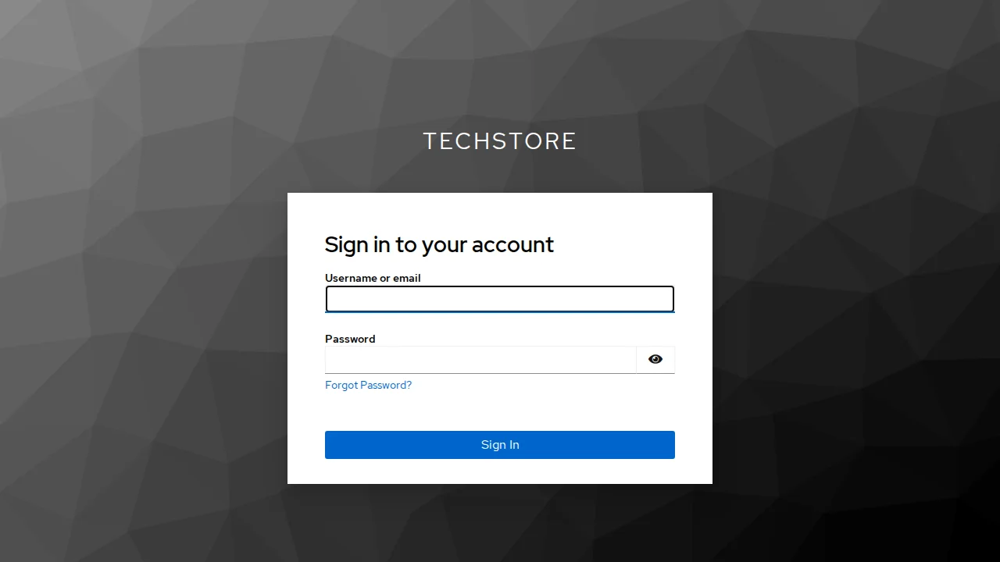
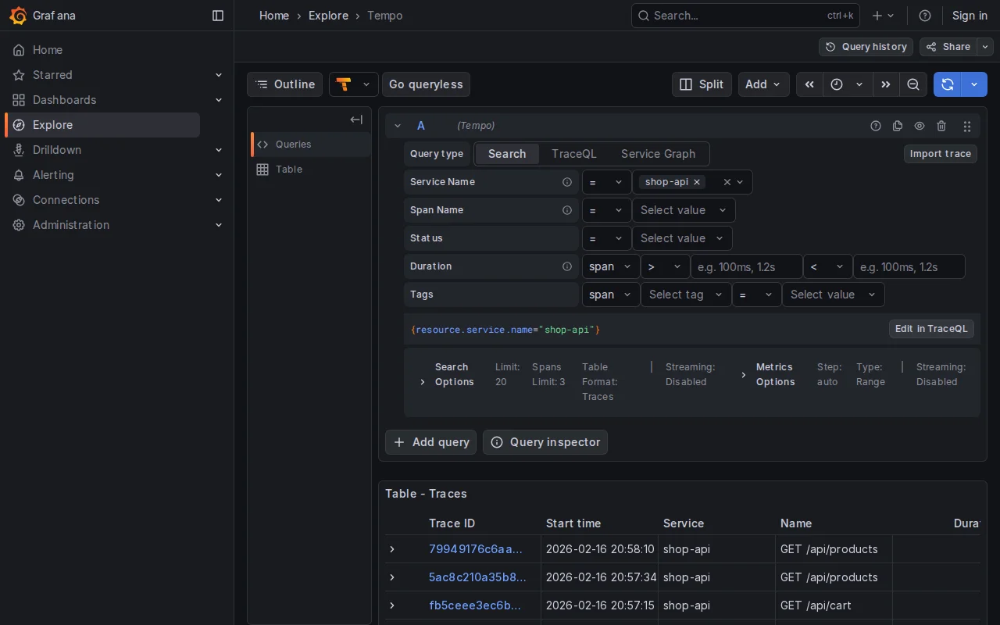
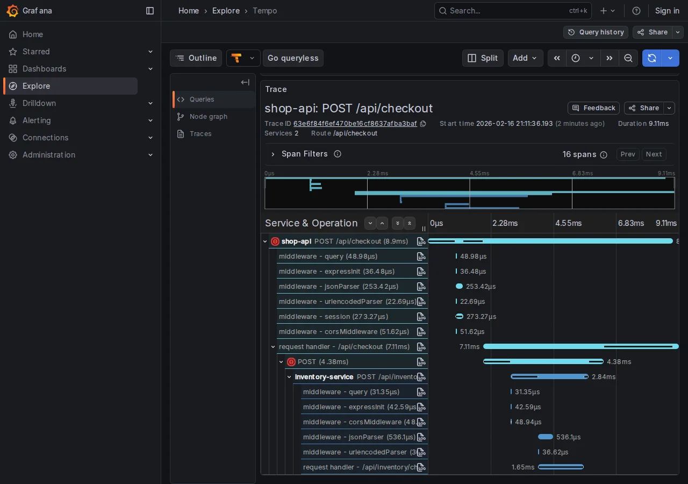

Il test E2E fallisce con un timeout, lo screenshot mostra uno spinner infinito, e l'unica informazione utile è "qualcosa nel backend non ha risposto". I test Playwright verificano il percorso utente: login, aggiungi al carrello, checkout. Ma il checkout di un e-commerce a microservizi attraversa 4 servizi diversi, e quando il test fallisce con timeout Playwright vede solo il frontend. Il backend resta una **black box**.

Collegare i test Playwright alle trace OpenTelemetry ci permette di rompere quella black box: quando un test fallisce, apriamo la trace in Grafana e identifichiamo esattamente quale microservizio è il colpevole.

👉 [Articolo Introduttivo Playwright](https://theredcode.it/testing/testing-e2e-perche-iniziare-con-playwright/).
👉 [Articolo Introduttivo OpenTelemetry](https://montelli.dev/blog/verificare/observability/04-correlation/)

**Cosa copriamo:**
1. Setup rapido MockMart (ambiente demo)
2. Autenticazione Keycloak con `storageState`
3. Trace correlation: dal test al backend
4. Visual testing come complemento
5. Limiti e gotcha

---

## MockMart: l'ambiente demo in 5 minuti

MockMart è un e-commerce demo con architettura a microservizi, instrumentato con OpenTelemetry:

```text
Gateway (nginx:80)
├── Shop UI (:3000)
├── Shop API (:3001)
│   ├── Inventory (:3011)
│   ├── Payment (:3010)
│   └── Notification (:3009)
├── Keycloak (:8080)
└── Grafana (:3005)
```

```bash
# Clone e avvia
git clone https://github.com/monte97/MockMart
cd MockMart
make up

# Verifica che tutti i container siano healthy
make health
```

**Credenziali test:**

| Username | Password | Ruolo |
|----------|----------|-------|
| mario | mario123 | User |
| admin | admin123 | Admin |
| blocked | blocked123 | User (checkout bloccato) |

L'app è disponibile su `http://localhost`. Il progetto Playwright è in `demo/mockmart-e2e/` nel [repository del workshop](https://github.com/monte97/workshop-playwright).

---

## Login una volta, riusa ovunque

Prima di iniziare sistemiamo una situazione scomoda. La nostra applicazione utilizza [Keycloak](https://www.keycloak.org/) per gestire l'autenticazione. Normalmente in un contesto E2E saremmo chiamati a ripetere il flusso OAuth per ogni test, introducendo una importante fonte di ritardo. Playwright risolve con `storageState`: si esegue il login una volta, si salvano cookies e localStorage, e si riusano in tutti i test.



### Setup file di autenticazione

```typescript
// tests/auth.setup.ts
import { test as setup, expect } from '@playwright/test';

const authFile = '.auth/mario.json';

setup('authenticate as mario', async ({ page }) => {
  await page.goto('/');
  await page.getByTestId('login-button').click();

  // Keycloak login form
  await page.getByRole('textbox', { name: 'Username' }).fill('mario');
  await page.getByRole('textbox', { name: 'Password' }).fill('mario123');
  await page.getByRole('button', { name: 'Sign In' }).click();

  // Attendi redirect back all'app
  await expect(page.getByTestId('user-menu')).toBeVisible();

  // Salva sessione (cookies + localStorage)
  await page.context().storageState({ path: authFile });
});
```

> Il file `.auth/mario.json` contiene token di sessione. È importante aggiungere `.auth/` al `.gitignore` per evitare di committare credenziali nel repository.

### Configurazione progetti

```typescript
// playwright.config.ts
import { defineConfig } from '@playwright/test';

export default defineConfig({
  testDir: './tests',
  use: {
    baseURL: 'http://localhost',
    trace: 'on-first-retry',
    screenshot: 'only-on-failure',
  },
  projects: [
    { name: 'setup', testMatch: /.*\.setup\.ts/ },
    {
      name: 'chromium',
      use: { storageState: '.auth/mario.json' },
      dependencies: ['setup'],
    },
  ],
});
```

Ogni test nel progetto `chromium` parte già autenticato, senza login ripetuti:

```typescript
// tests/checkout.spec.ts
import { test, expect } from '@playwright/test';

test('checkout as logged user', async ({ page }) => {
  await page.goto('/');
  // Mario è già loggato
  await expect(page.getByTestId('user-menu')).toContainText('mario');

  // Aggiungi prodotto e completa checkout
  await page.getByTestId('product-card').first().click();
  await page.getByRole('button', { name: 'Aggiungi al carrello' }).click();
  await page.getByTestId('cart-icon').click();
  await page.getByRole('button', { name: 'Checkout' }).click();
  await page.getByRole('button', { name: 'Conferma ordine' }).click();

  await expect(page.getByTestId('order-confirmation')).toBeVisible();
});
```

---

## Il test fallisce, ma il bug è nel backend

### Il problema

Il test del checkout fallisce per timeout:

```text
FAILED tests/checkout.spec.ts:15:5 › checkout as logged user
Error: Timeout 30000ms exceeded.
  waiting for getByTestId('order-confirmation')
```

La richiesta API è partita. Ma **quale** dei 4 microservizi (Inventory, Payment, Notification, DB) ha causato il problema? Il test verifica il comportamento utente, ma il comportamento utente dipende da 4 servizi che il test non può osservare.

### Trace correlation: come funziona

MockMart è instrumentato con OpenTelemetry. Ogni richiesta HTTP genera un **trace** che attraversa tutti i servizi coinvolti:

```text
POST /api/checkout (trace: abc123)
├─ Inventory check (abc123)
├─ Payment process (abc123)
├─ Inventory reserve (abc123)
├─ DB save (abc123)
└─ Notification (abc123)
```

Il backend propaga il trace ID secondo lo standard [W3C Trace Context](https://www.w3.org/TR/trace-context/) tramite l'header `traceparent`:

```text
traceparent: 00-0af7651916cd43dd8448eb211c80319c-b7ad6b7169203331-01
                 ^^^^^^^^^^^^^^^^^^^^^^^^^^^^^^^^
                 Questo è il trace ID (32 hex chars)
```

Lo standard W3C definisce `traceparent` come header di **request** per la propagazione tra servizi. Perché sia disponibile nelle **response** HTTP (e quindi catturabile da Playwright), il backend deve essere configurato per propagarlo. MockMart lo fa già. Se il backend non lo supporta, è necessario configurarlo lato server.

Catturando questo header dalle response nel test Playwright, è possibile cercare la trace in Grafana e vedere **esattamente** cosa è successo nel backend.



### Implementazione: trace-collector.ts

La fixture seguente intercetta le response, estrae i trace ID, e li stampa automaticamente quando un test fallisce:

```typescript
// fixtures/trace-collector.ts
import { test as base } from '@playwright/test';

interface TraceInfo {
  traceId: string;
  url: string;
  status: number;
  timestamp: Date;
}

interface TraceCollector {
  traces: TraceInfo[];
  getTraceIds(): string[];
  getGrafanaLinks(): string[];
  printSummary(): void;
}

function parseTraceparent(header: string | null): string | null {
  if (!header) return null;
  const parts = header.split('-');
  if (parts.length < 2) return null;
  const traceId = parts[1];
  if (traceId.length !== 32) return null;
  return traceId;
}

export const test = base.extend<{ traceCollector: TraceCollector }>({
  traceCollector: async ({ page }, use, testInfo) => {
    const traces: TraceInfo[] = [];

    page.on('response', (response) => {
      const traceparent = response.headers()['traceparent'];
      const traceId = parseTraceparent(traceparent);

      if (traceId) {
        traces.push({
          traceId,
          url: response.url(),
          status: response.status(),
          timestamp: new Date(),
        });
      }
    });

    const collector: TraceCollector = {
      traces,

      getTraceIds() {
        return [...new Set(traces.map(t => t.traceId))];
      },

      getGrafanaLinks() {
        const baseUrl = process.env.GRAFANA_URL || 'http://localhost/grafana';
        // Formato URL compatibile con Grafana 10.x+
        return this.getTraceIds().map(id =>
          `${baseUrl}/explore?schemaVersion=1&panes={"traceId":{"datasource":"tempo","queries":[{"query":"${id}","queryType":"traceql"}]}}`
        );
      },

      printSummary() {
        console.log('\n--- Trace Summary ---');
        console.log(`Requests traced: ${traces.length}`);
        console.log(`Unique traces: ${this.getTraceIds().length}`);
        console.log('\nGrafana Links:');
        this.getGrafanaLinks().forEach(link => console.log(`  ${link}`));
      },
    };

    await use(collector);

    // Su failure, stampa automaticamente le trace info
    if (testInfo.status === 'failed' || testInfo.status === 'timedOut') {
      console.log('\nTest failed — trace info for debugging:');
      collector.printSummary();
    }
  },
});

export { expect } from '@playwright/test';
```

### Demo: debug di un checkout lento

MockMart include scenari di errore preconfigurati. Vediamo insieme il "latency spike":

**1. Attiva lo scenario:**

```bash
cd MockMart
./scripts/scenario-2-latency-spike.sh
```

Questo configura il notification service con 3 secondi di delay.

**2. Esegui il test con timeout ridotto:**

```bash
npx playwright test checkout --timeout=5000
```

**3. Output:**

```text
FAILED tests/checkout.spec.ts:15:5 › checkout with trace correlation

Test failed — trace info for debugging:

--- Trace Summary ---
Requests traced: 3
Unique traces: 1

Grafana Links:
  http://localhost/grafana/explore?traceId=0af7651916cd43dd8448eb211c80319c
```

**4. Apri il link in Grafana.** La trace mostra la cascata di chiamate con i tempi:

```text
POST /api/checkout                    (3150ms)
├─ POST /api/inventory/check          (5ms)
├─ POST /api/payments/process         (85ms)
├─ POST /api/inventory/reserve        (4ms)
├─ pg.query INSERT orders             (12ms)
└─ POST /api/notifications/order      (3010ms)  ← BOTTLENECK
```



Root cause identificato: il notification service impiega 3 secondi. Cliccando "View Logs" sullo span lento:

```json
{
  "msg": "Template rendering took long",
  "renderTimeMs": 3000,
  "template": "order_confirmation_premium"
}
```

Senza trace correlation, avremmo dovuto indovinare tra 4 servizi.

### Pattern avanzati

**Iniettare un trace ID custom.** Per avere un trace ID prevedibile (utile per cercare le trace programmaticamente):

```typescript
import { randomUUID, randomBytes } from 'crypto';

test('checkout with custom trace', async ({ page }) => {
  const customTraceId = randomUUID().replace(/-/g, '');
  const parentId = randomBytes(8).toString('hex');

  await page.setExtraHTTPHeaders({
    'traceparent': `00-${customTraceId}-${parentId}-01`,
  });

  await page.goto('/');
  // ... checkout flow ...

  console.log(`Trace: http://localhost/grafana/explore?...query=${customTraceId}`);
});
```

> `setExtraHTTPHeaders` **sovrascrive** tutti gli header extra precedentemente impostati, incluso qualsiasi `traceparent` propagato dal browser. Se sono necessari altri header custom, vanno inclusi nella stessa chiamata.

> In produzione, le trace sono spesso campionate (es. 1%). Con un trace ID custom, è possibile che il backend lo scarti per sampling. MockMart in modalità demo ha sampling al 100%.

**Allegare trace al report HTML.** I link Grafana possono apparire direttamente nel report Playwright:

```typescript
// Usa `test` importato da '../fixtures/trace-collector'
test.afterEach(async ({ traceCollector }, testInfo) => {
  for (const link of traceCollector.getGrafanaLinks()) {
    testInfo.attach('grafana-trace', {
      body: link,
      contentType: 'text/uri-list',
    });
  }
});
```

---

## Quando la regressione visiva rivela un bug backend

`toHaveScreenshot()` di Playwright cattura regressioni visive. Su un'app a microservizi, una regressione visiva può indicare un bug nell'integrazione backend, non solo nel CSS.

### Setup base

```typescript
test('visual: order confirmation', async ({ page }) => {
  // ... completa checkout ...

  await expect(page).toHaveScreenshot('order-confirmation.png');
});
```

La prima esecuzione salva lo screenshot di riferimento. Le successive confrontano con il riferimento e falliscono se ci sono differenze significative.

### Gestire elementi dinamici

Timestamp, order ID, session ID cambiano ad ogni esecuzione. Il masking permette di escluderli dal confronto:

```typescript
test('visual: order confirmation (stable)', async ({ page }) => {
  // ... completa checkout ...

  await expect(page).toHaveScreenshot('order-confirmation.png', {
    mask: [
      page.getByTestId('order-id'),
      page.getByTestId('order-date'),
    ],
  });
});
```

### Integrazione con trace collector

Il vero valore emerge combinando visual testing e trace collector: quando uno screenshot diff fallisce, le trace backend mostrano **perché** l'UI è cambiata.

```typescript
import { test, expect } from '../fixtures/trace-collector';

test('visual: payment error with trace', async ({ page, traceCollector }) => {
  // ... trigger errore pagamento ...

  await expect(page.getByTestId('payment-error')).toBeVisible();

  await expect(page).toHaveScreenshot('payment-error.png', {
    mask: [page.getByTestId('timestamp')],
  });

  // Se lo screenshot diff fallisce, traceCollector stampa
  // automaticamente i link Grafana per identificare quale
  // microservizio ha risposto diversamente
});
```

**Scenario concreto:** lo screenshot mostra un messaggio di errore diverso dal reference. Le trace rivelano che il payment service ora restituisce `{error: 'BLOCKED'}` invece di `{error: 'USER_BLOCKED'}`: un breaking change nell'API.

### Best practices

- **Viewport fisso:** configurare `viewport: { width: 1280, height: 720 }` nel config per screenshot consistenti
- **Font loading:** attendere `await page.evaluate(() => document.fonts.ready)` prima dello screenshot
- **Animazioni:** impostare `reducedMotion: 'reduce'` nel config per eliminare variazioni da animazioni CSS
- **CI vs locale:** il rendering varia tra OS, è consigliabile generare i reference screenshot in CI dove l'ambiente è controllato

---

## Più trace correlation, più dati da gestire

Collegare i test E2E alle trace OpenTelemetry ci offre un beneficio immediato: debug preciso. Ma introduce anche una questione di gestione dati che dobbiamo considerare.

### Ambienti diversi, policy diverse

In **produzione**, le trace sono campionate. Un sampling rate dell'1-10% è la norma: la maggior parte del traffico è normale e non verrà mai consultata. Tenere tutto significherebbe pagare storage per dati che nessuno guarderà.

In **ambiente di test**, serve il 100%. Ogni test esiste per verificare un comportamento specifico. Se la trace di un test fallito non è stata salvata per sampling, il collegamento test-backend si perde, e con esso il valore della trace correlation.

Sono due policy opposte sugli stessi dati. La configurazione del sampling va gestita per ambiente.

```yaml
# otel-collector-config.yaml - ambiente di test
processors:
  probabilistic_sampler:
    sampling_percentage: 100  # Cattura tutto

# otel-collector-config.yaml - produzione
processors:
  probabilistic_sampler:
    sampling_percentage: 5    # Cattura il 5%
```

MockMart in modalità demo ha già sampling al 100%. Per ambienti di staging o pre-prod condivisi, è necessario decidere esplicitamente.

### Tail-based sampling: tenere gli errori, campionare il resto

Il sampling probabilistico è semplice ma cieco: decide se tenere una trace **prima** di sapere come finisce. Se una trace con errore viene scartata, l'informazione è persa.

Il [tail-based sampling](https://opentelemetry.io/docs/concepts/sampling/#tail-sampling) risolve questo: il Collector raccoglie tutti gli span di una trace, aspetta che sia completa, e poi decide. Le regole tipiche sono:

- **Errori:** tenere sempre le trace con span in errore
- **Latenza alta:** tenere le trace con durata sopra una soglia
- **Il resto:** campionare al rate configurato

```yaml
# Tail sampling nel Collector
processors:
  tail_sampling:
    decision_wait: 10s    # Tempo di attesa per span ritardatari
    num_traces: 100000    # Max trace in memoria durante la finestra di attesa
    policies:
      - name: errors-policy
        type: status_code
        status_code: { status_codes: [ERROR] }
      - name: latency-policy
        type: latency
        latency: { threshold_ms: 2000 }
      - name: default
        type: probabilistic
        probabilistic: { sampling_percentage: 5 }
```

Il trade-off: il tail sampling richiede che il Collector accumuli le trace in memoria prima di decidere. Il parametro `decision_wait` controlla per quanto tempo: valori più alti catturano span ritardatari ma consumano più memoria. Il parametro `num_traces` limita il numero di trace tenute in memoria simultaneamente (default 50000): va dimensionato in base al throughput dell'ambiente per evitare che il Collector scarti trace prematuramente. È un pattern potente ma non gratuito.

### Retention: quanto conservare

Oltre al sampling, va considerata la **retention**. In ambiente di test, le trace servono per il debug immediato o per confrontare run recenti. Non servono trace di 6 mesi fa.

| Ambiente | Sampling | Retention | Motivazione |
|----------|----------|-----------|-------------|
| Test/CI | 100% | 7 giorni | Debug immediato, confronto run recenti |
| Staging | 20-50% | 14 giorni | Validazione pre-prod |
| Produzione | 1-5% (+ tail sampling) | 30 giorni | Incident investigation |

In Grafana Tempo, la retention si configura con `compactor.compaction.block_retention`:

```yaml
# tempo-config.yaml
compactor:
  compaction:
    block_retention: 168h  # 7 giorni per ambiente di test
```

---

## Cosa può andare storto

**Backend senza `traceparent` nella response.** La fixture funziona solo se il backend propaga l'header `traceparent` nelle response HTTP. Come descritto nella sezione sulla trace correlation, questo non è un comportamento standard W3C ma una configurazione lato server (in MockMart è già attivo). È il requisito principale.

**Visual testing: locale vs CI.** Il rendering dei font e l'antialiasing variano tra sistemi operativi. Gli screenshot reference generati su macOS non corrisponderanno a quelli generati su Linux in CI. I reference vanno generati nello stesso ambiente dove girano i test.

**Quando NON serve trace correlation:**

| Scenario | Serve? | Perché |
|----------|--------|--------|
| Errore frontend (typo, CSS rotto) | No | Il problema è nel test o nella UI |
| Timeout su chiamata API | Sì | La trace mostra quale servizio blocca |
| Dati errati mostrati in UI | Sì | La trace mostra cosa ha risposto il backend |
| Test flaky intermittente | Sì | Confrontare trace di run OK vs KO |
| App monolitica senza OTel | No | Nessuna trace da correlare |

---

## Riepilogo

L'articolo ha collegato il mondo dei test E2E al mondo dell'observability backend:

- **storageState** per gestire l'autenticazione Keycloak senza ripetere il login
- **Trace correlation** per catturare i trace ID OpenTelemetry e aprirli in Grafana quando un test fallisce
- **Visual testing** integrato con trace collector per debug completo delle regressioni
- **Gestione del volume** di trace: sampling per ambiente, tail-based sampling per non perdere gli errori, retention differenziata
- I **limiti** concreti: header propagation, differenze di rendering tra ambienti

Il risultato: quando il test fallisce, non dobbiamo indovinare quale microservizio è il colpevole. Apriamo il link, leggiamo la trace, risolviamo. E con le policy giuste, questa capacità di debug non diventa un costo insostenibile.

---

## Risorse Utili

* **Codice sorgente esempi**: [workshop-playwright/demo/mockmart-e2e](https://github.com/monte97/workshop-playwright/tree/master/demo/mockmart-e2e)
* **MockMart Repository**: [github.com/monte97/MockMart](https://github.com/monte97/MockMart)
* **W3C Trace Context Spec**: [w3.org/TR/trace-context](https://www.w3.org/TR/trace-context/)
* **OpenTelemetry Sampling**: [opentelemetry.io/docs/concepts/sampling](https://opentelemetry.io/docs/concepts/sampling/)
* **Grafana Tempo Retention**: [grafana.com/docs/tempo](https://grafana.com/docs/tempo/latest/)
* **Playwright Documentation**: [playwright.dev](https://playwright.dev/)
