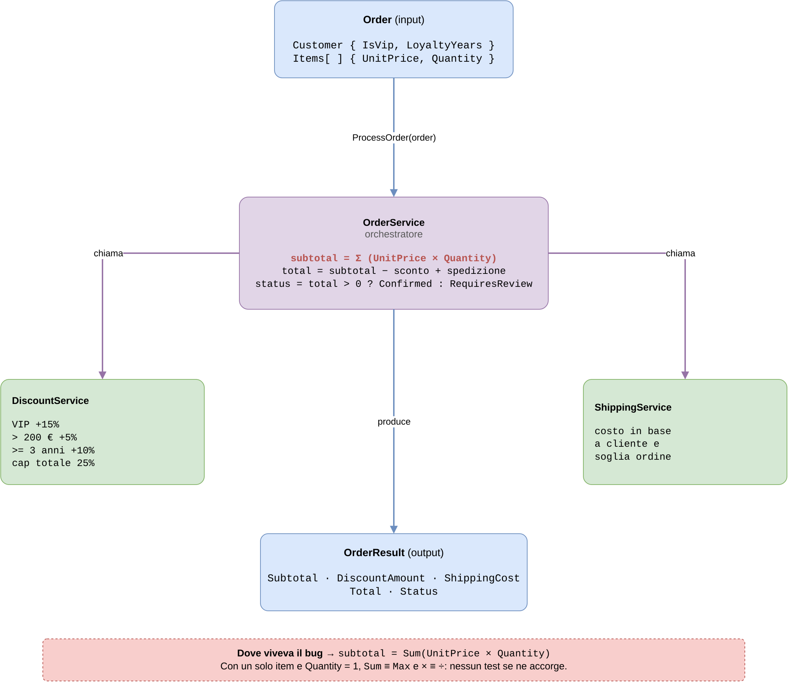
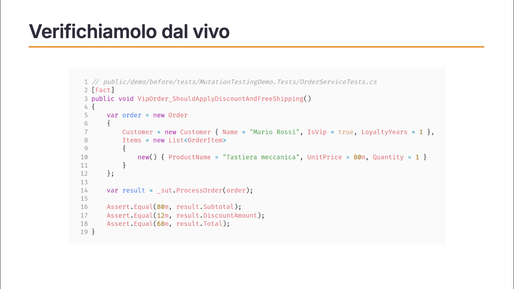
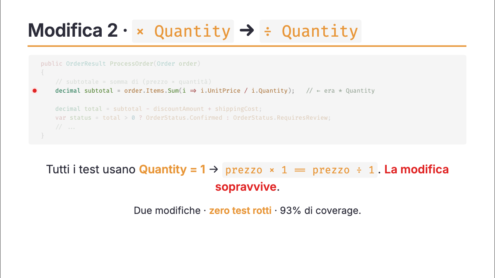
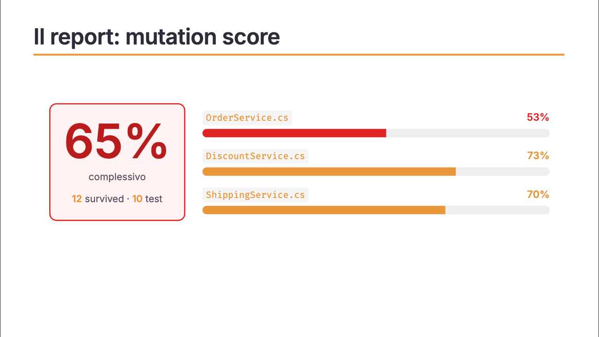
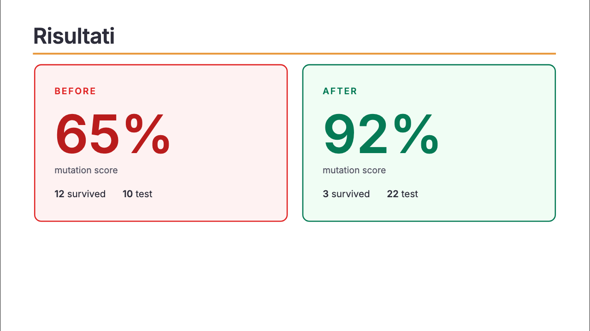

La maggior parte di noi si fida della propria suite di test. I test sono verdi, la coverage è alta: si rilascia tranquilli. È un'equazione che diamo per scontata (*test passano → codice sano*), e quasi sempre funziona.

Quasi. Perché "i test passano" e "il codice funziona" non sono la stessa cosa. E la differenza si paga: è esattamente lì che, un giorno, ti si rompe qualcosa in produzione su codice coperto, testato, verde. E nessun test se n'era accorto.

È successo a me. Ne ho fatto [un talk a Working Software 2026](/talks/mutation-testing-working-software-2026/): come ci sono finito, come l'ho scoperto, e gli strumenti che oggi uso per non ripensarci più. Lo ripercorro qui.

## La storia

Qualche anno fa avevo preso parte a un progetto. Niente test: "ci pensiamo dopo, c'è fretta". Il software era andato in produzione, io avevo lasciato l'azienda, erano passati anni. Poi mi hanno chiamato: *"lo usiamo ancora, ti va di aggiungere qualcosa?"*

Ho aperto il repo. Migliaia di righe, anni di stratificazione, e nella cartella `tests` praticamente il vuoto.

Ho fatto le cose per bene: specifiche di dominio prima di un singolo test, suite generata con gli agenti AI, CI in piedi. Alla fine: 93% di coverage (il 93% del codice eseguito da almeno un test), tutti verdi. Soddisfazione.

Poi un messaggio: *"oh fra, dopo l'ultimo aggiornamento si è rotto X"*.

Com'era possibile? I test passavano, quella funzionalità era coperta. Eppure la suite non aveva fiatato.

## Il sistema sotto esame

Per renderlo concreto, uso lo stesso esempio del talk: un piccolo flusso di gestione ordini. Un `OrderService` fa da orchestratore: riceve un `Order` (il cliente e la lista dei prodotti), calcola il subtotale, poi delega lo sconto a un `DiscountService` e il costo di spedizione a uno `ShippingService`, e infine assembla il risultato.

Niente di esotico: tre servizi, un input, un output. Tenete d'occhio quel subtotale: `Sum(UnitPrice × Quantity)`. È lì che, settimane dopo, si nascondeva il bug.

## Il codice era sbagliato, i test restavano verdi

La coverage risponde a una domanda precisa: *questo codice viene eseguito?*

Non risponde alla domanda che conta davvero: *se questo codice fosse sbagliato, i test se ne accorgerebbero?*

L'ho capito guardando i miei test nel dettaglio. Tre test, nomi chiari, assert con valori esatti. A prima vista fatti bene. Ma tutti con un solo item nell'ordine. Quantity sempre uguale a 1.

Ho provato a rompere il codice apposta: ho cambiato `Sum` in `Max` nel calcolo del subtotale.

Tutti verdi. `Max` di un solo elemento è uguale alla somma di un solo elemento.

Ho cambiato l'operatore aritmetico: `× Quantity` → `÷ Quantity`.

Tutti verdi. `Prezzo × 1 = Prezzo ÷ 1`.

**Due modifiche. Zero test rotti. 93% di coverage.**

## Mutation testing: rompere il codice apposta, sistematicamente

Quello che ho fatto a mano su due righe si chiama mutation testing. L'idea è semplice: se un test è affidabile, deve diventare rosso quando l'implementazione è sbagliata. Il modo più diretto per verificarlo è introdurre modifiche controllate (*mutanti*) e misurare quanti ne rilevano i test.

Un chiarimento che vale la pena fare, perché è il punto che confonde di più: **il mutante è una modifica al codice applicativo, non ai test.** La suite resta identica. Il tool prende il sorgente, ne genera centinaia di varianti, ognuna con una singola modifica (come `Sum → Max`), e contro ognuna rilancia gli stessi identici test. Se almeno un test diventa rosso, il mutante è *killed*: i test hanno fatto il loro lavoro. Se restano tutti verdi, il mutante è *survived*: c'è un buco.

Esiste dagli anni '70. Oggi ci sono tool che lo fanno in automatico su tutta la codebase.

Sul mio progetto ho usato **Stryker.NET**. Il risultato è un **mutation score** (la percentuale di mutanti che i test riescono a uccidere), ma soprattutto un report interattivo che ti porta esattamente sul punto fragile.

Lo score era **65%**: un mutante su tre sopravviveva, cioè il 35% delle modifiche al codice non faceva fallire nessun test.

## Cosa dice il report

Navigando i survived ho trovato tre famiglie di problema:

**1. Dato non discriminante.** Il test usa sempre un solo item con Quantity=1. `Sum` e `Max` danno lo stesso risultato. Il bug esisteva da tre settimane in produzione: era esattamente questo mutante.

**2. Assertion incompleta.** Il codice calcola `OrderStatus` (Confirmed o RequiresReview), ma nessun test lo verifica. Un'intera branch di logica di business mai controllata.

**3. Boundary non coperto.** Lo sconto fedeltà scatta a `>= 3 anni`, ma tutti i test usano 5 anni. Sposti la soglia di un anno e nessun test fallisce.

Non dovevo indovinare dove guardare: il report me lo diceva, con il diff esatto di ogni mutante.

## Il fix

Due modifiche mirate:

- Un test con due item e quantità diverse: ora `Sum` e `Max` danno risultati diversi, e moltiplicazione e divisione anche.
- Una riga in più: `Assert.Equal(OrderStatus.Confirmed, result.Status)`.

Score finale: **92%**. Da 10 test a 22. I survived passano da 12 a 3 (quei 3 sono mutanti equivalenti: cambiano la sintassi ma non il comportamento osservabile, quindi nessun test potrà mai ucciderli, è un limite teorico noto, non un buco nei tuoi test).

## La tesi

La coverage vi dice se il codice viene *eseguito*. Il mutation score vi dice se i test *funzionano*.

Sono due domande diverse. Vale la pena farle entrambe.

E questa seconda domanda vale a prescindere da chi ha scritto i test. Nel mio progetto buona parte li hanno generati gli agenti AI, ed è stato fondamentale: senza non avrei consegnato con quella qualità in quei tempi. Ma "chi" o "come" li ha scritti non vi dice se quei test valgono qualcosa.

## Cosa fare domani

Non serve adottarlo su tutto in un giorno. Scegliete un servizio: quello con la logica più critica, quello da cui passano i soldi, quello che nessuno vuole toccare perché "funziona e non si sa come".

Lanciate Stryker (o mutmut per Python, pitest per Java, cargo-mutants per Rust). Leggete i survived come domande che i vostri test non si erano ancora posti.

Con `--since:main` in CI muta solo il codice cambiato nella PR: il tempo di esecuzione rimane proporzionale alla modifica, non al progetto. Con una soglia (`break: 60`) blocchi le regressioni senza richiedere la perfezione.

L'obiettivo è costruire fiducia, strato dopo strato, con prove concrete. Così potete rilasciare senza la paura di rompere qualcosa. Anche di venerdì.

---

*Ho presentato questo talk a [Working Software Conference 2026](https://www.agilemovement.it/workingsoftware/): [slide, foto e materiale sono qui](/talks/mutation-testing-working-software-2026/), e il codice demo è pubblico su [GitHub](https://github.com/monte97/mutation-testing-ws2026-slides).*
