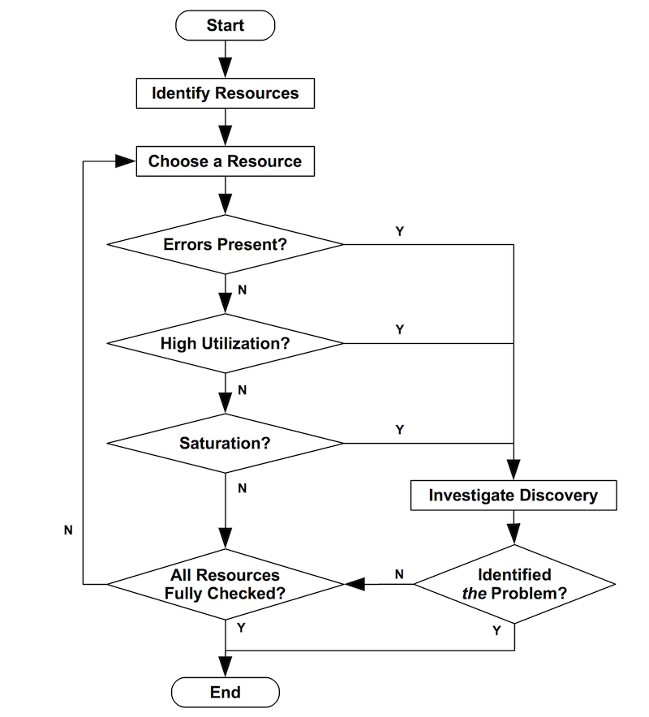
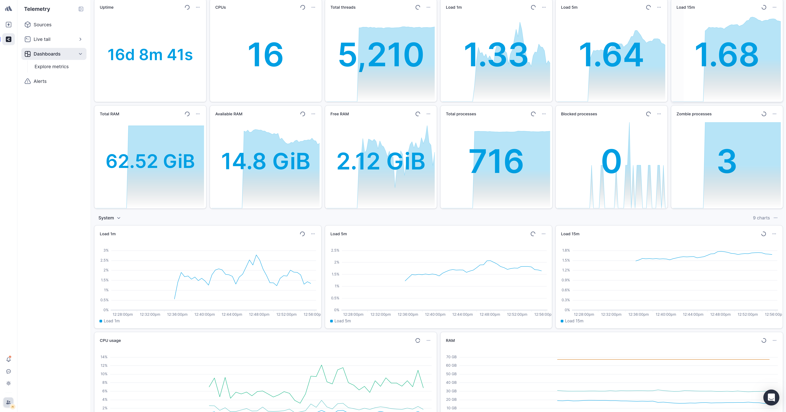

The average latency chart is a flat line at 180 milliseconds. It has been flat for weeks. Over the same period support keeps collecting slowness reports, always from the same three customers.

The chart is not lying: the average *is* 180 milliseconds. It is doing exactly what an average does, which is hiding the tail. If 97% of requests answer in 90 milliseconds and 3% take twelve seconds, the average stays good and that 3% is your inbox.

The previous piece in this series, [A thousand requests per second means nothing](/en/blog/verificare/testing/performance-senza-baseline/), is about what to decide before measuring. This one is about what to look at in the numbers once they exist.

## Averages lie, percentiles do not

A percentile answers: *below which value does this fraction of requests fall?* Three are enough.

- **p50**, the median: the typical user's experience.
- **p90**: the experience of the slowest 10%.
- **p99**: the experience of the slowest 1%.

The jump between p50 and p99 is the information an average destroys. A p50 at 90 milliseconds with a p99 at twelve seconds describes a system where almost everyone is fine and a stable minority is having a terrible time — which is a completely different diagnosis from "the system is slow on average", and leads to completely different work.

Thinking in percentiles changes three things concretely:

- **SLOs become writable.** "p99 under two seconds" is verifiable; "the system must be fast" is not.
- **Degradation shows up earlier.** A growing problem appears on the p99 weeks before it moves the average.
- **Segmenting by endpoint tells you where to act.** A high aggregate p99 says nothing; the same p99 split per endpoint usually points at a single culprit.

The rest of this article assumes you are looking at distributions, not averages.

## RED: the three questions from the service side

The RED method looks at the system from the outside, the way whoever uses it does. Three metrics, three questions.

**Rate — how much is it used?** The count of requests handled: HTTP requests for a web service, queries for a database, messages consumed for a queue. On its own it says little, but it is the denominator for everything else: without the rate you cannot tell whether a rise in errors is a regression or just more traffic.

**Errors — how many fail?** Every request that ends with something other than the expected result, whatever the reason: an explicit error, a timeout, a formally valid but wrong response. It has to be measured two ways at once, because they answer different questions: the **percentage** tells you how bad it is relative to traffic, the **absolute count** tells you how many people got angry.

**Duration — how long do they take?** This is where the percentiles from the previous section live.

RED answers: **what is going wrong for whoever uses the system?** It is the right thing to build alerts on, because it is the only one that corresponds to something somebody is actually experiencing. An alert on "CPU at 85%" wakes someone up for a system that may be working perfectly well; an alert on "checkout p99 above three seconds" wakes someone up because checkout is slow.

## USE: the three questions from the resource side

Brendan Gregg's [USE method](https://www.brendangregg.com/usemethod.html) looks the other way: not at the service, but at the resources holding it up. The rule fits in one line:

> For every resource, check utilization, saturation, and errors.

The step people skip most often is none of the three: it is the one before, **establishing what the resources are.** CPU, memory, disks, network — but also the imposed limits: connection pools, thread pools, API quotas, file descriptors. If the inventory is incomplete, USE will not find the bottleneck: it will look in the wrong place with great precision.

**Utilization — how busy is it?** The percentage of time a resource is occupied. Close to 100% it is almost always a bottleneck. But lower values mislead too, for two reasons: a value aggregated over five minutes hides much worse bursts, and some resources are not interruptible — a disk busy with one operation finishes it, and a more urgent one queues up regardless.

**Saturation — how much work can I not absorb?** The excess work piling up: queue lengths, wait times, load average, swap usage, disk I/O queue, requests waiting in the pool. It is the most diagnostic of the three, and it has to be read against a different threshold: while 70% utilization is debatable, **for saturation any value other than zero is already a signal.** A resource can be saturated without being at 100% utilization.

**Errors — how much is breaking?** Resource-level errors: network errors, filesystem errors, disk I/O errors. They do not immediately become application errors, which is why they go unnoticed until they become an outage. The value lies in correlating them: network errors rising together with network utilization tell a story neither metric tells alone.

## The rule: RED opens the investigation, USE closes it

The two methods are not alternatives and they do not overlap. They answer two questions in sequence:

| | RED | USE |
|---|---|---|
| Looks at | the service | the resources |
| Answers | **when** and **how badly** it broke | **why** and **where** |
| Used for | alerts and SLOs | diagnosis |
| Seen by | the user | the infrastructure |

The order is not arbitrary, and it is the part worth taking away:

**Alert on RED, investigate with USE.** An alert on a resource produces noise, because a loaded resource is not a problem until somebody suffers from it. An alert on RED corresponds, by construction, to a user waiting. When that alert fires, USE tells you where to look: which resource is saturated, which one is accumulating errors.

The interesting case is when the sequence breaks. **RED degrades and USE shows nothing**: no saturated resource, no errors, and yet the p99 climbs. That means the bottleneck is not in this inventory — it is downstream, in a third-party service, in an application-level lock, in a dependency you are not measuring. That silence is information, and without having looked at both sides you would not have it.

## What it costs to keep them together

The reason this distinction is worth the time to learn is that it gets paid in person-hours, and always at the worst moment.

A team that alerts on resources receives notifications about systems that are working, and after a few weeks stops looking at them — so when the real one arrives, nobody sees it. A team that measures only resources knows a disk is full but does not know which customers are suffering, and cannot decide what to fix first. **Separating the two levels is what lets you say "this affects 3% of users on checkout" instead of "CPU is high", which is the difference between a prioritisation decision and an argument.**

## What to do tomorrow

Take the service the money goes through and put three charts on it: rate, error percentage, p50/p90/p99 latency, all segmented per endpoint. That is RED, and it is half a day.

Then write down the resource inventory for that service, imposed limits included. You do not need to instrument them yet: you need the list ready for the day the p99 climbs and somebody has to decide where to look.

Put the first alert on the p99 of a single endpoint, the one that matters most. One that fires rarely and is always right is worth more than twenty nobody reads.
